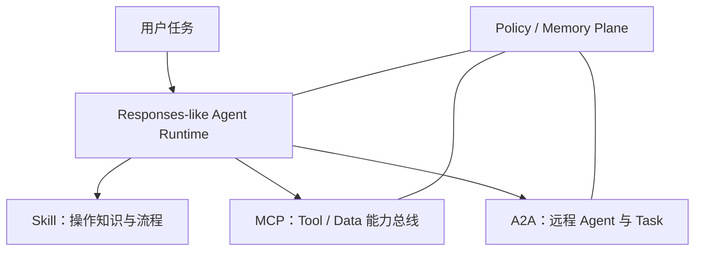

# 从 Chat API 到 Agent Runtime：大模型推理接口、Tool 接口与协议层演进

> 文档日期：2026-08-08  
> 讨论范围：大模型推理接口、Tool 接口、MCP、Skill、A2A，以及支撑它们的 Policy/Memory Plane。

## 摘要

大模型接口正在从“输入一组消息、返回一段文本”的生成接口，演化为“在一个受控环境中持续执行任务”的运行时接口。

传统 Chat API 主要暴露模型的**说话能力**；下一代 Agent API 进一步暴露模型的以下能力：

- 在多轮与多次工具调用之间保持推理连续性；
- 在上下文增长后压缩而不是简单截断历史；
- 按需发现并调用 Tool；
- 将可确定的工具循环交给程序执行；
- 以 Task、Event、Artifact 和 Checkpoint 表达长程工作；
- 在授权、审计、租户隔离和持久记忆约束下完成任务。

因此，生产环境中实际表现出来的能力，不只由模型权重决定：

\[
\text{Observed Capability}
=F(\text{Model},\text{Inference API},\text{Reasoning State},\text{Context Policy},\text{Tools},\text{Harness})
\]

ARC-AGI-3 的案例集中展示了这一点：同一个 GPT-5.6 Sol，没有重新训练，只改变状态保留与上下文管理方式，公开集得分从 13.3% 提升到 38.3%，同时输出 Token 降至原来的约六分之一。

---

## 一、现有的大模型推理接口、Tool 接口与协议层

### 1.1 大模型推理接口

当前主流推理接口可以归纳为四类。

| 接口形态 | 典型代表 | 核心对象 | 状态管理 | 适合场景 |
|---|---|---|---|---|
| Chat/Message API | OpenAI Chat Completions、Anthropic Messages、Gemini `generateContent` | Message / Content | 通常由客户端重传消息历史 | 单轮问答、普通多轮聊天、分类、抽取、改写 |
| Responses-like API | OpenAI Responses API | Message、Reasoning、Tool Call、Tool Output、Compaction 等 Item | `previous_response_id`、Conversation 或完整 Item 回放 | 多步推理、复杂 Tool Use、长程 Agent |
| Realtime API | WebSocket/WebRTC 实时接口 | 连续音频、文本、事件和工具调用 | 连接级实时状态 | 语音助手、实时客服、低延迟交互 |
| Async/Background API | Background、Batch、异步任务接口 | Job / Task / Event | 服务端任务状态 | 深度研究、批处理、长耗时任务 |

#### Chat/Message API

Chat API 的基本抽象是：

```text
messages[] → model → assistant message
```

它简单、兼容性好，适合一次请求即可完成，或者只需保留可见消息历史的任务。其问题并不是“无状态”本身，而是 Message 无法完整表达推理状态、工具执行阶段、压缩检查点和长任务生命周期。

对于普通问答，这种差异通常不大；对于需要连续几十次观察—行动循环的 Agent，接口是否保留推理与工具状态可能直接影响任务完成率。

#### Responses-like API

Responses-like API 的核心变化，是把一次模型运行中的不同对象拆成可组合的 Item：

- 用户或助手消息；
- 私有、不可见的 reasoning item；
- function/tool call；
- function/tool output；
- program 与 program output；
- compaction item；
- 文件、图像等多模态内容。

它的抽象更接近：

```text
input items + previous state + tools + context policy
    → response items + new state
```

OpenAI 官方文档明确建议推理模型在多轮、Tool Calling 场景中优先使用 Responses API，并允许通过 `reasoning.context` 控制是否使用早期回合的推理状态。[Reasoning models](https://developers.openai.com/api/docs/guides/reasoning)

#### Realtime 与异步接口

Realtime 和异步接口解决的是另外两个维度：

- Realtime 优化持续连接、低延迟和打断；
- Background/Task 优化长耗时执行、断线恢复、轮询或通知。

它们不一定让单次推理更强，但会改变 Agent 能否持续工作以及用户能否及时观察、取消或恢复任务。

### 1.2 Tool 接口

Tool 接口也在从单次 Function Calling 向多层工具运行时演进。

| Tool 形态 | 作用 | 优点 | 主要限制 |
|---|---|---|---|
| Function Calling | 模型生成符合 Schema 的工具名与参数 | 通用、容易接入现有 API | 每次调用通常需要模型与应用往返 |
| Hosted Tool | Web Search、File Search、Code Interpreter、Computer Use 等 | 平台负责执行与回传 | 平台绑定较强，权限与数据边界需单独评估 |
| Tool Search | 按需检索并加载工具定义 | 减少上下文污染与 Tool 选择干扰 | 需要良好的 namespace 和工具描述 |
| Programmatic Tool Calling | 模型生成程序，在受控运行时内组合多个工具 | 可并行、循环、过滤和聚合，减少中间结果进入模型上下文 | 不适合每一步都需要新语义判断或审批的任务 |
| Stateful Tool | 返回 handle，后续调用继续操作同一对象或会话 | 避免模型搬运大量原始数据 | handle 生命周期、权限和失效恢复必须明确 |

#### Function Calling：从自然语言连接确定性系统

Function Calling 的价值是让模型负责理解意图和填充参数，让传统程序负责实际执行。但 Tool Schema 不只是技术参数定义，它也会影响模型如何理解工具：

- 名称是否能区分相近工具；
- 必填字段是否明确；
- 枚举与格式约束是否足够；
- 是否说明前置条件、副作用和失败方式；
- 错误是否能指导模型修改参数后重试。

一个 Agent-friendly Tool 不应只返回 `400 Bad Request`，而应返回可恢复信息，例如：

```json
{
  "error_type": "invalid_argument",
  "field": "start_date",
  "expected": "YYYY-MM-DD and not earlier than today",
  "received": "2026/08/08",
  "retryable": true
}
```

#### Tool Search：从全量注入转向按需发现

当工具数量增多时，把全部 JSON Schema 放入每次请求会消耗 Token，并增加模型选错工具的概率。当前 OpenAI Tool Search 已支持对 Function、Namespace 和 MCP Server 延迟加载；模型开始时只看到高层名称与描述，需要时再加载具体工具定义。[Tool search](https://developers.openai.com/api/docs/guides/tools-tool-search)

实用原则是：

- 按用户意图划分 namespace，而不是按后端微服务划分；
- namespace 描述短而有区分度；
- 低频、Schema 较大的工具使用 `defer_loading`；
- 单个 namespace 尽量保持在约 10 个以内；
- 高频、关键工具可以直接加载，避免额外搜索步骤。

#### Programmatic Tool Calling：将确定性循环移出模型上下文

Programmatic Tool Calling 允许模型编写受控 JavaScript，进行并行调用、循环、条件判断、过滤、Join、去重和聚合，只把缩减后的结果交回模型。[Programmatic Tool Calling](https://developers.openai.com/api/docs/guides/tools-programmatic-tool-calling)

适合交给程序的阶段：

- 批量查询多个对象；
- 对工具结果排序、过滤、去重、聚合；
- 根据结构化返回值生成下一次调用参数；
- 可明确限制次数和停止条件的重试。

仍应由模型逐步判断的阶段：

- 搜索结果会改变下一步研究方向；
- 每个结果都需要语义判断；
- 涉及写入、付款、删除或对外发送；
- 需要保留原始引用或原生 Artifact；
- 执行前必须由用户审批。

### 1.3 MCP、Skill、A2A 与 Policy/Memory Plane

这几层经常被统称为“Agent 接口”，但它们解决的问题不同。



#### MCP：Agent 与 Tool/Data 之间的能力总线

MCP 的核心对象是 Tools、Resources 和 Prompts。它解决的是能力发现、参数调用、资源引用和结果传输，而不是整个任务如何规划。

当前 MCP 已支持输入/输出 Schema、结构化结果、可供模型自我修正的 Tool Execution Error，以及通过显式 handle 维护跨调用状态。MCP 本身没有统一的协议级状态会话；handle 在协议层只是普通字符串，因此服务端仍需在每次调用时重新验证调用者权限。[MCP Tools specification](https://modelcontextprotocol.io/specification/2026-07-28/server/tools)

可以把 MCP 理解为 Agent 世界里的设备驱动和 I/O 总线：它让不同 Agent Runtime 用相对一致的方式接入文件、数据库、搜索、企业服务与执行能力。

#### Skill：按需加载、按场景组织的操作知识

Skill 不是远程调用协议，更接近可装载的软件包。它描述模型在当前环境中应该如何使用已有资源完成一类任务，通常包含：

- 触发条件与适用边界；
- 操作步骤和判断原则；
- Tool/API 的组合方式；
- 参考文档；
- scripts、templates 和 assets；
- 验证方式、失败处理和停止条件。

Skill 的主要价值不是增加一个新能力端点，而是把个人、团队或垂直场景的操作经验变成模型可按需消费的流程。理想加载方式是先暴露名称与描述，命中场景后再读取完整说明和相关资源。

#### A2A：Agent 与 Agent 之间的任务协议

A2A 的核心对象不是 Tool Call，而是 Agent Card、Message、Task、Task State 和 Artifact。远程 Agent 可以返回即时 Message，也可以创建一个可查询、可流式订阅、可取消和可恢复的 Task；任务成果通过 Artifact 表达。[A2A specification](https://a2a-protocol.org/latest/specification/)

A2A 的 Streaming 进一步区分状态事件与 Artifact 更新，适合分钟、小时甚至更长时间的异步任务。[A2A Streaming and Async](https://a2a-protocol.org/latest/topics/streaming-and-async/)

#### Policy/Memory Plane：跨层约束与持久状态

Policy/Memory Plane 不是单一协议，却是企业 Agent 不可缺少的一层：

- 身份与租户；
- Tool、Resource 和 Agent 的授权；
- 高风险操作审批；
- 调用日志、Trace 与审计；
- Artifact 所有权和版本；
- 数据分类、保留期和跨境策略；
- 跨会话持久记忆及其写入审核。

推理状态、运行状态和持久记忆应当分开：

| 状态类型 | 主要用途 | 是否应直接长期保存 |
|---|---|---|
| Reasoning State | 当前模型推理连续性 | 通常不应直接作为长期记忆 |
| Run/Task State | 当前目标、进度、阻塞与恢复点 | 应保存到任务结束或审计期 |
| Artifact State | 文件、代码、报告、数据及版本 | 按业务生命周期保存 |
| Durable Memory | 经确认的偏好、事实和环境经验 | 经过筛选、验证后保存 |

### 1.4 为什么 MCP 与 A2A 不太可能合并

MCP 与 A2A 会相互引用和协同，但长期看仍会保持不同抽象：

- MCP 面向相对原子的能力与数据访问；
- A2A 面向有自主性的远程执行者和长生命周期任务；
- Skill 面向可加载的操作知识、流程和场景适配；
- Responses-like API 面向单个模型或 Agent Runtime 的推理与工具循环；
- Policy/Memory Plane 为所有层提供治理和持续状态。

一个 Agent 可以通过 MCP 调用数据库和搜索工具，也可以通过 A2A 委托另一个 Agent；被委托的 Agent 内部还可以加载 Skill 并继续调用自己的 MCP Tools。统一底层传输格式并不能消除这些语义差异。

---

## 二、ARC-AGI-3：接口如何改变同一模型的任务完成能力

### 2.1 ARC-AGI-3 测试的特殊之处

ARC-AGI-3 包含一系列未知规则的二维交互游戏。模型不会预先获得完整规则，而是需要：

1. 观察当前画面；
2. 选择一个动作；
3. 接收动作后的新画面；
4. 形成或修正规则假设；
5. 在后续几十乃至更多步骤中持续利用这些发现。

这不是普通的一问一答，而是典型的长程闭环任务：

```text
观察 → 假设 → 行动 → 新观察 → 修正假设 → 继续行动
```

因此，它对状态连续性极为敏感。

### 2.2 原始 Harness 的两个问题

#### 问题一：每次动作后丢弃私有推理

模型可以看到过去的动作和简短记录，却无法继续使用产生这些动作时形成的内部推理状态。这意味着模型刚刚发现的游戏机制、待验证假设和计划，在下一次动作时可能需要重新推导。

表现上会出现：

- 每一步都花大量 Token 重新解释游戏；
- 已经验证过的规律不能稳定复用；
- 策略在相邻动作间不连贯；
- 探索动作难以累计成长期知识。

#### 问题二：滚动截断早期历史

当上下文超过阈值后，原始框架直接删除最早的动作和观察。模型不仅失去过去的推理，还逐渐失去过去发生过什么。

滚动截断的问题不是只减少信息量，还会破坏因果链：后期状态可能依赖很早的规则发现，而这些记录已经不在上下文中。

### 2.3 Responses API Harness 的调整

OpenAI 的新 Harness 做了两项关键调整。

#### Retained Reasoning

通过 Responses API 的 `previous_response_id` 和 persisted reasoning，让模型在后续动作中继续使用兼容的 reasoning items。这里保留的不是向应用公开的原始 Chain-of-Thought，而是不透明的内部推理状态。

GPT-5.6 支持：

- `reasoning.context: "all_turns"`：允许使用更早回合可用的推理状态；
- `reasoning.context: "current_turn"`：只使用当前回合状态，避免旧推理继续影响新任务；
- `reasoning.context: "auto"`：使用模型默认设置，GPT-5.6 默认相当于 `all_turns`。

#### Compaction

当上下文增长到阈值后，不再简单删除最早记录，而是生成一个不透明的 compaction item，用较少 Token 承载后续仍然需要的状态与推理信息。[Compaction](https://developers.openai.com/api/docs/guides/compaction)

Compaction 更接近“有损但面向继续执行的工作状态检查点”，而不是普通对话摘要，更不能替代可审计的原始 Trace 或业务数据库。

### 2.4 结果

| Harness | GPT-5.6 Sol 公开集得分 | 输出 Token |
|---|---:|---:|
| ARC 官方 Harness | 13.3% | 基准 |
| Retained Reasoning + Compaction | 38.3% | 约为原来的 1/6 |

同一模型权重在新 Harness 下更少“从头思考”，反而形成了更连贯的策略。能力和效率同时提升的原因不是思考次数越多越好，而是减少了重复推理和状态丢失。

这一案例应被理解为：

> 接口没有凭空创造三倍通用智能，但原接口严重限制了模型在长程交互任务中展开已有能力。

它不能直接推出所有任务都会提升三倍。单轮生成、分类或简单问答通常不会获得同等级收益；收益最明显的是目标持续稳定、反馈连续、需要跨多次 Tool Call 累计发现的任务。

### 2.5 一个可参考的 Responses 配置

下面是用于“目标稳定、长程、多轮”任务的简化示例。`compact_threshold` 只是示意值，应根据模型上下文、平均 Tool 输出和预留输出空间通过评测确定。

```python
from openai import OpenAI

client = OpenAI()

response = client.responses.create(
    model="gpt-5.6",
    input="分析这个项目，定位故障并给出经过验证的修复。",
    reasoning={
        "effort": "medium",
        "context": "all_turns",
    },
    context_management=[
        {"type": "compaction", "compact_threshold": 200_000}
    ],
)

# 后续只提交新增输入，并引用上一轮 Response。
response = client.responses.create(
    model="gpt-5.6",
    previous_response_id=response.id,
    input="继续执行，并检查刚才的修改是否通过测试。",
    reasoning={
        "effort": "medium",
        "context": "all_turns",
    },
    context_management=[
        {"type": "compaction", "compact_threshold": 200_000}
    ],
)
```

如果使用 `store=False` 或无状态模式，就不能只保留可见文本，应将上一轮返回的完整 `response.output`——包括 reasoning、tool、program 和 compaction items——按原顺序加入下一轮 input。

### 2.6 提升任务完成率的实用 Tricks

#### Trick 1：先判断任务是否真的需要推理连续性

| 任务类型 | 建议接口设置 |
|---|---|
| 分类、抽取、短改写 | Chat 或 Responses；`none/low`；通常不需要 retained reasoning |
| 多轮 Tool Use、Agent Coding | Responses；`medium/high`；目标稳定时使用 `all_turns` |
| 独立复核、反方验证 | 新 Response/新 Session，或使用 `current_turn`，避免继承原执行者的路径依赖 |
| 超长研究或数据处理 | Responses + Compaction + 外部 Artifact/Task State |
| 高风险写操作 | 直接 Tool Call + 显式审批，不应藏在不可见的自动循环里 |

Retained reasoning 不是永远开启越好。如果用户目标改变、早期假设已经被推翻，或者需要真正独立的验证，应切换到 `current_turn`、建立新分支或开启新会话。

#### Trick 2：用 Compaction 替代硬截断，但保留外部权威状态

- 在接近上下文极限之前触发 compaction；
- 使用 `previous_response_id` 时不要再手工裁剪历史；
- 无状态回放时，保留最近 compaction item 及其后的完整 Item；
- 将目标、验收条件、关键事实、Artifact ID 和未完成事项保存在外部 Task State；
- 不把 compaction item 当作可读、可审计或跨任务复用的持久记忆。

#### Trick 3：推理强度应按阶段设置，而不是全程拉满

- 路由、抽取、格式转换：`none/low`；
- 普通 Tool Use、编码执行：`low/medium`；
- 复杂诊断、规划、研究：`medium/high`；
- `xhigh/max/pro`：只在代表性评测显示明显收益时使用。

更高 reasoning effort 不保证更高任务完成率。它可能增加延迟，也可能让模型在错误方向上探索更久。比较配置时，应同时看完成率、总 Token、重复工具调用、延迟和最终证据覆盖率。

#### Trick 4：不要把全部工具定义预先塞入上下文

- 高频基础工具直接加载；
- 大型工具集合使用 namespace；
- 低频工具使用 Tool Search 和 `defer_loading`；
- 名称和描述强调工具间的区别；
- 记录“模型看见了哪些工具”，否则难以复现实验结果。

#### Trick 5：区分直接 Tool Call 与程序化 Tool Call

可以用一个简单判断：

```text
下一步只依赖结构化字段和确定性规则？
    是 → 程序化调用、并行、过滤、聚合
    否 → 返回模型做新的语义判断
```

写入、删除、付款、发布和对外发送默认走直接调用，并保留审批点。

#### Trick 6：Tool 输出同时提供“语义视图”和“结构化视图”

建议返回：

```yaml
summary: 供模型快速判断的精简结论
structured: 供程序消费并通过 output schema 校验的数据
resources: 原始文件、游标或对象 handle
evidence: 来源、版本、时间与校验信息
control:
  status: completed
  retryable: false
```

不要把所有 JSON 都转换成 Markdown，也不要把所有原始数据直接塞给模型。Markdown 适合阅读，结构化数据适合组合，resource handle 适合保存大对象，evidence 适合验证。

#### Trick 7：错误信息应支持模型自我恢复

区分：

- 参数可修复错误；
- 临时错误，可有限重试；
- 权限不足，需要用户或系统授权；
- 状态失效，需要重建 handle；
- 永久失败，应停止并说明原因。

错误结果最好显式包含 `retryable`、错误字段、期望格式和建议动作。重试次数必须有上限，并利用 idempotency key 避免重复副作用。

#### Trick 8：评测时记录 Harness，而不只记录模型名

至少记录：

- 模型快照；
- Chat 或 Responses 接口；
- reasoning mode、effort、context；
- `store`、`previous_response_id` 或无状态回放方式；
- compaction 阈值与策略；
- Tool 列表、Schema 版本和加载方式；
- direct/programmatic Tool Calling；
- retry、stop 和 approval 规则；
- Sandbox 与依赖版本。

否则所谓“模型能力变化”，可能只是接口和执行环境变化。

---

## 三、未来接口的发展方向

### 3.1 从生成接口走向任务运行时

传统接口：

```text
generate(messages) → text
```

下一代 Agent 接口更可能接近：

```text
run(
  task,
  state_refs,
  available_capabilities,
  policy,
  budget,
  output_contract
)
→ events + artifacts + evidence + checkpoint
```

接口的核心对象将从 Message 扩展为：

- Task：要完成的目标与生命周期；
- Item/Event：一次运行中的消息、推理、工具和状态事件；
- Artifact：真正交付给用户或下游系统的结果；
- Checkpoint：任务恢复点；
- Capability：可发现、可授权的工具或 Agent；
- Policy：谁可以在什么条件下执行什么动作；
- Memory：哪些经验证的信息可以跨任务复用。

### 3.2 五层接口将长期并存

| 层 | 核心职责 | 可能继续演进的方向 |
|---|---|---|
| Responses-like Model API | 推理、状态连续性、Compaction、模型内 Tool Loop | 更细粒度的状态控制、自动上下文管理、任务级预算与恢复 |
| MCP | Agent 与 Tool/Data 的能力总线 | 动态发现、结构化结果、异步 Task、权限与企业治理扩展 |
| Skill | 按需加载、按个人/场景组织的环境操作知识 | 标准 Manifest、依赖与权限声明、测试、版本和兼容性信息 |
| A2A | Agent 间任务委托、状态与 Artifact | Agent 发现、异步任务、流式进度、Artifact 引用、跨组织授权 |
| Policy/Memory Plane | 授权、审计、租户、持久记忆和数据治理 | 细粒度委托、Memory 写入门槛、数据谱系、跨 Agent 审计 |

### 3.3 上层会更语义化，下层会更类型化

未来接口不太可能全面变成自然语言 API。更可能出现两阶段结构：

1. Agent 用自然语言或半结构化格式表达目标、约束和成功标准；
2. Runtime 将意图编译为可检查的类型化计划，再校验权限、成本和副作用后执行。

因此，“Agent-friendly”不等于弱化 Schema，而是让 Schema 除了字段类型，还能表达：

- 前置条件；
- 副作用与风险等级；
- 幂等性和补偿操作；
- 授权范围和审批要求；
- 成本、延迟与数据新鲜度；
- 结果证据与来源。

### 3.4 上下文会变成被调度的工作集

即使上下文窗口继续扩大，模型也不应成为文件、日志和数据库结果的搬运工具。未来更可能采用：

- 原始数据保留在外部系统；
- Agent 通过 handle、URI、cursor 或 Artifact ID 引用；
- 根据当前阶段按 summary、slice、query、raw 等视图读取；
- Tool Schema 和 Skill 也按需加载；
- Compaction 只维护当前任务所需工作集；
- Durable Memory 只保存经过验证、值得跨任务复用的信息。

这更接近一个 Context OS，而不是无限扩大的 Prompt。

### 3.5 MCP、A2A 与 Skill 的边界不会消失

MCP 和 A2A 不太可能合并成一个万能协议：

- MCP 更像设备驱动和 I/O 总线；
- A2A 更像分布式任务与协作协议；
- Skill 更像可装载的软件包；
- Responses-like API 更像单个模型的认知运行时；
- Policy/Memory Plane 更像跨运行时的治理与持久化层。

它们会共享身份、Schema、Artifact 和事件格式，也可能相互引用，但是否具备自主任务生命周期，是 Tool 与 Agent 的关键分界。

---

## 四、结论

接口设计已经不再只是工程兼容问题，而会直接影响模型在长程任务中的有效能力、Token 消耗和可靠性。

ARC-AGI-3 案例说明：

1. 同一个模型可能因为推理状态被丢弃而反复从头理解任务；
2. 简单截断上下文会破坏早期发现与后续决策之间的因果链；
3. Retained Reasoning 可以减少重复推理；
4. Compaction 可以在上下文受限时维持更连续的任务状态；
5. 评测对象应从单一模型名扩展为“模型 + API + Harness”。

未来的核心变化可以概括为：

> Chat API 暴露模型的“说话能力”；下一代 Agent API 暴露的是模型在一个受控世界中持续工作、恢复状态、调用能力并交付可验证结果的能力。

## 参考资料

1. [OpenAI：How enabling two settings tripled our scores on the ARC-AGI-3 benchmark](https://openai.com/index/how-two-settings-tripled-our-arc-agi-3-scores/)
2. [OpenAI API：Reasoning models](https://developers.openai.com/api/docs/guides/reasoning)
3. [OpenAI API：Compaction](https://developers.openai.com/api/docs/guides/compaction)
4. [OpenAI API：Tool search](https://developers.openai.com/api/docs/guides/tools-tool-search)
5. [OpenAI API：Programmatic Tool Calling](https://developers.openai.com/api/docs/guides/tools-programmatic-tool-calling)
6. [OpenAI API：MCP and Connectors](https://developers.openai.com/api/docs/guides/tools-connectors-mcp)
7. [Model Context Protocol：Tools specification](https://modelcontextprotocol.io/specification/2026-07-28/server/tools)
8. [A2A Protocol：Specification](https://a2a-protocol.org/latest/specification/)
9. [A2A Protocol：Streaming and Asynchronous Operations](https://a2a-protocol.org/latest/topics/streaming-and-async/)
