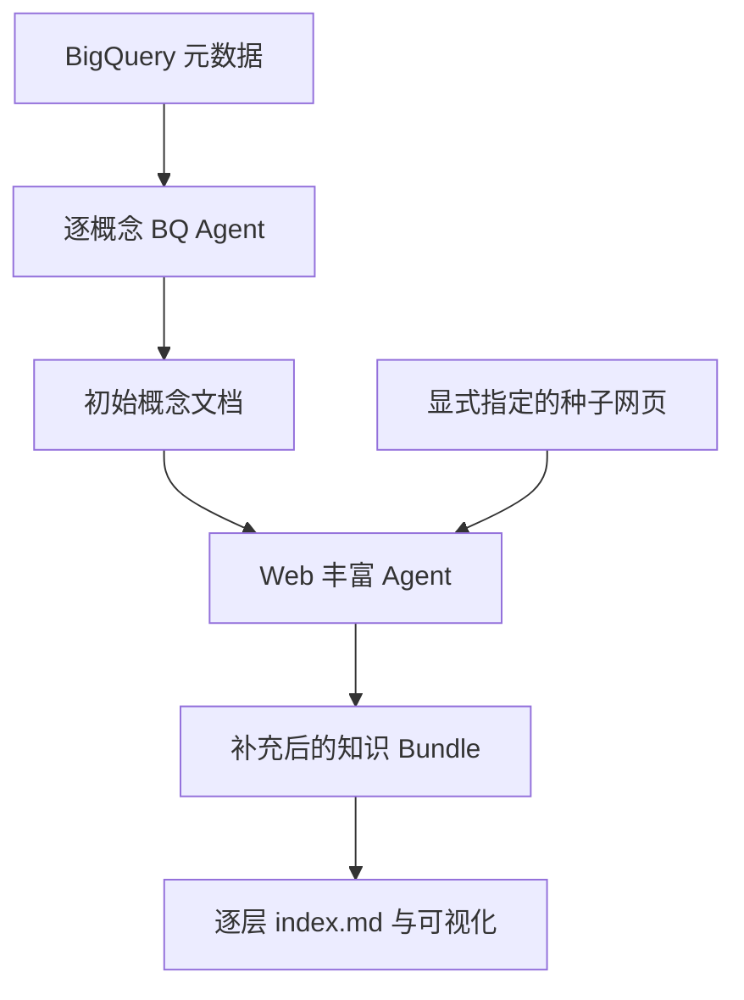
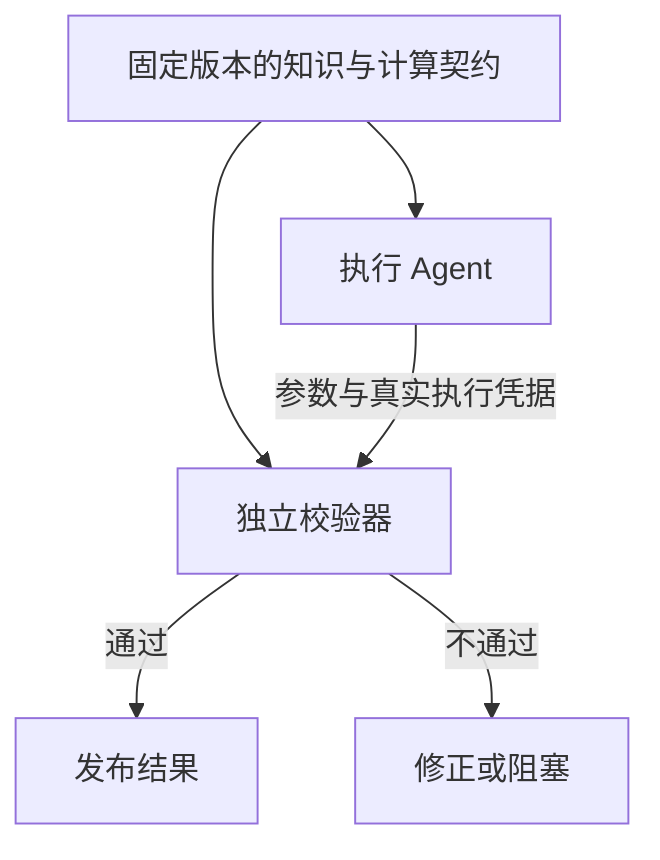

# OKF 的思想、实现与近期更新分析

核对日期：2026-10-02。日期按北京时间表述；源提交记录为 UTC。

对话依据：[用户分享的 2026-07-21 对话](https://chatgpt.com/share/6abf5a08-7bfc-83e9-9eb9-9d623dc11bc9)。

代码基准：[GoogleCloudPlatform/open-knowledge-format，main，ad30107c31c06aec8a7d5636e0d1058118604e6f](https://github.com/GoogleCloudPlatform/open-knowledge-format/tree/ad30107c31c06aec8a7d5636e0d1058118604e6f)。该主线最新提交发生于 2026-08-22 北京时间。另核对 knowledge-catalog 当前主线的 OKF 发布适配器；其基准为 62883ea36d63ca7cd7178f1381060d7b2617cd6f。9 月的 Issue/PR 作为讨论材料，未当成主线功能。

**核心判断**

当前 OKF 可以理解为“可版本化的领域知识源文件，加上来源、验证、生命周期和获准计算的契约”。相较原对话采用的 v0.1，v0.2 已开始处理知识可信度和计算行为的核验，但提供的运行代码仍以概念验证为主。检索排序、权限、多租户、知识晋升和执行门控仍需要消费端实现。

原对话中“OKF 负责知识表示、Wren 负责执行”的区分需要更新：OKF 现在可以规定获准计算、参数、执行器和核验器；Wren 仍提供面向业务数据查询的语义建模与实际执行引擎。两者在计算治理上的思想更接近，工程职责仍不同。不宜沿用原回答给出的重叠百分比，那些数字没有统一能力口径或实验支撑。

**一、先确认项目和版本**

原对话引用的是 `GoogleCloudPlatform/knowledge-catalog/okf`。该目录的当前 [README](https://github.com/GoogleCloudPlatform/knowledge-catalog/blob/main/okf/README.md) 已明确告知：独立仓库是规范、参考 Agent 和示例 Bundle 的正式维护位置，旧目录是冻结快照。

因此，应区分三件事：

| 对象 | 当前含义 |
|---|---|
| open-knowledge-format 的 SPEC.md | 格式规范，版本 0.2 |
| 参考 Python 包 | 概念验证生产工具，pyproject.toml 的包版本仍是 0.1.0 |
| knowledge-catalog 的 toolbox/mdcode/demo/okf | GCP 发布适配器，仍在另一个仓库维护 |

knowledge-catalog 在 10 月仍有其他提交，不能把整个仓库的更新日期当作 OKF 规范的更新日期。此次核对独立仓库的提交列表只有 6 个提交，最新主线仍是 ad30107c；GitHub Releases 列表为空。后续 Issue/PR 活跃不等于新版本已合并。

**二、OKF 到底想解决什么**

你的原始问题集中在四点：Agent 的领域知识不足、可持久化内容、Agent 的消费方式，以及多 Agent 的消息和串联。

OKF 的直接贡献是把分散的领域上下文变成可以共同读写的文件资产。数据库告诉 Agent 有哪些字段，领域知识还要说明一行代表什么、某个枚举的业务含义、指标口径和适用规则。OKF 将这些信息外部化，减少 Agent 临时猜测的空间。

这个定位有三层：

- **组织层**：一个概念一个 Markdown 文件；路径去掉 .md 后是 Concept ID；目录负责分组，链接负责跨目录关联。
- **消费层**：frontmatter 提供路由、过滤和摘要字段；正文保留定义、Schema、示例和解释；index.md 支持逐层发现。
- **维护层**：文件可 diff、review、追溯、打包和分发；v0.2 的来源和状态字段支持消费端判断如何使用。

格式不限制固定概念分类，因此不仅适用于表和指标，也能描述 API、业务流程、Playbook、设备术语或规则。参考工具当前主要面向 BigQuery，不能据此把格式理解为只支持 Google 数据库。

我的理解是：OKF 把“可读的知识内容”和“可被程序提取的少量信号”放在同一资产里。它适合成为知识源文件层；全文检索或向量索引可以由这些文件派生，而不是把索引当作唯一真源。

依据：[README](https://github.com/GoogleCloudPlatform/open-knowledge-format/blob/ad30107c31c06aec8a7d5636e0d1058118604e6f/README.md)、[SPEC §1–4](https://github.com/GoogleCloudPlatform/open-knowledge-format/blob/ad30107c31c06aec8a7d5636e0d1058118604e6f/SPEC.md#1-motivation)。

**三、实际实现怎样工作**

参考生产链路是两阶段，产物文件是两阶段之间的连接点：



| 代码 | 实现职责 | 对你的平台的启发 |
|---|---|---|
| [sources/base.py](https://github.com/GoogleCloudPlatform/open-knowledge-format/blob/ad30107c31c06aec8a7d5636e0d1058118604e6f/src/reference_agent/sources/base.py) | 抽象 list_concepts、read_concept、sample_rows | 保持领域输入适配与通用知识格式分离 |
| [sources/bigquery.py](https://github.com/GoogleCloudPlatform/open-knowledge-format/blob/ad30107c31c06aec8a7d5636e0d1058118604e6f/src/reference_agent/sources/bigquery.py) | 提取数据集、表、嵌套 Schema、分区、聚簇等；日期分片表归并成表族 | 按逻辑资产生成概念，避免按物理分片制造大量重复文件 |
| [agent.py](https://github.com/GoogleCloudPlatform/open-knowledge-format/blob/ad30107c31c06aec8a7d5636e0d1058118604e6f/src/reference_agent/agent.py) | 用 Google ADK 构建 BQ 和 Web 两个 Agent，工具权限不同 | 根据任务阶段限定工具集合，比给所有角色同样的工具更明确 |
| [runner.py](https://github.com/GoogleCloudPlatform/open-knowledge-format/blob/ad30107c31c06aec8a7d5636e0d1058118604e6f/src/reference_agent/runner.py) | BQ 概念顺序处理，每个概念新建 session；随后运行独立 Web session | 上下文隔离按概念、阶段划分，跨阶段传文件 |
| [prompts/web_ingestion_instruction.md](https://github.com/GoogleCloudPlatform/open-knowledge-format/blob/ad30107c31c06aec8a7d5636e0d1058118604e6f/src/reference_agent/prompts/web_ingestion_instruction.md) | 要求抽取指标、维度、Join；指标和 Join 单独成文，再从主要表文档链接回来 | 可复用概念应有归属和入口，避免参考文档成为孤岛 |
| [tools/bundle_tools.py](https://github.com/GoogleCloudPlatform/open-knowledge-format/blob/ad30107c31c06aec8a7d5636e0d1058118604e6f/src/reference_agent/tools/bundle_tools.py) | 写入 YAML + Markdown，补 generated；Web 阶段保护表 Schema 字段集合和 sources 数量 | 写知识时可以加确定性保护，但当前保护范围有限 |
| [bundle/index.py](https://github.com/GoogleCloudPlatform/open-knowledge-format/blob/ad30107c31c06aec8a7d5636e0d1058118604e6f/src/reference_agent/bundle/index.py) | 自底向上生成目录索引，按类型组织标题与摘要 | 提供发现能力；消费端仍要决定本次任务读取哪些内容 |
| [viewer/generator.py](https://github.com/GoogleCloudPlatform/open-knowledge-format/blob/ad30107c31c06aec8a7d5636e0d1058118604e6f/src/reference_agent/viewer/generator.py) | 将概念和正文链接变成静态 HTML 的图节点、边和详情 | 图是文件的派生视图，不承担知识真实性验证 |

当前参考实现不是 Agent 团队协商系统。BQ 和 Web 是由代码顺序安排的两类生产任务；BQ 每个概念独立会话，Web 阶段通过磁盘文档接续。没有证据表明它实现了通用 A2A 消息总线、并行任务调度或独立验收 Agent。

实现还保留了较强的具体技术选择：CLI 只接受 `--source bq`；Agent 使用 ADK/Gemini，默认模型是 `gemini-flash-latest`。格式本身与这些选择解耦。接入你的内网平台时，优先复用文档结构、输入适配抽象和工具契约，再替换运行框架及模型调用。

Web 获取的页面数、允许主机、URL 路径和跳数由工具检查。模型负责选择值得读的链接和抽取内容，代码负责限制可抓取范围。领域提取质量、引用正确性和停止是否充分仍需另行评估。

**四、v0.2 中最重要的三类变化**

**1. 来源从正文列表变成可查询的信号。**

`sources` 记录来源材料；正文脚注通过稳定的 `sources[].id` 归属到来源。来源列表重排时，ID 比“第 2 条来源”稳健。来源还能记录作者、使用次数、来源更新时间和使用窗口。

这里有两个边界：使用次数表示活跃程度和采用情况，不能直接等同正确率；来源的更新时间与知识文档的生成时间也不是一回事。某个文档昨天被 Agent 重写，不代表它依据的事实昨天得到重新确认。

**2. 生成、验证和生命周期分开。**

| 信号 | 回答的问题 | 不能单独证明什么 |
|---|---|---|
| generated | 当前内容由谁产生，何时发生有意义的改动 | 内容经过审核 |
| verified | 谁或哪个过程确认过内容 | 当前版本已经通过完整验证 |
| status | draft / stable / deprecated | 权限、事实正确性或执行安全 |
| stale_after | 到哪个明确时刻应视为过期 | 上游事实一定没有提前改变 |

[document.py](https://github.com/GoogleCloudPlatform/open-knowledge-format/blob/ad30107c31c06aec8a7d5636e0d1058118604e6f/src/reference_agent/bundle/document.py) 已实现 verified 单对象到列表的归一化、三个信任等级和过期判断。信任等级来自 verifier 的身份前缀：无验证、机器确认、人审。它们是消费信号，不是身份认证或签名。

一个具体限制是，当前 `trust_tier()` 不比较生成与验证的时间。离线输入“7 月人审、10 月重写”的概念仍返回 `human-reviewed`。如果你用于知识晋升，需要把验证绑定到内容版本或内容指纹，而不是只保留旧的 verified 列表。

**3. 获准计算成为独立概念。**

`Attested Computation` 将以下内容放在一个可复用合同里：运行方式、允许填写的参数、SQL/程序、执行器及其返回凭据、确定性核验器。指标叙述通过链接引用它。同一个计算可以服务不同报表，并独立过期或验证。

其关键约束是：Agent 为既定计算填参数；改计算定义属于另一项可审查的资产修改。业务需要灵活新查询时，仍可走另一个工作流，不能将任意生成的 SQL 冒充获准计算。

下面两种确认应独立：

- **定义验证**：这份口径仍符合当前政策，记录在知识资产中。
- **执行核验**：本次运行执行了该口径，展示值与执行证据一致，属于运行记录。

因此，“SQL 按获准方式运行”与“获准方式仍符合政策”都必须检查。一个旧口径的计算可以执行得完全忠实。

依据：[Acme 计算示例](https://github.com/GoogleCloudPlatform/open-knowledge-format/blob/ad30107c31c06aec8a7d5636e0d1058118604e6f/bundles/acme_retail/computations/revenue-ytd.md)、[执行规程](https://github.com/GoogleCloudPlatform/open-knowledge-format/blob/ad30107c31c06aec8a7d5636e0d1058118604e6f/bundles/acme_retail/skills/run-on-bq.md)、[核验器](https://github.com/GoogleCloudPlatform/open-knowledge-format/blob/ad30107c31c06aec8a7d5636e0d1058118604e6f/bundles/acme_retail/attesters/sql_equality.py)、[SPEC §10](https://github.com/GoogleCloudPlatform/open-knowledge-format/blob/ad30107c31c06aec8a7d5636e0d1058118604e6f/SPEC.md#10-attested-computations-concept)。

**五、规范目标与示例代码之间的距离**

这是落地时最需要留意的部分。以下观察来自当前源码与离线探针，不是对 Google Cloud 真实作业的测试。

| 观察 | 当前行为 | 实际含义 |
|---|---|---|
| SQL 改成另一张表 | 示例核验器返回失败 | 能检查一部分计算模板偏离 |
| 没有 job_id，SQL 与结果匹配 | 仍返回通过 | 未证明真实作业发生 |
| 同一个 @year 模板，参数值变化 | 核验器不检查实际绑定值 | 参数绑定依赖对执行器的信任 |
| 字符串字面量从 'select' 改成 'SELECT' | 正则规范化后仍可判定一致 | 不是可靠的 SQL 语义等价或忠实性检查 |
| result 为 [] | 抛 IndexError | 空结果未变成统一失败 verdict |
| 内容更新后保留更早的人审事件 | 仍为 human-reviewed | 旧验证会影响新内容的等级 |
| viewer 收到 /tables/a.md 正文链接 | 不生成该边 | 与规范支持的 Bundle 根路径形式存在差距 |
| 仅 sources 指向概念，没有正文链接 | 不生成该来源边 | 当前图不是完整的来源谱系图 |
| 重建根 index.md | 丢失原有 okf_version | 版本声明未保留；有未合并修复 PR |

`sql_equality.py` 明确不发网络请求：比较的是调用方传入的 `receipt.executed_sql` 与 `receipt.result`。它没有按 job_id 独立回读数据库，也没有独立核对实际参数。若执行凭据可以由生成 Agent 随意构造，这种自洽检查并不能证明真实执行。

在你的平台中，可以让执行工具从数据库响应生成凭据，由验证端回读作业或验证平台签发的证据，绑定计算版本、参数和结果指纹。需要 SQL 规范化时应使用能区分语法与字符串字面量的解析方式，或优先核对不可变模板及绑定参数。

写入保护也应按当前实际能力理解：代码保护 Web 阶段已有 BigQuery 表的字段名字集合，以及 sources 条数不缩小；它没有全面检查来源成员、每条声明或所有正文段落。索引目前主要发布类型、标题和描述，不自动发布或执行全套信任过滤。

**六、最近已合并的更新**

下面以原对话时间 2026-07-21 为起点，避免将最早已有的功能当作新增。

| 北京时间 | 变更 | 为什么值得关注 | 证据 |
|---|---|---|---|
| 07-25 | v0.1 → v0.2，迁移格式、生产提示、写入代码、Viewer 和样例；加入 Acme Retail | 扩展到来源、信任、生命周期和获准计算；不只是改规范文字 | [原仓库 #227](https://github.com/GoogleCloudPlatform/knowledge-catalog/pull/227) |
| 08-15 | Stack Overflow 示例的 tags 改为 YAML 列表 | 修复字符串被逐字符映射成目录标签的往返损坏 | [#293](https://github.com/GoogleCloudPlatform/knowledge-catalog/pull/293) |
| 08-15 | GCP 适配器承载完整 v0.2 信号，支持顶层及嵌套扩展字段，增加专用 entry type | 云端目录往返保留更多知识语义 | [#292](https://github.com/GoogleCloudPlatform/knowledge-catalog/pull/292)、[#296](https://github.com/GoogleCloudPlatform/knowledge-catalog/pull/296)、[#297](https://github.com/GoogleCloudPlatform/knowledge-catalog/pull/297) |
| 08-15 / 08-22 | 独立仓库恢复完整内容；旧目录公开标为冻结 | 以后应关注独立仓库，而非旧目录 | [恢复提交](https://github.com/GoogleCloudPlatform/open-knowledge-format/commit/25461dbcdd5b)、[旧仓库 #324](https://github.com/GoogleCloudPlatform/knowledge-catalog/pull/324) |
| 08-22 | 时间字段统一为有 UTC offset 的 ISO 8601 datetime；Python 保留时间文本，更新过期判断 | 修复跨时区歧义及 YAML 日期隐式转换；裸日期在当前 is_stale 中被忽略 | [独立仓库 #6](https://github.com/GoogleCloudPlatform/open-knowledge-format/pull/6) |
| 08-22～23 | 发布 Demo 改进参数解析、gcloud 调用、失败处理、拉取目标和 manifest 位置 | 默认拉取到 pulled/；减少覆盖源资产及错误成功状态 | [原仓库 #325](https://github.com/GoogleCloudPlatform/knowledge-catalog/pull/325)、[#326](https://github.com/GoogleCloudPlatform/knowledge-catalog/pull/326)、[#332](https://github.com/GoogleCloudPlatform/knowledge-catalog/pull/332) |

有一个文档与实现的差异：独立仓库的 [GCP connector 文档](https://github.com/GoogleCloudPlatform/open-knowledge-format/blob/ad30107c31c06aec8a7d5636e0d1058118604e6f/connectors/gcp-knowledge-catalog.md) 仍写“只承载七个 frontmatter 字段”；它引用的 [当前 okf.ts](https://github.com/GoogleCloudPlatform/knowledge-catalog/blob/62883ea36d63ca7cd7178f1381060d7b2617cd6f/toolbox/mdcode/demo/okf/okf.ts) 已承载更完整的信号，并用 JSON 的路径—值列表保留未建模字段。评估往返能力时，应检查适配器代码和实际目标后端，不能直接沿用这份文档的旧能力清单。

此次未运行 GCP push/pull。提交描述中报告的云端验证属于维护者的验证记录，不是本次独立复现。

**七、9 月新增讨论：尚未成为主线功能**

| 讨论主题 | 当前状态及入口 | 与你关注点的关系 |
|---|---|---|
| 带类型、方向和信任的关系；更明确的图语义 | [Issue #16](https://github.com/GoogleCloudPlatform/open-knowledge-format/issues/16)、[#30](https://github.com/GoogleCloudPlatform/open-knowledge-format/issues/30)，open | 从“链接到谁”扩展到“是什么关系、由谁确认” |
| supersedes 与 contested_by 的查询语义 | [Issue #22](https://github.com/GoogleCloudPlatform/open-knowledge-format/issues/22)，open | 旧口径替代、冲突知识的消费方式 |
| imported：记录外部知识及其原始验证，不自动继承本地信任 | [Issue #15](https://github.com/GoogleCloudPlatform/open-knowledge-format/issues/15)，open | 个人/公共资产、跨部门 Bundle 交换 |
| refuted：持久化“检查后否定”的事件 | [Issue #13](https://github.com/GoogleCloudPlatform/open-knowledge-format/issues/13)，open | 区分未验证与验证失败，避免后续 Agent 恢复错误经验 |
| generated 与 revised/edited 的语义拆分 | [Issue #28](https://github.com/GoogleCloudPlatform/open-knowledge-format/issues/28)，open | 区分原始生产者与最近修改者 |
| 来源跨信任边界时的隐藏或脱敏标记 | [Issue #32](https://github.com/GoogleCloudPlatform/open-knowledge-format/issues/32)，open | 多租户消费公共知识时，避免来源暴露或误以为来源完整 |
| 内部链接兼容、根索引保留 okf_version、资源路径前缀修复 | [PR #23](https://github.com/GoogleCloudPlatform/open-knowledge-format/pull/23)、[#25](https://github.com/GoogleCloudPlatform/open-knowledge-format/pull/25)、[#31](https://github.com/GoogleCloudPlatform/open-knowledge-format/pull/31)，open | 对生产者—消费者互操作的基础修复 |
| 时间格式变更未升级版本号的兼容问题 | [Issue #24](https://github.com/GoogleCloudPlatform/open-knowledge-format/issues/24)，open | 同为 0.2 的旧产物不能只看版本号断言完全兼容 |

这些是社区提出的问题或修复方案，不能当成维护者已承诺的路线图。9 月讨论说明真实读写、跨团队交换与生命周期管理开始暴露格式边界。尤其是 relationships、imported、refuted，正好对应你原对话已经提出的方向；当前 v0.2 消费者并不会自动执行这些扩展语义。

**八、哪些内容值得持久化**

以下是结合当前代码对你平台的建议，不是上游新增的强制 Schema。

| 内容 | 建议承载位置 | 关键约束 |
|---|---|---|
| 术语、实体、表结构、数据粒度和单位 | Concept 正文及少量 frontmatter | 每个概念保持语义边界，写清适用范围 |
| 业务规则、指标口径、标准来源 | 可链接的规则/指标概念 | 来源可追溯，验证绑定版本 |
| 已批准的 SQL 或确定性程序 | Attested Computation + 实际 SQL/脚本 | Agent 只填参数，定义修改走评审 |
| 操作流程 | Skill / Playbook | 执行要求交给脚本、工具与平台校验 |
| 已验证且可复用的案例 | Case 概念 + 证据引用 | 标明适用条件、正反例与验证方法 |
| 来源、审核、过期、废弃 | 元数据 | 消费端明确解释并据此筛选 |
| 每次执行的 job、参数、结果、verdict | Run 记录 | 与持久定义分离，通过版本引用关联 |

完整会话、试错日志、临时句柄和未验证假设可以保留在运行轨迹中，不应直接变成稳定领域事实。向量索引可重建；多 Agent 消息承担调度和状态；二者都不替代知识源资产。

格式允许额外字段，你可以添加领域 scope、适用设备、产品和版本等。保持开始时字段少且有明确消费用途；不要仅因为能扩展就先建一个庞大的通用本体。

**九、对多 Agent 通信与串联的直接启发**

最值得复制的是跨 Agent 传递“可定位、可版本化、可验证的产物”，并按任务边界隔离上下文。参考实现已有概念 session 和阶段 session 的隔离，生产者—消费者以文件接续。你的平台可以进一步把执行与验收接起来。

消息中最小需要包含任务 ID、资产版本、概念引用、参数、执行证据引用和验收条件。例如：

```yaml
task_id: process-capability-20261002-001
bundle_ref: semiconductor/process-knowledge
bundle_commit: "<immutable commit or content fingerprint>"
concept_refs:
  - /metrics/cpk.md
  - /computations/cpk-by-product.md
parameters:
  product: P1
  window_start: 2026-09-01T00:00:00+08:00
  window_end: 2026-10-01T00:00:00+08:00
receipt_ref: runs/run-001/receipt.json
acceptance:
  - 核对批准的计算版本与实际参数
  - 核对来源数据、样本量、单位和结果
  - 不通过时输出失败或阻塞原因
```

这是平台侧消息建议，**不是 OKF 官方消息协议**。具体产品、时间窗口、Cpk 适用条件与计算规则应按你实际业务确定。



独立校验器应读取原始任务、批准口径、必要原始证据和执行凭据，允许直接 FAIL。计算能机械校验时使用确定性代码；口径解释需要 LLM 时，再用独立会话。生成 Agent 的长篇解释不应替代这些证据。

还要显式补足 OKF 没有实现的部分：身份与权限、并发写入、任务幂等、固定版本读取、验证版本绑定、冲突处理和知识晋升。这些属于你的运行平台，不必都塞进格式。

**十、与 Wren 的当前关系**

此次另读了 [WrenAI 当前 README](https://github.com/Canner/WrenAI/blob/main/README.md)。它仍以业务数据查询为中心，提供 MDL 语义层、AI 上下文、检索和执行原语。当前 README 中的知识文件例子是 `instructions.md` 和 `queries.yml`，不能不加核对地照抄原对话中较早的目录名。

| 维度 | OKF v0.2 | Wren 当前定位 |
|---|---|---|
| 范围 | 多领域知识资产与交换 | 业务数据查询、分析与 GenBI |
| 核心表示 | 概念文件、来源和状态、计算契约 | MDL 模型/关系/指标，加业务上下文文件 |
| 计算治理 | 约定获准计算、执行凭据和确定性核验器 | 语义规划、查询执行和 dry-plan 等工具 |
| 项目交付形态 | 格式规范及参考生产/消费示例 | 可使用的语义引擎、CLI 和集成能力 |
| 多 Agent 通信 | 没有通用消息协议 | 也不能仅由语义层推导为通用多 Agent 编排系统 |

可以组合，但要显式映射：OKF 的 Metric 或 Policy 正文不会自动编译成 MDL，Markdown 里的 Join 描述也不会自动获得执行约束。高价值口径转成可执行定义，需要专门适配和验证。

**十一、建议你优先采用的最小部分**

1. 给一个具体场景建立小知识 Bundle：指标、数据对象、规则、计算、来源。沿用你的按需加载方式，让 Skill 指导 Agent 先发现再读取。
2. 将 1～2 个容易算错、但业务口径稳定的计算做成固定模板和真实执行凭据；把执行核验接到结果发布前。
3. 验证绑定内容指纹，并明确 draft、deprecated、stale 的消费行为；个人经验转公共资产时重新审核。
4. 多 Agent 消息先只传资产引用、版本、参数、凭据和验收条件；需要机械关系查询时再增加有限的类型化关系。
5. 用相同任务对比无 Bundle、只有文档、有导航和状态过滤、有计算核验四种设置；记录正确率、引用准确率、过期知识使用率、实际读取轨迹、token/耗时和核验拦截率。

这些评测阶段是平台落地建议，不是上游已有 benchmark。核心价值应通过任务结果验证，不能用知识文件数量或可视化图节点数量代替。

**核查范围**

已阅读分享对话；核对当前规范、参考 Agent、源适配、写入代码、索引、Viewer、Acme 计算/核验样例、相关提交和未合并讨论；运行了离线探针。未执行 Google Cloud 真实作业、push/pull，也未完成参考项目的 pytest 测试套件（当前环境未安装 pytest）。离线探针能证明上述代码路径的行为，不能证明部署后的整体可靠性。

