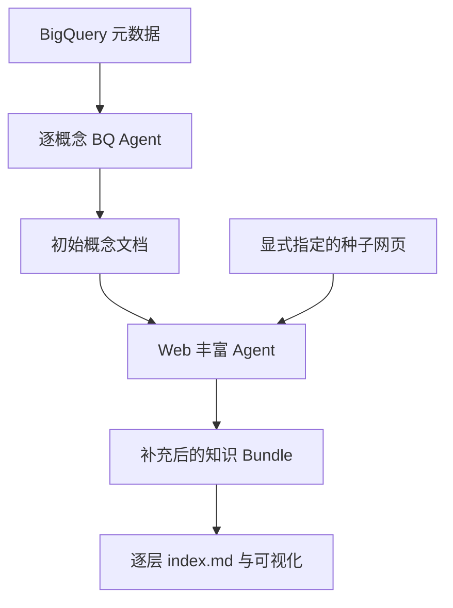
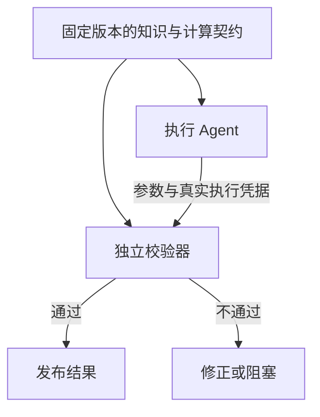
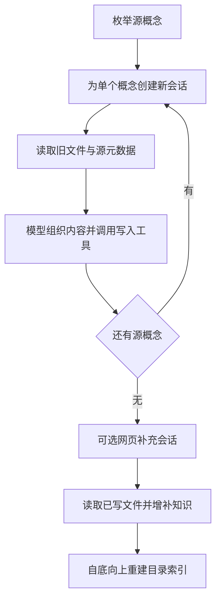
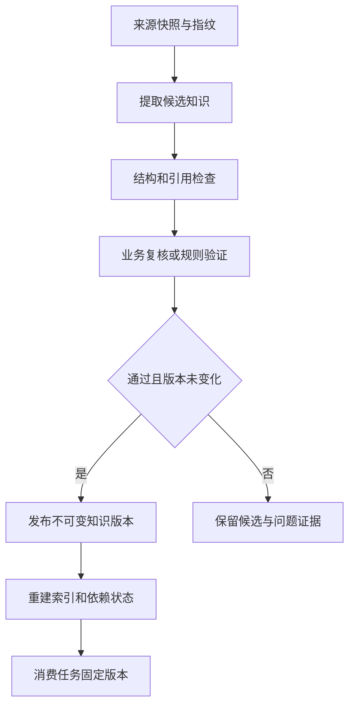
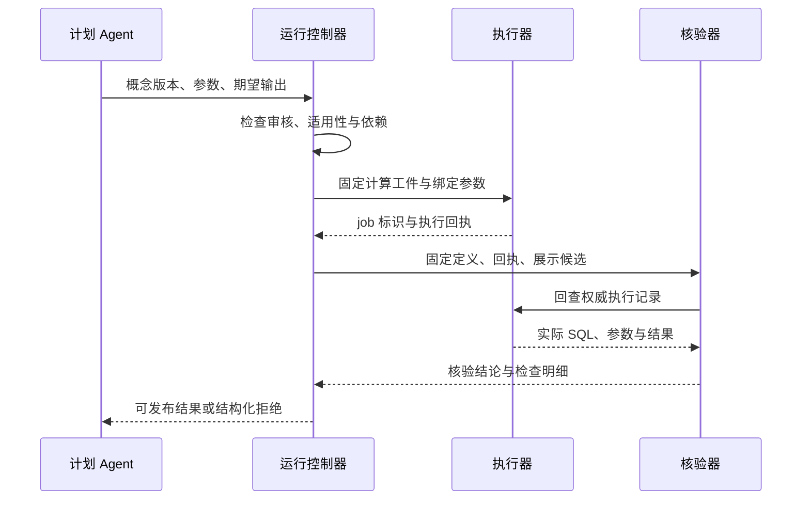

# OKF 深度分析：领域知识、Agent Runtime、按需加载与可信计算

阅读指引：第 1—11 节保留项目定位、近期更新、Wren 对照和初步结论；第 12—20 节展开本次关注的运行机制、算法、代码、检索、持久化、验证与落地设计；第 21 节为源码导航和复核边界。

核对日期：2026-10-02。日期按北京时间表述；源提交记录为 UTC。

对话依据：[用户分享的 2026-07-21 对话](https://chatgpt.com/share/6abf5a08-7bfc-83e9-9eb9-9d623dc11bc9)。

代码基准：[GoogleCloudPlatform/open-knowledge-format，main，ad30107c31c06aec8a7d5636e0d1058118604e6f](https://github.com/GoogleCloudPlatform/open-knowledge-format/tree/ad30107c31c06aec8a7d5636e0d1058118604e6f)。该主线最新提交发生于 2026-08-22 北京时间。另核对 knowledge-catalog 当前主线的 OKF 发布适配器；其基准为 62883ea36d63ca7cd7178f1381060d7b2617cd6f。9 月的 Issue/PR 作为讨论材料，未当成主线功能。

**核心判断**

当前 OKF 可以理解为“可版本化的领域知识源文件，加上来源、验证、生命周期和获准计算的契约”。相较原对话采用的 v0.1，v0.2 已开始处理知识可信度和计算行为的核验，但提供的运行代码仍以概念验证为主。检索排序、权限、多租户、知识晋升和执行门控仍需要消费端实现。

原对话中“OKF 负责知识表示、Wren 负责执行”的区分需要更新：OKF 现在可以规定获准计算、参数、执行器和核验器；Wren 仍提供面向业务数据查询的语义建模与实际执行引擎。两者在计算治理上的思想更接近，工程职责仍不同。不宜沿用原回答给出的重叠百分比，那些数字没有统一能力口径或实验支撑。

**一、先确认项目和版本**

原对话引用的是 `GoogleCloudPlatform/knowledge-catalog/okf`。该目录的当前 [README](https://github.com/GoogleCloudPlatform/knowledge-catalog/blob/main/okf/README.md) 已明确告知：独立仓库是规范、参考 Agent 和示例 Bundle 的正式维护位置，旧目录是冻结快照。

因此，应区分三件事：

| 对象 | 当前含义 |
|---|---|
| open-knowledge-format 的 SPEC.md | 格式规范，版本 0.2 |
| 参考 Python 包 | 概念验证生产工具，pyproject.toml 的包版本仍是 0.1.0 |
| knowledge-catalog 的 toolbox/mdcode/demo/okf | GCP 发布适配器，仍在另一个仓库维护 |

knowledge-catalog 在 10 月仍有其他提交，不能把整个仓库的更新日期当作 OKF 规范的更新日期。此次核对独立仓库的提交列表只有 6 个提交，最新主线仍是 ad30107c；GitHub Releases 列表为空。后续 Issue/PR 活跃不等于新版本已合并。

**二、OKF 到底想解决什么**

你的原始问题集中在四点：Agent 的领域知识不足、可持久化内容、Agent 的消费方式，以及多 Agent 的消息和串联。

OKF 的直接贡献是把分散的领域上下文变成可以共同读写的文件资产。数据库告诉 Agent 有哪些字段，领域知识还要说明一行代表什么、某个枚举的业务含义、指标口径和适用规则。OKF 将这些信息外部化，减少 Agent 临时猜测的空间。

这个定位有三层：

- **组织层**：一个概念一个 Markdown 文件；路径去掉 .md 后是 Concept ID；目录负责分组，链接负责跨目录关联。
- **消费层**：frontmatter 提供路由、过滤和摘要字段；正文保留定义、Schema、示例和解释；index.md 支持逐层发现。
- **维护层**：文件可 diff、review、追溯、打包和分发；v0.2 的来源和状态字段支持消费端判断如何使用。

格式不限制固定概念分类，因此不仅适用于表和指标，也能描述 API、业务流程、Playbook、设备术语或规则。参考工具当前主要面向 BigQuery，不能据此把格式理解为只支持 Google 数据库。

我的理解是：OKF 把“可读的知识内容”和“可被程序提取的少量信号”放在同一资产里。它适合成为知识源文件层；全文检索或向量索引可以由这些文件派生，而不是把索引当作唯一真源。

依据：[README](https://github.com/GoogleCloudPlatform/open-knowledge-format/blob/ad30107c31c06aec8a7d5636e0d1058118604e6f/README.md)、[SPEC §1–4](https://github.com/GoogleCloudPlatform/open-knowledge-format/blob/ad30107c31c06aec8a7d5636e0d1058118604e6f/SPEC.md#1-motivation)。

**三、实际实现怎样工作**

参考生产链路是两阶段，产物文件是两阶段之间的连接点：



| 代码 | 实现职责 | 对你的平台的启发 |
|---|---|---|
| [sources/base.py](https://github.com/GoogleCloudPlatform/open-knowledge-format/blob/ad30107c31c06aec8a7d5636e0d1058118604e6f/src/reference_agent/sources/base.py) | 抽象 list_concepts、read_concept、sample_rows | 保持领域输入适配与通用知识格式分离 |
| [sources/bigquery.py](https://github.com/GoogleCloudPlatform/open-knowledge-format/blob/ad30107c31c06aec8a7d5636e0d1058118604e6f/src/reference_agent/sources/bigquery.py) | 提取数据集、表、嵌套 Schema、分区、聚簇等；日期分片表归并成表族 | 按逻辑资产生成概念，避免按物理分片制造大量重复文件 |
| [agent.py](https://github.com/GoogleCloudPlatform/open-knowledge-format/blob/ad30107c31c06aec8a7d5636e0d1058118604e6f/src/reference_agent/agent.py) | 用 Google ADK 构建 BQ 和 Web 两个 Agent，工具权限不同 | 根据任务阶段限定工具集合，比给所有角色同样的工具更明确 |
| [runner.py](https://github.com/GoogleCloudPlatform/open-knowledge-format/blob/ad30107c31c06aec8a7d5636e0d1058118604e6f/src/reference_agent/runner.py) | BQ 概念顺序处理，每个概念新建 session；随后运行独立 Web session | 上下文隔离按概念、阶段划分，跨阶段传文件 |
| [prompts/web_ingestion_instruction.md](https://github.com/GoogleCloudPlatform/open-knowledge-format/blob/ad30107c31c06aec8a7d5636e0d1058118604e6f/src/reference_agent/prompts/web_ingestion_instruction.md) | 要求抽取指标、维度、Join；指标和 Join 单独成文，再从主要表文档链接回来 | 可复用概念应有归属和入口，避免参考文档成为孤岛 |
| [tools/bundle_tools.py](https://github.com/GoogleCloudPlatform/open-knowledge-format/blob/ad30107c31c06aec8a7d5636e0d1058118604e6f/src/reference_agent/tools/bundle_tools.py) | 写入 YAML + Markdown，补 generated；Web 阶段保护表 Schema 字段集合和 sources 数量 | 写知识时可以加确定性保护，但当前保护范围有限 |
| [bundle/index.py](https://github.com/GoogleCloudPlatform/open-knowledge-format/blob/ad30107c31c06aec8a7d5636e0d1058118604e6f/src/reference_agent/bundle/index.py) | 自底向上生成目录索引，按类型组织标题与摘要 | 提供发现能力；消费端仍要决定本次任务读取哪些内容 |
| [viewer/generator.py](https://github.com/GoogleCloudPlatform/open-knowledge-format/blob/ad30107c31c06aec8a7d5636e0d1058118604e6f/src/reference_agent/viewer/generator.py) | 将概念和正文链接变成静态 HTML 的图节点、边和详情 | 图是文件的派生视图，不承担知识真实性验证 |

当前参考实现不是 Agent 团队协商系统。BQ 和 Web 是由代码顺序安排的两类生产任务；BQ 每个概念独立会话，Web 阶段通过磁盘文档接续。没有证据表明它实现了通用 A2A 消息总线、并行任务调度或独立验收 Agent。

实现还保留了较强的具体技术选择：CLI 只接受 `--source bq`；Agent 使用 ADK/Gemini，默认模型是 `gemini-flash-latest`。格式本身与这些选择解耦。接入你的内网平台时，优先复用文档结构、输入适配抽象和工具契约，再替换运行框架及模型调用。

Web 获取的页面数、允许主机、URL 路径和跳数由工具检查。模型负责选择值得读的链接和抽取内容，代码负责限制可抓取范围。领域提取质量、引用正确性和停止是否充分仍需另行评估。

**四、v0.2 中最重要的三类变化**

**1. 来源从正文列表变成可查询的信号。**

`sources` 记录来源材料；正文脚注通过稳定的 `sources[].id` 归属到来源。来源列表重排时，ID 比“第 2 条来源”稳健。来源还能记录作者、使用次数、来源更新时间和使用窗口。

这里有两个边界：使用次数表示活跃程度和采用情况，不能直接等同正确率；来源的更新时间与知识文档的生成时间也不是一回事。某个文档昨天被 Agent 重写，不代表它依据的事实昨天得到重新确认。

**2. 生成、验证和生命周期分开。**

| 信号 | 回答的问题 | 不能单独证明什么 |
|---|---|---|
| generated | 当前内容由谁产生，何时发生有意义的改动 | 内容经过审核 |
| verified | 谁或哪个过程确认过内容 | 当前版本已经通过完整验证 |
| status | draft / stable / deprecated | 权限、事实正确性或执行安全 |
| stale_after | 到哪个明确时刻应视为过期 | 上游事实一定没有提前改变 |

[document.py](https://github.com/GoogleCloudPlatform/open-knowledge-format/blob/ad30107c31c06aec8a7d5636e0d1058118604e6f/src/reference_agent/bundle/document.py) 已实现 verified 单对象到列表的归一化、三个信任等级和过期判断。信任等级来自 verifier 的身份前缀：无验证、机器确认、人审。它们是消费信号，不是身份认证或签名。

一个具体限制是，当前 `trust_tier()` 不比较生成与验证的时间。离线输入“7 月人审、10 月重写”的概念仍返回 `human-reviewed`。如果你用于知识晋升，需要把验证绑定到内容版本或内容指纹，而不是只保留旧的 verified 列表。

**3. 获准计算成为独立概念。**

`Attested Computation` 将以下内容放在一个可复用合同里：运行方式、允许填写的参数、SQL/程序、执行器及其返回凭据、确定性核验器。指标叙述通过链接引用它。同一个计算可以服务不同报表，并独立过期或验证。

其关键约束是：Agent 为既定计算填参数；改计算定义属于另一项可审查的资产修改。业务需要灵活新查询时，仍可走另一个工作流，不能将任意生成的 SQL 冒充获准计算。

下面两种确认应独立：

- **定义验证**：这份口径仍符合当前政策，记录在知识资产中。
- **执行核验**：本次运行执行了该口径，展示值与执行证据一致，属于运行记录。

因此，“SQL 按获准方式运行”与“获准方式仍符合政策”都必须检查。一个旧口径的计算可以执行得完全忠实。

依据：[Acme 计算示例](https://github.com/GoogleCloudPlatform/open-knowledge-format/blob/ad30107c31c06aec8a7d5636e0d1058118604e6f/bundles/acme_retail/computations/revenue-ytd.md)、[执行规程](https://github.com/GoogleCloudPlatform/open-knowledge-format/blob/ad30107c31c06aec8a7d5636e0d1058118604e6f/bundles/acme_retail/skills/run-on-bq.md)、[核验器](https://github.com/GoogleCloudPlatform/open-knowledge-format/blob/ad30107c31c06aec8a7d5636e0d1058118604e6f/bundles/acme_retail/attesters/sql_equality.py)、[SPEC §10](https://github.com/GoogleCloudPlatform/open-knowledge-format/blob/ad30107c31c06aec8a7d5636e0d1058118604e6f/SPEC.md#10-attested-computations-concept)。

**五、规范目标与示例代码之间的距离**

这是落地时最需要留意的部分。以下观察来自当前源码与离线探针，不是对 Google Cloud 真实作业的测试。

| 观察 | 当前行为 | 实际含义 |
|---|---|---|
| SQL 改成另一张表 | 示例核验器返回失败 | 能检查一部分计算模板偏离 |
| 没有 job_id，SQL 与结果匹配 | 仍返回通过 | 未证明真实作业发生 |
| 同一个 @year 模板，参数值变化 | 核验器不检查实际绑定值 | 参数绑定依赖对执行器的信任 |
| 字符串字面量从 'select' 改成 'SELECT' | 正则规范化后仍可判定一致 | 不是可靠的 SQL 语义等价或忠实性检查 |
| result 为 [] | 抛 IndexError | 空结果未变成统一失败 verdict |
| 内容更新后保留更早的人审事件 | 仍为 human-reviewed | 旧验证会影响新内容的等级 |
| viewer 收到 /tables/a.md 正文链接 | 不生成该边 | 与规范支持的 Bundle 根路径形式存在差距 |
| 仅 sources 指向概念，没有正文链接 | 不生成该来源边 | 当前图不是完整的来源谱系图 |
| 重建根 index.md | 丢失原有 okf_version | 版本声明未保留；有未合并修复 PR |

`sql_equality.py` 明确不发网络请求：比较的是调用方传入的 `receipt.executed_sql` 与 `receipt.result`。它没有按 job_id 独立回读数据库，也没有独立核对实际参数。若执行凭据可以由生成 Agent 随意构造，这种自洽检查并不能证明真实执行。

在你的平台中，可以让执行工具从数据库响应生成凭据，由验证端回读作业或验证平台签发的证据，绑定计算版本、参数和结果指纹。需要 SQL 规范化时应使用能区分语法与字符串字面量的解析方式，或优先核对不可变模板及绑定参数。

写入保护也应按当前实际能力理解：代码保护 Web 阶段已有 BigQuery 表的字段名字集合，以及 sources 条数不缩小；它没有全面检查来源成员、每条声明或所有正文段落。索引目前主要发布类型、标题和描述，不自动发布或执行全套信任过滤。

**六、最近已合并的更新**

下面以原对话时间 2026-07-21 为起点，避免将最早已有的功能当作新增。

| 北京时间 | 变更 | 为什么值得关注 | 证据 |
|---|---|---|---|
| 07-25 | v0.1 → v0.2，迁移格式、生产提示、写入代码、Viewer 和样例；加入 Acme Retail | 扩展到来源、信任、生命周期和获准计算；不只是改规范文字 | [原仓库 #227](https://github.com/GoogleCloudPlatform/knowledge-catalog/pull/227) |
| 08-15 | Stack Overflow 示例的 tags 改为 YAML 列表 | 修复字符串被逐字符映射成目录标签的往返损坏 | [#293](https://github.com/GoogleCloudPlatform/knowledge-catalog/pull/293) |
| 08-15 | GCP 适配器承载完整 v0.2 信号，支持顶层及嵌套扩展字段，增加专用 entry type | 云端目录往返保留更多知识语义 | [#292](https://github.com/GoogleCloudPlatform/knowledge-catalog/pull/292)、[#296](https://github.com/GoogleCloudPlatform/knowledge-catalog/pull/296)、[#297](https://github.com/GoogleCloudPlatform/knowledge-catalog/pull/297) |
| 08-15 / 08-22 | 独立仓库恢复完整内容；旧目录公开标为冻结 | 以后应关注独立仓库，而非旧目录 | [恢复提交](https://github.com/GoogleCloudPlatform/open-knowledge-format/commit/25461dbcdd5b)、[旧仓库 #324](https://github.com/GoogleCloudPlatform/knowledge-catalog/pull/324) |
| 08-22 | 时间字段统一为有 UTC offset 的 ISO 8601 datetime；Python 保留时间文本，更新过期判断 | 修复跨时区歧义及 YAML 日期隐式转换；裸日期在当前 is_stale 中被忽略 | [独立仓库 #6](https://github.com/GoogleCloudPlatform/open-knowledge-format/pull/6) |
| 08-22～23 | 发布 Demo 改进参数解析、gcloud 调用、失败处理、拉取目标和 manifest 位置 | 默认拉取到 pulled/；减少覆盖源资产及错误成功状态 | [原仓库 #325](https://github.com/GoogleCloudPlatform/knowledge-catalog/pull/325)、[#326](https://github.com/GoogleCloudPlatform/knowledge-catalog/pull/326)、[#332](https://github.com/GoogleCloudPlatform/knowledge-catalog/pull/332) |

有一个文档与实现的差异：独立仓库的 [GCP connector 文档](https://github.com/GoogleCloudPlatform/open-knowledge-format/blob/ad30107c31c06aec8a7d5636e0d1058118604e6f/connectors/gcp-knowledge-catalog.md) 仍写“只承载七个 frontmatter 字段”；它引用的 [当前 okf.ts](https://github.com/GoogleCloudPlatform/knowledge-catalog/blob/62883ea36d63ca7cd7178f1381060d7b2617cd6f/toolbox/mdcode/demo/okf/okf.ts) 已承载更完整的信号，并用 JSON 的路径—值列表保留未建模字段。评估往返能力时，应检查适配器代码和实际目标后端，不能直接沿用这份文档的旧能力清单。

此次未运行 GCP push/pull。提交描述中报告的云端验证属于维护者的验证记录，不是本次独立复现。

**七、9 月新增讨论：尚未成为主线功能**

| 讨论主题 | 当前状态及入口 | 与你关注点的关系 |
|---|---|---|
| 带类型、方向和信任的关系；更明确的图语义 | [Issue #16](https://github.com/GoogleCloudPlatform/open-knowledge-format/issues/16)、[#30](https://github.com/GoogleCloudPlatform/open-knowledge-format/issues/30)，open | 从“链接到谁”扩展到“是什么关系、由谁确认” |
| supersedes 与 contested_by 的查询语义 | [Issue #22](https://github.com/GoogleCloudPlatform/open-knowledge-format/issues/22)，open | 旧口径替代、冲突知识的消费方式 |
| imported：记录外部知识及其原始验证，不自动继承本地信任 | [Issue #15](https://github.com/GoogleCloudPlatform/open-knowledge-format/issues/15)，open | 个人/公共资产、跨部门 Bundle 交换 |
| refuted：持久化“检查后否定”的事件 | [Issue #13](https://github.com/GoogleCloudPlatform/open-knowledge-format/issues/13)，open | 区分未验证与验证失败，避免后续 Agent 恢复错误经验 |
| generated 与 revised/edited 的语义拆分 | [Issue #28](https://github.com/GoogleCloudPlatform/open-knowledge-format/issues/28)，open | 区分原始生产者与最近修改者 |
| 来源跨信任边界时的隐藏或脱敏标记 | [Issue #32](https://github.com/GoogleCloudPlatform/open-knowledge-format/issues/32)，open | 多租户消费公共知识时，避免来源暴露或误以为来源完整 |
| 内部链接兼容、根索引保留 okf_version、资源路径前缀修复 | [PR #23](https://github.com/GoogleCloudPlatform/open-knowledge-format/pull/23)、[#25](https://github.com/GoogleCloudPlatform/open-knowledge-format/pull/25)、[#31](https://github.com/GoogleCloudPlatform/open-knowledge-format/pull/31)，open | 对生产者—消费者互操作的基础修复 |
| 时间格式变更未升级版本号的兼容问题 | [Issue #24](https://github.com/GoogleCloudPlatform/open-knowledge-format/issues/24)，open | 同为 0.2 的旧产物不能只看版本号断言完全兼容 |

这些是社区提出的问题或修复方案，不能当成维护者已承诺的路线图。9 月讨论说明真实读写、跨团队交换与生命周期管理开始暴露格式边界。尤其是 relationships、imported、refuted，正好对应你原对话已经提出的方向；当前 v0.2 消费者并不会自动执行这些扩展语义。

**八、哪些内容值得持久化**

以下是结合当前代码对你平台的建议，不是上游新增的强制 Schema。

| 内容 | 建议承载位置 | 关键约束 |
|---|---|---|
| 术语、实体、表结构、数据粒度和单位 | Concept 正文及少量 frontmatter | 每个概念保持语义边界，写清适用范围 |
| 业务规则、指标口径、标准来源 | 可链接的规则/指标概念 | 来源可追溯，验证绑定版本 |
| 已批准的 SQL 或确定性程序 | Attested Computation + 实际 SQL/脚本 | Agent 只填参数，定义修改走评审 |
| 操作流程 | Skill / Playbook | 执行要求交给脚本、工具与平台校验 |
| 已验证且可复用的案例 | Case 概念 + 证据引用 | 标明适用条件、正反例与验证方法 |
| 来源、审核、过期、废弃 | 元数据 | 消费端明确解释并据此筛选 |
| 每次执行的 job、参数、结果、verdict | Run 记录 | 与持久定义分离，通过版本引用关联 |

完整会话、试错日志、临时句柄和未验证假设可以保留在运行轨迹中，不应直接变成稳定领域事实。向量索引可重建；多 Agent 消息承担调度和状态；二者都不替代知识源资产。

格式允许额外字段，你可以添加领域 scope、适用设备、产品和版本等。保持开始时字段少且有明确消费用途；不要仅因为能扩展就先建一个庞大的通用本体。

**九、对多 Agent 通信与串联的直接启发**

最值得复制的是跨 Agent 传递“可定位、可版本化、可验证的产物”，并按任务边界隔离上下文。参考实现已有概念 session 和阶段 session 的隔离，生产者—消费者以文件接续。你的平台可以进一步把执行与验收接起来。

消息中最小需要包含任务 ID、资产版本、概念引用、参数、执行证据引用和验收条件。例如：

```yaml
task_id: process-capability-20261002-001
bundle_ref: semiconductor/process-knowledge
bundle_commit: "<immutable commit or content fingerprint>"
concept_refs:
  - /metrics/cpk.md
  - /computations/cpk-by-product.md
parameters:
  product: P1
  window_start: 2026-09-01T00:00:00+08:00
  window_end: 2026-10-01T00:00:00+08:00
receipt_ref: runs/run-001/receipt.json
acceptance:
  - 核对批准的计算版本与实际参数
  - 核对来源数据、样本量、单位和结果
  - 不通过时输出失败或阻塞原因
```

这是平台侧消息建议，**不是 OKF 官方消息协议**。具体产品、时间窗口、Cpk 适用条件与计算规则应按你实际业务确定。



独立校验器应读取原始任务、批准口径、必要原始证据和执行凭据，允许直接 FAIL。计算能机械校验时使用确定性代码；口径解释需要 LLM 时，再用独立会话。生成 Agent 的长篇解释不应替代这些证据。

还要显式补足 OKF 没有实现的部分：身份与权限、并发写入、任务幂等、固定版本读取、验证版本绑定、冲突处理和知识晋升。这些属于你的运行平台，不必都塞进格式。

**十、与 Wren 的当前关系**

此次另读了 [WrenAI 当前 README](https://github.com/Canner/WrenAI/blob/main/README.md)。它仍以业务数据查询为中心，提供 MDL 语义层、AI 上下文、检索和执行原语。当前 README 中的知识文件例子是 `instructions.md` 和 `queries.yml`，不能不加核对地照抄原对话中较早的目录名。

| 维度 | OKF v0.2 | Wren 当前定位 |
|---|---|---|
| 范围 | 多领域知识资产与交换 | 业务数据查询、分析与 GenBI |
| 核心表示 | 概念文件、来源和状态、计算契约 | MDL 模型/关系/指标，加业务上下文文件 |
| 计算治理 | 约定获准计算、执行凭据和确定性核验器 | 语义规划、查询执行和 dry-plan 等工具 |
| 项目交付形态 | 格式规范及参考生产/消费示例 | 可使用的语义引擎、CLI 和集成能力 |
| 多 Agent 通信 | 没有通用消息协议 | 也不能仅由语义层推导为通用多 Agent 编排系统 |

可以组合，但要显式映射：OKF 的 Metric 或 Policy 正文不会自动编译成 MDL，Markdown 里的 Join 描述也不会自动获得执行约束。高价值口径转成可执行定义，需要专门适配和验证。

**十一、建议你优先采用的最小部分**

1. 给一个具体场景建立小知识 Bundle：指标、数据对象、规则、计算、来源。沿用你的按需加载方式，让 Skill 指导 Agent 先发现再读取。
2. 将 1～2 个容易算错、但业务口径稳定的计算做成固定模板和真实执行凭据；把执行核验接到结果发布前。
3. 验证绑定内容指纹，并明确 draft、deprecated、stale 的消费行为；个人经验转公共资产时重新审核。
4. 多 Agent 消息先只传资产引用、版本、参数、凭据和验收条件；需要机械关系查询时再增加有限的类型化关系。
5. 用相同任务对比无 Bundle、只有文档、有导航和状态过滤、有计算核验四种设置；记录正确率、引用准确率、过期知识使用率、实际读取轨迹、token/耗时和核验拦截率。

这些评测阶段是平台落地建议，不是上游已有 benchmark。核心价值应通过任务结果验证，不能用知识文件数量或可视化图节点数量代替。

**核查范围**

已阅读分享对话；核对当前规范、参考 Agent、源适配、写入代码、索引、Viewer、Acme 计算/核验样例、相关提交和未合并讨论；运行了离线探针。未执行 Google Cloud 真实作业、push/pull，也未完成参考项目的 pytest 测试套件（当前环境未安装 pytest）。离线探针能证明上述代码路径的行为，不能证明部署后的整体可靠性。


---

**十二、把你的两句话翻译成可实现的系统契约**

你提出的“写出来、确认过、仍有效、本次算对了”，适合成为系统的四个独立判断维度。它们不能压缩成一个 `verified: true`，也不应被理解为四个走完就永远结束的阶段。知识会变化，数据会刷新，每次计算都有不同的参数和结果。

| 维度 | 回答的问题 | OKF 对应载体 | 当前参考实现的实际保证 | 你的消费端应补充 |
|---|---|---|---|---|
| 写出来 | 这个概念是否已经被明确表达、可以引用？ | 概念 Markdown、Concept ID、`generated`、`sources` | 能生成文件；必填验证主要是 `type` | 完整性、来源可追溯、适用范围、冲突检查 |
| 确认过 | 哪个主体检查了哪一版内容，检查了什么？ | `verified` 事件 | 按 `by` 文本推导展示等级 | 验证绑定内容哈希、验证范围、证据和主体身份 |
| 仍有效 | 在当前时间、业务边界、数据版本下还能使用吗？ | `status`、`stale_after`、来源信息 | 能做时间比较；不自动检查全部依赖 | 时间有效性、业务适用性、依赖变更、授权状态 |
| 本次算对了 | 这次结果来自获准定义、正确参数和可信执行吗？ | Attested Computation、executor、receipt、attester | 示例检查 SQL 文本与回执中的值 | 参数绑定、真实 job 回查、数据快照、结果形状、展示变换 |

建议将消费决策表示为一个判定对象，而不是一个总分：

```json
{
  "concept_id": "finance/metrics/recognized-revenue",
  "content_revision": "sha256:<concept-content>",
  "definition_review": "accepted",
  "review_scope": ["business-definition", "currency-policy"],
  "freshness": "fresh",
  "applicability": "matched",
  "execution_attestation": "not-run"
}
```

这是本文建议的应用层结构，并非 OKF v0.2 新增的标准字段。`execution_attestation` 尚未运行时，系统仍能解释指标口径；它不能据此报出某个年度的实际收入。反过来，一次 SQL 成功执行，也不能证明指标定义已经获得业务认可。

可以把最终数值发布条件写成一个便于评审的逻辑式：

`可发布 = 定义获准 ∧ 当前适用 ∧ 版本一致 ∧ 执行证据可信 ∧ 结果核验通过`

这里“当前适用”至少包含时间、业务范围和依赖版本。这个逻辑式表达门控策略，不代表 OKF 当前已经实现这些检查。

“按概念隔离上下文，以文件连接阶段”则对应另一个分工：**短期会话负责完成局部任务；文件保存可复用结论；版本化工件负责跨阶段交接；运行记录保存本次执行事实。** 对话历史、知识真源和运行证据应该拥有不同的生命周期。

**十三、参考 Agent 的运行过程：实际执行了什么**

代码入口集中在 `src/reference_agent/cli.py`、`agent.py`、`runner.py`。当前 CLI 的数据源实现是 BigQuery；网页用于补充语义知识。它不是一个已经具备任意检索、任意计算、验证晋升和多 Agent 调度能力的通用平台。



这个图描述参考实现的知识生产流程；用户问答时如何加载和执行知识，是另一个需要建设的消费流程。

**13.1 一概念一会话，隔离的是模型对话历史**

下面是 `runner.py` 中 `enrich_concept()` 的实际核心代码，省略了日志调用：

```python
session_id = f"enrich-{uuid.uuid4().hex[:12]}"
self._bq_session_service.create_session_sync(
    app_name=_BQ_APP_NAME, user_id=_USER_ID, session_id=session_id
)
message = _build_bq_user_message(ref)
for event in self._bq_runner.run(
    user_id=_USER_ID, session_id=session_id, new_message=message
):
    _log_event_parts(event, ref.id_str, verbose=self.verbose)
```

每次生成一个新 session ID，避免上一个表的完整工具结果继续污染下一个表的会话。任务消息只给概念 ID、类型，以及“为此概念写一个文件”的要求；模型通过工具获取内容。这使工作单元比较明确，也使后续按概念重跑成为可能。

但 `InMemorySessionService` 是内存会话服务，不能据此期待进程退出后恢复会话。真正跨阶段保留下来的主要是文件。`enrich_all()` 当前顺序遍历概念，之后执行 Web pass，再重建索引；没有概念级并行调度、持久化任务队列或检查点恢复协议。

还有一个执行语义上的缺口：`enrich_concept()` 主要消费并记录事件，没有在结尾强制检查目标文件是否成功产生、内容是否符合完整业务契约。`enrich_all()` 中的计数是在调用返回后递增。因此，**处理数量不能直接当作验证通过的产物数量**。生产环境应在阶段结束时重新读取工件、计算哈希、运行校验器，再写成功 manifest。

**13.2 工具集决定可行动边界，提示词决定工作顺序**

| Agent | 当前注册的主要工具 | 阶段职责 |
|---|---|---|
| BQ Agent | `list_concepts`、`read_concept_raw`、`sample_rows`、`read_existing_doc`、`write_concept_doc` | 从结构化数据源生成概念文件 |
| Web Agent | `list_concepts`、`read_concept_raw`、`read_existing_doc`、`write_concept_doc`、`fetch_url` | 从网页解释术语、指标、关联规则，并增补文件 |

`agent.py` 将 Python 函数包装为 Google ADK 的 `FunctionTool`。BQ 提示词要求先读取已有文档，再获取原始元数据，必要时取少量样本，寻找跨概念链接，最后写完整文档。工具 `sample_rows` 的默认 `n` 是 5；提示词中的建议采样量与函数默认值不是同一个约束。若对敏感数据有要求，应在工具执行端控制允许列和数量，不能只依赖提示词。

特别需要注意：`source_tools.list_concepts()` 返回的是 **Source 广告出来的概念**，并不扫描 bundle 中所有新增的 `references/` 文件。因此，Web Agent 新建的知识并不会自动变成这个工具下一次完整列举的对象。建议将源对象发现和已沉淀知识发现拆成 `list_source_concepts` 与 `search_bundle` 两个清晰接口。

**13.3 会话隔离不等于工具上下文隔离**

`tools/context.py` 使用模块级变量：

```python
_ctx: ToolContext | None = None
_web: WebState | None = None

def set_context(source: Source, bundle_root: Path, model: str = "") -> None:
    global _ctx
    _ctx = ToolContext(source=source, bundle_root=Path(bundle_root), model=model)
```

`ReferenceRunner` 构造函数会调用 `set_context()`。如果在同一进程中构造多个 runner，后构造的 runner 可以覆盖先前 runner 的工具上下文。即便它们的 ADK session ID 不同，工具仍可能取到同一个最新 `_ctx`。

对你的多 Agent 设计，建议优先使用显式依赖注入：每个任务持有自己的 source、只读 bundle revision、写入目录和权限句柄，并将这些对象绑定到工具实例。如果采用 `ContextVar`，还应验证任务创建和异步调用中的上下文传播；更简单的过渡方案是一个隔离进程负责一个 bundle 写入任务。单独修改 prompt 或增加 session ID 无法解决这个问题。

**13.4 Web pass 是独立阶段，但仍有共享文件状态**

Web pass 创建一个新的会话，设置抓取状态，在 `finally` 中清理 `_web`。它不继承 BQ 会话的完整聊天记录，通过 `read_existing_doc()` 接上上一阶段输出。这正是文件连接阶段的实际落点。

不过，当前整个 Web pass 共用一个会话；页数限制不等于上下文 token 上限。网页增多后，需要进一步分批：按主题或概念组生成独立提取任务，输出候选补丁，再由合并步骤提交。保留抓取状态与来源指纹，不必保留所有网页正文在模型窗口中。

依据：[runner.py](https://github.com/GoogleCloudPlatform/open-knowledge-format/blob/ad30107c31c06aec8a7d5636e0d1058118604e6f/src/reference_agent/runner.py)、[agent.py](https://github.com/GoogleCloudPlatform/open-knowledge-format/blob/ad30107c31c06aec8a7d5636e0d1058118604e6f/src/reference_agent/agent.py)、[context.py](https://github.com/GoogleCloudPlatform/open-knowledge-format/blob/ad30107c31c06aec8a7d5636e0d1058118604e6f/src/reference_agent/tools/context.py)。

**十四、这里的“算法”分别是什么：确定性代码与模型判断的边界**

OKF 的主要贡献不是训练一个新的领域模型，也没有在参考实现中提供完整的向量检索算法。其工程方法是将确定性提取、模型组织知识、文件约束和可执行检查组合起来。

| 环节 | 当前方法 | 确定性部分 | 模型判断部分 | 不能由此推出的能力 |
|---|---|---|---|---|
| 源概念发现 | Source 接口与 BigQuery 枚举 | 数据集、表、字段和部分元数据读取 | 无需模型决定对象是否存在 | 自动支持任意数据源 |
| 分片归并 | 名称后缀规则 | 正则分组、选取代表分片 | 无 | 跨分片结构完全一致 |
| 概念成文 | 工具调用循环 | 读写路径、基础结构检查 | 解释、摘要、链接、示例组织 | 自动业务确认 |
| 网页补充 | 有界链接探索 | host、路径、页数、深度、已访问集合 | 选择高价值页面、决定增补或新建 | 完备的网页覆盖与语义召回保证 |
| 层次索引 | 自底向上聚合 | 扫描目录、分组、排序、链接 | 目录摘要 | 自动最优分类或查询排序 |
| 知识图展示 | 正文链接抽取 | 解析 `.md` 链接、构建邻接关系 | 无 | 有类型、可推理的完整知识图谱 |
| 信任与过期展示 | frontmatter 字段规则 | 事件类型分类、时间比较 | 无 | 身份认证、版本绑定和依赖有效性 |
| 计算核验样例 | SQL 字符串归一化与值比较 | 文本处理、等值判断 | 不使用 LLM | SQL 语义等价、真实执行与参数正确性 |

**14.1 BigQuery 的分片归并是命名启发式**

`bigquery.py` 使用以下规则识别以日期式数字结尾的表名：

```python
_SHARD_SUFFIX_RE = re.compile(r"^(?P<prefix>.+?_)(?P<shard>\d{6,8})$")
```

例如 `events_20260101` 和 `events_20260102` 可以被归入 `events_` 家族。该机制压缩大量结构重复的物理表，让 Agent 围绕一个逻辑概念写文档。它根据名称规则分组，并选择代表分片；六到八位数字本身不证明真实日期语义，也不证明每个分片 Schema 相同。

你可以复用“逻辑概念覆盖一组物理对象”的思想，但应附带分组规则版本、已观测时间范围、异常分片列表和 Schema 漂移检查。否则，概念压缩可能隐藏数据差异。

**14.2 Web 新概念判定属于知识建模启发式**

Web 提示词要求判断一个页面是否只是导航、教程或大范围介绍，还是包含值得独立引用的概念。常见判断包括：能否命名为一个稳定主题，主概念会不会引用它，是否可跨多个概念复用，或是否对单个概念不可缺少。指标和 Join 知识被特别强调为应抽取的对象；普通维度信息可以保留在所属概念中。

这套方法有利于避免“每个网页一个知识文件”。但它仍是提示词策略，不是具备召回率保证的分类器。建议积累业务专家标注的拆分案例：哪些应该独立、哪些应内联、哪些属于证据而不是知识定义。评价对象应包括重复概念率、孤立文件率和关键口径遗漏率，而不只是生成字数。

**14.3 索引生成是底向上摘要，不是查询检索**

`bundle/index.py` 先收集含 Markdown 的目录及其祖先，再按深度降序处理：

```python
directories = sorted(
    _directories_to_index(bundle_root),
    key=lambda p: (-len(p.relative_to(bundle_root).parts), str(p)),
)
```

处理某目录时，子目录摘要已经可用。概念条目按 `type` 分组、按标题排序，子目录链接指向其 `index.md`。只有一个且已有描述的子条目时可复用描述；其他情况调用摘要生成器。摘要失败还有简单回退文本。

因此，上层 Agent 可以先读少量目录说明，再下钻。这是渐进加载的基础设施。它没有实现“根据用户问题选择哪一个目录”的消费循环，也没有 BM25、向量相似度、学习排序、权限过滤或固定 token 预算。

如果每个概念会话都调用返回全量对象的 `list_concepts()`，有 N 个概念时，整个生产批次反复传输概念目录的规模可能接近 O(N²)。这是基于调用模式的规模推断，不是实测性能结论。后续应支持按类型、前缀和关键字分页发现相关对象。

依据：[BigQuery Source](https://github.com/GoogleCloudPlatform/open-knowledge-format/blob/ad30107c31c06aec8a7d5636e0d1058118604e6f/src/reference_agent/sources/bigquery.py)、[Web 提示词](https://github.com/GoogleCloudPlatform/open-knowledge-format/blob/ad30107c31c06aec8a7d5636e0d1058118604e6f/src/reference_agent/prompts/web_ingestion_instruction.md)、[索引实现](https://github.com/GoogleCloudPlatform/open-knowledge-format/blob/ad30107c31c06aec8a7d5636e0d1058118604e6f/src/reference_agent/bundle/index.py)。

**十五、文件写入究竟保证了什么**

`write_concept_doc()` 接收概念 ID、完整 frontmatter 与正文。路径由概念 ID 推导，工具自动补齐缺失的生成者和生成时间，构造 `OKFDocument`，执行基础验证后写入文件。

关键代码如下，摘自 `tools/bundle_tools.py`：

```python
if not generated.get("by"):
    generated["by"] = f"reference_agent/{ctx.model}" if ctx.model else "reference_agent"
if not generated.get("at"):
    generated["at"] = datetime.now(timezone.utc).isoformat(timespec="seconds")
fm["generated"] = generated
# 中间执行文档验证和 Web 增补保护。
path.parent.mkdir(parents=True, exist_ok=True)
text = doc.serialize()
path.write_text(text, encoding="utf-8")
```

这段代码有五个值得借鉴或补齐的点。

第一，生成者信息由工具填入，减少模型遗漏元数据；但只在字段缺失时填入。若调用者带着旧 `generated.at` 重写新内容，工具保留旧值。你需要明确区分首次创建时间、最近内容修订时间和重新验证时间。

第二，这是完整替换，不是结构化补丁。模型必须读全旧内容并保留仍有效部分。如果两个 Agent 同时读取旧版本再写入，后写者可能覆盖先写者的更新。建议写请求携带 `expected_revision`，由存储层执行比较后交换（CAS），失败时重新读取并合并。

第三，当前验证主要要求 `type` 非空，并不等同于完整 OKF 语义验证。可解析 YAML、不丢字段、链接可解、时间合法、来源存在、计算参数一致，是不同级别的校验，最好分成多个可解释的结果。

第四，Web pass 对已有 BigQuery Table 有增补保护：新正文 `# Schema` 中抽出的字段集合不能少于旧集合；新 `sources` 数量不能减少。前者不能保护字段解释是否被改错；后者只比较数量，不保证旧来源仍在。建议分别校验字段签名和来源 ID 集合，并允许经过明确审批的合法删除。

第五，`write_text()` 本身没有提供文件事务、锁、Git 提交、review 流程或 `verified` 失效处理。应在应用层增加临时文件写入与原子替换、乐观并发控制、提交记录、验证事件失效与重建索引。不要让多个 Agent 直接争写同一个正式知识文件。

推荐的晋升流程如下，属于你的应用层设计：



其中，“未通过”不必删除候选。它可以成为有明确状态的待核实信息或反例；但不能自动进入权威知识集合。

**十六、知识检索与按需加载：建议怎样补上消费端**

领域知识检索的目标，应当是找到足以支持当前决策的一组可引用概念及其必要依赖。仅命中一个语义相近的段落，常常还不足以正确执行任务。例如查到“收入”的定义，却没加载收入确认政策、退货窗口、币种处理和获准计算，会产生看似合理但口径错误的 SQL。

建议使用三层内容与两类关联。

| 加载层 | 主要内容 | Agent 在此层做什么 |
|---|---|---|
| L0 领域路由 | 目录说明、领域边界、可回答问题、owner | 判断进入财务、生产、设备或其他域 |
| L1 概念卡片 | ID、类型、标题、描述、适用范围、版本和有效性摘要 | 从候选中挑选少量对象 |
| L2 正文及必要依赖 | 完整定义、规则、证据、计算契约、参数和异常处理 | 形成答案或执行计划 |

两类关联分别是“相关内容”和“执行必需依赖”。前者可以在预算内按相关性展开；后者缺失时应阻止执行或明确降级。当前 Markdown 链接本身没有充分表达这种区别，你可以在应用侧维护依赖索引，未来再与标准中的类型化关系方案对齐。

**16.1 目录以业务稳定边界为主，类型作为域内组织方式**

不要把全部信息都放进一个巨大 `references/`。也不要按照 Agent 名称建真源目录，否则 Agent 职责一调整就需要迁移知识。下面是建议结构，所有带 `app_` 的元数据和运行控制均属于应用扩展：

| 路径示例 | 作用 |
|---|---|
| `knowledge/index.md` | 根路由：业务域与边界 |
| `knowledge/finance/index.md` | 财务知识入口 |
| `knowledge/finance/metrics/recognized-revenue.md` | 指标定义 |
| `knowledge/finance/policies/revenue-recognition.md` | 业务政策与适用期 |
| `knowledge/finance/computations/revenue-by-year.md` | 获准计算与参数 |
| `knowledge/finance/datasets/orders.md` | 数据粒度、字段和质量约束 |
| `knowledge/manufacturing/metrics/first-pass-yield.md` | 示例：一次通过率定义 |
| `knowledge/shared/calendars/fiscal-year.md` | 跨域复用日历 |
| `knowledge/shared/units/currency.md` | 跨域复用单位约定 |
| `runtime/runs/<run-id>/manifest.json` | 本次运行与知识版本绑定 |
| `runtime/runs/<run-id>/receipt.json` | 执行器回执 |
| `runtime/runs/<run-id>/verdict.json` | 核验结果 |
| `candidates/<change-id>/` | 尚未获准的知识候选与证据 |

层次化目录解决归属和默认浏览路径；跨目录链接解决多个业务主题的关联。单个概念只保留一个权威文件，其他目录使用链接或别名映射，避免复制两份以后分别演化。

目录深度和单目录条目数应由实际查询路径与 token 测量决定。不能仅因为文件系统支持很多层，就不断细分。判定一个目录是否值得存在，可以看它能否帮助 Agent 在不读正文的情况下排除大部分无关概念。

**16.2 一次消费流程应该带预算、版本和停止条件**

推荐流程：先确定任务类型、业务域、时间范围和权限；读取根目录；搜索或下钻到概念卡片；过滤不适用或不可用对象；读取少量正文；补齐必要依赖；生成 context manifest；最后将这个确定的上下文交给执行 Agent。

下面是设计伪代码，表达控制顺序，并非仓库已有实现，也不是可直接投产的检索器：

```python
def build_context(task, catalog, budget):
    snapshot = catalog.pin_revision()
    scope = authorize_and_resolve_scope(task)
    candidates = catalog.search_cards(
        snapshot=snapshot, scope=scope, query=task.query
    )
    ranked = rank_by_terms_types_and_task(candidates, task)
    selected, unresolved = [], []
    for card in ranked:
        if not applicable(card, task):
            continue
        closure = catalog.required_dependencies(card, snapshot)
        docs = catalog.load_authorized([card, *closure], scope)
        checks = validate_versions_freshness_and_reviews(docs, task)
        if checks.blocked or not budget.fits(docs):
            unresolved.append((card.id, checks.reason or "budget"))
            continue
        selected.extend(docs)
        budget.consume(docs)
        if evidence_sufficient(selected, task):
            break
    return context_manifest(snapshot, deduplicate(selected), unresolved)
```

实现时，依赖闭包需要循环检测、去重和最大展开限制。预算不足时，不能默默裁掉执行必需依赖；应返回“上下文不完整”，再缩小问题或请求额外预算。排序可以先采用全文检索与类型过滤，遇到同义词和表达差异问题后再引入向量召回与重排。索引可以随时重建，原始概念和版本才是可信依据。

`context_manifest` 建议记录查询、任务参数、bundle revision、加载的概念 ID 与内容哈希、读取章节、选择原因、未解决依赖。这样后续 Agent 能解释为什么加载这些知识，也能判断是否需要补充，而不必复制整个上游聊天记录。

**16.3 来源检索与知识检索需要分开**

业务知识文件是已经组织过的解释；来源是支持解释的证据。`sources[].resource` 可能是 URL、bundle 内资源路径，也可能是范围描述，不能假定每项都可以直接抓取。对可抓取来源，应维护来源快照或指纹、抓取时间和引用位置；对于不可公开复制的来源，保留受控引用即可。

当知识冲突时，Agent 应查看来源和适用条件，而不是把检索分数最高的文本当作最终事实。两份文档可能分别适用于不同工厂、币种或会计期间；这种情况需要建模范围，而不是投票决定哪份“更可信”。使用次数也是使用信号，不能直接代替正确性或权威性。

**十七、验证与有效性：从展示徽章走向运行门控**

`bundle/document.py` 的 `trust_tier()` 根据 `verified` 的存在与验证者前缀分类：没有事件为 `unverified`，包含 `human:` 为 `human-reviewed`，其他为 `machine-confirmed`。这个函数适合展示来源类别，不检查签名，也不比较验证时间和内容生成时间。

本次离线探针已经确认：当 `generated.at` 晚于原来的人工验证时间，只要 `verified` 中仍保留 `human:` 事件，函数仍返回 `human-reviewed`。因此，你的系统应将验证绑定到具体内容版本，而不是仅把历史事件附在文件旁。

建议的应用层验证记录示例：

```yaml
app_review:
  subject: finance/metrics/recognized-revenue
  content_sha256: "<本次被审核的内容哈希>"
  scope:
    - business-definition
    - currency-policy
  decision: accepted
  reviewer: "human:<经过系统认证的主体>"
  evidence_ref: "reviews/<review-id>.json"
  reviewed_at: "2026-10-02T08:00:00Z"
```

这个记录应由审核系统生成或签署，不能由被审核的生成 Agent 自行声明后就取得权限。内容有变化时，系统比较哈希和受影响范围：纯排版变化可以使用明确定义的语义哈希策略；SQL、参数、业务规则变化则应触发相关验证失效。哈希规范也要版本化，避免不同组件计算出不同含义的“相同内容”。

**17.1 “仍有效”至少需要四种检查**

| 检查 | 例子 | 处理方式 |
|---|---|---|
| 到期时间 | 政策到达年度复核日 | 标为过期或要求重新确认 |
| 适用范围 | 集团标准不适用于某海外子公司 | 路由到正确规则，不能直接套用 |
| 依赖变更 | 上游字段单位、Schema 或计算定义改变 | 标记依赖对象待复核 |
| 生效区间 | 新政策已发布但下月生效 | 按任务业务日期选择版本 |

参考代码只覆盖其中一部分。`is_stale()` 对缺失、日期格式不合规或无时区的值返回 `False`。这表示该函数没有判定为过期，不代表已经证明有效。建议在消费层使用 `fresh / stale / unknown` 三态；格式错误归入 `unknown` 并留下诊断。

对于一组任务依赖，还需要区分“每个节点单独有效”和“组合适用”。例如指标定义要求新政策，但计算脚本仍引用旧 Schema，单独的到期时间都没有到也不能执行。最小实现可以记录依赖内容哈希和兼容版本范围；不必一开始就构造复杂推理引擎。

**17.2 变更影响应沿必要依赖传播**

建议将业务定义、政策、计算和数据约束之间的执行必要关系维护成依赖图。一份政策修订时，找到依赖它的指标与计算，标记为待重新验证；已完成历史运行保留当时版本，不回写成新口径。这样可以同时回答“现在应该怎么计算”和“上个月那次为什么这样计算”。

当前 viewer 的链接图不能直接承担这项工作：它主要从正文 Markdown 链接构图，未把所有 frontmatter 来源关系转为边，也缺少完整的关系类型和失效传播语义。9 月的类型化关系 Issue 应作为设计参考，不能当成已可用功能。

依据：[document.py](https://github.com/GoogleCloudPlatform/open-knowledge-format/blob/ad30107c31c06aec8a7d5636e0d1058118604e6f/src/reference_agent/bundle/document.py)、[viewer/generator.py](https://github.com/GoogleCloudPlatform/open-knowledge-format/blob/ad30107c31c06aec8a7d5636e0d1058118604e6f/src/reference_agent/viewer/generator.py)、本研究包中的 `implementation-probes.json`。

**十八、从“获准计算”走到“本次算对了”**

Acme 示例将指标解释、政策、计算、执行技能和核验器分别放在文件中。`computations/revenue-ytd.md` 的关键 frontmatter 是：

```yaml
runtime: bigquery
parameters:
  - { name: year, type: integer, required: true }
executor:
  resource: skills/run-on-bq.md
  receipt: [job_id, executed_sql, result]
attester:
  resource: attesters/sql_equality.py
```

这里体现出一个值得保留的设计：**用文件声明允许的计算和执行依赖，让模型负责选择与解释，将结果核验交给确定性程序。** 然而，Markdown 中写着 executor 和 attester，不意味着 CLI 已经自动加载它们并完成一轮执行。示例技能还需要被你的 runtime 适配成工具或执行步骤。

**18.1 样例 attester 的实际检查边界**

`sql_equality.py` 不访问网络，也不调用 LLM。它读取调用者提供的 `executed_sql`，与获准 SQL 分别去注释、折叠空白、统一部分关键词大小写，然后比较。接着检查回执中的第一个值与将要展示的值是否相等。

```python
can_sanctioned = _canonicalize(sanctioned_sql)
can_executed = _canonicalize(executed)
if can_sanctioned != can_executed:
    return {"ok": False, "reason": "executed SQL does not match sanctioned computation", ...}

result = receipt.get("result")
first_cell = result[0] if isinstance(result, list) else result
if first_cell != claimed_value:
    return {"ok": False, "reason": "claimed value does not match receipt result", ...}
```

以上摘录为阅读压缩版，`...` 代表省略的返回详情，不能直接执行。真实完整代码位于研究包中。

本次探针结果如下：

| 输入情形 | 实际结果 | 说明 |
|---|---|---|
| SQL 与值都一致 | 通过 | 基础正例 |
| 改成其他表 | 拒绝 | 能阻挡部分明显 SQL 改写 |
| 没有 `job_id`，文本和值一致 | 通过 | 不要求可回查执行标识 |
| SQL 模板相同，参数值不同 | 通过 | 不检查实际绑定参数 |
| 字符串字面量 `'select'` 改成 `'SELECT'` | 通过 | 正则处理可能修改字面量，产生错误等价 |
| `result=[]` | 抛出 `IndexError` | 异常结果没有完整转为结构化拒绝 |

所以这份样例证明了“可以插入一个确定性核验器”的可行性，但它目前主要检查回执内部的一致性。若回执完全来自不可信调用者，文本和值相互一致仍不能证明真实执行。它也没有证明 SQL 的业务口径本身正确；这依赖前面的定义审核。

**18.2 生产运行中的证据链建议**



建议回执至少包含：run ID、任务 ID、计算概念 ID、bundle revision、计算工件哈希、实际绑定参数及类型、执行环境、job ID、数据快照或分区范围、结果 Schema、结果引用和结果哈希、执行时间、执行主体。业务允许时还应记录查询时区、币种、舍入规则等影响结果解释的条件。

核验器应从权威执行系统读取实际 job 信息，检查参数和输出形状，再按明确定义的数值规则核验展示结果。金额可以采用定点数或最小货币单位；统计数值应指定容差、缺失值和 NaN 规则。用户看到“1.23 亿”时，还要核验单位换算和舍入，不能只比底层原始标量。

SQL 比较优先采用固定获准工件哈希加绑定参数；若确实允许 SQL 改写，才引入对应方言的 AST 与受限变换规则。不要把正则归一化升级包装成通用 SQL 语义等价证明。

此外，示例 SQL 使用 `CURRENT_DATE()`，同一个 `year` 参数在不同运行日可能得到不同结果。复现不仅需要 SQL 和参数，还需要运行日期或显式 `as_of_date`、数据快照等条件。是否修改获准 SQL 应经业务评审；消费端不能自行改写后继续沿用旧的验证结论。

依据：[revenue-ytd.md](https://github.com/GoogleCloudPlatform/open-knowledge-format/blob/ad30107c31c06aec8a7d5636e0d1058118604e6f/bundles/acme_retail/computations/revenue-ytd.md)、[run-on-bq.md](https://github.com/GoogleCloudPlatform/open-knowledge-format/blob/ad30107c31c06aec8a7d5636e0d1058118604e6f/bundles/acme_retail/skills/run-on-bq.md)、[sql_equality.py](https://github.com/GoogleCloudPlatform/open-knowledge-format/blob/ad30107c31c06aec8a7d5636e0d1058118604e6f/bundles/acme_retail/attesters/sql_equality.py)。

**十九、持久化沉淀与多 Agent 交接：哪些存下来，哪些只传引用**

建议把持久化对象分成五类，各自设置审核和保留策略。

| 对象类别 | 应保存内容 | 更新方式 | 下游加载方式 |
|---|---|---|---|
| 权威概念 | 定义、范围、规则、约束、依赖、获准计算 | 受控版本变更 | 先读卡片，再读相关章节 |
| 来源证据 | 原始资源引用、快照或指纹、引用位置 | 按来源版本追加 | 需要核实时读取 |
| 审核记录 | 审核对象哈希、范围、主体、判定和证据 | 追加事件；不篡改历史 | 运行门控读取结构化摘要 |
| 运行工件 | context manifest、计划、receipt、verdict、最终答案 | 按 run ID 不可变保存 | 重放、追责和调试时读取 |
| 经验候选 | 失败模式、适用条件、反例、修复建议 | 先候选，验证后晋升 | 按任务类型匹配，明确状态 |

不宜直接晋升为权威知识的内容包括：未验证的模型推断、仅在某一次数据快照上成立的观察、没有适用范围的操作技巧、来源不明的“最佳实践”，以及整段对话中混杂的试探性结论。聊天记录可以作为审计线索，但需要经过提取和审查才能成为可消费知识。

**19.1 用消息传控制，用工件传内容**

消息建议只传任务目标、固定输入、版本引用、预期产物、完成状态和阻塞原因。大段 Schema、网页正文和全部上游推理不应反复复制到每个 Agent 的聊天上下文。下游按需读取工件，并核对其版本。

下面是建议的交接信封；它与前文的知识 frontmatter 属于不同层次：

```json
{
  "task_id": "revenue-check-001",
  "phase": "execute-approved-computation",
  "input_manifest": "runs/revenue-check-001/context.json",
  "bundle_revision": "<immutable-revision>",
  "required_concepts": [
    {"id": "finance/computations/revenue-by-year", "sha256": "<hash>"}
  ],
  "parameters": {"year": 2026},
  "output_contract": {
    "receipt": "runs/revenue-check-001/receipt.json",
    "verdict": "runs/revenue-check-001/verdict.json"
  },
  "status": "ready",
  "blocked_by": []
}
```

实际系统应通过受控工件服务解析这些逻辑引用，并校验租户权限，不能把消息中的任意路径直接交给文件系统打开。幂等键可以由任务 ID、阶段名、输入 manifest 哈希和工具版本组成。重试时先检查同一输入是否已有完整产物；部分失败的结果不应伪装成成功重用。

**19.2 分阶段不必等于无限拆 Agent**

一个阶段值得拥有独立 Agent，通常因为它需要不同的知识范围、工具权限、评估标准或责任主体。仅为了“多 Agent”而把连续的小动作切成很多聊天，会增加信息损失和协调成本。

推荐起步时保留三个职责边界：知识整理负责候选与来源；知识审核负责版本化结论；任务执行负责只读加载、执行与结果核验。它们可以分别由人、程序或 Agent 承担，不必都变成自由推理 Agent。核验器应尽量采用确定性程序；业务审核需要人时，系统保存待审核状态，而不是让生成者代替审核者宣布通过。

**19.3 文件连接阶段的适用边界**

文件适合作为可检查、可重放的内容工件，但它不是队列、锁或调度器。运行控制器仍应管理超时、重试、取消、并发限额、工件提交、任务状态和观测日志。对一个包含 SQL、Markdown、审核记录和索引的发布包，需要 manifest 统一声明版本，避免消费者读到“新概念配旧索引”的半完成状态。

引用可变的 `latest` 可以用于发现；真正开始执行时应解析为固定 revision。上游后续产生新版本，不应悄悄改变已经运行中的任务上下文。

**二十、针对你的落地建议：先构建可审计的小闭环**

结合你对领域知识、多 Agent 以及可复用沉淀的关注，我建议先做一个领域、少量高频问题的闭环。评价重点应是能否减少业务口径错误、能否解释版本选择、能否拒绝证据不足的数值，而不是先追求知识文件数量。

| 顺序 | 交付内容 | 验收问题 |
|---|---|---|
| 1. 知识真源 | 概念模板、业务边界、目录索引、稳定 ID | 不读全部正文，能否找到正确概念？ |
| 2. 版本与审核 | 内容哈希、审核范围、变更日志、候选区 | 内容改动后，旧审核是否仍被错误复用？ |
| 3. 消费检索 | 概念卡片搜索、必要依赖加载、context manifest | 能否在预算内补齐关键口径，并记录选择理由？ |
| 4. 计算门控 | 一种获准计算、执行回执、权威回查、verdict | 错参数、错版本、缺证据时是否拒绝发布？ |
| 5. 经验晋升 | 失败案例、反例、回归任务、受控修订 | 修订是否改善新任务，同时避免已知退化？ |

建议从容易核验的任务开始，例如“解释一个核心指标，并按指定期间执行唯一获准计算”。把开放式业务分析放在后续阶段：开放式推断仍然可以使用 OKF，但需要区分已确认事实、数据观察与分析假设，不应让一次分析的合理叙述自动获得知识审核状态。

建议建立以下评估题型，具体阈值以你的业务风险和基线实测确定：

- **目录与检索题**：同名不同口径、跨域依赖、历史版本查询、权限受限对象；测正确概念召回和完整上下文 token 成本。
- **知识维护题**：政策变更、字段单位改变、来源被替换、文档中出现冲突；测受影响依赖发现和审核失效是否正确。
- **运行核验题**：错参数、伪造 job、空结果、单位换算、过期定义、不同数据快照；测错误接受和错误拒绝。
- **协作题**：重复消息、阶段重试、两个候选同时修改一概念、下游读旧索引；测幂等、冲突可见性和版本一致性。

建议优先修补参考实现的几处具体问题：工具上下文改成任务作用域；写入增加版本检查和原子提交；验证绑定内容哈希；索引重建保留根版本声明并排除保留文件；增加 bundle 内概念发现；attester 检查实际参数并回查执行记录。然后再按检索质量需要增加向量索引与重排。

对 Wren 的借鉴可以集中在执行语义层：如果核心任务是自然语言访问业务数据，语义建模和查询执行引擎能减少自由生成 SQL 的不确定性。OKF 则适合作为跨系统共享的定义、政策、来源、审核和计算说明文件。将两者对接时，应明确哪个系统拥有指标和计算的权威版本，避免两边各存一份可独立编辑的业务口径。

**二十一、研究材料、代码导航与复核边界**

本次提供的研究包包含独立仓库固定提交的文件快照、原对话提取文本、提交与 Issue 证据、外部发布适配器、离线探针和本报告。快照依据 GitHub tree 清单保存，附带逐文件 Git blob 与 SHA-256 校验结果；它不含 `.git` 提交历史，也不代表可以在没有云凭据和依赖的环境中直接运行全部 Agent。

| 阅读目标 | 研究包中的位置 |
|---|---|
| 正式格式契约 | `okf-source/SPEC.md` |
| 项目目标和使用说明 | `okf-source/README.md` |
| ADK Agent 与工具注册 | `okf-source/src/reference_agent/agent.py` |
| 会话生命周期与阶段串联 | `okf-source/src/reference_agent/runner.py` |
| 概念发现与 BigQuery 元数据 | `okf-source/src/reference_agent/sources/` |
| 概念和网页生产策略 | `okf-source/src/reference_agent/prompts/` |
| 完整文档读写与增补保护 | `okf-source/src/reference_agent/tools/bundle_tools.py` |
| 解析、信任展示和过期判定 | `okf-source/src/reference_agent/bundle/document.py` |
| 目录索引与摘要 | `okf-source/src/reference_agent/bundle/index.py`、`synthesizer.py` |
| 链接图和详情展示 | `okf-source/src/reference_agent/viewer/` |
| 业务政策、指标、获准计算案例 | `okf-source/bundles/acme_retail/` |
| 更多领域样例与抓取入口 | `okf-source/bundles/`、`okf-source/samples/` |
| 当前外部 GCP 适配器 | `analysis-data/connector-okf.ts` |
| 原始调研证据与提交时间 | `analysis-data/research-evidence.json` |
| 文件版本与完整性核对 | `analysis-data/source-manifest.json` |
| 可重跑的局部行为探针 | `analysis-data/reproduce-probes.py` |

分析强度分为三类：对固定提交源文件的静态核查；对少量纯本地函数的行为探针；面向你需求提出的应用层设计建议。本文没有运行真实 BigQuery 查询、Gemini 生成或完整跨服务流程，没有把提示词要求当成确定性执行保证，也没有把尚未合并的 Issue/PR 当成现有能力。示例数据与建议目录用于解释设计，并非对你实际业务结构的假定。
