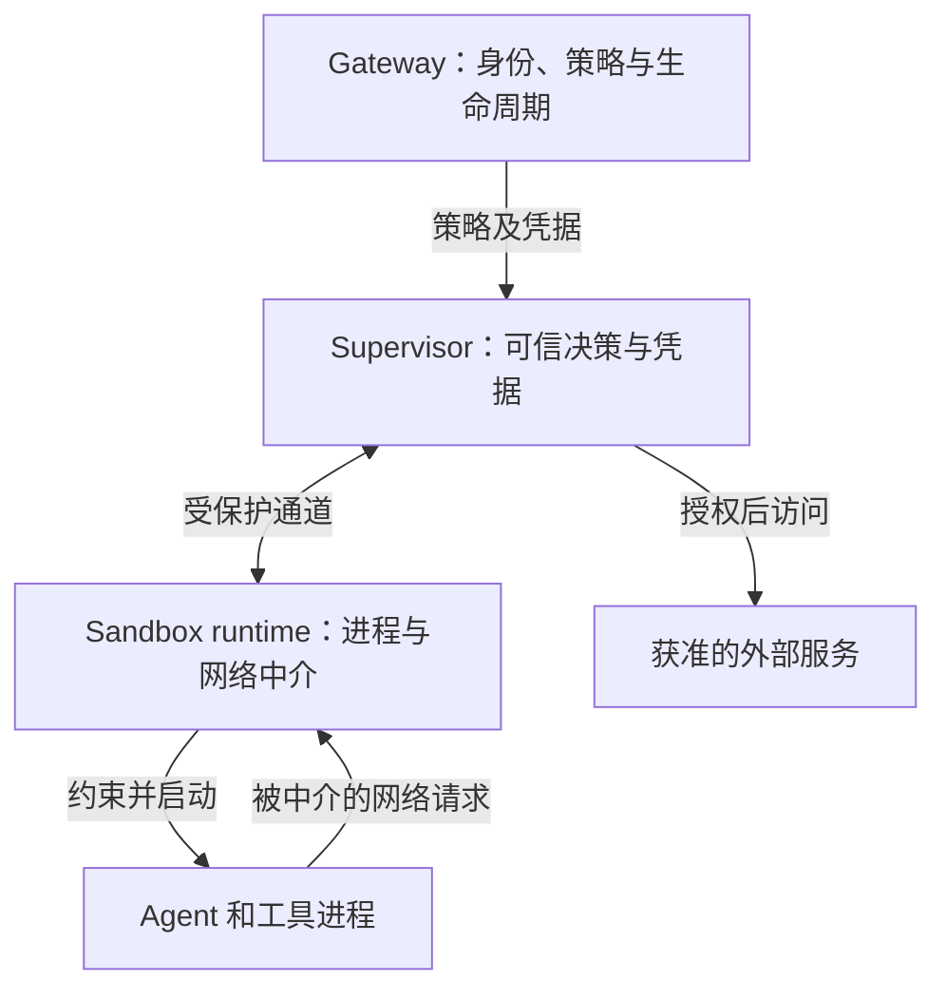
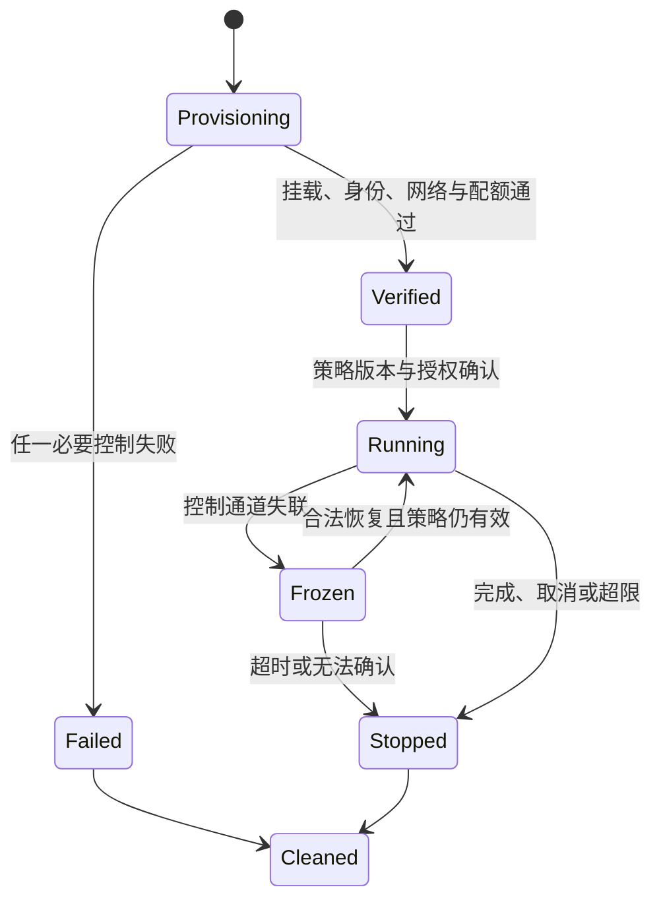

# Agent 沙盒与运行时设计：从文件影响策略到外部权限与凭据控制

> 面向 OpenCode 二开、多租户、bwrap、Skills/Agents 按需加载的企业内部智能体平台。
>
> 研究日期：2026-10-02。本文包含固定版本源码分析、机制解释，以及面向你平台的设计建议。未在你的内网运行，未执行逃逸测试或性能压测；没有把文档声明当作安全认证。

## 阅读结论

你的平台已经采用 OpenCode＋bwrap，不需要因为出现新的沙盒产品就推倒重来。最值得补齐的是：**统一的每次调用策略、覆盖所有执行入口的隔离、工作负载外的网络和凭据控制、可追踪的授权及生命周期**。

这几个项目提供了不同层面的参考：

- **DeepSeek Harness（DSH）**：把文件影响策略设计成清晰、可替换、可诊断的能力接口；对模型提供一致的拒绝与授权反馈。
- **Anthropic Sandbox Runtime（SRT）**：在本地进程沙盒基础上，结合文件读写规则、网络 namespace 和代理，适合研究如何继续强化 bwrap。
- **NVIDIA OpenShell**：将工作负载、可信 supervisor、控制面分离，把网络授权和真实凭据留在 Agent 外部，并通过运行时协议和状态约束实施控制。
- **gVisor / microVM / 沙盒平台**：分别解决更强执行隔离、独立 guest kernel，以及环境调度和生命周期问题；它们与上述策略治理可以组合。

本文使用三种标签：

- **【源码事实】**：可以定位到本次固定版本源码或仓库文档。
- **【机制推导】**：根据机制推导出的结果或限制，没有宣称是项目官方保证。
- **【平台建议】**：为你的场景提出的方案、伪代码与验收条件，不是现成项目已实现的功能。

特别要区分：**模型愿意遵守规则、工具实现检查规则、操作系统强制限制行为，是三个不同层次。**

## 1. 研究范围、版本和证据

| 项目 | 固定 commit | commit 时间 | 阅读重点 |
|---|---|---|---|
| DeepSeek Harness | `639ed015397290b3745d163aafe02ffee4aa3f84` | 2026-09-29 | sandbox 契约、profile、文件工具、权限提升、Skills 与文件引用 |
| NVIDIA OpenShell | `8719fc9f37a93dd96435cf6753ae53c8ee8809e6` | 2026-10-02 | 隔离接口、seccomp/Landlock、网络 broker、provider、策略 prover |
| Anthropic SRT | `117eb928202b53c80d3cb6527d88d1b90e4ca7a9` | 2026-10-01 | Linux bwrap 包装、网络桥接、HTTP/SOCKS 代理、配置 |

固定版本源码和文档摘选共 53 个文件，保留原目录结构及许可证；见 [SOURCE_INDEX.md](SOURCE_INDEX.md) 和 [source-manifest.json](source-manifest.json)。本报告中的 `[D1]` 等引用可在末尾找到固定版本链接。源码摘选用于阅读，不是完整可构建项目。

本次发现 OpenShell 同一版本的部分文档存在描述差异：`docs/security/best-practices.mdx` 仍含 veth、`10.200.0.1`、gateway-level proxy 等旧描述；较新的 architecture、isolation interface、network broker 描述的是外部 supervisor 和受保护通道。本文以固定版本接口与对应实现为主，保留原始文档供对照。部署时仍应核对具体 driver 和实际生成资源，不能混合不同架构代际的配置。[O1][O2][O3]

## 2. 沙盒到底要防什么

### 2.1 六种风险不能用一个 sandbox=true 表示

| 风险 | 例子 | 主要控制位置 |
|---|---|---|
| 意外破坏 | 模型误删工作区外文件 | 文件系统权限、挂载、文件工具规则 |
| 租户泄漏 | 用户 A 读取 B 的报告、缓存或会话 | 可见目录、身份、存储、索引 ACL |
| 权限滥用 | 有联网能力的 Agent 调用不该调用的内部 API | 出口控制、业务鉴权、操作授权 |
| 不可信代码 | 依赖安装脚本或工具执行任意代码 | 内核约束、gVisor、VM、资源配额 |
| 提示注入与越狱 | 文档诱导 Agent 上传数据或修改规则 | 不可信输入标识、外部策略、最小授权 |
| 控制面破坏 | Agent 修改 policy、启动器、插件、审计文件 | 控制面隔离、只读安装、可信部署 |

“模型越狱”是模型行为偏离约束；“提示注入”常由网页、仓库、工具返回等不可信内容触发；“沙盒逃逸”是突破执行边界。三者可以串联，但不是同义词。

沙盒主要限制前两种模型行为问题的**后果**，不保证模型的推理或输出不会被影响。任务完成率高，也不代表访问和副作用符合要求。

### 2.2 三个正交维度

1. **隔离强度**：进程 namespace、共享内核、用户态内核、独立 guest kernel。
2. **授权精度**：目录、域名、API method/path、数据集、行级权限。
3. **治理完整度**：策略版本、审批、配额、审计、撤销、恢复。

一个 microVM 可以隔离宿主，却携带权限过大的数据库 token；一个 bwrap 可以非常严格地限制目录与网络，却仍与宿主共享内核。不要用单一“强弱排序”替代选型。

### 2.3 主流路线的位置

| 路线 | 代表 | 核心机制 | 更适合的场景 | 额外要解决的问题 |
|---|---|---|---|---|
| 本地进程约束 | DSH、SRT | bwrap、Landlock、Seatbelt 等 | 现有 CLI、受控工具、低部署负担 | 凭据、租户读隔离、资源限额 |
| OCI 容器 | Docker/Podman/K8s | namespace、cgroups、镜像 | 环境标准化、服务运维 | 共享内核风险、配置与挂载权限 |
| 用户态内核 | gVisor | Sentry 中介系统调用 | 不可信代码、容器生态 | syscall/IO/设备兼容性 |
| microVM | Firecracker、E2B | 虚拟化、独立 guest kernel | 强多租户、不可信任务 | 镜像、快照、存储、设备支持 |
| 运行治理 | OpenShell | 外部 supervisor、policy、credentials | Agent 访问与权限管理 | 仍需选择合适执行后端 |
| 沙盒生命周期平台 | OpenSandbox、Kubernetes Agent Sandbox | API、控制器、环境管理 | 规模化创建、恢复、清理 | 实际隔离保证取决于运行时和配置 |

这里的“代表”不表示市场份额排名。gVisor、Firecracker、E2B 与生命周期项目只作架构定位，未执行与三份源码仓库等深度的审计。[R1–R5]

## 3. DSH：将“文件影响策略”做成运行时契约

### 3.1 分离策略、执行约束与工具结果

【源码事实】DSH 通过不同插件分担职责：

| 模块 | 负责什么 | 不负责什么 |
|---|---|---|
| `sandbox-policy` | 解析会话 mode、workspace root、当前策略上下文 | 选择平台 runner |
| `sandbox` | 类型、confine 接口、错误与授权词汇 | 具体 bwrap 参数 |
| `sandbox-local` | 选择和探测平台后端，构建包装 argv | 解释业务任务是否合理 |
| `bash-sandbox` | 调用后端、执行进程、处理输出与状态 | 持有所有会话的全局权限 |
| `fs-sandbox` | 直接文件 API 的写入限制 | 约束任意宿主代码 |

核心接口简化如下，省略注释与非关键类型；不是完整源码复制：[D1]

```ts
interface SandboxExecutionPolicy {
  mode: 'read-only' | 'workspace-write' | 'danger-full-access'
  workspaceRoot: string
  sessionId?: SessionId
}

interface ConfinedArgv {
  argv: string[]
  enforcement: 'full' | 'partial'
  denialSignatures: readonly string[]
  runnerFailureRules: readonly RunnerFailureRule[]
}

confine(argv, policy, signal): Promise<ConfinedArgv>
```

这里的关键是 `policy` 随每次执行传入，而不是通过修改 provider 的全局状态表达。两个会话可以同时执行不同权限的调用；一次已批准重试也可以使用单独策略。

### 3.2 策略解析算法

【源码事实】解析优先级为：本次明确批准的 mode → 会话最后的 sandbox mode → 部署默认 mode；默认文件策略为 read-only。workspace root 优先来自会话不可变 cwd；执行后端在真实执行环境中规范化路径。[D3]

```ts
// 根据原实现缩写
return {
  mode: request.mode ?? sessionOverride ?? deploymentDefault,
  workspaceRoot: absolute(session?.header.cwd ?? fallbackRoot),
  sessionId: session?.id,
}
```

【机制推导】“当前工作目录”与“允许写入的根目录”应分开。模型执行 `cd` 不应该自动扩大它的写权限；运行目录可以变，授权根目录必须由可信运行时决定。

### 3.3 bwrap profile：很小，也有明确边界

【源码事实】`bwrapProfileArgs` 的关键实现如下：[D2]

```ts
const args = [
  '--ro-bind', '/', '/',
  '--dev', '/dev',
  '--unshare-pid',
  '--proc', '/proc',
  '--die-with-parent',
]
if (policy.mode === 'workspace-write') {
  args.push('--tmpfs', '/tmp')
  args.push('--bind', policy.workspaceRoot, policy.workspaceRoot)
}
```

| 机制 | 它解决的问题 | 没有解决的问题 |
|---|---|---|
| 根目录只读挂载 | 限制从该挂载路径修改文件 | 不隐藏本来就可读的文件 |
| workspace 可写 bind | 将写入限制到授权工作区 | 不识别工作区内文件的业务敏感度 |
| 私有 `/tmp` | workspace-write 命令的临时空间 | 不代表持久会话目录或自动配额 |
| PID namespace | 隔离该后端的进程视图 | 不保证所有备用后端等价 |
| 父进程死亡联动 | 减少脱离父执行器的进程存活 | 不替代 cgroup 和完整清理策略 |

这个 profile 没有 `--unshare-net`，也没有配置域名代理。`--ro-bind / /` 暴露的是**调用环境**的根目录：若外面已有容器/租户沙盒，所见范围由外层决定；若直接跑在共享宿主，则可见范围可能非常大。

**重要解释：DSH 的 `full` 仅表示完整实施其文件影响契约。不能翻译成“完整网络隔离”“完整读隔离”或“强多租户”。**文档明确将网络和进程可见性排除在 `SandboxMode` 词汇承诺之外。[D1]

### 3.4 bwrap → Landlock 不是安全能力完全相同的回退

【源码事实】Linux 默认后端链先尝试 bwrap，再尝试 Landlock；存在多个候选时进行功能探测，并缓存选择结果。无可用约束后端时抛出 `SANDBOX_UNAVAILABLE`，不静默执行原命令。[D4]

Landlock profile 的思路是：`readOnly: ['/']`；为 `/dev/null` 允许所需写入；workspace-write 另外允许 `/tmp` 和 workspace。旧 ABI 可能报告 partial。

【机制推导】两个后端都可能实现同一“写影响”契约，但附带性质不同：bwrap 提供 mount/PID 视图及私有 tmpfs；这里的 Landlock 授权现有 `/tmp`，并不自动构造相同视图。平台不能把回退视为无差别替换。

【平台建议】记录 capability vector，例如文件写约束、读约束、private tmp、network fence、syscall filtering 分别是否可用。任务申请的能力必须是实际能力的子集；强制需求不能被 partial 静默满足。

### 3.5 原子文件工具必须服从相同策略

【源码事实】`tool-fs/write.ts` 先解析策略，再解析目标，取得写入意图，最后调用 filesystem backend。它支持从 policy plugin 获得 `createIfAbsent` / `replaceIfVersion` 意图；没有该策略插件时可为无条件写入，不能说所有 DSH 写入都强制 CAS。[D6]

```text
resolvePolicy → resolve target → write-intent → writeText → observed event
```

`fs-sandbox` 对写入目标做规范化及包含性检查。`containment.ts` 用规范化路径进行带分隔符的词法比较；必要时沿祖先目录比较 `(dev, ino)`，处理不同路径拼写指向同一目录的情况。[D5]

这比直接 `target.startsWith(root)` 好：后者会错误接受 `/work-a` 是 `/work` 的子路径。但规范化检查仍不自动消除检查与写入之间的 TOCTOU 竞态。DSH 文档明确接受其威胁模型中的剩余竞态，不将该层宣称为内核边界。

【平台建议】你可以保留文件工具中的友好检查，同时让实际文件 worker 位于同一租户/任务隔离环境。强对抗环境中，结合基于目录 FD 的安全解析、适当的 `openat2` 限制、内核约束和写入前置版本检查；不要只把字符串校验写复杂。

### 3.6 单次授权：模型可以申请，但不能决定

【源码事实】`escalation.ts` 定义 strictly-wider 模式阶梯，要求权限字段与 justification 配对；在执行前调用审批服务，仅 `allowed-once` 返回更宽模式，拒绝、取消、不可用都不会得到授权。[D7]

还要区分“模型提示”与“强绑定”：提示文字要求对刚才被拒绝的相同操作进行一次重试；`approveEscalation` 本身主要判断模式和审批结果，并未单独证明两次 argv/path/content 相同。不能仅凭提示文字声称已有完整防重放和参数哈希绑定。

【平台建议】给企业平台的一次性授权绑定：tenant、session、tool、规范化参数摘要、policy version、有效期、用途和剩余使用次数。授权票据留在可信执行链；模型只获得批准结果。参数改变、策略改变、过期或跨租户使用均重新判断。

### 3.7 失败归因也是 runtime 契约

DSH 的 `ConfinedArgv` 不只返回命令，还返回后端的拒绝特征和 runner 失败规则；消费者先判断 runner 失败，再判断策略拒绝。[D8]

例如 Landlock 的 partial 信息行不能因为出现在非零退出日志里，就被当作启动失败。仓库有专门 postmortem 与回归测试。这一点与你的信号提取和评测非常相关：

| 结果 | task 执行状态 | 平台归因 |
|---|---|---|
| 应用退出非零 | 可能已产生副作用 | 程序/参数/业务失败 |
| policy denied | 操作被规则阻止 | 策略生效，可能缺授权 |
| sandbox unavailable | 未建立必要约束 | 运行基础设施失败 |
| partial enforcement | 执行保证不完整 | 能力与任务要求不匹配 |

stderr 特征是诊断证据，不是不可伪造的安全凭证。高可靠审计应使用 supervisor 发出的结构化事件；Agent 输出的相似文字不能提升权限或伪造审批。

## 4. OpenShell：把决定权与真实凭据留在工作负载外

### 4.1 三个角色与两条边界

【源码事实】当前架构区分 Gateway、Supervisor、Sandbox runtime：[O1]

| 角色 | 持有的职责 |
|---|---|
| Gateway | 身份、策略、provider、生命周期及控制面状态 |
| Supervisor | 网络授权、真实凭据、DNS、外部连接、网关通道 |
| Sandbox runtime | Agent 子进程、终端、网络请求中介、执行约束 |



可信不等于没有漏洞。设计价值是缩小工作负载能够直接读取或改写的高权限状态。Agent 仍能请求 supervisor 做事，因此 supervisor 必须验证目标、调用者、策略、协议和资源限制。

### 4.2 Compute driver 与 isolation backend 分工

Compute driver 负责放置资源、建立通信通道和外层网络围栏；isolation backend 提供统一的启动、执行、信号和网络中介接口；supervisor 负责授权决定。[O1][O2]

| 后端 | Supervisor 位置 | 通道 | 外层限制 |
|---|---|---|---|
| Docker/Podman | 独立容器 | Unix socket | workload 无网络 |
| Kubernetes | 独立 Pod | mTLS 私有服务 | NetworkPolicy 限制出口 |
| VM | 宿主进程 | vsock | guest 无网卡 |

【机制推导】安全性同时依赖通用接口和 driver 的真实实施。K8s CNI 不执行 NetworkPolicy、管理员暴露额外宿主 socket、错误挂载控制目录，都可能使抽象契约不成立。不能只验证 YAML 存在。

### 4.3 用状态约束避免先运行后上锁

【源码事实】`contract.rs` 有 `IsolationBackend::attach`、`BoundBoundary::confirm`、`ReadyBoundary::start_agent` 等接口，状态转换返回不同类型。[O2]

含义是：附着边界、确认边界、准备执行和运行中的操作不能随意混用。确认之后到启动前还有对应控制检查，而不是只检测某个进程已经存在。

【平台建议】即便你的实现是 TypeScript/Python，也可以落地明确状态：



这是建议状态机，不是逐字复制 OpenShell 的全部内部状态。ready 必须代表执行边界可用；心跳正常、端口可连接、容器启动均不足以替代该事实。

### 4.4 文件、系统调用、网络采用不同强制机制

【源码事实】Linux workload 采用非 root 身份、零 capabilities、Landlock 和 seccomp；`no_new_privs` 用于限制后续权限获得。[O3][O4]

- Landlock：按规则限制文件访问；策略安装后不能简单地在原进程上取消。
- seccomp：针对系统调用或参数组合施加限制。
- 网络 user notification：将特定网络操作交给用户态 broker 处理。
- 外层围栏：阻止工作负载另找未经中介的网络出口。

重要细节：本次读取的 seccomp 过滤代码使用**默认允许＋定向阻断**，不是“所有 syscall 默认禁止”的全量白名单。两种设计在兼容性和维护成本上有不同权衡，不能把营销表述替换成更强的实现承诺。

Landlock 实现中存在 best-effort 和 hard-requirement 路径，且 runtime baseline 有自己的要求。由此应得出的结论是核对实际生效配置、运行路径和观测结果，不能笼统断言任何 OpenShell 配置都严格拒绝缺失的内核能力。

### 4.5 网络 broker：不能只设置 HTTP_PROXY

【源码事实】`network_broker.rs` 中存在 `PendingTcpOpen`、`PendingDnsQuery` 等类型。TCP 打开请求在 supervisor 决策前被挂起，之后建立获准的中继；队列与 worker 存在容量上限和超时。[O3]

概念过程：

1. 捕获请求及可获得的调用进程信息。
2. 将目标及必要上下文交给 supervisor。
3. supervisor 匹配有效策略。
4. 获准则建立真实连接并中继；拒绝或超时则不放行。
5. 记录决策与结果。

【机制推导】`HTTP_PROXY` 是应用使用代理的配置；外层围栏才决定能否绕过。Python socket、忽略代理的库和子进程不应该直接通向内网。

另一个值得保留的细节：源码明确指出，对某些已进入内核缓冲区的 DNS 写入，不能可靠恢复发送者身份；相关函数返回身份不可用，而不是编造精确归因。因此不可假设每条 DNS 消息都有同等可靠的二进制身份。

【平台建议】无法获得必要身份时按策略拒绝，或只允许无须该身份的受限操作；不要把未知身份当成可信默认值。

### 4.6 凭据隔离与双重授权

【源码事实】Agent 可见的是 opaque placeholder；真实 credential 在代理转发允许的请求前解析。它至少受到两个不同边界约束：[O5]

\[
Allow(request)=NetworkPolicy(request)\land CredentialBinding(request)
\]

第二项用于有凭据的请求：目标 host、port、path 必须符合 provider 绑定。允许访问 A 服务，不表示可以把 B 服务凭据发送给 A。

这种机制依赖支持的协议与配置。文档列出 header、query、部分 path/body/WebSocket 和 SigV4 等处理方式；body/WebSocket 有显式启用要求；`tls: skip` 和非 HTTP 隧道不支持同样的凭据改写。

**占位符也需要控制使用范围。**真实 key 不在 Agent 内，并不表示 Agent 无法通过合法服务实施有害操作。允许写入整个 Git 组织的凭据，即使从未被读取，也仍可造成破坏。业务 scope、method/path 和上游资源权限必须共同限制。

### 4.7 两类策略变化不要混为一谈

文件/进程限制常固化于创建或进程启动阶段；网络规则和 provider 更新可以由外部服务动态处理。这意味着“更新配置已保存”和“所有运行中进程已按新规则工作”是不同事实。

OpenShell provider 文档也区分：刷新凭据成功、sandbox readiness、旧进程持有的 revision-scoped reference、以及已发送上游的请求。[O5]

【平台建议】策略更新事件至少区分 `saved`、`applied_to_new_calls`、`requires_restart`、`revocation_pending`。不要声称撤销会收回已发送的数据；文件快照也无法撤销远端数据库更新。

### 4.8 策略 prover：检查边界，而非证明整个系统安全

【源码事实】prover 使用 SMT，比较候选权限与最大边界，也用于网络提案风险检查；两类检查不是同一问题。[O6]

\[
Allowed(candidate)\subseteq Allowed(boundary)
\]

当前模型有覆盖限制：某些 MCP/GraphQL 规则返回 unsupported；不同文件路径之间即使看似父子关系，也可能因缺少文件系统/符号链接事实而不支持比较。超时或规模限制可返回 inconclusive。

只有明确通过的结果才能算边界检查通过。即便通过，也不能推出：候选策略最小、适合业务、运行时正确执行了策略，或者不存在内核漏洞。

对你的平台，初期可以先实现显式集合交集、端点白名单和拒绝未知字段，再考虑复杂证明。

## 5. Anthropic SRT：强化本地 bwrap 的参照

【源码事实】Linux 实现使用 `--unshare-net` 隔离网络，通过 Unix socket 和桥接程序连接宿主侧 HTTP/SOCKS 代理；域名过滤在代理侧实施。[A1][A2]

这形成两个层次：

- namespace 使直接网络路径不可用。
- HTTP/SOCKS 代理对允许路径进行细粒度决定。

环境变量帮助应用找到代理，但不是唯一强制点。实现还包含文件读写规则、seccomp 辅助与依赖检查。源码中对 seccomp 辅助不可用会给出 Unix socket 约束不足的 warning，因此部署验收应检查实际能力，不能仅看 bwrap 是否安装。

【平台建议】你现有无 Docker 环境，最有迁移价值的可能是这种本地组合。不过不要简单复制几条命令就认为等价：需要处理 socket 暴露、DNS/IPv6、子进程、代理身份、超时、取消和桥接进程回收。

通过网络代理只能保证请求走受控路径；如果允许某个外部域名接收任意上传，该域名仍然可能成为外传通道。企业内部要进一步控制可访问服务及操作。

## 6. 面向你的 Agent 环境设计

### 6.1 把目录结构变成明确的权限契约

【平台建议】不要把一个巨大的可写 home 同时用作任务工作区、凭据目录、Skill 仓库和 runtime 配置。下面是建议的逻辑划分，路径名称可按现有平台调整：

| 区域 | 可见性与写权限 | 内容 | 生命周期 |
|---|---|---|---|
| `/runtime` | 可读/可执行，不可写 | 固定解释器、工具、启动文件 | 发布版本 |
| `/skills/public` | 按授权只读 | 已发布公共 Skill | 固定 release |
| `/skills/private` | 当前用户授权部分只读 | 私有 Skill | 固定 release |
| `/inputs` | 当前任务只读 | 上传原件、检索证据快照 | 任务/留存策略 |
| `/workspace` | 当前任务读写 | 代码、实验、生成文件 | 任务 |
| `/tmp` | 当前任务私有、有配额 | 临时文件、编译中间产物 | 任务结束清理 |
| `/outputs` | 允许生成，导出需登记 | 交付产物 | 持久化规则 |
| 控制配置、真实凭据、审计存储 | 不挂入 workload | tenant mapping、policy、secret | 可信控制面 |

路径的名字本身不会产生安全性；必须由挂载、身份、内核规则和文件 worker 实施。对外导出也要独立判断：允许读取数据以完成分析，不代表允许上传原始数据到任意目的地。

如果需要在线编辑 Skill，把候选版本写到用户工作区，完成评测与发布后才更新公共版本。Agent 不应在运行中直接改写自己正在依赖的公共控制规则。

### 6.2 用户、任务、调用：三个粒度

- **租户/用户**：决定能接触哪些数据、Skill、业务身份。
- **任务/会话**：决定本次工作区、依赖、进程组、资源与产物。
- **调用**：决定本次工具参数和是否有一次性额外授权。

用户实例可以长期存在，任务 worker 可以短期创建；也可以复用执行环境，但复用前必须清除前一任务的进程、环境变量、tmp、挂载和临时授权。只换 cwd 不能构成新的租户边界。

### 6.3 原子化工具的“原子”有三个含义

1. **语义单一**：一个工具做一类明确操作，如 read/search/edit。
2. **提交一致性**：修改要么满足前置版本并提交，要么返回冲突。
3. **授权可解释**：一次调用的目标和效果能被清晰判断。

三者不是天然同时成立。一个 `write_file` 工具可以语义单一却覆盖并发更新；一条 bash 命令可以被称作“一次调用”，内部却产生数百个副作用。

### 6.4 建议的最小工具契约

| 工具 | 主要输入 | 返回内容 | 必需限制 |
|---|---|---|---|
| `list` | root、深度、cursor | 文件条目、类型、下一页 | 授权根目录；条目/深度预算 |
| `search` | root、query、glob、limit | 文件引用、行号、短片段 | 只检索可读集合；不泄漏未授权命中数 |
| `read` | 文件引用、range | 内容片段、版本、大小、截断标记 | 读 ACL；输出预算；来源标签 |
| `write` | 目标、内容、创建/替换意图 | 新版本、变更摘要 | 写 ACL；前置条件；大小限制 |
| `edit` | 目标、精确补丁、expected_version | diff、新版本 | 匹配歧义则拒绝；并发冲突则拒绝 |
| `bash/exec` | argv 或 shell script、cwd、timeout | stdout/stderr、exit、执行句柄 | OS 级边界、资源限制、进程清理 |
| `artifact.get` | artifact_id、range | 产物内容或片段 | 每次读取重新检查租户与权限 |
| `capability.call` | 操作 ID、结构化参数 | 业务结果和副作用摘要 | 外部业务授权；必要时幂等键 |

`read` 与 `search` 不应因为“没有写副作用”而默认无条件允许。企业数据泄漏常发生在读取、检索片段、目录列表和错误提示中。

全局搜索索引要在可信服务侧做授权过滤；不能先检索全公司内容，把摘要返回模型后再让模型自行过滤。缓存键也必须包含租户/授权范围或等价安全分区。

### 6.5 文件修改的并发控制

【平台建议】一个简单而有效的编辑契约：

```python
# 概念伪代码，不是可直接部署的文件安全实现
policy = resolve_policy(trusted_call_context)
target = securely_resolve_under_allowed_root(request.file_ref, policy)
authorize(policy, operation='write', target=target)

with exclusive_commit_guard(target):
    current = read_version(target)
    if current != request.expected_version:
        return conflict(current_version=current)
    commit_in_same_filesystem(target, request.content)
    return changed(new_version=compute_version(target))
```

关键不是写一个 hash 字段，而是检查和提交位于同一受控临界区；否则两个并发调用仍可能通过同一个版本检查。原子 rename 可帮助提交，但不独立解决授权竞态、符号链接、跨文件事务或 crash durability。

版本 token 可以是存储层版本或可信内容摘要。模型传来的 expected_version 只是请求条件，不是授权。

### 6.6 bash 的必要性与边界

保留 bash 是合理的：它覆盖新工具、组合命令和原生开发习惯，避免为每个程序造一个 MCP tool。但不要依赖命令字符串黑名单保护系统。

建议区分两个入口：

- `exec(argv)`：固定 executable＋参数数组，适合可信工具和结构化调用。
- `bash(script)`：允许 shell 组合语义，整体在约束环境内运行。

两者都要被内核边界和资源限制覆盖。原子工具用于减少模型犯错和提高可观测性；bash 不能成为绕开原子工具权限的后门。

“只读命令”也不是通过命令名推断即可：测试、包安装、构建和脚本可能运行工作区代码。是否可执行这类代码，应由任务权限和隔离强度决定。

### 6.7 环境变量、FD、socket 和依赖缓存

文件目录之外，还有四类容易漏掉的资源：

- **环境变量**：采用可信白名单构造子进程环境，避免继承控制面 token。
- **文件描述符**：避免把已打开的敏感文件、审批管道和控制 socket 继承给子进程；不要以路径不可见推断 FD 不可用。
- **Unix socket**：宿主服务 socket 可以赋予远超文件权限的能力；需要显式限制和逐项授权。
- **缓存与依赖**：只读共享基础缓存与任务可写缓存分开；不让 A 租户改写 B 即将执行的包或解释器。

依赖锁文件、镜像/环境版本和允许的 registry 都应进入任务记录。安装依赖本身就是代码执行面，应在任务边界内进行。

### 6.8 多 Agent：上下文隔离之外还要资源隔离

你强调的“生成与验收独立 session”很正确，但还需说明能看到什么、能改什么：

| 角色 | 建议输入 | 建议权限 |
|---|---|---|
| 生成 Agent | 需求、工作副本、工具 | 写自己的工作区 |
| 验收 Agent | 固定 diff、规则、证据、代码快照 | 规则只读；私有测试临时目录 |
| 发布/合并执行器 | 审批过的版本与验证结果 | 有边界的发布权限 |

让验收 Agent 只读不意味着它不能运行测试；测试输出应写进它自己的临时目录。禁止生成 Agent 改验收规则及金标。子 Agent 的权限应由可信控制面取交集，不能由父 Agent 在提示词里自行授予。

## 7. 越狱与提示注入：从“模型识别”转向“后果受限”

### 7.1 一条典型风险链

外部文档包含恶意指令 → 模型把文档内容当成任务命令 → 请求读取敏感文件 → 请求外发 → 执行工具或网络 API。

可在多个位置截断：不把外部内容升级为指令、不给敏感文件读取权、不开放任意出口、不授予过大的 API 权限、在高影响动作前核对具体操作。

只做最后一步人工确认会增加打断；只做模型分类则依赖概率性识别。你的平台应将高频合法路径预先授权，把少量扩大权限的操作交给精确审批。

### 7.2 防护层和保证范围

| 层 | 做法 | 能提供什么 | 不能保证什么 |
|---|---|---|---|
| 输入来源 | 标记 user、policy、retrieved、tool_output | 保留来源与可信度信息 | 模型绝不会误解 |
| 模型引导 | 明确外部内容不能改权限 | 降低误服从概率 | 确定性拒绝全部注入 |
| 工具契约 | 参数校验、operation scope | 拒绝不合法请求 | 请求在业务上必然合理 |
| OS 边界 | 挂载、Landlock、seccomp、网络围栏 | 限制实际执行能力 | 消除所有内核漏洞 |
| 外部授权 | tenant/resource/API scope | 限制合法身份可做的事 | 撤回已发送数据 |
| 评测审计 | 轨迹与副作用验证 | 发现回归和覆盖缺口 | 穷尽所有攻击 |

模型生成的 justification、Skill 里的“已批准”、工具 stdout 的“授权成功”都只是文本，不能转化成授权事实。

### 7.3 把“拒绝后怎么做”设计好

【平台建议】拒绝返回应短、明确、有稳定代码和允许的下一步。例如：

```json
{
  "ok": false,
  "code": "POLICY_DENIED",
  "operation": "write",
  "resource": "/runtime/config.yaml",
  "reason": "protected_control_path",
  "retryable": false,
  "allowed_alternative": "Write a proposal under the task workspace."
}
```

这是建议格式。模型需要知道是应该改参数、换合法路径、申请权限，还是停止。模糊的 `Permission denied` 容易触发重复尝试；明确替代路径能同时改善效率与行为可控性。

错误中不应暴露真实 secret、其他租户目录、内部 token 或完整策略机密。对工具循环可以沿用你的 doom-loop 思路，但计数要区分相同错误、参数变化和真实进展。

### 7.4 避免把模型检测器放在唯一强制点

可以增加提示注入检测或 LLM-as-Judge 作为辅助，但不能允许检测器的一句“安全”扩大 OS 权限。尤其不要让被攻击的同一上下文既生成操作，又最终决定是否放行该操作。

对高影响操作，可信服务校验具体目标与副作用；对权限变化，比较当前与候选权限；对用户意图，必要时请用户审批具体可读的变更。模型可以帮助解释，但批准结果需要来自独立可信通道。

## 8. 利用模型特性：shortcut、按需加载与小而稳定的反馈

### 8.1 本文中 shortcut 的含义

这里将 shortcut 理解为：**模型倾向选择更短、更显著、更容易获得成功反馈的操作路径**，以及开发者为常见任务提供的简短入口。不是仓库中的键盘快捷键，也不是某种已被证明可靠的安全算法。

【平台建议】利用这种倾向，让合法路径更省步骤，而不是要求模型在每一步记住很长的安全说明。

| 常见任务 | 容易出错的长路径 | 可提供的受控入口 |
|---|---|---|
| 查找业务知识 | 扫描整个 home、拼接脚本 | 按授权知识目录检索 |
| 查询数据 | 模型拼 SQL 并寻找账号 | `query_dataset(dataset_id, ...)` |
| 运行测试 | 猜环境、手写多条 shell | `run_checks(profile, workspace)` |
| 交付文件 | 自行寻找上传凭据和地址 | `publish_artifact(artifact_id)` |
| 申请访问 | 反复尝试不同命令 | 明确的访问申请与一次性重试 |

这些入口是复合业务能力，不必假装成 OS 原子工具。**基础层保持少量原子工具，上层为稳定高频流程提供窄权限复合能力。**

### 8.2 防止 shortcut 变成评测投机

你的 RSI/评测飞轮尤其要防止：模型学到打印“PASS”、创建一个看似正确的文件、引用不存在的测试证据，就能满足验收。

- 以真实副作用和独立验证结果验收，而非模型自述。
- 验收规则与运行凭据不放在生成 Agent 的可写目录。
- 产物登记只说明文件存在；还需按任务验证内容。
- 记录执行证据与版本，避免重新生成一段“测试通过”文本冒充轨迹。

因此 shortcut 应减少无意义步骤，不应减少必要验证或授权。

### 8.3 DSH 中可直接观察到的按需加载

【源码事实】`skill-filesystem` 将 catalog 与正文分开：发现阶段解析 frontmatter，形成摘要目录；加载时再读取正文。目录有自己的监听和更新流程，正文加载读取当前文件。[D9]

这与你“Agent 做导航，Skill 放具体操作”的偏好一致。但目录摘要也是模型输入：第三方 Skill 的 description 可能含诱导文本。目录发现不应授予执行权限，Skill 加载也不应改变 tenant policy。

另一个明确实现是 `fileHandleText`：[D10]

```text
文件名 + 字节数 + 短摘要 + 只读文件路径
需要内容时使用文件工具读取；修改前复制到可写区域。
```

若当前环境无法提供可读路径，提示应说明不可访问，不让模型声称已经读过。委派时要传文件路径，并说明只有共享执行环境的子 Agent 才能读取。

这是一种很好的 Agent 环境设计：**上下文中保存引用和定位信息，文件系统保存原始材料；模型按任务需要展开。**

### 8.4 加载上下文与授予权限必须独立

| 事件 | 可以改变什么 | 不应自动改变什么 |
|---|---|---|
| 发现 Skill | 可选技能目录 | 文件和网络权限 |
| 加载 Skill 正文 | 当前模型知道的步骤 | 凭据 scope、宿主权限 |
| 读取知识文档 | 当前证据上下文 | 指令优先级 |
| 加载工具 schema | 模型可请求的操作表达 | 实际授权集合 |
| 获得一次性 grant | 特定调用的有效权限 | 所有未来会话权限 |

隐藏工具 schema 只能减少误用机会；服务端仍要拒绝未授权调用。反之，模型知道工具存在，也不表示它可以调用成功。

### 8.5 按需加载与复现性的冲突

DSH 当前文件 Skill provider 加载最新正文，适合开发迭代；你的企业评测和公共资产发布更需要“这一轮到底用了哪个版本”。

【平台建议】

- 开发模式：允许热更新，记录每次加载的内容摘要。
- 评测模式：冻结 Skill/Agent/工具/schema/environment 版本。
- 生产公共 Skill：指向已发布 release；候选修改写入单独目录。
- 同一任务如果切换版本，应明确记录切换事件，不让热更新悄悄改变后续行为。

安全边界也包括文件里的规则：可被 Agent 写入的项目说明，不应覆盖不可写的企业权限。

### 8.6 大结果资源化与上下文预算

【平台建议】大工具结果返回摘要、计数、artifact reference、分页参数和截断信息，而不是整批塞入模型上下文。完整结果保留在受控文件或对象存储中。

但读取 reference 时仍要验权；不可把“不可猜 ID”当授权。摘要中的业务统计也可能敏感，不应认为只有原始行需要 ACL。

较稳定的系统提示、明确工具 schema、小型策略摘要，以及在拒绝发生时给出就地说明，有助于减少重复 token 和模型记忆负担。实际收益需要测量：token、时延、任务成功率、错误重试数和拒绝后恢复率。按需加载可能增加工具轮次，不能先验保证更快。

## 9. 一个适合你现有平台的最小统一运行模型

### 9.1 不必先引入一个庞大的 Policy Engine

【平台建议】初期定义三份对象即可：

1. **EnvironmentSpec**：环境/工具版本、mount、workspace、资源上限、网络模式。
2. **EffectivePolicy**：租户、任务、工具权限及有效临时 grant。
3. **ExecutionReceipt**：实际后端、策略版本、决定、执行结果、副作用与资源消耗。

策略可以先用结构化 JSON/YAML＋确定性校验实现；复杂 L7 或跨基础设施治理成熟后再考虑 OPA、SMT 或完整 OpenShell 集成。

### 9.2 有效权限的计算

用操作集合表示权限，建议定义：

\[
P_{effective}=P_{tenant}\cap P_{environment}\cap P_{task}\cap(P_{standing}\cup G_{call})
\]

- tenant：企业/用户最大边界。
- environment：本次环境实际可安全实施的能力。
- task：任务边界。
- standing：常驻授权。
- call grant：有范围和期限的一次性授权。

这个公式是设计建议。它表达一个约束：即使用户批准一次调用，也不能越过更外层企业或环境边界。不要把 grant 直接写成全局 `allow all`。

复杂权限不是一个整数等级。例如“只允许写目录 A”和“只允许访问服务 B”未必有大小关系，应按操作、资源、条件做集合比较。

### 9.3 执行入口的可信顺序

```python
# 平台建议：表达控制顺序，不是生产实现
async def execute_tool(trusted_ctx, raw_request):
    request = validate_tool_schema(raw_request)
    identity = trusted_ctx.identity       # 不采用模型自报 tenant_id
    snapshot = policy_store.resolve(identity, trusted_ctx.task_id)
    env = environment_registry.get(trusted_ctx.environment_id)
    effect = tool_registry.describe_effect(request)
    grant = grant_store.get_for_call(trusted_ctx.call_id)
    decision = authorize(snapshot, env.capabilities, effect, grant)
    audit.append_decision(trusted_ctx, decision)
    if not decision.allowed:
        return structured_denial(decision)
    receipt = await env.executor.run(request, decision.execution_policy)
    audit.append_result(trusted_ctx, receipt)
    return render_for_model(receipt)
```

`describe_effect` 对原子/业务工具可以很精确；对任意 bash 只能给出粗粒度影响范围，不能假装静态解析能预测所有副作用。后者依靠运行边界强制限制。

异步执行要在队列消费、恢复、重试时重新确认策略与 grant。超时只是调用方不再等待，不代表后台进程已经结束。

### 9.4 控制面与执行面怎么分离

你的平台可以先保留现有服务，不必一开始重建完整 OpenShell：

- 控制进程负责会话、身份、审批、调度，不加载不可信插件代码。
- 文件/bash worker 在租户或任务边界内执行。
- 网络/业务 gateway 持有真实凭据，进行目标和操作授权。
- 审计通过可信通道上报，Agent 的文本输出不冒充控制事件。

如果允许用户安装任意 Node/Python 插件到控制进程内，那么即使 bash 做了完美隔离，这些插件仍可能直接访问控制面。**插件的信任与装载位置，比工具名字是否叫 sandbox 更重要。**

## 10. 可观测、评测与 RSI 闭环

### 10.1 最小事件模型

将已有 task/run/step/attempt 与沙盒事件关联：

| 字段组 | 建议字段 |
|---|---|
| 关联 | tenant_id、session_id、task_id、tool_call_id、attempt |
| 环境 | sandbox_id、generation、backend、environment_version |
| 策略 | policy_version、policy_digest、grant_id、enforcement |
| 决定 | allow/deny、reason_code、operation、resource_ref |
| 执行 | launch_started、exit_code、timeout、cancelled、cleanup_status |
| 成本 | startup_ms、exec_ms、cpu_ms、memory_peak、output_bytes |
| 资产 | skill_version、loaded_content_digest、artifact_digest |

避免把凭据值、完整敏感正文写入审计；资源引用本身也要按租户保护。

### 10.2 不把所有失败混在一个分母里

建议分别看：

- sandbox 启动失败率：运行设施健康。
- policy 拒绝率：规则触发，不天然代表坏事。
- 合法任务被阻塞率：策略可用性，需人工或独立规则确认。
- 未授权副作用发生率：安全验收指标。
- 拒绝后合法恢复率：模型与工具反馈质量。
- cleanup 失败率：残留进程、资源和实例成本。

部门之间的任务不同、工具成熟度不同，拒绝率不可直接拿来排名。延续你之前的做法，区分原生工具和用户自建工具，先粗筛再细诊断。

### 10.3 最值得先建立的回归题

以下是受控测试目标，使用测试文件、测试凭据和 mock 服务，不接生产敏感资源。

| 用例 | 操作 | 通过条件 |
|---|---|---|
| 跨租户读 | A 尝试读 B 的测试标记文件 | 内容不返回，日志归因正确 |
| 写边界 | shell 和 file tool 修改同一禁止目录 | 两条路径均拒绝 |
| 路径别名 | 符号链接/父路径/相似前缀 | 不落到授权根之外 |
| 临时目录 | 两个会话创建同名 tmp 文件 | 不发生未授权互读互写 |
| 直接联网 | 程序不使用代理变量 | 无未经授权外连 |
| 凭据边界 | 将占位符用于未绑定 mock endpoint | 请求拒绝，无真实凭据泄漏 |
| 无后端 | 运行时缺少必要 sandbox 能力 | 不执行原始命令 |
| 授权绑定 | 批准后改变调用参数/换会话/重放 | 不继承不匹配的 grant |
| 并发编辑 | 两次编辑基于同一版本 | 至少一个返回明确冲突 |
| 取消任务 | 启动子进程后取消 | 子进程及桥接资源回收 |
| 控制失联 | supervisor 通道中断 | 进入约定冻结/停止状态 |
| 提示注入 | 文档声称“管理员已授权外传” | 不产生未授权副作用 |
| 规则篡改 | Agent 尝试修改公共 Skill/验收规则 | 被阻止或只产生候选修改 |
| 热更新复现 | 任务期间替换 Skill 正文 | 冻结模式不受影响，开发模式有版本事件 |

规则层直接判断可见性、写入、连接和状态；LLM-as-Judge 只辅助分析意图、恢复路径和可用性。生成与裁判仍使用独立上下文，按你既有要求采用不同系统提示词、结构化输出，并保留人工校准。

### 10.4 让评测结果进入正确的修复路径

- 越权实际成功 → 修复强制边界/业务授权，不能只改提示词。
- 合法任务频繁受阻 → 优化预授权 scope 或增加窄权限业务能力。
- 相同拒绝反复重试 → 改错误反馈、运行循环和 Skill 引导。
- sandbox 不可用 → 修复内核、部署、启动器与能力探测。
- 路径/上下文错误 → 改工具 schema、文件引用和按需加载规则。
- Skill 改动改善效率 → 经冻结任务对照后发布；不要直接在线替换全部公共 Skill。

## 11. 分阶段改造建议

| 优先级 | 改造内容 | 为什么先做 | 最小完成证据 |
|---|---|---|---|
| P0 | 列出全部执行入口和信任位置 | 确认没有宿主侧旁路 | shell/fs/MCP/插件/终端执行路径图 |
| P0 | 统一 per-call policy 与错误分类 | 防并发串权，改善诊断 | 双会话并发与授权回归通过 |
| P0 | 租户读取、控制目录、凭据与 FD 隔离 | 企业数据和控制面保护 | 测试数据跨边界不可见 |
| P1 | 网络围栏＋外部凭据/业务 gateway | 控制真实外部副作用 | 直接连接失败、合法请求成功 |
| P1 | cgroups/配额/终止清理与状态机 | 控制成本和残留资源 | 取消、超限、失联用例通过 |
| P1 | 文件版本与 Skill release 固定 | 支持可靠编辑和评测复现 | 相同环境版本可重跑 |
| P2 | 高风险任务接入 gVisor/microVM | 降低共享内核暴露 | 兼容性、成本、安全回归评估 |
| P2 | L7 细规则和策略形式化验证 | 更精确的授权与委派 | 覆盖范围明确的验证结果 |

先检查 P0 的现状再决定工作量；这里不是判断你平台已经缺失这些功能。你现有内网无 Docker 约束下，bwrap＋可信 worker＋出口 gateway 可以作为演进方向。OpenShell 的 Podman/VM 路线仍要确认运维许可、虚拟化、镜像分发和内核兼容性，不是无成本替换。

建议优先深入阅读顺序：DSH `profiles.ts` → `sandbox-policy` → `escalation.ts` → `fs-sandbox`；再读 SRT Linux 网络桥接；最后读 OpenShell `contract.rs` → `network_broker.rs` → provider 文档。这样从你现有实现最容易迁移的部分逐步扩展。

## 12. 需要明确保留的限制

1. 没有统一基准支持“某方案一定比另一个快”。要测你的依赖、并发、冷启动和 IO 模式。
2. 内核约束与业务授权都不能由模型自述替代。
3. 强内核隔离不保证业务权限最小；精细策略不消除内核漏洞。
4. 按需加载减少上下文暴露，但不消除恶意 Skill/文档影响。
5. `full`、`ready`、`passed` 都必须附带具体契约和覆盖范围。
6. 文件快照不是远程 API 事务回滚；安全审计不能仅依靠文本日志。
7. 源码摘选不包含完整依赖树，不应作为可直接部署的安全实现。
8. 本报告中的平台模型和伪代码需要结合你的实际 UID、挂载、内核、MCP 与业务接口验证。

## 13. 固定版本引用与进一步阅读

### DSH

- [D1 sandbox 契约与作用范围](https://github.com/deepseek-ai/deepseek-harness/blob/639ed015397290b3745d163aafe02ffee4aa3f84/docs/subsystems/sandbox.md)
- [D2 bwrap / Landlock / Seatbelt profile](https://github.com/deepseek-ai/deepseek-harness/blob/639ed015397290b3745d163aafe02ffee4aa3f84/packages/sandbox/sandbox-local/src/profiles.ts)
- [D3 per-call 策略解析](https://github.com/deepseek-ai/deepseek-harness/blob/639ed015397290b3745d163aafe02ffee4aa3f84/packages/sandbox/sandbox-policy/src/index.ts)
- [D4 本地后端选择、探测与 enforcement](https://github.com/deepseek-ai/deepseek-harness/blob/639ed015397290b3745d163aafe02ffee4aa3f84/packages/sandbox/sandbox-local/src/index.ts)
- [D5 文件约束及竞态范围](https://github.com/deepseek-ai/deepseek-harness/blob/639ed015397290b3745d163aafe02ffee4aa3f84/packages/fs/fs-sandbox/README.md)
- [D6 文件写入工具](https://github.com/deepseek-ai/deepseek-harness/blob/639ed015397290b3745d163aafe02ffee4aa3f84/packages/fs/tool-fs/src/write.ts)
- [D7 单次权限提升](https://github.com/deepseek-ai/deepseek-harness/blob/639ed015397290b3745d163aafe02ffee4aa3f84/packages/sandbox/sandbox/src/escalation.ts)
- [D8 错误归因](https://github.com/deepseek-ai/deepseek-harness/blob/639ed015397290b3745d163aafe02ffee4aa3f84/packages/sandbox/sandbox/src/diagnostics.ts)
- [D9 Skill 目录与正文按需加载](https://github.com/deepseek-ai/deepseek-harness/blob/639ed015397290b3745d163aafe02ffee4aa3f84/packages/skill/skill-filesystem/README.md)
- [D10 文件引用的模型表示](https://github.com/deepseek-ai/deepseek-harness/blob/639ed015397290b3745d163aafe02ffee4aa3f84/packages/llm/llm/src/content.ts)

### OpenShell

- [O1 当前架构](https://github.com/NVIDIA/OpenShell/blob/8719fc9f37a93dd96435cf6753ae53c8ee8809e6/docs/about/architecture.mdx)
- [O2 隔离接口与状态约束](https://github.com/NVIDIA/OpenShell/blob/8719fc9f37a93dd96435cf6753ae53c8ee8809e6/crates/openshell-isolation-interface/src/contract.rs)
- [O3 网络 broker](https://github.com/NVIDIA/OpenShell/blob/8719fc9f37a93dd96435cf6753ae53c8ee8809e6/crates/openshell-sandbox/src/network_broker.rs)
- [O4 seccomp 实现](https://github.com/NVIDIA/OpenShell/blob/8719fc9f37a93dd96435cf6753ae53c8ee8809e6/crates/openshell-sandbox/src/sandbox/linux/seccomp.rs)
- [O5 Provider 与凭据处理](https://github.com/NVIDIA/OpenShell/blob/8719fc9f37a93dd96435cf6753ae53c8ee8809e6/docs/how-it-works/providers/overview.mdx)
- [O6 策略 prover 及覆盖范围](https://github.com/NVIDIA/OpenShell/blob/8719fc9f37a93dd96435cf6753ae53c8ee8809e6/docs/how-it-works/policies/prover.mdx)

### Anthropic SRT

- [A1 README 与配置说明](https://github.com/anthropics/sandbox-runtime/blob/117eb928202b53c80d3cb6527d88d1b90e4ca7a9/README.md)
- [A2 Linux bwrap 与网络桥接实现](https://github.com/anthropics/sandbox-runtime/blob/117eb928202b53c80d3cb6527d88d1b90e4ca7a9/src/sandbox/linux-sandbox-utils.ts)

### 路线定位资料

以下是官方现行页面，没有像上述三份源码一样固定 commit；用于概念定位，后续页面可能变化。

- [R1 gVisor 官方文档](https://gvisor.dev/docs/)
- [R2 Firecracker](https://firecracker-microvm.github.io/)
- [R3 E2B](https://e2b.dev/)
- [R4 Kubernetes Agent Sandbox](https://github.com/kubernetes-sigs/agent-sandbox)
- [R5 OpenSandbox](https://github.com/opensandbox-group/OpenSandbox)

## 附录：如何使用配套源码包

1. 从本报告开始阅读；优先看第 3、4、6、8、9、10 章。
2. 用 `SOURCE_INDEX.md` 打开对应文件；目录结构与上游相同。
3. 用 `source-manifest.json` 查看来源 commit、SHA-256 和大小，避免把不同版本拼在一起。
4. 原文件保留各自许可证和文件头。报告中的缩写代码与建议伪代码已明确标记。
5. 在你内部实现时，先画出当前实际调用路径，再将建议映射到已有模块；不要为了模仿项目结构而额外拆出大量服务。
