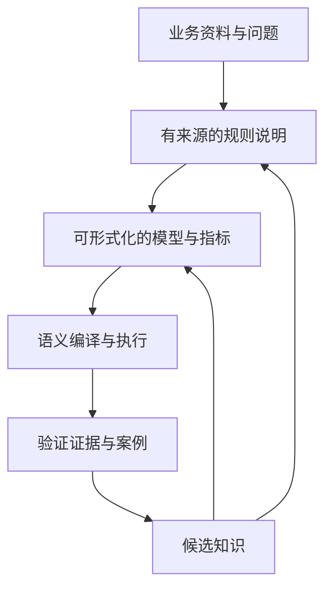
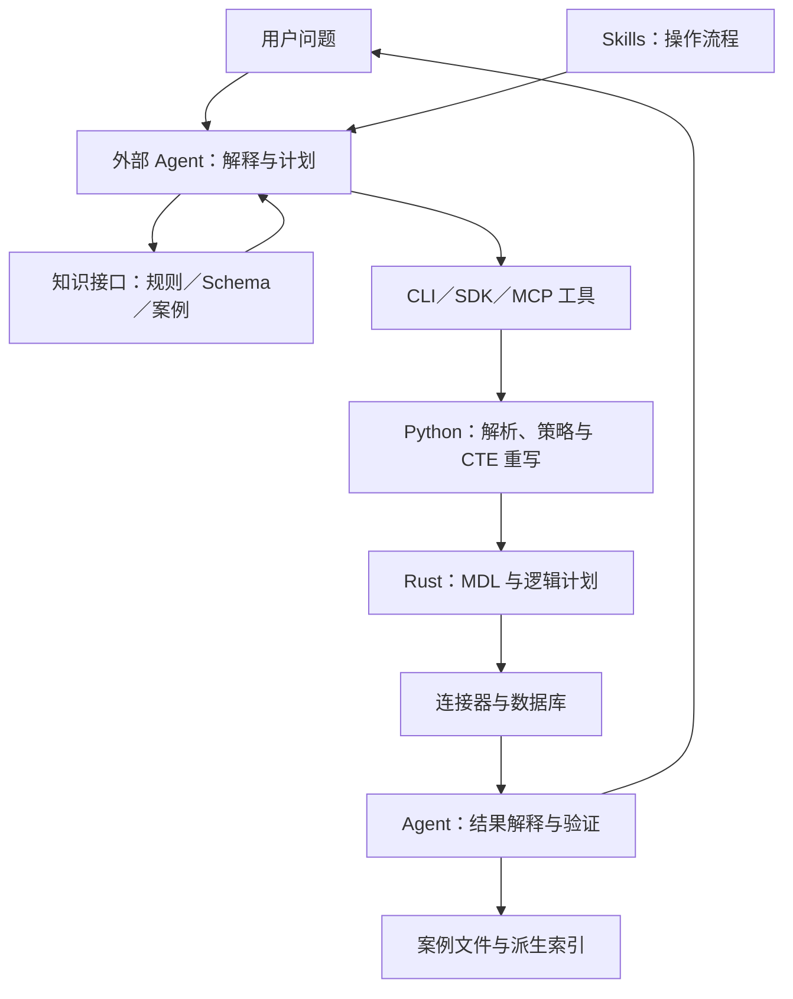
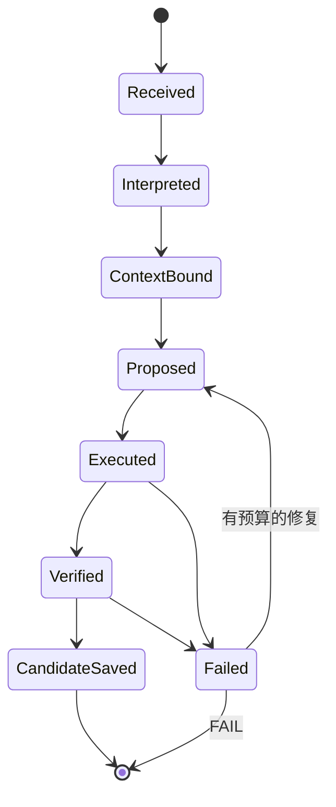
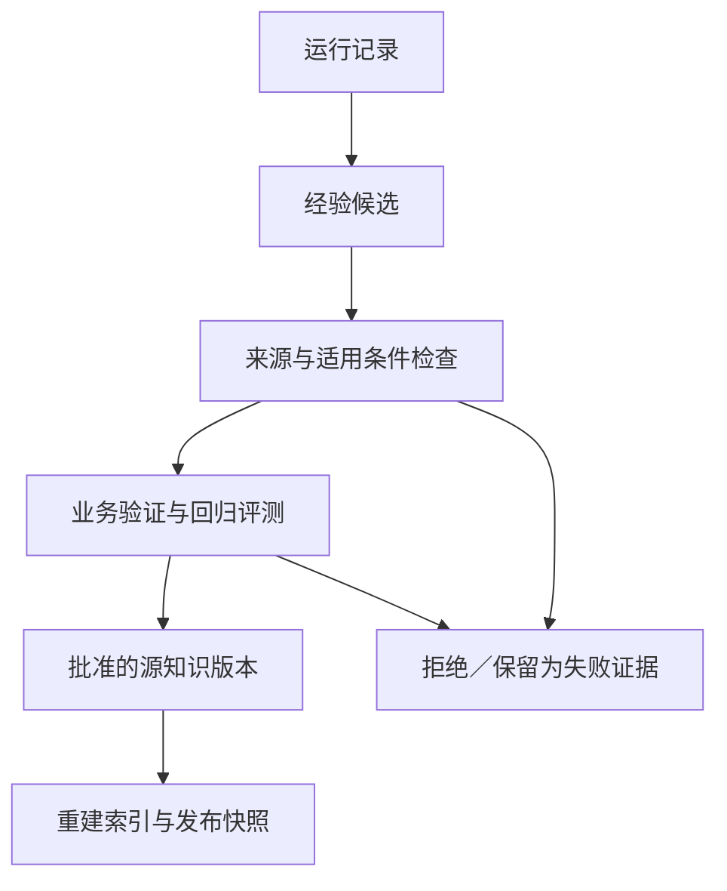

# WrenAI：从领域知识到可执行语义的设计、算法与 Agent Runtime 分析

> 分析日期：2026-10-02。代码基线：官方仓库 `Canner/WrenAI` 的 `main`，提交 `2cc843fd87d6cfe9831554721559018dda2938a0`，提交时间为 2026-10-02 02:17:30 UTC。本文区分 **仓库已实现**、**实现边界** 和 **对你平台的建议**。代码示例若标为“简化流程”或“建议契约”，用于解释设计，不代表可直接替换原实现。
>
> 阅读背景：[原始讨论：OKF 与 Wren AI 比较](https://chatgpt.com/share/6abf5a08-7bfc-83e9-9eb9-9d623dc11bc9)。本文重新核查了 WrenAI 当前代码；没有重新逐项核查 OKF 当前仓库，因此涉及 OKF 的比较限于原讨论中的设计问题，不构成两个项目的最新功能对照。

## 1. 先给结论：WrenAI 值得借鉴的是知识如何约束执行

WrenAI 的核心思路，是把“理解业务”拆成两个互补的问题：**让 Agent 找到足够的业务上下文，以及让确定性的语义引擎把模型上的查询编译成数据库能执行的 SQL。** 前者依赖 Agent、Skills、说明性知识和检索；后者依赖 MDL、解析器、逻辑计划、策略检查与数据库连接器。

这与“往提示词里多放一些领域资料”有明显区别。描述“净收入排除退款”是一种知识；把净收入定义为有明确过滤条件、聚合表达式和关系依赖的可执行模型，是另一种知识。WrenAI 尝试把后者变成可复用、可版本化、可编译的资产。

对你的内部 Agent 平台，最有价值的迁移不是照搬一套 SQL 产品，而是采用下面的责任划分：

1. **Agent 负责理解目标、选取知识、制定计划和提出候选。**
2. **Skills 负责具体操作流程、知识获取顺序和失败处理约定。**
3. **Runtime 负责权限、版本绑定、工具调用、资源限制与任务状态。**
4. **领域执行器负责可机器检查的业务约束与确定性转换。**
5. **知识系统负责证据、适用条件、版本、验证状态和后续检索。**

WrenAI 对第 4 项提供了很具体的实现，对第 1、2、5 项提供了有价值的接口和工作流；它并没有完整实现你需要的多租户 Agent Runtime、多 Agent 任务编排和知识晋升治理。

### 1.1 对齐你的关注点

| 你的关注点 | WrenAI 当前可借鉴的机制 | 仍需由你的平台补足 |
|---|---|---|
| Agent 领域知识不足 | MDL、规则说明、Schema 检索、历史 NL→SQL 案例 | 面向非 SQL 任务的知识类型、适用条件与证据模型 |
| 按需消费上下文和 Skill | 小 Schema 全量、大 Schema 检索；Skill 发现入口与完整操作指南分离 | 统一路由、上下文预算、召回后的资格过滤 |
| “解释、检索、执行”衔接 | 外部 Agent + CLI/SDK/MCP + 语义编译器 | 显式任务状态、重试预算、检查点、取消与恢复 |
| 多 Agent 消息和串联 | 工具与资源接口可被不同 Agent 共享 | A2A 任务协议、消息去重、依赖关系、隔离的验证会话 |
| 持久化沉淀 | Git 友好的源文件、SQL 案例 Markdown、可重建索引 | 候选/验证/批准状态、失效机制、责任人、发布门槛 |
| 允许验证失败 | dry-plan、dry-run、执行错误可作为反馈 | 独立业务验证、明确 FAIL、失败知识与成功资产分离 |
| 内网、不能使用 Docker | 当前 Python CLI/SDK、进程内 MCP、可选 ONNX | 离线依赖和模型分发、bwrap 隔离、服务身份与网络策略 |

## 2. 当前 WrenAI 已经不是早期的多服务聊天应用

阅读当前仓库时，需要先排除一个版本混淆：2026 年 5 月之后，活跃主线把重心转向 **Rust 语义内核、Python SDK/CLI、Skills、Agent 工具接口与 GenBI**。早期 `wren-ui`、`wren-ai-service`、`wren-launcher` 和 Docker 部署体系留在 `legacy/v1`／`v1-final`。

因此，不能沿用旧架构，把当前 WrenAI 描述成“自带完整 LLM 问答编排的 Docker 应用”。当前设计更接近：现有 Agent 调用 Wren 提供的语义能力，再生成 SQL、分析结果或可部署的分析界面。

官方产品叙述中的 Generate／Deploy／Know 可以理解为：生成分析应用、交付应用、持续改善上下文。对本文主题，最重要的是 **Know 如何进入 Generate 的上下文，以及语义执行如何约束生成结果**。WASM 与浏览器侧分析属于交付路径的一部分，不等于 Agent Runtime。

许可证也要按模块看：当前核心、SDK、Skills 主要采用 Apache-2.0，文档采用 CC-BY-4.0；仓库中的 AGPL 文件不意味着整个当前代码库统一采用 AGPL。实际复用时仍应检查目标目录的许可证声明。

来源：[官方仓库](https://github.com/Canner/WrenAI/tree/2cc843fd87d6cfe9831554721559018dda2938a0)、[架构说明][architecture]、[Python 包定义][pyproject]。

## 3. 设计理念：把业务语义分成“说明”和“可执行契约”

### 3.1 三种知识承担不同责任

| 知识形态 | 典型内容 | 消费方式 | 可以期待的保证 |
|---|---|---|---|
| 说明性知识 | 术语、口径解释、例外、业务规则、注意事项 | Agent 读取 Markdown／instructions | 提高理解质量；是否遵守仍取决于工作流和模型 |
| 结构性语义 | 模型、列、关系、计算列、视图、Cube | 编译成 MDL，交给语义引擎 | 把被支持的语义表达转换成确定性的计划 |
| 经验性案例 | 自然语言问题、对应 SQL、来源和备注 | 关键词／向量召回后供 Agent 参考 | 提供范例；不自动证明对新问题有效 |

这一划分对你的平台也适用。比如半导体场景中的“良率”至少包含三层：

- **术语层**：良率指晶圆良率、测试良率还是最终出货良率？
- **计算层**：分子、分母、重测规则、批次粒度、时间归属具体是什么？
- **使用层**：某个已验证分析案例适用于哪条产线、哪个测试程序版本、哪个时间范围？

只持久化一段“良率很重要”的说明，无法约束执行。只持久化一个计算公式，也无法解决口径歧义。只持久化过去成功的 SQL，则可能在新的批次、程序版本或粒度下重复旧错误。

### 3.2 从知识到契约存在一个逐步形式化的过程



这里的最后两条反馈边，是你应当建设的知识晋升过程。WrenAI 提供了 enrichment 与案例存储的基础流程，但没有把每一次反馈都实现成严格的“证据 → 审核 → 发布”状态机。

### 3.3 与原讨论中 OKF 关注点的关系

原讨论关心的是：领域知识是否能被持久化，并以 Agent 友好的方式交换、串联和消费。沿这个问题看：

- 知识文件／交换格式解决的是“知识能否携带结构、来源与引用”；
- Wren 的语义模型与编译器解决的是“某些知识能否变成执行约束”；
- Runtime 解决的是“谁在什么身份、版本和预算下消费这些资产”；
- 验证与晋升解决的是“哪些运行经验值得进入后续任务”。

这些层互补，不宜简单替代。尤其不能以文件可交换，推导出业务口径已经正确；也不能以 SQL 可以编译，推导出所有领域知识都已经形式化。

来源：[Context 概念][context-concept]、[MDL 概念][mdl-concept]、[正确性说明][correctness]。

## 4. 端到端架构：解释、检索和执行在哪里发生



**“解释”主要发生在外部 Agent；“检索”由 Agent 选择工具和知识入口；“执行”由 Python／Rust／数据库共同承担。** Skill 是工作流说明，MCP 是工具与资源协议，它们都不自动构成一个持久化 Agent 编排系统。

### 4.1 运行时责任矩阵

| 环节 | Wren 的实现位置 | 主要责任 | 你的 Runtime 应承担的责任 |
|---|---|---|---|
| 意图理解 | 外部 Agent、usage Skill | 判断问题、澄清歧义、生成 SQL | 会话边界、任务输入、身份、输出契约 |
| 上下文选择 | context、memory、MCP | 返回规则、模型或相似案例 | 权限过滤、预算、版本固定、来源记录 |
| 计划生成 | Agent + MDL 工具 | 提出查询与调用路径 | 调用白名单、重试／修复次数、检查点 |
| 语义转换 | Engine、CTERewriter、Rust core | 展开模型、表达式和关系，生成计划 | 固定引擎版本与模型版本 |
| 执行控制 | policy、connector | SQL 策略检查、查询与错误包装 | 凭据隔离、超时、资源限额、审计 |
| 验证 | 部分工具检查 + 外部 Agent | 语法／计划／数据库反馈 | 独立验证会话、业务标准、FAIL |
| 沉淀 | memory CLI、Markdown、LanceDB | 保存 NL→SQL、建立派生索引 | 候选隔离、批准发布、失效与回滚 |

### 4.2 `wren ask` 不等于内置 LLM Runtime

`wren ask --guided`／`--direct` 的作用是组织并输出交给 Agent 的提示内容；它本身没有完成“调用 LLM → 得到 SQL → 执行”的完整闭环。因此，不能依据命令名称推断 Wren 管理了模型调用、会话状态或多 Agent 协作。

这反而是对你平台有利的分层：Wren 可以成为内部平台的领域工具，而无需接管已有 OpenCode 衍生 Runtime。

来源：[ask.py][ask]、[usage Skill][usage]、[MCP 实现][mcp]。

## 5. “解释”阶段：怎样让 Agent 理解业务问题

### 5.1 理解不只是把自然语言换成 SQL

一个完整问题需要至少确定：目标对象、指标定义、分组粒度、时间归属、过滤条件、数据版本和期望输出。Wren 的 usage Skill 引导 Agent 先获取 Schema、读取业务说明、召回类似案例，再生成 SQL；复杂任务可以拆解，简单任务可以直接执行。

但这仍是操作指引，不是 Runtime 的强制前置条件。如果工具调用者绕过 Skill，直接提交 SQL，说明性规则可能完全没有被读取。

对你的平台，建议把解释结果变成轻量结构，而不是只留在模型思维或对话文本里：

```yaml
# 建议契约；不是 Wren 原生结构
task_interpretation:
  objective: "比较最近四周某产品的最终测试良率"
  metric_ref: "metric.final_test_yield@v3"
  entity_scope: "product_family_A"
  grain: [product, week]
  time_basis: "final_test_completed_at"
  timezone: "Asia/Shanghai"
  exclusions: [engineering_lots]
  unresolved: ["重测后的最终结果是否覆盖首次结果？"]
```

这里的 `unresolved` 应触发澄清、保守分析或阻塞状态；不能默认把 Agent 的猜测升级成业务事实。示例中的业务规则仅为说明，需以你的真实口径为准。

### 5.2 AGENTS.md 与 Skills 的边界

Wren 将发现入口、具体使用指南和引用资料分开，支持获取完整指南及相关资源。你可以沿用这一点：

- `AGENTS.md` 保留任务路由、权限边界、必须引用的资产类型和失败条件；
- Skill 保存具体步骤、工具用法、例子和诊断方法；
- 大量术语、数据字典、案例由检索获取；
- 真正不可绕过的限制交给 Runtime 与执行器。

这样既能减少每轮上下文成本，也避免把“写在 Skill 里的约定”误认为安全控制。

来源：[Skill 发现入口][skill-entry]、[Skill 分发实现][skills-delivery]、[usage Skill][usage]。

## 6. “检索”阶段：三个不同入口，不是一套统一 RAG

### 6.1 规则读取：完整说明进入上下文

当前 `load_rules` 读取 `knowledge/rules/` 下顶层 Markdown 文件，按顺序组合，并兼容已废弃的 `instructions.md`。这不是递归加载知识目录内所有 Markdown。

规则通过 context instructions 或 MCP `get_instructions` 供 Agent 阅读。它们适合承载跨模型业务要求、容易误用的口径、默认处理和例外。读取这些规则，并不意味着引擎会把它们转成 SQL 的过滤条件。

例如“分析必须排除工程批次”：

| 表达位置 | 作用 |
|---|---|
| Markdown 规则 | 告诉 Agent 应排除；模型可能遗漏 |
| 语义视图／计算指标 | 在特定模型路径中编码口径 |
| MDL 行级策略 | 由引擎基于会话属性应用约束 |
| 数据库权限／授权视图 | 在数据库侧构成执行边界 |

业务默认口径和安全访问限制应分别设计，不能把两者混成一段说明。

### 6.2 Schema 检索：小模型全量，大模型向量搜索

`MemoryStore.get_context` 首先生成 Schema 文本描述，按文本长度选择策略。**默认阈值是 30,000 字符，不是 token。** 小于等于阈值返回完整描述；超过阈值时对索引执行向量搜索，默认返回 5 项，并可按模型或条目类型过滤。

```python
# 基于 store.py 的简化流程
description = describe_schema(manifest)
if len(description) <= threshold:
    return full_context(description)

return search_schema(
    question,
    limit=5,
    mdl_hash=manifest_hash(manifest),
    item_type=optional_type,
    model_name=optional_model,
)
```

索引条目包含模型、列、关系、视图、Cube 及其度量／维度／时间维度。条目文本由结构字段和描述合成，并带有模型标识、条目类型和 `mdl_hash`。

`mdl_hash` 过滤有一个重要作用：避免当前模型查询直接召回其他模型版本的 Schema 条目。但它不等于索引自动更新。当前 `get_context` 和 CLI `memory fetch` 路径不会因为索引缺失或版本过期，就隐式完成全部重建；大模型路径可能返回空结果。应在发布流程中显式 build／index，并检查索引与目标模型一致。

### 6.3 历史案例检索：Grep 和 LanceDB

历史 SQL 案例有轻量关键词后端和向量后端。配置 `WREN_MEMORY_BACKEND` 可以选择；自动选择会考虑相关依赖是否可用。

**Grep 后端实际是简单词项匹配，不是 BM25。** 其核心逻辑可以表示为：

\[
S(q,x)=|T(q)\cap(T(x_{nl})\cup T(x_{sql}))|+5\cdot I[q\text{ 是 }x_{nl}\text{ 的子串}]
\]

其中词项由 `[a-z0-9]+` 提取，过滤长度小于 2 的词项；分数大于零才入选，再按分数和自然语言文本排序。历史案例召回默认数量为 3，可按 datasource 过滤。

这对中文有直接影响：ASCII 词项提取无法覆盖中文语义改写；整个问题的子串命中仍可能有效，但不能当作中文语义召回。因此，你的中文领域任务适合优先测试多语言 embedding，同时保留精确编号、术语和错误码的关键词匹配。

**LanceDB 后端**对自然语言问题生成 embedding，保存 SQL 及其他元数据，再对新问题执行近邻检索。存储时的主要 embedding 对象是 NL，不是完整执行结果或完整任务轨迹。当前调用没有显式指定一个统一的业务置信度刻度，返回的距离不能直接当成“案例正确概率”。

### 6.4 业务规则没有全部自动向量化

这是本文最需要纠正的一种常见概括：“Wren 把所有业务知识放进向量库，问题来了统一检索”。当前代码并不是这样。

索引命令可以把规则放到 manifest 的辅助 `_instructions` 字段，但 Schema 条目提取并不消费这个字段；enrich-context 指南也明确把规则读取与 Schema 索引区别开来。因此应分别处理：

| 内容 | 当前主要消费路径 |
|---|---|
| 跨模型业务规则 | context instructions／`get_instructions` |
| 模型与列描述、关系、Cube | Schema 描述或 Schema 向量检索 |
| 历史问题与 SQL | query history／Markdown recall |
| 其他知识文件 | 显式列表、资源读取，不能假定已进入同一个索引 |

对你平台的启发是：先明确每类知识由哪个入口消费，再考虑统一检索界面。统一接口可以有，但内部应保留类型、资格过滤与不同召回策略。

来源：[规则与项目加载][context-code]、[Schema 条目提取][schema-indexer]、[MemoryStore][memory-store]、[检索后端][index-backend]、[Memory CLI][memory-cli]。

## 7. Embedding 算法与部署细节

默认 embedding 模型为 `paraphrase-multilingual-MiniLM-L12-v2`，默认维度为 384，可通过 `WREN_EMBEDDING_MODEL` 配置。实现支持 sentence-transformers 与 ONNX 路径，按批次编码；默认批大小为 32。

ONNX 路径并不是仅仅替换一个模型文件。它需要复现分词、截断、编码器输出、attention mask、mean pooling 和 L2 归一化：

\[
z=\frac{\sum_i m_i h_i}{\max(\sum_i m_i,\epsilon)},\qquad
e=\frac{z}{\max(\|z\|_2,\epsilon)}
\]

这里 `h_i` 是 token 的隐藏向量，`m_i` 为 attention mask。归一化避免不同后端的向量尺度不一致而影响历史索引排序。实现检查 pooling 配置，不支持的模式会报错，不应假定任意模型都能无缝在两个后端间切换。

还有三个工程细节值得你关注：

1. **本地优先不等于严格离线。** 加载先尝试本地缓存，但缓存失败可能回退到在线下载。内网部署应预置模型与依赖，并用网络策略约束出网。
2. **进程内 singleflight 不等于多租户隔离。** 锁用于避免同一进程并发重复加载模型；不解决租户索引、访问控制或集群级并发发布。
3. **改变 embedding 配置应视为索引版本变化。** 即使维度相同，不同权重、分词或 pooling 也可能改变语义空间。建议记录模型指纹，显式重建，而不是只检查向量长度。

ONNX 可减少对 PyTorch 路径的依赖，但不能据此称整个 Wren CLI 为“零依赖”。基础包、数据库连接器和不同 optional extras 仍有各自部署成本。

来源：[embeddings.py][embeddings]、[依赖定义][pyproject]。

## 8. “执行”阶段：从逻辑 SQL 到数据库 SQL

### 8.1 Python Engine 的主链路

核心 `_plan` 流程大致如下，代码依据 `engine.py` 简化：

```python
# 简化流程；省略类型、错误包装和方言细节
ast = parse_sql(input_sql, dialect=data_source_dialect)
validate_sql_policy(ast, modeled_names, config)

tables = collect_referenced_tables(ast)
effective_mdl = extract_required_manifest(full_mdl, tables)
session = get_session_context(
    effective_mdl,
    session_properties=properties,
    data_source=data_source,
)

planned_sql = CTERewriter(session, effective_mdl).rewrite(input_sql)
validate_planned_sql(planned_sql, config)
return planned_sql
```

这一链路有两个重要优化：先按表依赖缩小 manifest，再按模型所需列展开。它们作用于实际编译输入，不只是减少给 LLM 的提示词。

manifest 提取失败时的行为与策略有关：特定 Wren 错误直接抛出；通用提取异常在严格模式或配置禁用函数时不能随意退回，而较宽松配置下可以回退到完整 manifest。这说明“始终只编译精确最小依赖”不是无条件保证。

`query` 会先调用规划路径，再延迟获取连接器执行 SQL，返回 Arrow 数据；超时与其他执行异常分开处理，其他错误按阶段包装，并携带规划后的 SQL 等诊断信息。对 Runtime 来说，这有助于区分：输入政策问题、语义规划问题、数据库语法问题、连接问题和实际执行问题。

### 8.2 CTE 重写为何重要

Agent 通常应对稳定的语义模型名称写 SQL，而不是直接重复底层表、清洗逻辑和连接表达式。`CTERewriter` 把这些模型引用展开成可以执行的 CTE，再嵌入原查询。

它会解析 AST、识别用户自己的 CTE 作用域、收集模型与列引用、分析视图依赖，并调用 Rust 语义转换。它也处理目标数据库的大小写、引用符和别名差异。

```sql
-- 解释性示例：Agent 面向语义模型编写
SELECT product, SUM(good_units) / NULLIF(SUM(tested_units), 0) AS yield_rate
FROM final_test_summary
GROUP BY product;
```

执行前，该模型可能被展开为包含源表、口径过滤、计算列和必要连接的 CTE。上面的 SQL 仅用于说明模型边界，不代表一个已经验证的真实良率口径。

### 8.3 列裁剪有三个不同分支

| 查询情况 | 引擎展开方式 | 原因 |
|---|---|---|
| `SELECT *` | 让 core 按模型可见列展开 | 必须结合列可见性规则 |
| 引用明确列集合 | 仅请求相关列及计算依赖 | 减少不必要计算与连接 |
| 只需要行，例如 `COUNT(*)` | 用 `SELECT 1` 保留行语义 | 需要行数，不需要每个字段 |

展开后重命名内部源别名，是为了避免如 BigQuery 中模型名称与 CTE／别名发生遮蔽；大小写和 quoting 的保留则对 Oracle 等方言重要。这些细节表明语义层并不只是字符串模板。

**边界：**无实体表的标量／表值函数查询存在独立路径，仍受 SQL policy 约束；未知表在特定兼容路径中可能转入旧的整体转换逻辑，而不是保证任意未知表都可执行。

来源：[Engine][engine]、[CTERewriter][cte-rewriter]。

## 9. Rust 语义内核：关系、计算依赖与逻辑计划

Rust core 基于 DataFusion 处理逻辑计划。MDL 不只是提示词 Schema，它包含模型、计算列、关系和访问策略等供计划生成消费的结构。

### 9.1 关系链不是 LLM 临场推测

`relation_chain.rs` 将关系链接到模型计划，维护所需字段和关联条件。当前实现支持沿前一节点继续的链式关系，也兼顾从起点分支的星形关系：优先找 `prev → next`，没有则尝试 `start → next`。

```text
简化流程：
1. 从基础模型建立 source plan。
2. 遍历所需关系节点。
3. 获取关系边、目标模型与该模型所需字段。
4. 构造 PartialModelPlanNode，并追加到 RelationChain。
5. 递归生成子计划，解析连接键，处理别名，合成连接表达式。
```

复合连接键会分解为多个等值对，再重新合成为 AND 条件。例如两个维度同时构成业务关联键时，不能只取第一对。

这里有图结构，但不能因此称整个知识检索系统为“知识图谱 RAG”。关系图用于语义计划与依赖展开，和全域知识的检索、推理、证据融合是不同问题。

### 9.2 关系引用有明确的语法边界

模型内部计算列可以利用关系，例如通过 `customer.first_name` 定义一个命名计算列 `customer_name`，查询时再使用 `orders.customer_name`。

但直接在外部查询中写 `SELECT orders.customer.first_name FROM orders`，不能当作当前已支持的通用关系点号导航。近期文档修正正是为了澄清这个边界。

同样，存在 MDL relationships，不意味着 Agent 手写的所有 JOIN 都经过一个“业务批准关系白名单”核验。计划合法与业务连接正确仍是两回事：1:N 放大、去重策略和统计粒度仍需要验证。

### 9.3 RLAC／CLAC 与说明性规则不同

行级与列级访问控制属于结构化策略，基于 session properties 参与计划。它们与 Markdown 里的业务说明不同，可以进入编译器的执行路径。

你的 Runtime 应从可信身份／授权上下文注入属性，而不是让 Agent 自行声明拥有哪个租户或权限。如果 `tenant_id` 可以由模型任意填入，策略表达式再正确也无法提供可靠身份边界。

来源：[MDL 类型定义][manifest]、[关系链实现][relation-chain]、[访问策略实现][access-control]。

## 10. 正确性与安全：哪些检查可靠，哪些仍需要补齐

### 10.1 SQL 策略不是单纯检查第一个单词

`validate_sql_policy` 在严格模式关闭时也执行只读 AST 检查，并扫描 AST 中可能隐藏的写操作，包括写入型 CTE、`SELECT INTO` 等。严格模式额外限制查询对象为建模对象，限制外部数据读取函数等；配置还可禁用函数。

当前 `WrenConfig.strict_mode` 默认是 `False`；配置文件由 `~/.wren/config.json` 加载。不能因为有 strict mode，就把默认安装描述为严格模式。

允许源函数的配置用于特定可接受的生成器等路径，不应理解成可随意放行文件／外部数据读取函数。

### 10.2 规划后复查仍有边界

引擎会对展开后的 SQL 再检查，从而发现模型内部 SQL 带入的问题。但规划后方言 SQL 若无法被解析，复查有容错放行路径，目的在于避免拒绝合法但解析器未覆盖的数据库输出。

这意味着：该检查是有价值的防线，但不是完整安全证明。生产平台还应使用只读数据库凭据、目标库权限、工具白名单、网络隔离和资源限制。若 Agent 另有直接数据库工具或原始凭据，它可以绕过 Wren 的语义路径。

### 10.3 把正确性分层，避免一个 PASS 掩盖所有问题

| 验证层 | 检查什么 | 可以发现什么 | 不能证明什么 |
|---|---|---|---|
| 结构／构建 | 模型文件、引用与编译产物 | 不合法结构、缺失引用 | 业务口径正确 |
| dry-plan | 解析、策略、语义规划 | 未知字段、计划错误 | 数据库支持全部生成 SQL |
| dry-run | 连接器支持的数据库预检查 | 方言／数据库侧部分问题 | 全部业务结论正确、所有连接器零成本 |
| query | 实际执行 | 运行错误与真实结果 | 粒度、口径、解释正确 |
| 业务验证 | 对照口径、样本、约束 | 放大、遗漏、错误时间归属 | 无限制泛化到未来版本 |

dry-plan 不需要连接数据库；dry-run 的成本与行为取决于具体连接器，不能统一承诺“不会执行任何数据库工作”。`query` 隐式规划，所以显式 dry-plan 的价值还在于提前审查与诊断。

对你最重要的原则是：**生成成功、规划成功、执行成功、业务正确、允许沉淀，必须是不同状态。**

来源：[policy.py][policy]、[config.py][config]、[connector 基础接口][connector-base]、[正确性说明][correctness]。

## 11. 持久化设计：源文件是真相，索引是派生产物

### 11.1 当前项目布局

当前源项目 `schema_version` 为 5；生成的 MDL 使用另一套 layout 版本，不应混用。主要对象如下：

| 路径／对象 | 内容 | 性质 |
|---|---|---|
| `wren_project.yml` | 项目与布局配置 | 源资产 |
| `models/<name>/metadata.yml` | 模型与列定义 | 源资产 |
| 模型的 `ref_sql.sql` | 模型来源 SQL | 源资产 |
| `relationships.yml` | 模型关系 | 源资产 |
| `views/<name>/` | 视图元数据与 SQL | 源资产 |
| `cubes/<name>/metadata.yml` | 度量、维度与分析对象 | 源资产 |
| `knowledge/rules/*.md` | 业务说明 | 源资产 |
| `knowledge/sql/*.md` | NL→SQL 案例 | 源资产 |
| glossary／metrics／caveats 等知识目录 | 分类知识文件 | 源资产，按具体入口消费 |
| `target/mdl.json` | 编译后的 MDL | 派生产物 |
| `.wren/memory/` | 本地检索索引 | 派生产物 |
| `.wren/apps.yml` | 本地应用注册信息 | 运行状态 |
| `~/.wren/profiles.yml` | 环境连接配置 | 环境资产；需按敏感配置管理 |

这个分层对你有直接价值：Git 审查源知识，运行时读取固定发布快照，索引损坏后可以重建。不要让向量库成为唯一知识来源。

### 11.2 NL→SQL 案例的写入流程

CLI `memory store` 先写 `knowledge/sql/<slug>.md`，再尝试写入 LanceDB。如果 embedding 依赖没有安装，Markdown 仍可保存；索引不是写入成功的唯一前提。

案例文件包含自然语言问题、SQL、datasource、tags、source、created_at 等已知字段及正文备注。其优点是可读、可审查、可纳入版本管理。

但写入函数不先执行 SQL，也不校验业务批准状态。它只是存储接口，不是可信知识晋升器。

### 11.3 身份和更新语义存在局限

slug 主要由 ASCII 字符生成，中文问题可能落到 `query`、`query-2` 等名字。同一个完全相同的 NL 可以更新原文件；不同 NL 的同名 slug 则加后缀。

这不是“业务案例身份”的完整建模。两个问题文字完全相同，仍可能分别适用于不同 datasource、时间归属或模型版本。若以 NL 作为更新判定的一部分，不能自动区分所有业务条件。

此外，文件写入器只渲染它认识的 frontmatter 字段。若你自行增加 `approved_by`、`status` 等字段，后续同 NL 更新不保证这些扩展字段保留，更不保证原生 recall 会按它们过滤。

**建议：**用独立的受控案例目录／sidecar 注册表和包装工具维护治理元数据，或者明确扩展原生 writer 与 reader。不要仅在 Markdown 增加字段，就宣称具备审批与资格过滤。

### 11.4 索引同步不是全局原子事务

即刻存储可以向量追加；重建索引负责把 Markdown 源重新同步进去。这不是文件写入与向量表更新的跨介质原子事务。静态代码也不支持把所有调用描述成天然幂等。

近期改动为由 Markdown 同步产生的行加入来源标记，使源文件删除后的重建能够清除相应索引行，同时避免误删其他导入／种子来源。这个细节很适合你借鉴：**删除和失效应依据来源身份，而不是仅依赖向量相似度或文本内容。**

索引还会生成结构性 starter／seed 查询。这些是帮助探索 Schema 的起点，不是经过业务验证的 gold cases；不能把整个 query history 当成可靠成功记忆。

来源：[布局说明][layout]、[案例 Markdown 实现][memory-markdown]、[存储与同步实现][memory-store]、[Memory CLI][memory-cli]。

## 12. 知识 enrichment：发现缺口、提议变更、再构建

enrich-context Skill 把知识补充拆成不同来源和处理路径：结构信息、来自当前材料的可核查原子事实，以及需要推断的内容。它识别多种常见缺口，包括枚举、单位、空值、软删除、魔法值、同义词、时间、外部标识、币种和权威表。

| 缺口类型 | 常见落点 | 例子 |
|---|---|---|
| 字段解释 | 列 description | `[unit]`、`[enum]`、`[time]` |
| 跨模型规则 | `knowledge/rules/` | 默认过滤与业务例外 |
| 指标定义 | Cube／命名聚合 | 明确度量及维度 |
| 可复用查询 | SQL 案例文件 | 问题与对应 SQL |

这些 description 标签主要是上下文标记，不是普遍的强类型验证器。比如 `[unit]` 说明有助于 Agent 避免单位误用，但不能自动保证所有计算都完成单位检查。

Skill 提供逐个缺口 accept／edit／skip 的 grill 流程，也有 auto 流程。auto 可以应用推断并记录说明，冲突、影响较大的指标／视图／关系等再触发人工介入。对结构变更，指南要求验证、失败回滚该部分，然后 build／index。

这给你两个相反但同时重要的启发：

1. 值得借鉴“小步增补、定位缺口、结构验证、局部回滚”，避免每次都重写一整套知识；
2. 不能把该指南等同于代码层强制的审批系统。auto 推断也不等于业务事实已被证明。

特别是“append-only”属于工作流约定，并非所有底层 writer 都保证绝不覆盖。你需要把允许追加、允许修订、必须审核的对象类型明确写成 Runtime／存储规则。

来源：[enrich-context Skill][enrich]、[缺口目录][gaps]、[Agent learning 概念][learning]。

## 13. MCP、SDK 与 Runtime 的真实边界

### 13.1 MCP 暴露了哪些能力

当前 `wren serve mcp` 是进程内实现，支持 stdio 和 Streamable HTTP。HTTP 默认绑定回环地址。常见能力包括：

- Schema／语义：`list_models`、`describe_model`、`get_mdl`、Cube 和函数描述；
- 上下文／知识：`get_instructions`、`get_context`、`describe_schema`、`recall_queries`、知识列表与资源；
- 执行：规划、数据库预检查、查询与 Cube 执行；
- 写入：显式 `--allow-write` 后开放案例存储。

`--no-connect` 禁用需要数据库的查询、dry-run、Cube 等能力，同时允许无连接规划。`--allow-write` 默认关闭是工具可见性／写入权限控制，不等于案例审批。

知识资源包含 `wren://mdl`、`wren://instructions`、`wren://project`、`wren://agents` 以及知识路径。知识文件读取做了路径解析和目录包含检查，以防路径穿越；这不等于租户级访问授权。

### 13.2 当前没有完整的服务身份与多租户体系

当前 MCP HTTP 不自带完整 bearer authentication 体系。stdio 由父进程控制通常更容易结合已有沙箱。对你的平台，优先由 Runtime 启动每租户／项目作用域的进程，注入受限环境与工具权限；若共享 HTTP 服务，则由网关或服务层实现身份认证、授权和租户绑定。

不要把一个共享目录、一个共享索引和用户可改的 datasource 参数，当作多租户隔离。

### 13.3 源模型与执行模型需要发布一致性

MCP 启动时可以使用已编译 MDL 构建 Engine；源模型变更后可能提示产物过期，而不是自动重建所有运行状态。部分元数据接口从当前源构建描述，执行器则仍使用启动时加载的产物。

因此存在需要关注的版本不一致风险：Agent 看到新字段，执行器仍使用旧模型。建议发布时冻结源快照，完成 build／index，绑定三个指纹：源版本、编译产物版本、索引版本，再启动／刷新服务。这里是基于代码生命周期得出的工程建议，不是声称所有调用都会发生不一致。

### 13.4 结果封装与降级行为也属于 Runtime 契约

MCP 查询默认限制 1,000 行，硬上限为 10,000 行；负数限制会被拒绝。实现额外请求一行来判断是否截断，再裁剪结果并返回截断标记。这是一个值得借鉴的小设计：Agent 必须知道看到的是全部数据还是部分数据，不能把截断后的结果误认为完整证据。

但返回行数限制不等于数据库计算成本限制。聚合、排序和 JOIN 在产生少量结果之前，仍可能消耗大量资源；超时和资源配额应单独设计。

`get_context` 遇到可选依赖未安装的 `ImportError`，可以回退为完整 Schema 描述；已安装索引或 embedding 的实际错误则会暴露。这个区分也有价值：缺少可选能力可以明确降级，损坏的已配置能力不能默默假装成功。你的 Runtime 应在日志和结果契约里记录实际使用的检索策略。

### 13.5 文档与代码冲突时以实现为准

部分概念文档仍带有旧产品划分，例如对 OSS MCP 的描述与当前代码／MCP 使用指南不一致。文档适合理解方向；具体能力应由当前命令、代码与版本验证确认。

来源：[MCP 使用指南][mcp-guide]、[MCP 实现][mcp]、[SDK 概览][sdk]。

## 14. 最近更新：发布版本与 main 变化分别看

下面聚焦 2026 年 9 月至 10 月 2 日；更早的只读检查、SDK 会话属性转发等作为相关背景。**不能把 main 上的所有修复都归入已发布的 CLI 0.15.0。**

| 时间／版本 | 更新 | 对你的意义 |
|---|---|---|
| 2026-09-02，CLI 0.13.4 | 只读 SELECT 路径及多项验证／类型／事务可靠性修复 | 执行防线应持续覆盖 SQL 结构，而不是只靠提示词 |
| 2026-09-08，CLI 0.14.0 | ONNX embedding 路径；Git／Cloud 绑定；案例删除后的索引同步修复 | 内网轻量部署、源与派生索引一致性、项目发布 |
| 2026-09-10，Rust core 0.4.0、Python binding 0.8.0 | Cube `orderBy` 支持进入核心／绑定 | 语义对象的表达力需要跨语言逐层落实 |
| CLI 0.15.0：Changelog 2026-09-16，实际发布 2026-09-21 | CLI／MCP Cube 排序；BigQuery ADC；LIMIT 与尾注释、UNION 各分支 `SELECT *` 等兼容性 | 产品能力应追踪实际发布时间和组件版本 |
| 2026-09-24，main | WASM `orderBy` 类型补齐；关系引用文档澄清 | 同一能力的客户端契约与文档需同步 |
| 2026-09-29，main | DataFusion 升级至 55.1；用 AST 去掉限定符，保留字符串字面量 | 避免字符串替换破坏 SQL 语义 |
| 2026-09-30，main | 显式 UTF-8 写入及 SDK 读取相关修复 | 中文／非 ASCII 知识资产需要跨平台一致编码 |
| 2026-10-01，main | Linux aarch64 wheel 相关工作 | 内网硬件架构适配 |
| 2026-10-02，main | 关系使用文档再澄清；v2 Cube 元数据以 UTF-8 读取 | 边界表述与跨平台读写可靠性 |

可追溯变更入口：

- [ONNX embedding #2707](https://github.com/Canner/WrenAI/pull/2707)
- [Markdown 删除后的索引同步 #2703](https://github.com/Canner/WrenAI/pull/2703)
- [Git／Cloud 绑定 #2706](https://github.com/Canner/WrenAI/pull/2706)
- [Cube orderBy 核心 #2677](https://github.com/Canner/WrenAI/pull/2677)、[CLI／MCP #2730](https://github.com/Canner/WrenAI/pull/2730)、[WASM #2753](https://github.com/Canner/WrenAI/pull/2753)
- [BigQuery ADC #2726](https://github.com/Canner/WrenAI/pull/2726)
- [DataFusion 55.1 #2766](https://github.com/Canner/WrenAI/pull/2766)
- [AST 限定符修复 #2762](https://github.com/Canner/WrenAI/pull/2762)
- [UTF-8 写入 #2770](https://github.com/Canner/WrenAI/pull/2770)、[SDK 读取 #2764](https://github.com/Canner/WrenAI/pull/2764)、[Cube 读取 #2769](https://github.com/Canner/WrenAI/pull/2769)
- [Linux aarch64 wheel #2750](https://github.com/Canner/WrenAI/pull/2750)
- [关系语法文档 #2755](https://github.com/Canner/WrenAI/pull/2755)、[进一步澄清 #2760](https://github.com/Canner/WrenAI/pull/2760)
- [官方 Releases](https://github.com/Canner/WrenAI/releases)

我的判断：这一阶段的重点更多是 **语义执行、检索依赖、跨方言和交付可靠性**，并不是引入一个新的通用多 Agent 框架。这个方向值得你借鉴：先让知识到执行的链路稳定，再增加协作复杂度。

## 15. 对你平台的建议：保留通用 Runtime，增加领域适配层

### 15.1 不把所有领域问题都强行变成 MDL

Wren 很适合关系数据、指标、统计分析和 SQL 路径。半导体平台还可能涉及日志解释、测试程序、工艺文档、文件处理和故障定位，这些并不都适合 SQL 语义模型。

建议抽象一层薄的领域适配器：

| 场景 | 说明性资产 | 可执行约束 | 确定性工具 |
|---|---|---|---|
| 良率／测试数据分析 | 口径、重测、样本排除 | 语义模型、指标、粒度规则 | Wren 或专用查询执行器 |
| 日志排障 | 错误码、故障模式、历史案例 | 必需证据、时间窗口、禁止操作 | 日志检索与解析工具 |
| 测试程序诊断 | 程序说明、变更记录 | 程序版本、产品兼容条件 | diff／静态检查／受控试验 |
| 文档与规则检索 | 工艺规范、术语、例外 | 有效期、来源级别、批准状态 | 受权限控制的文件检索 |

可复用的是“解释 → 检索 → 提议 → 受控执行 → 验证 → 候选沉淀”的骨架，各领域执行器不同。

### 15.2 最小 Runtime 闭环



`CandidateSaved` 并不是正式知识发布。发布是独立流程，可以在后续版本审查中完成。这样运行任务不必每次都等待完整知识治理，同时不会让未确认经验自动影响下一轮生产任务。

最初只需要把下面几件事做实：

- task／run ID、明确状态和终止原因；
- 固定模型、Skill、知识、工具版本；
- 工具调用权限、时间与结果大小限制；
- 原始结果引用、解释结果和验证结果；
- 候选资产保存与生产资产发布分离。

先不需要一个复杂的多 Agent 调度平台。单个生成 Agent 加一个独立验证会话，就能验证很多收益。

## 16. 知识资产契约：什么信息值得持久化

### 16.1 按作用保存，不保存一大块无结构“经验”

| 资产类型 | 建议保存字段 | 主要检索／消费方式 |
|---|---|---|
| 术语／事实 | 内容、来源、适用域、有效期、版本 | 按对象与词语检索 |
| 指标／规则 | 口径、粒度、依赖、例外、批准状态 | 任务解释及执行器约束 |
| 操作程序 | 触发条件、步骤、工具、失败条件 | Skill 路由与按需加载 |
| 查询／任务案例 | 输入条件、方案、结果证据、验证结论 | 相似案例参考 |
| 失败案例 | 触发、观测、分类、已证实原因、修复状态 | 诊断和评测，不作为成功模板 |
| 运行产物 | 内容哈希、资源引用、生成版本、保留期 | 后续 Agent 引用／复核 |

值得长期保存的是能够改变未来决策的稳定信息。一次性的中间猜测、冗长对话和大表结果，不宜全部注入长期检索库；它们可以作为可追溯运行记录按保留策略保存。

### 16.2 建议的知识条目元数据

```yaml
# 建议契约；由你的平台实现
id: "rule.final_test_retest_policy"
version: "3"
kind: "business_rule"
status: "candidate"
claim_type: "source_fact"
scope:
  tenant: "tenant_A"
  domain: "final_test"
  product_family: "family_A"
applies_to:
  schema_version: "test_schema@12"
  program_version: "program@7"
  effective_from: "2026-09-01"
source_refs:
  - "artifact://specification/retest-policy@rev3"
evidence_refs:
  - "artifact://run/run_123/verification.json"
owner: "team_or_role_id"
supersedes: "rule.final_test_retest_policy@2"
```

不要让 `confidence: 0.9` 替代上述字段。模型的自报置信度、检索距离和业务验证结论是不同量。

完整条目还应明确正文、校验方式、是否允许发布、批准者与批准时间。敏感身份与目录权限不应仅依赖 Markdown 声明，应由服务端控制。

### 16.3 资格过滤先于相似度排名

建议召回分两步：

1. 先筛选租户、领域、状态、有效期、适用模型／程序版本；
2. 再对合格资产做关键词、向量或结构检索，并按来源级别／适用性排序。

精确编号、批次号、错误码适合精确／关键词匹配；解释性问题适合向量召回；关系依赖应由结构查询补全。只有出现具体漏召回问题后，再加入 reranker 或复杂混合检索。

尤其不能让“向量很相似的旧规则”越过已废止状态和租户边界。

## 17. 多 Agent 通信：传任务与引用，避免传一整段历史

Wren MCP 使多个 Agent 可以调用同一工具，但没有定义多 Agent 任务依赖、消息幂等、责任交接或跨会话验证协议。这些仍属于你的 Runtime。

建议控制消息保持小而明确，大型结果留在产物存储中。一个最小交接可以包含：

```json
{
  "message_id": "msg_001",
  "task_id": "task_001",
  "run_id": "run_001",
  "type": "verification.requested",
  "producer_role": "generator",
  "consumer_role": "verifier",
  "input_refs": ["artifact://run_001/task_contract.json"],
  "artifact_refs": [
    "artifact://run_001/proposed_query.sql",
    "artifact://run_001/result.arrow"
  ],
  "knowledge_snapshot": "knowledge_release_20261002_01",
  "acceptance_criteria_ref": "artifact://run_001/criteria.json"
}
```

这是建议契约，不是 Wren 协议。`artifact://` 是逻辑引用示例；真正读取时由服务端鉴权并解析到内容哈希／对象版本。

### 17.1 独立验证会话的输入

验证 Agent 应拿到原始用户目标、已确认口径、版本快照、候选 SQL／方案、结果和验证标准。它不需要继承生成 Agent 全部对话，更不应把生成 Agent 的自我判断当作事实。

验证结果可以结构化为：

```yaml
# 建议契约
verdict: "FAIL"
checks:
  - id: "grain_alignment"
    status: "FAIL"
    evidence_ref: "artifact://run_001/checks/grain.json"
reason: "连接使同一测试记录重复计入分母"
required_action: "先按确认的记录粒度去重，再重新执行"
promotion_allowed: false
```

允许 FAIL 的关键不是语气，而是让 FAIL 真正阻止候选进入正式知识。验证器还必须允许“证据不足／无法判断”，避免被迫二选一后产生虚假的 PASS。

### 17.2 Runtime 应强制的几个条件

- 消息 ID 去重，不能依赖 Agent 记得某个任务已执行；
- 消费者获得的是固定版本引用，不能读取过程中漂移；
- 上游 PASS、执行成功与知识发布分别记录；
- 重试有预算，失败可以终止，不无限自我修复；
- 产物可访问权限由平台决定，消息字段不能自行授予权限。

## 18. 从运行到长期沉淀：建议的晋升流程



### 18.1 晋升的不是整段对话，而是一个可检查的改动

一个候选应说明：要增加或修订什么、从哪次运行产生、证据是什么、适用于什么条件、有什么反例、会影响哪些任务。

例如一次查询失败，不能直接沉淀成“所有良率查询都要先去重”。更合理的是：“针对某数据源和程序版本，某连接会在指定粒度下重复计数；使用某唯一键预聚合能够通过给定样本验证”。范围更窄，但更可靠。

### 18.2 RSI／持续改进优先落在知识和 Skill 上

对你当前阶段，我建议先让系统自动产出候选和证据，再由受控发布流程更新知识或 Skill。不要一开始就允许 Agent 自动修改 Runtime 权限、工具边界或线上执行策略。

最小迭代单位可以是：

- 补一条有来源的规则；
- 增加一个明确触发条件的 Skill 步骤；
- 修正一个模型字段或指标定义；
- 增加一条不会泄漏答案的回归题；
- 限制一个已证实危险的调用路径。

每次改动要有适用条件与反例，评测通过只说明在该任务集上没有发现阻塞问题，不自动证明全域提升。

## 19. 评测：借鉴 Wren 的 A/B 骨架，补业务验证

仓库中的 `evals/spodbtify_ab` 对同一 Spotify DuckDB 数据集上的 20 个分析问题比较 schema-only 与 dbt-integrated 上下文。它采用 Agent 无关的提示／输出协议、运行包装与评分结构，数据集未直接随仓库提供。

这是一套可借鉴的实验骨架，不是“Wren 已证明提高某个百分比”的证据。评分设计有多个维度及 0／1／2 等级，需要外部评分／复核，不等于完全内置的自主业务裁判。

对你的平台，可用小规模但代表性的固定题集比较：

| 对照 | 目的 |
|---|---|
| 原始 Schema vs Schema + 业务规则 | 看口径上下文是否改善业务正确性 |
| 无案例 vs 合格案例召回 | 看经验是否减少错误，是否造成错误套用 |
| 全量 Skill vs 按需 Skill | 看上下文成本与遵循质量 |
| 单会话自查 vs 独立验证会话 | 看错误检出与误拒率 |
| 旧知识快照 vs 候选新快照 | 看具体改动的改善与退化 |

固定数据、工具、模型与知识快照；各次任务独立会话，避免前一次答案和 memory 写入泄漏到下一次。测试集与可召回案例要有明确隔离规则。

建议至少观察：业务正确率、规则遗漏、粒度／连接错误、无法完成率、验证误报与漏报、上下文用量、耗时、工具次数，以及不合格知识被消费的次数。若模型接口不可固定随机种子，应通过重复运行与记录条件估计波动，而不是声称完全可复现。

来源：[A/B 评测说明][eval-readme]、[评测 runner][eval-runner]。

## 20. 分阶段落地：先把一条链路做成闭环

### 阶段一：固定一个高频分析任务

选一个输入、数据源和业务口径都相对清晰的任务族，例如一种已确认口径的测试良率分析。先建立：业务规则、最小语义模型、受控查询工具、任务解释契约、独立验证输出。

验收应是“同样条件下能够给出有证据的正确结果，或者明确 FAIL”，而不是“总能生成一个结果”。

### 阶段二：把检索和版本绑定做实

采用一个源知识仓库，明确规则、模型、案例和 Skill 的目录与责任人。发布时生成不可变快照与索引指纹。优先解决中文召回、旧规则失效、租户隔离和空召回处理，再考虑复杂 reranking。

### 阶段三：加入候选沉淀和回归

成功任务只产生候选，不立即污染生产 memory。失败任务保留诊断证据，经过筛选再转为回归题或受限诊断知识。每次知识／Skill 改动在固定任务上比较前后。

### 阶段四：确有收益时再增加 Agent 角色

如果大量时间花在独立查证、跨数据源核对或重复的审查，可以增加专门角色；如果单 Agent 加工具已经足够，就不必拆。角色增加必须有清楚的输入输出、权限、验收和失败归属。

你可以先接入 Wren CLI 或 stdio MCP，由现有 Runtime 在 bwrap 沙箱中运行。预置 Python 环境、必要连接器与 embedding 模型；知识快照只读挂载，候选写入单独目录，数据库凭据由平台注入。是否共享 embedding 服务或索引服务，等实际容量、启动时延与并发数据再决定。

## 21. 需要避免的误读

| 常见说法 | 更准确的表述 |
|---|---|
| Wren 是完整的多 Agent Runtime | 它提供语义执行与 Agent 工具／Skill；编排由外部平台承担 |
| 所有业务知识统一进入向量库 | 规则、Schema 和案例有不同消费路径 |
| 存储成功的 SQL 就等于批准知识 | 存储接口不验证业务正确性；部分工作流还有不同存储门槛 |
| 有 relationships 就能任意点号导航 | 关系引用在模型计算等路径中有明确支持边界 |
| strict mode 存在就意味着默认严格 | 默认关闭；需要显式配置与配套凭据控制 |
| dry-run 就是零成本且完整正确性验证 | 连接器行为不同；业务正确性需另外检查 |
| metadata description 就是强制业务约束 | 描述供 Agent 理解；结构化策略才进入对应执行路径 |
| embedding 距离就是可信度 | 它是检索排序信号，不是正确概率 |
| 保存 Markdown 就有知识治理 | 还需资格过滤、版本、责任人、晋升与失效流程 |
| main 最新修复都在 0.15.0 | 发布版本和后续主线要分别追踪 |

值得特别留意一个工作流差异：usage Skill 倾向保存有明确 NL 的成功查询，并排除失败、错误、纯探索等情形；MCP workflow prompt 的描述更强调确认正确、允许写入后的可选保存。不能据此给所有入口统一套上“必须先人工批准”的保证。

## 22. 代码阅读地图与证据范围

### 22.1 建议阅读顺序

| 顺序 | 代码／文档 | 重点问题 |
|---|---|---|
| 1 | usage、enrich-context Skills | Agent 被要求怎样读知识、执行、沉淀？ |
| 2 | context.py、项目布局 | 源资产是什么，哪些知识实际会被加载？ |
| 3 | memory 的 index_backend／store／schema_indexer | 搜什么、如何打分、版本如何过滤？ |
| 4 | engine.py、policy.py | 解析与检查顺序，回退与错误边界在哪里？ |
| 5 | cte_rewriter.py | 模型如何展开，列和依赖如何裁剪？ |
| 6 | Rust relation_chain／access_control | 关系和策略如何进入逻辑计划？ |
| 7 | mcp_server.py | 工具权限、服务生命周期和版本一致性 |
| 8 | evals | 怎样验证上下文带来的实际收益？ |

### 22.2 分析限制

本文基于上述固定提交的代码、指南、近期提交与发布信息进行静态分析，没有部署并运行全部数据库连接器，也没有实测中文召回质量、你的业务数据或全套跨数据库行为。因此涉及默认值、调用链和字段语义是代码分析结论；涉及吞吐、准确率、企业业务收益必须用你的样本验证。

本文中的平台契约、半导体例子、晋升流程和落地阶段为设计建议，不是 Wren 内置功能。原讨论与当前实现不同的地方，以本文核查的代码版本为准。

## 23. 给你的最终建议

最值得借鉴的，是把领域知识分成 **可读说明、可执行模型、已验证案例**，并让它们分别进入合适的消费路径。最需要你补上的，是 **Runtime 版本与权限绑定、独立业务验证、知识资格过滤和候选晋升**。

你的已有 Agent 平台可以继续负责会话、沙箱、消息和工具生命周期。Wren 可以作为一个关系数据领域的执行适配器；其他领域用同样的资产契约与验证骨架接入各自工具。

第一步就做一条小而完整的链路：**解释出明确口径 → 检索固定版本知识 → 受控执行 → 独立验证 → 仅保存候选 → 回归后发布**。只有在这条链路能够稳定成功、明确失败、追溯证据后，再扩展更多 Agent 角色和更自动化的自我改进。

---

## 固定版本来源索引

以下代码链接均固定到本文基线提交，便于后续对照；近期变更使用独立 PR／Release 链接。

[architecture]: https://github.com/Canner/WrenAI/blob/2cc843fd87d6cfe9831554721559018dda2938a0/docs/core/reference/architecture.md
[pyproject]: https://github.com/Canner/WrenAI/blob/2cc843fd87d6cfe9831554721559018dda2938a0/core/wren/pyproject.toml
[context-concept]: https://github.com/Canner/WrenAI/blob/2cc843fd87d6cfe9831554721559018dda2938a0/docs/core/concepts/what_is_context.md
[mdl-concept]: https://github.com/Canner/WrenAI/blob/2cc843fd87d6cfe9831554721559018dda2938a0/docs/core/concepts/what_is_mdl.md
[correctness]: https://github.com/Canner/WrenAI/blob/2cc843fd87d6cfe9831554721559018dda2938a0/docs/core/concepts/correctness.md
[ask]: https://github.com/Canner/WrenAI/blob/2cc843fd87d6cfe9831554721559018dda2938a0/core/wren/src/wren/ask.py
[usage]: https://github.com/Canner/WrenAI/blob/2cc843fd87d6cfe9831554721559018dda2938a0/core/wren/src/wren/skills_content/usage/SKILL.md
[skill-entry]: https://github.com/Canner/WrenAI/blob/2cc843fd87d6cfe9831554721559018dda2938a0/skills/wren/SKILL.md
[skills-delivery]: https://github.com/Canner/WrenAI/blob/2cc843fd87d6cfe9831554721559018dda2938a0/core/wren/src/wren/skills_delivery.py
[context-code]: https://github.com/Canner/WrenAI/blob/2cc843fd87d6cfe9831554721559018dda2938a0/core/wren/src/wren/context.py
[schema-indexer]: https://github.com/Canner/WrenAI/blob/2cc843fd87d6cfe9831554721559018dda2938a0/core/wren/src/wren/memory/schema_indexer.py
[memory-store]: https://github.com/Canner/WrenAI/blob/2cc843fd87d6cfe9831554721559018dda2938a0/core/wren/src/wren/memory/store.py
[index-backend]: https://github.com/Canner/WrenAI/blob/2cc843fd87d6cfe9831554721559018dda2938a0/core/wren/src/wren/memory/index_backend.py
[memory-cli]: https://github.com/Canner/WrenAI/blob/2cc843fd87d6cfe9831554721559018dda2938a0/core/wren/src/wren/memory/cli.py
[embeddings]: https://github.com/Canner/WrenAI/blob/2cc843fd87d6cfe9831554721559018dda2938a0/core/wren/src/wren/memory/embeddings.py
[engine]: https://github.com/Canner/WrenAI/blob/2cc843fd87d6cfe9831554721559018dda2938a0/core/wren/src/wren/engine.py
[cte-rewriter]: https://github.com/Canner/WrenAI/blob/2cc843fd87d6cfe9831554721559018dda2938a0/core/wren/src/wren/mdl/cte_rewriter.py
[manifest]: https://github.com/Canner/WrenAI/blob/2cc843fd87d6cfe9831554721559018dda2938a0/core/wren-core-base/src/mdl/manifest.rs
[relation-chain]: https://github.com/Canner/WrenAI/blob/2cc843fd87d6cfe9831554721559018dda2938a0/core/wren-core/core/src/logical_plan/analyze/relation_chain.rs
[access-control]: https://github.com/Canner/WrenAI/blob/2cc843fd87d6cfe9831554721559018dda2938a0/core/wren-core/core/src/logical_plan/analyze/access_control.rs
[policy]: https://github.com/Canner/WrenAI/blob/2cc843fd87d6cfe9831554721559018dda2938a0/core/wren/src/wren/policy.py
[config]: https://github.com/Canner/WrenAI/blob/2cc843fd87d6cfe9831554721559018dda2938a0/core/wren/src/wren/config.py
[connector-base]: https://github.com/Canner/WrenAI/blob/2cc843fd87d6cfe9831554721559018dda2938a0/core/wren/src/wren/connector/base.py
[layout]: https://github.com/Canner/WrenAI/blob/2cc843fd87d6cfe9831554721559018dda2938a0/docs/core/internals/project-layout-v5.md
[memory-markdown]: https://github.com/Canner/WrenAI/blob/2cc843fd87d6cfe9831554721559018dda2938a0/core/wren/src/wren/memory/markdown.py
[enrich]: https://github.com/Canner/WrenAI/blob/2cc843fd87d6cfe9831554721559018dda2938a0/core/wren/src/wren/skills_content/enrich-context/SKILL.md
[gaps]: https://github.com/Canner/WrenAI/blob/2cc843fd87d6cfe9831554721559018dda2938a0/core/wren/src/wren/skills_content/enrich-context/references/gap_catalog.md
[learning]: https://github.com/Canner/WrenAI/blob/2cc843fd87d6cfe9831554721559018dda2938a0/docs/core/concepts/agent_learning.md
[mcp-guide]: https://github.com/Canner/WrenAI/blob/2cc843fd87d6cfe9831554721559018dda2938a0/docs/core/guides/mcp.md
[mcp]: https://github.com/Canner/WrenAI/blob/2cc843fd87d6cfe9831554721559018dda2938a0/core/wren/src/wren/mcp_server.py
[sdk]: https://github.com/Canner/WrenAI/blob/2cc843fd87d6cfe9831554721559018dda2938a0/docs/core/sdk/overview.md
[eval-readme]: https://github.com/Canner/WrenAI/blob/2cc843fd87d6cfe9831554721559018dda2938a0/evals/spodbtify_ab/README.md
[eval-runner]: https://github.com/Canner/WrenAI/blob/2cc843fd87d6cfe9831554721559018dda2938a0/evals/spodbtify_ab/run_eval.py
