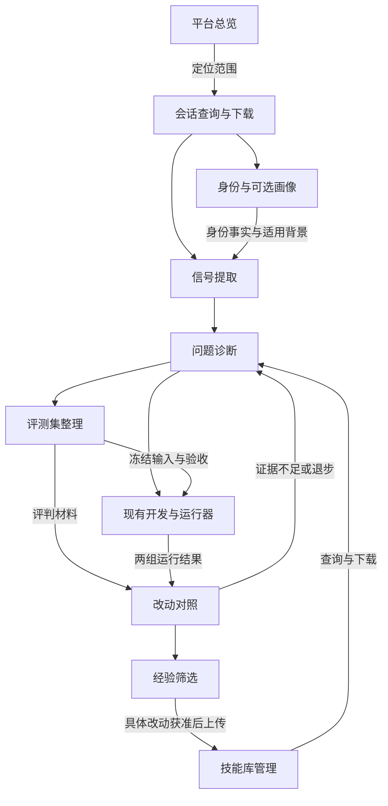

# 九个 Skill 如何协同：会话信号、评测与 Harness 迭代使用建议

依据：你提供的 `4_skills_describe.md`、前一轮五个评测 Skill 的当前说明，以及此前关于部门比较、文件复用、工具失败和人工复核的实际反馈。本次针对使用流程提出建议，没有访问内网、审查四个内网 Skill 的完整代码或修改现有 Skill。

**建议把“会话获取与信号分析”合成一个使用入口，其余能力按需分支调用。** 九个 Skill 不需要串行全跑，更不需要对应九个 Agent。日常先完成取数、观测和问题定位；有具体改动时才进入题集、对照与经验筛选。

## 阅读导航

1. 九个 Skill 的分工与合并建议
2. 主流程与并行边界
3. 五种常见需求的调用方式
4. 最少需要补齐的接口与证据
5. 对四个内网 Skill 的针对性调整
6. 一条真实问题的完整示例
7. 最小落地顺序与汇报方式

## 1. 九个 Skill 的分工与合并建议

### 1.1 各自负责什么

| Skill | 在飞轮里的职责 | 主要输入/输出 | 边界 |
|---|---|---|---|
| session-usage-analysis | 明确范围内查询、下载会话，完成基础解析 | 工号/时间/能力过滤 → 原始 JSON、usage_summary、报告 | 查到多少、下载多少、解析多少分别记录 |
| session-observe | 基于会话提取信号、检查覆盖、挑选复核案例 | 标准会话/支持格式的 MD → 观测、候选、指标行 | 候选不直接成为根因或价值结论 |
| flash-agent-total-use | 提供平台总览、趋势和总体口径 | 只读统计查询 → JSON 快照 | 汇总量通常不能代替逐会话质量证据 |
| emp-profile-builder | 查身份、复用会话事实、按需形成服务画像 | 工号/会话 → identity、profile_facts、画像 | 当前身份、历史行为和推断分别标时间与来源 |
| flash-agent-skills-manager | 读取技能供给与文件；获准后上传技能包 | 工号/技能名/ZIP → 清单、文件、安装结果 | 查询/下载与上传分开；不是通用 Agent/工具部署器 |
| harness-diagnose | 从候选问题定位具体契约、交接或实现缺陷 | 轨迹/配置/产物 → 事实、假设、小改动、反例 | 诊断不等于新版本效果验证 |
| eval-curate | 将复核案例变成可复跑、用途隔离的题目 | 初始输入/附件/验收/材料家族 → 题集与覆盖 | 原运行自报成功不自动成为金标 |
| harness-compare | 在固定任务上比较新旧 Harness | 两组真实运行、规则结果、必要的 Judge → 逐题得失与门控建议 | 不负责完整 Agent 重放；需要现有运行器 |
| experience-screen | 筛选有来源、有条件、有验证的经验 | 诊断/对照证据 → 候选案例、规则、反例、冲突 | 默认不激活长期记忆、不自动发布技能 |

你的四个内网 Skill 解决了重要的接入和运维问题；之前五个补充的是信号解释、验证和经验采用标准。现阶段重点是接好两者的输入输出。

### 1.2 哪些合并，哪些保留

| 组合 | 建议 | 具体做法 |
|---|---|---|
| session-usage-analysis + session-observe | **优先合并使用入口，适配稳定后可合成一个 Skill** | 保留内网查询/下载和成熟 parser；加入 observe 的覆盖检查、标签纪律、信号与复核队列。可保留 session-usage-analysis 名称 |
| session-usage-analysis + emp-profile-builder | **共享解析事实，不合并全部职责** | 同一会话解析一次；画像只聚合和解释已有事实，只有缺日志时才查询 |
| flash-agent-total-use + 会话观测 | **两条互补分析支线** | 一个提供总体分母，一个解释具体会话；口径对齐后在报告中汇合 |
| emp-profile-builder + 会话观测 | **按需补充身份，画像独立可选** | 部门切片只需 identity；不必先生成完整八节画像 |
| harness-diagnose + eval-curate | **可在一次工作任务中连续使用，职责保留** | 定位一个缺陷后顺手做诊断/回归题；另行维护未暴露的验证题 |
| harness-diagnose + harness-compare | **保持判断与上下文边界** | 修复者可见诊断题，独立验收按冻结规则判断；同模型也应使用独立请求/会话 |
| experience-screen + emp-profile-builder | **分别保留** | 一个记录可复用操作经验，一个记录用户服务背景；个人偏好不自动成为全局 Skill 规则 |
| experience-screen + skills-manager | **通过“拟采用的具体改动”衔接** | 前者给候选及依据，后者执行技能库操作；经验通过不等于上传授权 |

可以先保留九个文件包，把日常调用入口收敛。若第一个合并运行稳定，再将 observe 的相关资源移入 session-usage-analysis；原入口转为离线备用或归档，避免两个入口重复触发。这样对外可减少到八个 Skill，但不必为了数量而立即搬文件。

你说明中两个 `parse_session.py` 当前逐字节相同，这是最明确的复用点。先共享解析产物，并记录解析器版本；以后维护一个源文件、分发到两个包即可。暂不需要建设公共服务或新 Python 包。

## 2. 主流程与并行边界

图中的“现有开发与运行器”是你的平台已有能力，不是新增第十个 Skill。发布后的真实会话再回到查询与观测，形成下一轮数据。回到诊断表示选择下一步，不代表无限重试；每轮只做有证据支持的一项改动，并预先约定预算和停止条件。

### 可以并行的部分

- 范围确定后，平台快照查询、已明确用户的会话获取、身份查询、指定 Skill 下载，原则上可以独立准备；遵守各服务已有并发限制。
- 会话下载完成后，不同会话的本地解析可独立进行，避免两个 Skill 重复写同一解析文件。
- 画像生成和问题诊断可以消费同一份冻结事实，但画像中的推断不要作为 Judge 的评分依据。

### 需要串行或隔离的部分

- **total-use 的 stickiness / overview 按现有全局互斥约束执行。** 已有 overview 快照满足需求时，不再并发重复查询其中相同数据；该约束也应覆盖多个分析任务之间的调用。
- 身份查询可独立进行，完整画像聚合须等会话事实就绪。
- 原始快照、解析、口径映射、指标聚合之间有依赖，不因“并行”打乱顺序。
- 先冻结输入/验收，再正式跑对照。验收材料与修复上下文分离，不能通过共享工作目录把保留答案重新暴露给修复者。
- skills-manager 的上传放在具体改动形成并满足既有授权流程后。冲突沿用当前规则，默认 error；按要求确认后才覆盖，不把 overwrite 写成默认动作。

## 3. 五种常见需求的调用方式

### 场景 A：看平台使用情况，找值得分析的范围

**主入口：flash-agent-total-use。**

1. 按问题选 overview 或具体端点，保存查询参数、时间与原始 JSON。
2. 看部门/用户/能力的分布，确定本轮明确的工号列表与时间窗。
3. 需要解释现象时再用 session-usage-analysis 下载会话，接 session-observe。
4. 只有组织身份不清楚时调用 emp-profile-builder 的身份查询步骤；完整画像可跳过。

**交付**：总体快照、抽样范围、覆盖缺口、少量可追溯的问题。总体排行用于找线索，不能直接给出业务价值或人员能力排名。

适用提示词：

> 看指定时间范围的平台使用情况。先用 total-use 获得总体快照，再在已明确的用户范围内选普通样本和异常样本，使用 session-usage-analysis 获取会话并做信号分析。保留两类采样标记，说明哪些指标能对齐总体口径。

### 场景 B：评估某个 Skill / Agent 是否好用

**主入口：session-usage-analysis + session-observe，按需使用 manager 的只读操作。**

1. 查明确用户在指定 Skill/Agent 下的会话，记录过滤条件。
2. manager 查询/下载相关 Skill，供阅读契约、脚本和参考资料；Agent 配置、独立工具实现从现有项目来源取得，不能假定 manager 能下载所有 Harness。
3. 先看加载/委派、输入、回执、错误、产物及覆盖，再由 diagnose 复盘具体问题。
4. 如果问题是“用了该 Skill 是否更好”，另选代表任务做有/无或旧/新对照，进入 curate + compare。

**交付**：适用任务、可见使用证据、问题清单与对照计划。经过 Skill 过滤的会话适合诊断已使用案例，但缺少未使用组；其通过率不能直接证明增量价值。

适用提示词：

> 分析这些用户使用 X Skill 的真实情况，并下载当前 Skill 作契约参考。区分已观察事实、历史版本未知、原因假设。先找一个最具体的问题；只有存在可复跑输入和验收时，再设计增量对照。

### 场景 C：为某个用户改善服务

**主入口：emp-profile-builder，复用已下载日志与解析结果。**

1. 若缺日志，由 session-usage-analysis 在明确范围内获取；若已有日志则直接复用。
2. 查身份，生成 profile_facts，再按需写画像。
3. 用户偏好、常见业务背景用于服务适配；重复追问、跨会话重试等摩擦点可交给 observe/diagnose。
4. 形成针对任务的建议，例如补充输入模板、推荐已有 Skill；不要把一次困难归结为用户水平低。

**交付**：有来源和时间范围的画像，以及少量可行动的服务建议。画像不应成为每次信号分析的前置步骤，也不传给 Judge 作为判断输出好坏的依据。

### 场景 D：修一处 Harness 问题，并证明没有退化

**主入口：harness-diagnose → eval-curate → harness-compare。**

1. 从 observe 候选中选择一个问题，补齐可见轨迹和适用契约。
2. 用 manager 下载 Skill 基线；明确当前文件快照与历史加载版本的区别。
3. curate 固定初始输入、附件、验收与任务家族。诊断题可以已被修复者阅读，最后验证题需另行隔离。
4. 由现有开发流程修改候选副本，运行器在隔离环境下执行旧/新版本，确认实际加载内容。
5. compare 先程序验收，必要时再跑分维度 Judge，报告逐题改善、退步、未知与资源消耗。

**交付**：可复现问题、具体改动与配对验证。默认不需要 total-use 或完整画像；只在判断影响范围、解释差异时补查。

### 场景 E：采纳经验与部署后再观测

**主入口：experience-screen + manager 的受控上传操作。**

1. screen 核对经验来源、适用条件、反例、验证及冲突，输出候选。
2. 决定保留为案例、更新一条现有规则，还是保持待复核；不是每条经验都要产生新 Skill。
3. 对拟发布的具体包记录文件指纹、目标用户、基线、验证结果、采用决定与恢复方式。
4. 按已有授权与冲突规则上传。安装返回成功后，核对新会话实际加载的版本，再观察真实使用。
5. 后续会话仍由 usage/observe 收集；需要看总体影响时才补 total-use。

若“候选经验”又被写成了新的 Prompt/Skill 文本，且该文本不同于刚才验证过的版本，应作为新改动再验证。避免把验证摘要自动改写成一段未测过的运行指令。

## 4. 最少需要补齐的接口与证据

### 4.1 一次查询、一次解析，多处消费

建议共用三类产物，不重建数据库：

| 产物 | 谁负责产生 | 谁消费 |
|---|---|---|
| 原始会话及获取清单 | session-usage-analysis | parser、问题追溯、题集整理 |
| 版本明确的解析事实 | 现有 parse_session.py | session-observe、emp-profile-builder、diagnose |
| 来源可追溯的信号/候选 | session-observe | 画像的可选补充、diagnose、curate |

已知两份 parser 当前相同，但其输出结构与 observe 标准 session JSONL 是否兼容，仍需实际字段对照。补一个薄适配函数即可：复用可确认字段；摘要缺失的原始工具参数/回执回到 raw JSON 读取；不要从一段 Markdown 总结反向捏造事件。

解析缓存至少关联 `session_id + raw_sha256 + parser_version + 影响结果的解析选项`。多租户时把租户加入键。日志更新或解析器变化后才重新解析；同一批事实交给多个消费者使用。

### 4.2 增加一份简单的采集范围记录

建议附在已有 usage_summary.meta 或一个旁侧 JSON 中。以下是**建议新增的逻辑字段**，不是宣称当前接口已经返回：

| 字段 | 用途 |
|---|---|
| dataset_id、queried_at | 标识本批数据和查询时点 |
| users、agent/skill filters | 写清查询范围及过滤条件 |
| window_start/end、timezone | 对齐时间；CST 缩写需记录明确时区/UTC 偏移 |
| hit_count、downloaded_count、parsed_count | 命中、下载、成功解析的数量分开 |
| limit、selection_method、errors | 暴露默认截断、样本选择与失败 |
| source_scope | 当前服务可访问的数据范围，如现存未归档实例 |
| source_refs、parser_version | 支持回到原始证据并解释版本变化 |

你当前默认 `--limit 20`：如果命中 300 条、只下载 20 条，后续结论必须标“已下载样本”；除非接口明确提供随机抽样，否则不能称随机样本。能力过滤还会造成另一层选择偏差。

日期范围当前限制 ≤31 天。更长时间可按服务支持的窗口分批，记录边界并去重；不要假定 end 是否包含当日，更不能把重复下载的同一会话当新样本。查询限定工号的约束继续保留，不用无 user 请求绕过它。

### 4.3 总体统计与会话分析先对账，再解释

total-use 与 usage-analysis 同属平台，也不能据此默认同口径。对照时间窗、时区、归档范围、去重规则、Token 类型、父子调用和统计更新时点。

- 对齐后，可以报告“已分析样本占该口径总体多少”；未对齐时并列展示两个范围。
- DAU/WAU/MAU 或粘性不能自动替代留存。你现在已有 stickiness 端点，可以获取真实队列输出，但仍须核对 cohort、活跃定义及尾部队列观察期。
- 平台汇总的 Agent 分布与运行轨迹中的 subagent_type 不一定同层级；字段含义明确后再做映射。

### 4.4 给“这次改动”留一条小记录

沿用 JSON 文件即可，先记录：`change_id`、目标 Skill/Agent/脚本、基线与候选指纹、源问题、eval_plan、运行结果、采用状态。只有需要投放时再补目标用户/环境、安装结果和后续加载证据。

不要混用三个状态：

1. **技能库里存在**：manager list/exists/download 能说明的范围。
2. **已经安装到目标位置**：upload 返回 installed_skills 等结果。
3. **某次运行实际加载**：需要本次运行的加载事件、可核对内容或实际执行路径证据。

无法确认第 3 项时保留未知，不能把前两项自动填成 harness_loaded_confirmed=true。

## 5. 对四个内网 Skill 的针对性调整

### session-usage-analysis：最适合成为日常观测入口

保留原有查询、下载、解析和四段报告。建议只增加三项：

- 报告开头增加“范围与覆盖”：命中/下载/解析、过滤条件和数据缺口。
- 解析完成后可选调用 observe 的规则；不再重复写一套完成率、自愈率、复用率逻辑。
- 最后移交少量候选：原始事件引用、现象、可能修改位置、需要补的证据。来源是启发式时明确标注。

按技能过滤后的报告仍可以保留，但用于评价平台整体分布时，应另取未做该过滤的明确用户样本。

### emp-profile-builder：事实层共用，画像按需生成

直接复用已有 identity、parsed 与 profile_facts。部门切片只取身份事实；只有任务确实需要服务画像时才生成完整 Markdown。

现有“新证据优先”建议改得更精确：可变身份注明生效/观测时点；偏好变化保留条件；无法解释的新旧矛盾标冲突。新记录较晚，不代表推断一定更准确，也不应改写历史会话的部门归属。

profile_facts 中 fail_rate、P50/P95、dup_inputs、“自动修复次数”应沿用同一指标定义。重复输入可能是合理轮询；后续一次成功不一定修复了前面的问题。缺少 issue/branch/用户介入证据时，画像可写“观察到该序列”，不升级为稳定能力判断。

跨会话一致可提高可信度，但同一任务反复尝试、共用材料或复制提示并不是独立证据。经验筛选与用户画像共用来源，保留不同用途。

### flash-agent-total-use：提供总体背景与变化线索

保留独立只读入口，避免让每次单会话分析都查询 overview。输出统计快照时保留查询参数与时间，能回答本次总体是谁、时间多长、覆盖多少。

排行用于选样本和定位投入，不自动解释为业务价值。部署前后趋势可作后续观测；任务量、模型、用户构成可能变化，因此不能代替冻结任务上的对照。

### flash-agent-skills-manager：同时连接供给侧和实施侧

只读操作可为诊断提供当前 Skill 文件、脚本与注册信息，也可以支持“是否存在适用能力但未被使用”的候选分析。但某人的个人技能库清单不等于其运行时所有可见能力，可能还有全局或项目级来源；需结合实际加载规则判断。

建议下载时在分析工作区附一份时间/工号/包指纹记录，保留基线副本。历史加载版本未知时照实记录。上传时沿用现有冲突规则与授权范围，不把“评测通过”视作对任意用户覆盖安装的许可。

你的说明明确提到内置凭据、统一密钥和自动刷新。接入评测时，让认证继续留在这些客户端中；Judge、题集与导出的分析包只接收必要结果。目标工号与实际操作者分别记录，工号参数本身不能充当授权依据。这里不需要先重建鉴权系统，但连接流程不应放大既有权限范围。

## 6. 一条真实问题的完整示例

沿用你此前材料中的候选：**校验器可能没有覆盖目标文件，却给出通过结果。**

| 步骤 | 使用能力 | 实际产出 |
|---|---|---|
| 1. 定位 | usage-analysis + observe | 相关调用、参数、输出与目标引用；原始状态缺失则注明 |
| 2. 取契约 | skills-manager 下载；必要时补项目文件 | 当前 Skill/脚本快照及指纹，不冒充历史版本 |
| 3. 复现诊断 | harness-diagnose | 在副本核对正常、缺目标、未索引目标；崩溃与正确拒绝分开 |
| 4. 整理验收 | eval-curate | 诊断/回归夹具，另留未暴露的正常与边界验证题 |
| 5. 修改运行 | 现有开发与运行器 | 精确修改校验器的一处逻辑；在同环境执行旧/新实现 |
| 6. 对照 | harness-compare | 目标检出是否修复、正常输入是否退化、证据是否齐全；可能完全无需 Judge |
| 7. 筛选经验 | experience-screen | 关于“检查目标必须明确”的候选约定、来源、适用版本与反例 |
| 8. 采用并观测 | manager 上传或已有项目发布流程；再回 usage/observe | 获准的实际包、加载证据与后续问题变化 |

此例不必生成用户画像，也不必先做全平台总览。若改动落在独立工具服务或 Agent 配置中，使用原有项目发布流程；manager 的个人 Skill 上传不能替代它。

相反，如果只是想知道“某科主要如何使用平台”，通常到 usage/observe 与身份切片就足够，无需跑完整评测或发布链路。

## 7. 最小落地顺序与汇报方式

### 第一阶段：先减少重复处理

让 usage-analysis、observe、profile 共用原始会话与解析产物；补齐采集范围记录。把“查使用并分析信号”做成一个入口，不增加编排服务。日常只读分析按已明确范围执行，缺材料时输出缺口，不要求反复确认已经授权的查询。

### 第二阶段：只接一个可验证的问题

选择你能修改或能提交给维护者的一处缺陷，补题卡、变更记录和旧/新运行结果。修复与评判保持上下文隔离，现有运行器完成执行。没有实际运行证据时交付待执行计划，不用假结果补齐流程。

### 第三阶段：再连接技能库采用与后续观测

只对拟采用的具体改动使用 manager 上传，保留基线并确认新运行加载。经验先成为候选；保留题解法不进入普通 Skill/画像后再被称作盲测题。

一份最终报告可以只有三段，避免九个 Skill 各写一篇长总结：

| 段落 | 主要内容 | 主要证据来源 |
|---|---|---|
| 使用与范围 | 谁在用、用什么、分析覆盖到哪里 | total-use、usage-analysis、身份事实 |
| 问题与改进 | 哪个具体问题、改哪里、对照结果与退步/未知 | observe、diagnose、curate、compare |
| 采用与待办 | 哪些经验候选/版本被采用、适用范围、下一条证据缺口 | screen、manager、后续会话 |

业务采用确认仍是可选补充：用户把结果用在哪里、经过哪些修改。画像、活跃、安装和 token 都不能自动代替这条证据；九个 Skill 目前也没有提供可靠工时基线，不应从使用统计直接换算节省金额。

**最小成功标准**：可以从一个异常追溯到具体会话与文件，再追溯到一处改动、一次有效验收，以及实际采用/加载状态。先让这一条链可信，后续再扩大用户、部门和任务覆盖。
