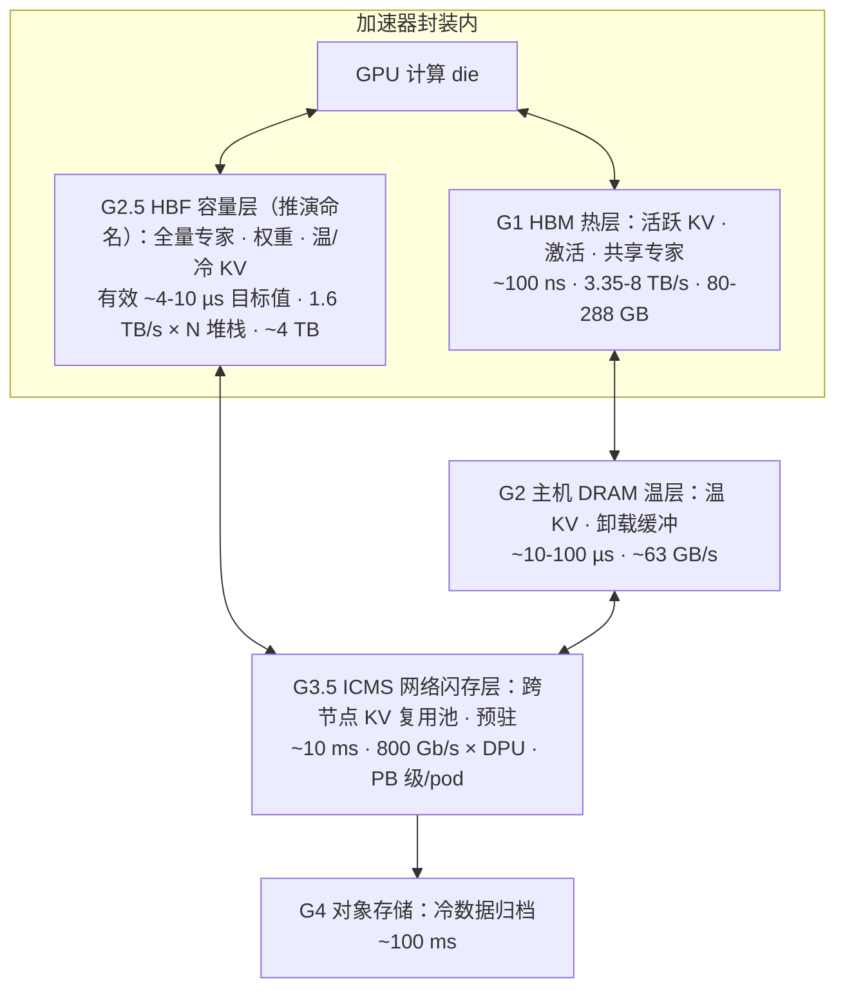

## 2. HBF 引入后的系统架构演化（对应模型问题 2、3；硬件问题 5、6）

HBF（High Bandwidth Flash，高带宽闪存）把单加速器可寻址的近存容量从 HBM 的 80–288 GB 抬升至封装内约 4 TB（8 堆栈），Gen1 单堆栈 512 GB、读带宽 1.6 TB/s（≈HBM4@6.4 Gb/s JEDEC 口径），Gen2/Gen3 目标值分别为 >2 TB/s·1 TB 与 >3.2 TB/s·1.5 TB[^401^][^403^][^435^]。需先行声明口径：HBF 样品预计 2026 年下半年出样、首批推理设备 2027 年初[^402^][^406^]，本章引用的全部 HBF 带宽/时延数字均为厂商目标值或学术建模口径，尚无第三方实测；涉及未来的表述均为基于证据的条件性推演。本章依次回答：HBF 存 KV 对命中率与命中时间的影响（2.1）、MoE 架构适用性（2.2）、batch size 系统级优势与带宽容量量化（2.3）、仿真工具需新增的模型因素（2.4），并在 2.5 给出五个开放问题的条件性判定。

### 2.1 HBF 存储 KV 对命中率与命中时间的影响

#### 2.1.1 KV reuse 时间分布：复用窗口短且强偏斜，读:写≈186:1

生产 trace 给出了 HBF 层"容量—命中率"核算的两个关键前提。**其一，KV 复用高度集中于短窗口**：阿里云生产 trace（ATC'25）实测 80% 的 KV 复用间隔在 to-C 聊天负载下小于 10 分钟、to-B API 负载下小于 10 秒；KV 块 P99 寿命仅 97 秒；10% 的块贡献 77% 的复用[^206^]。多轮对话与 agent 负载进一步抬高复用密度：ShareGPT 中 78% 会话为多轮、历史 token 占比随轮数升至 98% 以上[^207^]；coding agent 轨迹平均 157 轮、平均上下文 32.7K token、每轮仅追加约 429 token，KV 命中率天然达 98.7%[^208^]。**其二，KV 访问呈极端读多写少**：FlexGen-SSD 块层 I/O trace 实测 KV 读带宽 2.0 GiB/s 对写带宽 11 MiB/s，读:写≈186:1，单个 sector 最多被读 256 次[^218^]——这是"历史/共享 KV 可以下放 NAND 类介质"的物理前提（冷热适配判定详见第 1 章，此处不重复）。

两个前提共同决定命中率对容量的依赖形态：复用窗口短意味着有限容量即可逼近理想命中率——ATC'25 测算 to-B 负载下 2×GPU HBM 容量即足够、to-C（GQA 模型）需 4×HBM[^206^]，独立测算亦给出"高复用效率可能要求约 4× 工作集容量"[^414^]。问题在于现有 DRAM 层恰好卡在窗口之内：约 2 TB 主机 DRAM 只能保留约 5 分钟的 KV，而 100 TB 级 NVMe 才能保留 1 小时以上[^202^]——"10 分钟复用窗口"与"5 分钟 DRAM 容量"之间的落差，正是现实部署中命中率损失的结构性来源。分层放置实证同样支持容量—命中正相关：CachedAttention 在四个模型上命中率从 HBM-only 的约 0%、HBM+DRAM 的 1.9–11.2% 升至加 SSD 后的 56–89%[^209^]。HBF 以 8–16×于 HBM 的封装内容量[^320^][^405^]把该窗口期工作集拉进封装内，使命中率不再受 DRAM 容量截断；SK hynix H³ 模拟（B200+8×HBM3E+8×HBF）显示，该放置策略下 1M/10M token 上下文吞吐分别提升 1.25×/6.14×、能效提升 2.69×[^222^]。对象界定保持不变：共享预计算只读 KV 与历史 KV 放 HBF，逐 token 生成的活跃 KV 留 HBM[^222^]。

#### 2.1.2 命中率与命中时间对 TTFT/ITL/吞吐的定量传导

命中率与命中时间是两条独立的传导链：命中率决定"免去多少 prefill 重算"，命中时间（取回 KV 的端到端时延）决定"命中收益有多少被 I/O 吃掉"。已有实测锚点汇总于表 2-1。

表 2-1 命中率/命中时间 → 服务指标的定量传导锚点

| 系统/来源 | 命中侧改进 | 对服务指标的传导 | 来源 |
|---|---|---|---|
| Marconi（2024） | 复用准入+FLOP 感知驱逐，token 命中率最高 34.4× | TTFT −71.1%（617 ms） | [^210^] |
| ATC'25（阿里生产 trace） | 复用分布拟合 WA 策略，hit +8.1–23.9% vs LRU/LFU/S3-FIFO | QTTFT −28.3–41.9% | [^206^] |
| RTP-LLM（阿里生产） | 分层 KV+前缀缓存，缓存复用 +215% | TTFT P95 −35~37%；prefill 机器 −75% | [^215^] |
| LMCache+VAST（DGX SuperPOD） | 预计算 KV 直接命中 | 128K 上下文 TTFT >11 s→1.5 s（400 Gbps RDMA+GDS） | [^216^] |
| HCache（EuroSys'25） | hidden-state 混合恢复 | 重算 TTFT 为理想值 20–26×、KV offload 6.5–13×；TBT 劣化 ≤4% | [^204^] |
| KVServe | 命中时间受链路约束 | 10–50 Gbps 下 KV 通信占 JCT 16–60%；5–15 Gbps 下达 66% | [^217^] |

表 2-1 揭示三条规律。其一，传导主要落在 TTFT 与吞吐，ITL/TBT 侧代价可控——HCache 的 TBT 劣化不超过 4%[^204^]。其二，命中时间收益与传输带宽强相关：VAST 案例约 7 倍的 TTFT 压缩依赖 400 Gbps RDMA+GDS 高端链路[^216^]，而 KVServe 显示 10 Gbps 级云链路上 KV 通信可吃掉端到端时间的一半以上[^217^]。其三，存在"读-算拐点"：hidden-state 混合方案单机约需 24–37 GB/s 存储带宽（7B/13B/30B 模型）才能与重算等速[^204^]，链路级拐点为 10–80 Gbps（低于 10 Gbps 时取回慢于重算）[^205^]。HBF 单堆栈 1.6 TB/s 超出拐点约 40–65 倍，使命中时间发生量级跃迁：取回一个 128K token、70B 模型的 KV（约 42 GB），NVMe（14 GB/s）约 3.0 s、ICMS 级（约 100 GB/s）约 0.42 s、HBF（1.6 TB/s）仅约 26 ms（本章按带宽复算）——从"超出 TTFT 预算"进入"可与一次 chunked prefill 重叠"的区间。

再看预取可掩盖性判据 $T_{load} \cdot L_{hist} \le T_{pref} \cdot L_{new} + S_{buf}/BW_{eff}$[^203^]：HBF 把 $T_{load}$ 压缩约两个数量级，不等式显著放松；但 agent 类短追加负载（$L_{new}$ 平均仅约 429 token[^208^]）掩盖窗口仍然最小，仍需调度器 look-ahead 与 wait_complete 类预取策略配合[^203^][^214^]。由此给出本章第一个方法论结论（跨维度洞察 1）：越过读-算拐点之后，评估 HBF 价值的第一指标应从 SSD 时代的"命中率"转为"有效延迟预算 × 聚合带宽利用率"——miss 的代价本身已可控，预取从"必须命中"降级为"延迟掩盖"优化（本报告推演，置信度：高）。

#### 2.1.3 HBF 有效延迟口径冲突区（C1）：~10 µs vs tR≈4 µs vs 裸 NAND 40–100 µs

HBF 读延迟存在三种并存口径，构成本章必须显式呈现的冲突区 C1（表 2-2）。

表 2-2 HBF 读延迟三种口径对照（冲突区 C1）

| 口径 | 数值 | 测量层 | 来源 |
|---|---|---|---|
| 厂商/分析师口径 | ~10 µs，约为 HBM 的 100× | 系统级有效访问（含控制器与接口） | [^323^][^324^] |
| OCP 送审/学术建模 | tR≈4 µs（首批数据到达）；综述表 1–10 µs、读粒度 4 KB | 堆栈级经并行与缓冲后的流水线化延迟 | [^414^][^930^] |
| 裸 NAND 器件 | TLC 40–100 µs；QLC 85–170 µs；SLC 约 30 µs（max） | cell→页缓冲的裸读 tR | [^908^][^909^][^910^][^907^] |

三种口径并不矛盾，因为测量的是不同层。裸 tR 由 sensing 次数决定（SLC 1 次、TLC 最多 3 次）[^905^]，属器件物理，不会因 TSV 堆叠而缩短；"个位数 µs"应理解为 SLC 模式 + die 内 96 plane 子阵列并行 + 跨 die SRAM 双缓冲预取（整栈 SRAM 按 >2×峰值带宽×读延迟配置）之后的有效流水线化延迟目标值[^929^]。SanDisk 方面亦承认"HBF 延迟仍是 HBM 的 10–100×"，并把可行性押在"加速器若预知数据即可预取、避免等待单次慢读"[^925^]。工程含义直接：FlashAccel 测算单次 4 µs 读会使一次 4 µs GEMV 的时延增加 50%，必须靠 SRAM 预取与超页流水隐藏[^414^]——一切把 HBF 放进 decode 回路的架构，其成立前提都是访问模式可预知；KV 逐层顺序消费满足该前提，随机细粒度读不满足。本章后续统一采用"裸 tR 不变、有效延迟取厂商目标值"的口径。

### 2.2 HBF 引入后 MoE 架构的适用性

#### 2.2.1 MoE expert offloading 技术线：预测命中率 17%→99% 的跨度

MoE 与慢速大容量介质天然互补：每 token 只激活少数专家，"全部专家驻留快速内存"可放宽为"热/将用专家驻留、其余驻留慢介质"。Mixtral-8x22B 仅专家 FFN 参数即超过 256 GB，为同 FLOPs 稠密模型的 4–5 倍[^301^]；Apple 的 LLM-in-a-Flash（非 MoE，同原理）证明参数放闪存、按需调入 DRAM，配合 windowing 与 row-column bundling，可运行 2×DRAM 容量的模型并在 GPU 上提速 20–25×[^302^]。2023–2026 年该技术线的代表系统见表 2-3。

表 2-3 MoE 专家卸载代表系统：放置策略、命中率与性能

| 系统 | 放置/策略 | 预测·命中率 | 性能数据 | 来源 |
|---|---|---|---|---|
| MoE-Lightning（2024） | CPU-GPU-I/O 流水+paged weights，不重预测 | —（吞吐型） | Mixtral-8x7B 单 T4(16 GB) 最高 10.3× | [^301^] |
| LLM-in-a-Flash（Apple，2023） | 闪存驻留+windowing+行列捆绑 | — | 2×DRAM 容量模型；GPU 提速 20–25× | [^302^] |
| Fate（2025） | 跨层门控预测+浅层（0–3 层）全缓存 | 预取 97.15%，缓存命中 99.08% | decode 提速 4.1×/2.2× | [^306^] |
| ExpertFlow（2024） | 预测调度+路由感知 rebatch+自适应缓存 | 预测 95%，命中 91.96%（超 LRU 61.15%） | 显存 −93.7%，吞吐至 10× | [^307^] |
| HOBBIT（2024） | token/层/序列三级混合精度+自适应预取 | 命中仅约 55% | decode 最高 9.93× | [^330^][^331^] |
| MoE-Beyond（2025） | 轻量 Transformer 预测器（6600 万条轨迹训练） | 命中 17%→72% | GPU 缓存命中 +55% | [^336^] |
| DuoServe（2025） | prefill/decode 分相+层级预测器 | top-2 54–67%，hit-1 90.3–95.5% | Mixtral-8x7B/8x22B | [^334^] |
| FlashMoE（2026） | SSD 单次加载+ML 缓存替换 | 替换策略超 LRU +21%、超 LFU +51% | 加载快 llama.cpp 4× | [^335^] |

表 2-3 中命中率 17%→99% 的跨度由两个变量决定：是否允许改模型（Pre-gated/SiDA 改门控或引入哈希预测可达 90% 以上，但损失模型便携性）[^303^][^332^][^333^]，以及层深（浅层路由分布平坦、预取不准，深层路由集中、预取准；Fate 正是靠把 0–3 层全部专家驻留才拿到 99.08% 命中）[^306^]。更值得注意的信号来自吞吐型系统：MoE-Lightning 不强依赖预测，靠 I/O 调度即可逼近硬件吞吐上限[^301^]——这暗示当慢介质带宽足够高时，"复杂预取"的边际价值下降，为 2.2.2 的推演埋下伏笔。

#### 2.2.2 专家局部性的脆弱性与负载均衡张力；HBF 带宽补上后"预取失效"被治本

"缓存热专家"路线依赖专家访问的时空局部性，而证据显示该局部性真实存在但脆弱且模型相关。Mixtral 中相邻 token 选同一专家的概率高于随机、可延续 2–4 个 token[^309^]；但对 20 个 MoE 模型的系统研究发现：局部路由一致性与"局部"负载均衡强负相关（"全局"负载均衡可与之共存），DeepSeek 式共享专家因压缩专家组合空间而降低一致性；并非所有模型适合卸载（GRIN-MoE 一致性高、Jamba-Mini 低）[^310^]。负载均衡训练还从机制上抹平局部性：均衡后的模型在单序列内激活近乎均匀、跨序列专家偏好漂移，导致缓存不命中与专家频繁迁移[^311^]；对 Qwen3.5-35B-A3B 的独立实测显示，跨层专家索引相关性仅为随机的 1.07 倍、top-8 专家仅占 15.7% 概率质量[^345^]。预测派对此的自我批评同样直接："预测方法收益有限，因为专家加载成本远大于 GPU 计算成本"[^330^]——在 PCIe 32 GB/s 链路上搬运权重比片上计算慢约 50×[^433^]。

这正是冲突的根源："缓存+预取"范式的全部复杂度都源于慢介质带宽太低、miss 代价太高。HBF 把慢介质带宽抬高约两个数量级（1.6 TB/s 对 NVMe PCIe4 的约 7 GB/s、PCIe5 的约 14 GB/s）[^403^][^321^]，与 HBM 的带宽差距缩小到约 3×（1.6 vs H200 的 4.8 TB/s）——"预取失效"是低带宽慢介质时代的病，HBF 是治本而非治标：预取从"必须命中"降级为"掩盖个位数 µs 级延迟的优化"，按需读任一专家的代价落入可接受区间；负载均衡抹平 hot/cold 的副作用在此模式下变得无害，因为不再依赖"缓存命中热专家"（综合推演，置信度：中高）。

#### 2.2.3 架构推演：HBM 算 + HBF 存全量专家按需流式读 + SSD/3FS 存 KV/数据

EP（expert parallel，专家并行）拓扑的存在理由是单卡 HBM 放不下全部专家：DeepSeek-V3 规模下每层 dispatch/combine 两次 all-to-all × 58 个 MoE 层 = 每前向 116 次，单次 200 MB 负载在 50 GB/s 互联上需数 ms，累计每步数百至数千 ms[^317^]。DeepSeek 的降税工程——Node-Limited Routing 借 NVLink(200 GB/s):IB(50 GB/s)≈4:1 的带宽差做节点内流量去重[^316^]、冗余专家（预填设 32 个、每 GPU 多驻 1 个）[^315^]、DeepEP 高吞吐/低时延双内核[^347^]——把税压低但无法消除。

若单封装内 HBF 可容纳全量专家，EP 度数可大幅收缩。按容量复算：8 堆栈 HBF 约 4 TB[^401^][^408^]，DeepSeek-V3 全量 671B 参数（FP8 约 0.67 TB）约占 2 堆栈；按激活参数流读，1.6 TB/s ÷ 37 GB ≈ 43 token-steps/s/堆栈，6 堆栈聚合约 259 steps/s（本章按带宽复算；batch 摊薄后聚合吞吐随 batch 近似线性放大）。MoE 扩展的第一约束由此从"互联带宽"回到"HBF 读带宽"——后者单点、可预测、易扩展（方向性推演，置信度：中，定量待 2026–2028 硬件到位后实证）。

分工层面形成自洽的三级结构（跨维度洞察 3：MoE 与 KV 对 HBF 是"一体两面"）：MoE 冷专家是随机稀疏读、吃延迟与并发，历史 KV 是大块顺序读、吃带宽，HBF 的多 die/多 plane 并行结构可同时服务两种模式，容量规划应把"全量专家+历史 KV"合并算账——HBM 存激活、注意力/共享专家与活跃 KV，HBF 存全量路由专家与温/冷 KV，SSD/3FS 层存冷 KV 与数据。该分工与 SK hynix 公开的"HBM 热层+HBF 冷/温层+并列放置"路线一致[^319^][^350^]；网络侧 KV 层已被生产验证：DeepSeek 3FS 在 180 节点集群实现 6.6TiB/s 聚合读、KVCache 单客户端峰值 40+ GiB/s[^313^]，线上 Context Caching 把 KV 放分布式硬盘阵列并以命中/未命中 10 倍价差计费[^314^]。

判定：HBF 不会让 MoE 失效，反而因"稀疏读+推理期只读+容量巨大"三重匹配而奖励 MoE、相对惩罚稠密——MoE 的核心价值"容量与每 token 计算解耦"（671B 质量@37B 成本）[^346^]与内存介质无关。边界条件有二：对极致低延迟的单请求（batch=1）场景，HBF 是改良而非质变；专家数持续增长（256→384→512）[^346^][^430^][^325^]后单封装未必永远装得下整模型，届时出现"HBF 内全专家+少量跨封装 EP"的混合拓扑，而非回到超大 EP。边缘侧已给出对照证据：iPhone 17 Pro 上以 NVMe（4–6 GB/s）流式跑 397B MoE 仅 0.6 tok/s，瓶颈明确是 SSD 带宽[^325^]——HBF 恰好把这一短板抬高约两个数量级。

### 2.3 Batch size 的系统级优势与带宽容量量化

#### 2.3.1 Decode memory-bound：算术强度 1–2 FLOP/B，batch 是吞吐杠杆

Decode 阶段每步读取全部权重但每字节只做约 2 次浮点运算，batch=1 时算术强度约 1–2 FLOP/B[^416^][^417^]，TPUv4 实测 batch-1 decode 仅 11–22 FLOP/B[^416b^]——比 H100 的 roofline 拐点（约 295 FLOP/B）低两个数量级，Tensor Core 空闲率达 99.7%[^417^]。"带宽即吞吐"有直接代际证据：H200 相对 H100 算力不变、带宽 +43%，decode 吞吐直接 +43%[^417^]。batch 增大把权重读取摊薄到 B 个请求，等效算术强度约 2B FLOP/B，要触到计算 bound 需 batch≈90–160（BF16；H100/H200/B200 拐点 206–312 FLOP/B），FP8 权重再减半（本章按公开规格复算）；需注意 batch 只摊薄流量、并不改变算术强度这一算法属性[^415^]。

实测红利：H100 SXM 上 Llama-3.1-70B FP8 连续批处理，batch 1→64 吞吐约 550→12,000 tok/s（22×），代价是 TTFT 80→700 ms[^419^]；Llama-3.3-70B（TP4）H100 在 500 并发下达约 7,000 TPS，而 A100 约 50 并发即饱和于约 570 TPS——容量与带宽共同决定饱和点[^420^]。大 batch 受两道闸门限制：HBM 容量（KV 驻留）与 SLO（TTFT/TPOT）；调度侧亦有成本，朴素混合批使 TBT 最高恶化 28.3×[^423^]，DistServe 的 PD 分离让 decode 池独立堆 batch 至"近 compute-bound"，goodput 最高 7.4×[^422^]。

#### 2.3.2 KV 容量公式：Llama-3-70B 320 KB/token、128K≈40 GiB/请求；MLA 约 70 KB/token

KV 占用由注意力形态决定：MHA/GQA 为 $KV_{token} = 2 \times L \times H_{kv} \times d_{head} \times p$，MLA 为 $(d_c + d_{rope}) \times L \times p$[^426^][^427^]。主要模型的量化结果见表 2-4。

表 2-4 KV 容量/流量量化表（BF16；流量按 decode 每步重读全部活跃 KV、r=20 tok/s 复算）

| 模型 | 注意力结构 | KV/token | 128K 上下文容量 | 128K KV 流量/请求 | 1M 上下文容量 | 1M KV 流量/请求 |
|---|---|---|---|---|---|---|
| Llama-3-70B | GQA-8，80 层 | 320 KB[^425^][^426^] | ≈40 GiB[^426^] | 0.84 TB/s | ≈305 GiB | ≈6.6 TB/s |
| Llama-3-405B | GQA-8，126 层 | 504 KB[^428^] | ≈62 GiB | 1.32 TB/s | ≈481 GiB | ≈10.3 TB/s |
| DeepSeek-V3 | MLA(512+64)，61 层 | 68.6 KB[^426^][^427^] | ≈8.4 GiB | 0.18 TB/s | ≈65 GiB | ≈1.4 TB/s |
| DeepSeek-V3（FP8 KV） | 同上 | ≈38 KB[^427^][^431b^] | ≈4.7 GiB | 0.10 TB/s | ≈36 GiB | ≈0.78 TB/s |

表 2-4 显示注意力形态是一阶变量：MLA 相对 MHA 压缩 57×、相对 GQA 压缩 7×[^426^][^427^]，同一台 H200 上 128K 上下文从"MHA 假设下连 1 个并发都放不下"变为"MLA 后可放 8–9 个"[^428b^]。容量直接锁定连续批处理的 batch 上限：

$$B_{max} = \frac{M_{HBM} - W_{model}}{KV_{token} \times S}$$

H200（141 GB）跑 FP8 70B 时，8K 上下文 $B_{max}$≈27、128K 仅≈2、1M 为 0（本章按上式复算）。实测侧，vLLM 在 B=32、1600+1600 token 负载下 KV 占用（102,400 token）已超出 HBM 分配（45,584 token）2 倍以上，触发运行时停滞与排队[^421^]；KV 接近 100% 饱和时抢占引发的重算会造成端到端时延的灾难性尖刺[^446^]。HBF/近存层把这道容量闸门抬升 1–2 个数量级：FlashAccel 在 405B、15K/6K 上下文场景将 batch 从 30 提到 110[^414^]；8×H200+4 TB HBF 跑 DeepSeek-V3 时 128K 的 $B_{max}$ 从约 51 升至约 500（本章复算）。

#### 2.3.3 长上下文 KV 流量反超权重流量：0.84 TB/s(GQA) vs 0.18 TB/s(MLA)/请求@128K

Decode 每步须重读全部活跃 KV，单请求 KV 流量为 $S \times KV_{token} \times r$，不随 batch 摊薄；权重流量则被 batch 摊薄为 $W \times r / B$。二者相等的交叉并发为：

$$B^{*} = \frac{W_{active}}{S \times KV_{token}}$$

代入表 2-4 参数：70B FP8（70 GB）@128K 的 $B^{*}$≈1.7，DeepSeek-V3（激活 37 GB）@128K 的 $B^{*}$≈4.1（本章复算）——长上下文下 2–5 个并发即越过交叉点，KV 而非权重成为带宽主体，这正是"HBM 之后加一层大容量闪存"的根本动因[^413^]。对 HBF 预算的含义：一个 128K 的 70B-GQA 请求需 0.84 TB/s，约占去半个 Gen1 堆栈；同条件 MLA 模型仅 0.18 TB/s，同带宽下可服务并发提高约 4.7×——注意力形态决定 HBF 堆栈预算差约 5×。需要强调的边界是：HBF 解决容量，并不解决 KV 带宽随上下文线性增长的问题——500K 上下文 decode 每步已约 25 ms[^424^]；正交解是稀疏注意力（DSA：indexer 以 132B/token 全读 + top-2048 稀疏读）[^427^]与 KV 低精度化[^431b^]。

#### 2.3.4 三级架构分工：HBM 热层 + HBF 封装内容量层 + ICMS 网络 G3.5

综合介质参数与系统实测，HBF 引入后的推理内存层级收敛为表 2-5 的分工；NVIDIA Dynamo KVBM 的分层时延口径（G1 HBM 约 µs、G2 DRAM 约 ms、G3/G3.5 约 10 ms、G4 对象存储约 100 ms）[^410^]可作参照系。

表 2-5 HBM+HBF+ICMS 多级架构分工表

| 层级 | 介质/挂载方式 | 时延口径 | 带宽口径 | 容量口径 | 数据分工 | 能否入 decode 回路 |
|---|---|---|---|---|---|---|
| G1 热层 | HBM，封装内 | ~100 ns（KVBM 访问口径 ~µs）[^410^][^417^] | 3.35–8 TB/s（H100→B200）[^417^][^436^] | 80–288 GB/GPU[^435^] | 活跃 decode KV、激活、注意力/共享专家 | 是（原生） |
| G2 温层 | 主机 DRAM，PCIe/CXL | ~10–100 µs（本地）；跨节点口径 ~ms[^448^][^410^] | ~63 GB/s（PCIe5 x16）[^448^] | ~TB 级/节点 | 温 KV、卸载缓冲 | 边缘（逐层流水可行但受限） |
| G2.5 容量层（本报告推演命名） | HBF，封装内 HBM4 footprint | 有效 ~4–10 µs（目标值）；裸 tR 不变[^414^][^930^] | 1.6 TB/s×N 堆栈[^401^][^403^] | 512 GB/堆栈、约 4 TB/GPU[^401^][^408^] | 全量路由专家、模型权重、温/冷 KV（超页流式读） | 是（须 SRAM 预取流水掩盖） |
| G3.5 网络层 | ICMS：BlueField-4 DPU 挂载闪存 | ~10 ms[^410^] | 800 Gb/s（2×400G）/DPU[^412^] | PB 级/pod[^411^] | 跨节点 KV 复用池、预驻 | 否（只做预驻/复用） |
| G4 归档层 | 对象存储 | ~100 ms[^410^] | 弹性 | 弹性 | 冷数据/归档 | 否 |

表 2-5 的关键分水岭是"能否进入 decode 回路"。HBF 是封装内近存：N 堆栈聚合带宽已超单卡 HBM（6 堆栈 9.6 TB/s ≈ 2× H200 的 4.8 TB/s，本章复算），有效延迟 µs 级（目标值），可承载权重流读——SanDisk 官方仿真显示 HBF 承载 Llama-3.1-405B 权重时 decode 性能落在"无限容量 HBM"基线的 2.2% 以内[^401^][^409^]——并在预取流水配合下承载温/冷 KV。ICMS（Inference Context Memory Storage，推理上下文内存存储）则是以太网挂载的 pod 级共享层：BlueField-4 DPU 终结 NVMe-oF/RDMA 并提供硬件辅助驱逐与预取[^227^][^411^]，官方宣称相对传统存储 5×tok/s、5× 能效（厂商口径）[^411^]；约 10 ms 级时延决定其只能做 KV 预驻与跨节点复用，不进 decode 回路。二者互补而非互斥：NVIDIA 目前押注 ICMS 路线、未采用封装内 HBF[^412^]。

层级分工最终由写耐久约束收口：DeepSeek 生产口径下每 GPU 每天写入 KV 22.7 TB（prefill 集群）/26.9 TB（decode 集群），1 TB SLC 模式 HBF 约可承 55 TB/天[^414^]；FlashAccel 的 5 年核算（148,570 TB 写入对 1M P/E 下 1,125,000 TBW 供给）给出 7.6× 余量，但若按 100K P/E 口径则不足——可行性对 P/E 假设一阶敏感，retention 从 3 年折短到 3 天可换约 10× 耐久[^221^]。

### 2.4 仿真工具适配 HBF 需考虑的模型因素

现有推理仿真工具链的谱系：Vidur（Microsoft，MLSys'24）以离散事件仿真加机器学习时延预测实现 TTFT 误差 5–10%、吞吐误差 10–15%，支持主流调度器与 TP/PP[^443^]；LLMServingSim 2.0 基于改造的 ASTRA-sim/Chakra，显式把内存层级扩展到 device/host/storage/CXL 四层并建模带宽竞争、KV 迁移与 PIM 算子[^444^]；FlashAccel 自研周期级仿真则把粒度推进到 plane 级 NAND 时序（4 KB 页/4 µs/plane、单 plane 约 1 GB/s）、约 19 MB 超页并行与 ball-into-bins 负载偏斜模型（100 GB KV 分布到 4,916 个 plane 时最大负载超均值 52%）[^414^]。要适配"HBM+HBF 两级近存"，除容量/带宽参数外必须新增以下模型侧因素：

1. **注意力形态**：MHA/GQA/MQA/MLA/稀疏注意力直接决定 KV/token 字节数（差 57×）与 HBF 上 KV 流带宽（0.18–0.84 TB/s/请求，差 4.7×）[^426^][^427^]；
2. **模型结构参数**：层数、隐藏维、KV 头数/head dim；MoE 的专家数/激活数/top-k/共享专家（决定权重工作集与专家流模式）[^429^]；
3. **精度配置**：权重 FP8/NVFP4、KV FP8（KV 字节再减半；MLPerf v6.0 已把 FP8 KV 作为基准配置）[^410^][^431b^]；
4. **上下文长度分布 × 并发 × 到达过程**：KV 占用随上下文长度线性增长、随并发数倍增扩张，并决定 SLO 达成率[^413^]；
5. **HBF 微架构参数**：堆栈/die/plane 数、页与超页大小、tR、聚合带宽、P/E 与 retention 策略[^414^]；
6. **数据布局与调度**：权重按执行序映射、KV 块→plane 均衡（布局不良带宽损失达 52%）、HBM 热块卸载比例、SRAM 预取深度（≥2×带宽×tR）[^414^][^929^]；
7. **层级策略**：G1–G4 的放置/晋升/降级、预驻时机（与 prefill chunk 重叠）、多轮复用命中率（DeepSeek 生产口径 56%）[^414^]；
8. **SLO 模型**：TPOT 50/100 ms 两档、TTFT 预算、抢占/重算代价[^446^][^422b^]。

方法论上需特别强调（跨维度洞察 6）：仿真工具适配 HBF 的微调关键不在 NAND 介质模型，而在 I/O 路径建模——GPU 直访 vs CPU 拷贝路径、队列深度、对象粒度。围绕 SSD 层入列的 C2 冲突双方结论相反但各自为真，差别恰在 I/O 路径（见 2.5.1）；若仿真把 I/O 栈简化为单一带宽数字，将系统性误判 HBF 层的价值。

### 2.5 专家验证：开放问题的条件性结论

#### 2.5.1 冲突区 C2：SSD 层入列的相反实测及分水岭条件

围绕"SSD 层是否应进入 KV 层级"，实测证据呈相反两派。**反方**（Tutti，2026）：vLLM+LMCache 朴素三级层次下，从 SSD 恢复 KV 导致 GPU bubble 占总推理时延 70–80%（开 GPUDirect Storage 仍 >70%），结论为"从 SSD 恢复 KV 不再有益"；根因并非 SSD 原始带宽，而是 paged KV 布局碎片化——128K token 的 KV（64 层、block=64）相当于约 25.6 万个散落的 80 KB 对象，按 256-token chunk 聚合后仍需超过 1000 次多为随机的访问[^201^][^202^]。Strata 的独立测量同向佐证：即便 I/O 机制达到 75% 理论 PCIe 带宽，stall 仍占 prefill 执行时间 24%[^229^]。**正方**：LMCache+vLLM 社区报告 3–10× 时延下降、最高 15× 吞吐[^216^][^3^]；VAST 在 DGX SuperPOD 上以 400 Gbps RDMA+GDS 把 128K 上下文 TTFT 从 >11 s 压到 1.5 s[^216^]；NetApp 报告显示增加 S3 对象存储层后聚合处理速度最高 +173%、单请求平均 TTFT 最高 −99%[^21^]。

本报告归纳的分水岭条件有三：(i) **GPU-centric 直接 I/O**——由 GPU 侧对象存储加 io_uring 发起 I/O，消除 CPU 中心化启动；(ii) **粗粒度对象化**——聚合到 ≥256-token chunk 或对象级批量 I/O，避免数十万级碎片；(iii) **slack 感知调度**——逐层流水在 SSD 上适得其反（缩小 I/O 粒度、抬高请求数），须改为大块提前取。Tutti 自身在满足三条件后使 SSD 后端逼近 DRAM 后端：严格 SLO 下 TTFT −78.3%、可承载请求率 2×、成本 −27%[^201^]。对 HBF 的含义是前置性的：HBF 的 1.6 TB/s 高带宽同样需要 GPU 直连 I/O 路径与粗粒度布局才能兑现；若沿用 CPU 中心化的分页 I/O 栈，带宽红利会被软件栈吞没——C2 不是"SSD 要不要"的争论，而是 HBF 系统设计必须继承的教训（判定：条件性成立，置信度：高）。

#### 2.5.2 五个开放问题的条件性判定

表 2-6 汇总本章对用户五个开放问题的验证判定（判定档：成立/部分成立/需修正/不成立）。

表 2-6 开放问题的条件性判定汇总

| 开放问题 | 判定 | 关键条件与边界 | 主要证据 |
|---|---|---|---|
| HBF 引入后 MoE 是否仍适用 | **成立**（且被奖励） | 稀疏读+推理只读+大容量三重匹配；吞吐型负载质变，极致低延迟单请求仅改良；专家数继续增长后演化为"HBF 内全专家+少量跨封装 EP" | [^301^][^317^][^403^][^346^] |
| HBF 存 KV 对命中率/命中时间/系统性能的影响 | **部分成立，须界定对象** | 历史/共享只读 KV：容量 8–16× 越过 2–4×HBM 的理想命中门槛，命中时间从秒级压到约 26 ms（128K/70B）；活跃 decode KV 禁入（写耐久对 P/E 假设一阶敏感） | [^206^][^222^][^221^] |
| 增大 batch size 的系统级优势 | **成立，有边界** | batch 上限从 HBM 容量约束移到 SLO/延迟预算约束（吞吐 +2.54×、能效 +1.93×）；边界：TTFT 随 batch 恶化、KV 流量反超成新瓶颈 | [^414^][^419^][^421^] |
| 带宽与容量要求 | **可量化** | 见表 2-4：GQA 128K 每请求 0.84 TB/s vs MLA 0.18 TB/s，注意力形态决定堆栈预算差约 5×；4 TB/GPU 容量扣权重后可驻 DeepSeek-V3@128K 约 380 请求（本章复算） | [^426^][^427^][^401^] |
| 仿真工具适配 HBF 需考虑模型的什么因素 | **条件性清单** | 注意力变体/结构参数/精度/上下文×并发分布 + HBF 微架构与布局调度；微调关键在 I/O 路径建模而非介质模型 | [^443^][^444^][^414^] |

五个判定共享同一条证据链：HBF 把"容量墙"抬升 1–2 个数量级后，系统瓶颈按"容量墙→延迟墙→调度墙"的路径迁移（跨维度洞察 2）——延迟墙由 SRAM 预取流水与超页布局消化（2.1.3），调度墙落在"谁决定什么数据在什么时间放到哪一层"，这正是 NVIDIA 同时布局 KVBM/NIXL 软件栈与 ICMS 硬件层的原因[^410^][^411^]，也是仿真工具必须把层级策略与 I/O 路径作为一等建模对象的原因（2.4）。口径风险再次声明：表中全部 HBF 性能数字在 2026H2 出样前为厂商目标值或学术建模，"约 380 请求"等容量账为按公开公式的复算值；2027–2028 年硬件到位后，判定中标注"待实证"的推演（EP 收缩幅度、HBF 进 decode 回路的实测收益）应优先复核。
