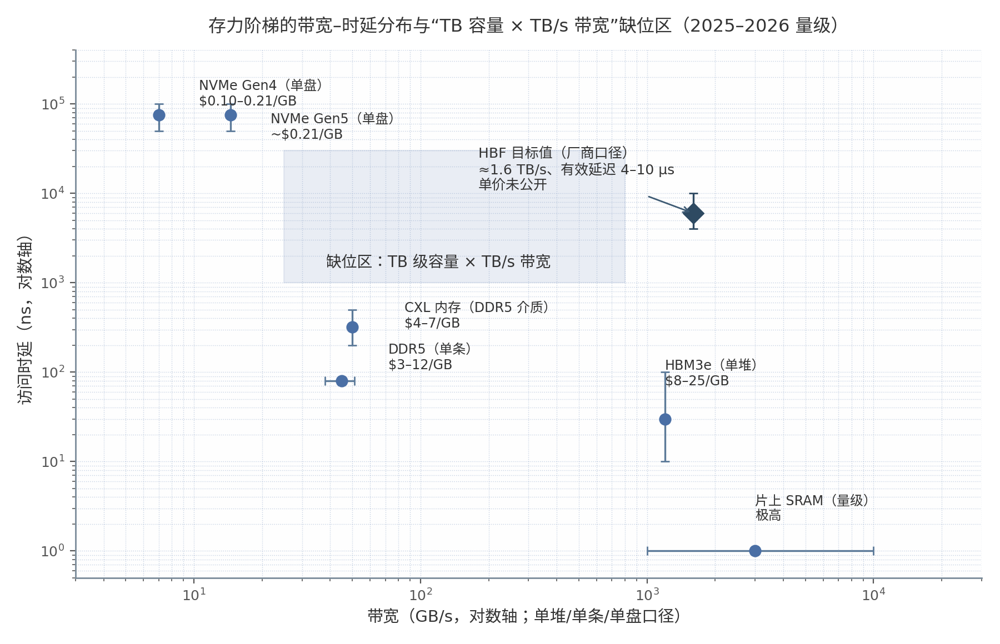

## 6. AI 系统搭建 Trade-off 与快照回放瓶颈识别（对应模型问题 7、8）

问题 7 问"如何搭建满足需求的 AI 系统、存力部分如何 trade off"，问题 8 问"如何通过快照回放识别系统瓶颈、存力监测哪些指标"。本章给出面向存储行业读者的可落地方法论：6.1 节把"从需求反推配置"公式化为可执行的六步流程；6.2 节分析存力取舍的核心杠杆与边际拐点；6.3 节梳理快照回放（snapshot/trace replay）的方法栈与瓶颈判定决策树；6.4 节给出存力监测指标清单。结论先行：推理系统设计已被公式化——以第 5 章表 5-1 的服务等级目标（Service Level Objective, SLO）八件套为输入，经"权重＋键值缓存（KV cache）显存公式 → roofline 分相 → SLO 反推并行 → 互联与存储分层"即可完成初配；存力 trade-off 的本质是在 SLO 约束下以容量换 batch 与命中率，且扩容存在边际收益拐点（超拐点后存储成本反超算力节省）[^822^]；回放方法栈（Chakra ET＋nsys＋trace 仿真）与内存带宽利用率（Memory Bandwidth Utilization, MBU）×流式多处理器（Streaming Multiprocessor, SM）双指标决策树已可工程化落地 [^824^][^834^]。

### 6.1 从需求反推系统配置

#### 6.1.1 权重+KV 公式与 roofline 分相：prefill compute-bound、decode memory-bound

反推流程的第一步是显存预算，其公式已经标准化：**权重显存＝参数量×每参数字节数**（BF16/FP16 为 2 B、FP8 为 1 B、INT4 为 0.5 B）[^801^][^803^]；**KV cache 每 token 占用＝2×层数×KV 头数×头维×字节数**，总量再乘上下文长度与并发数，随两者**线性**增长，是容量规划的中心变量 [^801^][^803^]；工程上另加激活与框架开销（约 5–10%）及碎片余量（10–15%）[^801^][^802^][^804^]。算例可直观显示 KV 的主导性：Llama-3.1-70B（80 层、8 KV 头、128 头维、BF16）每 token 约 0.31 MB（分组查询注意力（Grouped-Query Attention, GQA）较多头注意力（Multi-Head Attention, MHA）的 2.5 MB 省约 8 倍）[^801^][^803^]，单请求 128K 上下文的 KV cache 即约 40 GB，4 并发需 160 GB——超过单张 H200 的全部 141 GB 显存 [^801^][^804^]；对采用 MHA 的 LLaMA-7B，KV 占用超过权重本身的"交叉点"约在 26.7K token [^804^]。第二、三步是反推 GPU 型号与数量：总显存须不超过 GPU 显存×`gpu_memory_utilization`（生产常设 0.85–0.92）[^803^]；NVIDIA 内部范式为"LLaMA-70B、TP=4、4×H100、FP8 KV、`gpu_memory_utilization=0.92` → 约 60 并发 4K 请求"[^803^]，VMware 提供含分 GPU 首 token 时延（Time To First Token, TTFT）/TPOT/吞吐表的可执行计算器 [^802^]。

第四步由 roofline 分相决定并行策略：预填充（prefill）阶段算术强度高（≈batch×seq），越过拐点（A100 约 156 FLOP/B、H100 SXM 约 295 FLOP/B）后为计算受限（compute-bound）[^805^][^807^]；解码（decode）阶段算术强度≈batch size，常态为访存受限（memory-bound），瓶颈在读权重与读 KV [^805^][^806^]。分相的实测证据是：A100 上 4K token 后 prefill 的 HBM 带宽利用率不足 10%、16K 时不足 1%——prefill 几乎不碰 HBM 带宽 [^806^]。这决定了指标归因结构：**TTFT 由算力决定、TPOT 由 HBM 带宽决定**，存力取舍主要作用于 decode 相与 KV 搬运链路。SLO 反推并行的范式案例是 PD 分离：DistServe 实测 13B 模型单 A100 的 per-GPU goodput 仅 1.6 rps，拆成 2 prefill＋1 decode GPU 后整体达 10 rps（3.3 rps/GPU，2.1 倍），评测最高 7.4 倍 goodput 或 12.6 倍更严 SLO [^808^][^809^]。第五步以互联带宽约束并行上限：NVLink 4 为 900 GB/s（H100/H200）、NVLink 5 为 1.8 TB/s（B200）、PCIe Gen5 双向合计约 128 GB/s（单向约 64 GB/s），张量并行（Tensor Parallelism, TP）应尽量留在 NVLink 域内；跨节点 PD 传 KV 依赖 IB/RDMA，25 Gb 链路下 DistServe 的 KV 传输耗时占比仍低于 0.1% [^814^][^815^][^809^]。GPU 代际存力阶梯可作为选型锚点：H100 80 GB/3.35 TB/s → H200 141 GB/4.8 TB/s（同 die 的纯存力升级，Llama2-70B 推理提速 1.9 倍）→ B200 192 GB/8 TB/s → B300 288 GB——"显存加大"直接转化为更大 KV 池与更大 batch [^814^][^815^]。

#### 6.1.2 存力阶梯：HBM $8–25/GB·TB/s 级 → DRAM → NVMe $0.1–0.2/GB·GB/s 级

第六步是存储层级设计：高带宽内存（High Bandwidth Memory, HBM）承载热 KV 与权重，DRAM 承载温 KV，本地 NVMe/远端存储承载冷 KV 与模型权重，对应 SGLang HiCache 的 L1/L2/L3 与 NVIDIA Dynamo 的 G1–G4 分层，LMCache/Mooncake 提供跨层搬运与复用 [^823^][^838^][^847^]。各层级的 2025–2026 年量级为：HBM3e 约 1.2 TB/s/栈、时延约 10–100 ns、$8–25/GB（合约价估计、波动大）；DDR5 约 38–51 GB/s/条、约 80 ns、$3–12/GB（2026 年处涨价周期）；CXL 内存 200–500 ns、$4–7/GB；NVMe SSD Gen4 约 7 GB/s、Gen5 约 12–14.5 GB/s、时延约 50–100 µs、$0.10–0.21/GB [^810^][^811^][^812^][^813^]。阶梯的结构性缺口在于"HBM 有带宽没容量、SSD 有容量没带宽"——"TB 级容量×TB/s 级带宽"的层级目前不存在，这正是 HBF（High Bandwidth Flash）、CXL 内存池与 KV 分层存储共同瞄准的空位 [^810^][^811^]（图 6-1）。

图 6-1 以对数坐标呈现六个层级的带宽-时延分布（单堆/单条/单盘口径）：左上 NVMe 区域容量廉价但带宽不足 15 GB/s、时延高达 50–100 µs [^810^][^813^]；右下 HBM/SRAM 区域带宽达 TB/s 级但单价高两个数量级以上 [^810^][^811^]；中部阴影即"TB 容量×TB/s 带宽"缺位区，HBF 目标值（约 1.6 TB/s、有效延迟 4–10 µs，厂商口径，详见第 2 章）恰好落在其中。需要强调口径风险：HBM/DDR5 的 $/GB 均为分析师三角估计、无公开价格指数，存在约 ±2 倍不确定性 [^812^]。

对存储行业更有操作意义的是**单位带宽成本**的换算（由上述单价与带宽推算）：HBM3e 单堆 36–48 GB、1.2 TB/s、$8–25/GB，折合每 GB/s 带宽约 $0.24–1.0；而 15.36 TB 企业级 NVMe Gen5 盘约 $3,250、顺序读 14.5 GB/s，折合每 GB/s 约 $224 [^810^][^812^][^813^]——即 SSD 的容量单价便宜约 40–120 倍，但**带宽单价反而贵约 2–2.5 个数量级**。这一不对称是"读不如重算"拐点（见 1.2.3 节与 6.3.2 节）的经济学根源，也解释了为什么"把 KV 放到便宜介质"必须与预取、大块聚合 I/O、逐层流水等带宽补偿机制绑定设计。

### 6.2 存力 Trade-off 的核心权衡

#### 6.2.1 容量换 batch/命中率 vs 时延恶化；扩容边际收益递减（Kareto：超拐点存储成本反超算力节省）

容量扩容转化为吞吐的机理是 decode 的算术强度≈batch size：增大 batch 可摊薄每步对全部权重与 KV 的读取，吞吐近似线性上升直至 HBM 带宽饱和 [^805^]。代价同样线性：KV 占用随 batch 上涨挤占可服务并发，排队时延上升、TPOT 恶化——因此在 SLO 约束下目标函数必须是 goodput 而非裸吞吐 [^808^]。显存换 batch 的极限案例是 FlexGen：单张 T4（16 GB）offload 到 208 GB DRAM＋1.5 TB SSD 运行 OPT-175B，有效 batch 达 144–256、吞吐 1.12 token/s（压缩后），在相同 5,000 秒延迟预算下吞吐比 ZeRO-Inference 高逾 40 倍——但其定位明确为"以时延换吞吐"，仅适用于离线批处理等延迟不敏感场景 [^816^][^817^]。容量放在哪一层比放多少更关键：分层 offload 的时延代价高度不对称——DRAM 层的搬运可通过逐层流水隐藏在 attention 计算之后，而 SSD 层实测 GPU 气泡达 70–80%，逐层流水反而恶化至约 80% [^839^]。

成本侧的口径为"$/M tokens＝GPU 时租÷每小时 token 产出×10⁶"：实测范式为 H100 以 $6.88/GPU·h 时租、SGLang 离线引擎稳定吞吐 35,094 tok/s，折合 $0.054/M tokens [^819^]。三大降本杠杆按幅度排序：其一为**利用率**——同一 H100、同一模型，请求率从 1 rps 到饱和，每百万输出 token 成本从 $15.25 降至 $0.21（2.5–24 倍差距），而公开计算器普遍按 100% 利用率估算，恰好系统性低估真实成本 1/U 倍 [^818^]；其二为批大小——batch 1→64 吞吐 1,000→5,000 tok/s、成本 $3→$0.6/M tokens（5 倍），推荐 batch 32–128 [^820^]；其三为量化——FP8 对 MoE 模型吞吐提升 69–74%（dense 仅 31%），KV cache 量化至 FP8/INT8 减半占用、等效翻倍并发或上下文 [^818^][^801^]。

扩容边际收益递减已有系统级实证。阿里与浙大的 Kareto（arXiv 2603.08739）将 KV 分层配置建成多目标 Pareto 问题：决策变量为 DRAM 容量、磁盘 TTL 与介质档位（如 ESSD PL1/PL2/PL3），目标函数耦合命中率、有效 I/O 带宽与算力成本，因目标函数非解析、变量耦合，只能靠**历史 trace 回放仿真**逼近 Pareto 前沿 [^822^]。相对静态 1024 GB DRAM 基线，Kareto 实现吞吐＋9.3%（算力受限场景）、平均 TTFT −58.3%、总成本 −20.2%；其关键观察是"简单扩容并不总能带来性能收益——超过某点后，存储成本会超过节省的算力"，且算力充裕时扩容几乎无吞吐收益，部分 trace 的复用集中于少数前缀子树、反而应减配省钱 [^822^]。SGLang HiCache 官方文档独立确认同一规律："更大的 HiCache 容量带来更高命中率，但关系非线性——多数可复用 KV 被缓存后，继续扩容收益边际"[^823^]。由此得到存力 trade-off 的可操作答案：**以 SLO 约束下的 goodput×成本为目标函数，以容量、介质档位、TTL 为决策变量，用自身生产 trace 回放实测拐点位置**，而非按"越大越好"扩容；拐点由负载的复用结构（前缀集中度、复用间隔）决定，这正是 6.3 节快照回放方法论的用武之地。

### 6.3 快照回放识别瓶颈

#### 6.3.1 方法栈：Chakra ET、vLLM/SGLang+nsys、Vidur/DistServe trace 仿真

回放方法论分"采集 → 回放/仿真 → 归因"三层。采集层有四类工具：(a) 框架内 profiler——vLLM 以 `VLLM_TORCH_PROFILER_DIR`＋`/start_profile` API 动态抓取、SGLang 用 `--enable-torch-profiler`、TRT-LLM 用 `--profiling-verbosity detailed`，产出 Chrome/Perfetto trace 与请求级火焰图 [^825^][^826^][^827^]；(b) 全栈系统时间线——`nsys profile --trace-fork-before-exec=true --cuda-graph-trace=node`（vLLM 需配合 `VLLM_WORKER_MULTIPROC_METHOD=spawn`），可逐事件归因 CUDA kernel/memcpy/NCCL，是定位 GPU 气泡的主工具 [^825^][^826^]；(c) 算子图标准快照——Chakra execution trace（ET）为 MLCommons 标准，以 protobuf 图表达 compute/memory/comm 算子、数据与控制依赖、时序与资源约束，由 Meta/NVIDIA/AMD/HPE 等共建，是可移植、供仿真器消费的"快照"格式 [^824^]；(d) 指标时序——dcgm-exporter 导出至 Prometheus，配合 vLLM/SGLang 的 `--enable-metrics` [^832^][^833^][^836^]。回放层提供可复现负载：`vllm bench serve`（ShareGPT/random 数据集，可带 `--profile` 联动服务端抓取）、NVIDIA AIPerf 与 K8s 社区的 inference-perf（后者定义了 $/M tokens 标准计算式）[^821^][^825^][^831^]；公开生产 trace 数据集（Azure LLM inference trace、BurstGPT、Mooncake FAST'25 trace）提供真实到达时间与输入/输出长度分布，且负载呈明显日/周周期性 [^829^][^830^]。仿真层实现不烧 GPU 的 what-if 分析：微软 Vidur 用 ML 模型预测 kernel 时间，TTFT 预测误差 5–10%、吞吐误差 10–15% [^828^]；DistServe 模拟器以 trace 重采样复现 SLO 达成、误差≤2% [^808^]；Kareto 模拟器显式建模 KV 分层与 I/O stall [^822^]。利用负载周期性，可用上周同时段 trace 回放数百种（容量×策略×硬件）配置、输出 Pareto 前沿指导下一周期供给 [^822^][^828^][^829^]。最后以 MLPerf Inference 做交叉校验：其提供跨厂商可比的 tokens/s 基准与可复现提交，但只报结果不做 kernel 分解，需自建 roofline 分析补位 [^848^][^806^]。

#### 6.3.2 瓶颈判定决策树：MBU/SM 利用率区分 compute/memory/IO/network-bound

归因层的核心是一个可操作的判定流程：先固定可复现负载（固定并发与输入/输出长度），再以 DCGM 双指标分相判读，最后用 nsys 时间线确认证据链 [^825^][^834^]。关键 kernel 级锚点包括 decode 的 `paged_attention_v1_kernel` 与 TRT-LLM 的 `fmha_v2_flash_attn`——memory-bound 负载中时间线被 HBM 读/memcpy 占据而非计算 kernel [^834^][^827^]。缓存维度需做对照实验：SGLang 在不同命中率下 profile，radix cache 命中时 `radix_cache_decode` 近零耗时、未命中则出现完整 KV 重算序列，官方建议"在多个缓存命中率下 profile 以观察时延悬崖"[^827^]。判定规则汇总为表 6-1。

**表 6-1 瓶颈判定决策树（DCGM 双指标＋nsys 时间线）**

| 判定路径 | 观测量与阈值 | 瓶颈类别 | 首选处置 |
|---|---|---|---|
| MBU>80–90% 且 SM<60% | `DCGM_FI_PROF_DRAM_ACTIVE` 配对 `DCGM_FI_PROF_SM_ACTIVE`/`PIPE_TENSOR_ACTIVE` [^832^][^833^][^834^] | memory-bound（存力域） | 换大带宽 GPU、KV 量化、KV 分层下沉 [^834^] |
| SM>80% 且 MBU<60% | 同上双指标 [^834^] | compute-bound | 加 GPU/调 TP、算子融合与 kernel 优化 |
| 双指标均低＋时间线空隙 | nsys 上 memcpy/memset 与 kernel 间空隙占比（气泡率）；SSD 恢复 KV 时 70–80% 为实测上界 [^839^] | IO/网络/CPU-bound | 查 offload I/O 路径、NIC 带宽、tokenizer/调度开销 [^834^][^840^] |
| 双指标均低＋队列积压 | `vllm:num_requests_waiting` 持续>0、`gpu_cache_usage_perc` 趋近 1 [^836^] | 容量/调度瓶颈 | 扩 KV 池、提命中率、cache-aware 调度 |

表 6-1 的使用有两个要点。其一，阈值必须分相解读：prefill 本来就近乎不使用 HBM 带宽（A100 上 4K token 后 MBU<10% 是正常态而非异常信号）[^806^]，对全流程套同一阈值会把 prefill 误判为 IO-bound，因此 profile 应按 prefill/decode 分别抓取（vLLM/SGLang 的 NVTX 区间可直接区分两相）[^825^][^827^]。其二，四条路径中有两条落在存力域（memory-bound 与 IO-bound），对存储团队而言，瓶颈判定过程本身就是存储选型（档位、带宽、I/O 路径）的验证闭环。此外，本报告跨维度洞察 6（见第 8 章）指出：第 1 章冲突区 C2 中 Tutti（GPU 气泡>70%）与 IBM Storage Scale（130K 提示 TTFT 加速 56 倍、吞吐 22 倍）的相反实测，根源在 I/O 粒度与预取/流水机制差异 [^839^][^831^]，此类争议可被回放实验直接裁决——仿真保真的关键不在介质模型，而在 I/O 路径建模（GDS/CPU 拷贝路径、队列深度、对象粒度）。

### 6.4 存力监测指标清单

#### 6.4.1 HBM 带宽利用率、KV 命中率/占用率、offload 流量与时延、GPU 气泡、SSD IOPS/带宽（指标表）

承接 6.3 的归因流程，表 6-2 按层级列出生产环境应持续采集的指标、采集工具与经验阈值；其中 HBM 带宽/容量、KV 占用与命中率、offload 流量、GPU 气泡、SSD 与链路指标为存力直接相关项。

**表 6-2 存力监测指标清单（指标—工具—解读/阈值）**

| 层级 | 指标 | 工具/来源 | 解读与经验阈值 |
|---|---|---|---|
| HBM 带宽 | MBU（`DCGM_FI_PROF_DRAM_ACTIVE`） | dcgm-exporter→Prometheus | 持续>80–90% ＝memory-bound；须与 `PIPE_TENSOR_ACTIVE` 配对分类 [^832^][^833^][^834^] |
| HBM 容量 | `DCGM_FI_DEV_FB_USED/FREE` | DCGM | 推理副本 free<4 GB 告警；预留 5–10% 头部空间 [^832^][^836^] |
| 算力 | `DCGM_FI_PROF_SM_ACTIVE`、`PIPE_TENSOR_ACTIVE` | DCGM | Tensor<30% 提示算子未走 Tensor Core（如 fp16 算子跑 fp32）[^832^][^833^] |
| KV cache 占用 | `vllm:gpu_cache_usage_perc` | vLLM metrics | >95% 触发 preemption；趋近 1＝并发上限被打满 [^836^] |
| Prefix 命中率 | vLLM≥0.3.0 起分层报告 GPU/CPU 命中率；SGLang 口径 `cached_tokens/prompt_len` | vLLM/SGLang 日志＋metrics | 命中率下降＝容量不足或复用性差；agentic 负载应>95% [^835^][^841^] |
| 分层命中 | HiCache L1/L2/L3 hit、L3 预取 I/O 时间、L2 DMA 时间 | SGLang（issue #28047 提案）；LMCache 指标族 | TTFT 分解＝queue＋schedule＋forward；L3 I/O 高＝存储层瓶颈 [^837^][^838^] |
| Offload 流量 | KV 搬运字节数/耗时；cache-compute 比（GB/PFLOP） | LMCache/Dynamo/NIXL 传输指标；自算 | agentic 参考值约 22 GB/PFLOP（DeepSeek-V3.2）；比值越高越吃存储带宽 [^838^][^840^] |
| GPU 气泡 | 时间线空隙占比（bubble ratio）、IO stall 时长 | nsys；Kareto 仿真 | SSD 恢复 KV 时 70–80% 为实测上界；DRAM 层应被逐层流水隐藏 [^839^][^822^] |
| PCIe | `DCGM_FI_PROF_PCIE_TX/RX_BYTES`、`PCIE_REPLAY_COUNTER` | DCGM | 对比 Gen5 x16 双向合计上限约 128 GB/s（单向约 64 GB/s）；offload 走 PCIe 时是第一嫌疑 [^833^][^814^] |
| NVLink | `DCGM_FI_PROF_NVLINK_TX/RX_BYTES` | DCGM | 单向应<900 GB/s（NVLink 4）/1.8 TB/s（NVLink 5）；骤降提示链路故障 [^833^][^832^] |
| SSD | 顺序读/写带宽、IOPS、时延；GDS 传输量 | iostat、阵列/盘厂计数器 | 参考：Gen5 企业盘约 14.5 GB/s 读；实测双盘聚合读 29 GB/s、写 12 GB/s [^813^][^839^] |
| 网络 | NIC 带宽利用率、RDMA 时延 | 交换机/DCGM/Perftest | agentic 场景单存储 NIC 是 KV 加载瓶颈 [^840^] |
| 引擎队列 | `vllm:num_requests_running/waiting`、TTFT/TPOT 直方图 | vLLM metrics | waiting 持续>0＝容量不足；TTFT p95>1.5×SLO 告警 [^836^] |
| 健康 | 温度（die>83°C、HBM>95°C）、ECC、XID、降频时长 | DCGM/nvidia-smi | HBM 高温与降频直接压低有效带宽 [^832^] |

表 6-2 的落地使用遵循"先分相、再下钻"的顺序：先以 MBU×SM 完成 6.3.2 的四分类，再在存力域内沿"KV 占用→命中率→offload 流量与气泡→链路（PCIe/NVLink/SSD）"逐层下钻——例如 MBU 高而 KV 命中率低，指向容量不足；命中率正常而气泡率高，指向 I/O 路径（粒度、队列深度、GDS 与否）而非介质本身 [^834^][^839^]。两个口径警告不可省略：其一，vLLM 与 SGLang 的命中率口径不同（仅 GPU 层 vs `cached_tokens/prompt_len` 跨层口径），跨系统比较前必须先对齐 [^835^][^837^]；其二，社区监测仍碎片化——SGLang issue #28047 明确指出缺 per-request 的 TTFT 分解与 HiCache 分层命中指标（"HiCache tier performance is invisible"），L2 DMA 与 L3 预取 I/O 时间需自建埋点 [^837^]。另外，host 侧 page cache 命中率在推理文献中极少作为 KPI——主流引擎以 GDS/O_DIRECT 或自管缓冲绕过 page cache，故仅建议作为文件后端 KV 存储场景的低置信度补充指标 [^844^]。对存储团队而言，清单中的主责域是五行：SSD IOPS/带宽、offload 流量与时延、GPU 气泡、PCIe/NVLink 链路、分层命中——它们分别对应 6.2 节 trade-off 的介质选型、I/O 路径工程与容量拐点三个决策变量。

综合判定：问题 7 的预设**成立且可落地**——系统搭建已被公式化为"SLO 输入→显存公式→roofline 分相→并行与互联→存储分层"的六步流程，存力 trade-off 可在 goodput×成本目标函数下定量求解；需修正的常见预期是"容量越大越好"——Kareto 证明超过拐点后存储成本反超算力节省，且 SSD 层的收益强依赖 I/O 路径工程（冲突区 C2 的条件性结论）[^822^][^839^][^831^]。问题 8 的预设**成立**——快照回放已形成"采集（Chakra ET/nsys/profiler）→回放（bench 工具＋生产 trace）→仿真（Vidur/DistServe/Kareto）→归因（MBU×SM 决策树）"的完整方法栈，瓶颈识别可操作、可复现 [^824^][^828^][^834^]；其边界为仿真保真度（Vidur 的 TTFT 误差 5–10%）与监测口径碎片化，前者要求关键决策以实机 profile 复核，后者要求跨系统比较前先对齐指标口径 [^828^][^837^]。
