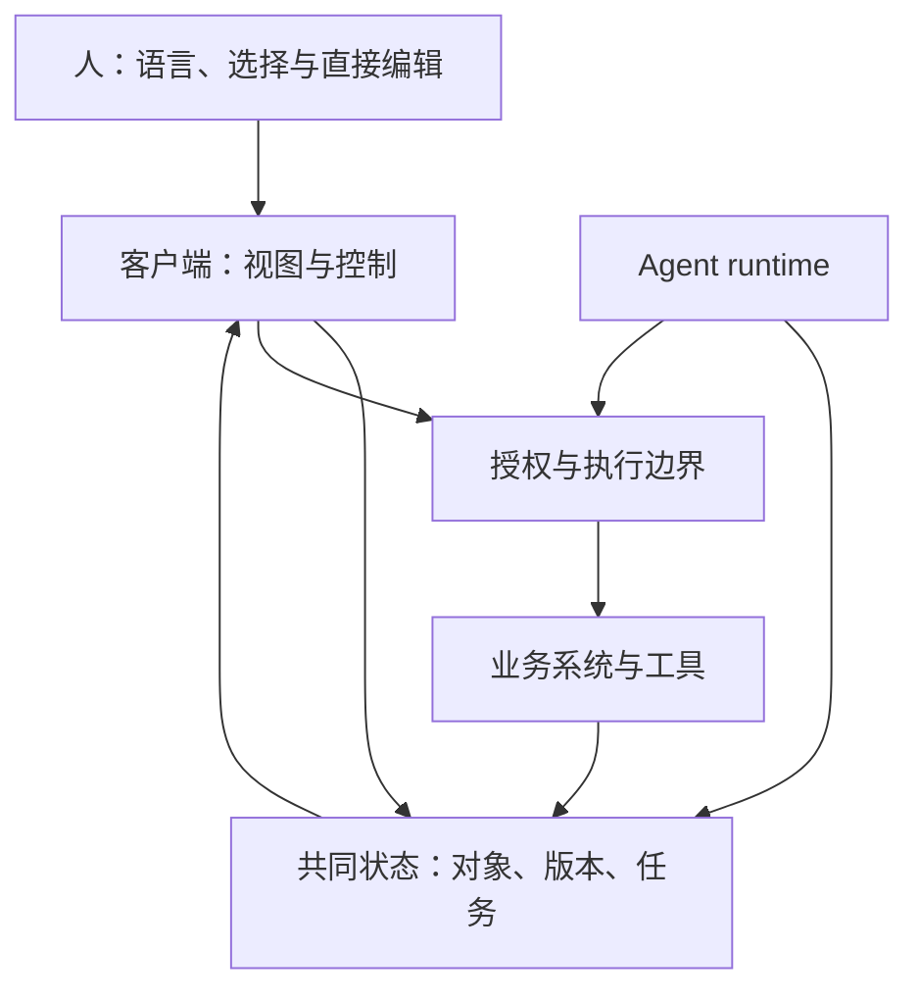

# 综合头脑风暴：AI native UI 可能如何生长

日期：2026-10-02。以下以假设和实验为主，不是产品路线结论。历史事实与协议范围见前五篇。

## 1. 先修正一个容易产生的线性故事

“终端 → GUI → Web → 移动 → 对话”是方便讲述的顺序，但并不描述真实替代关系。终端在专业场景继续强大，移动应用也依赖 Web 和桌面后台。新媒介常常增加一种工作方式，而不是清空上一代。

因此可以同时保留三种解释：AI 带来新入口；AI 改写应用内部操作；AI 形成新的任务组织层。三者可能共存，也可能在不同领域各自占主导。

## 2. 历史对比：什么变了，什么留下来

| 阶段 | 扩大的技术能力 | 重要交互对象 | UI 承担的工作 | 可借用的 Agent 设计问题 |
|---|---|---|---|---|
| 终端 | 可编程和可组合执行 | 命令、流、文件 | 精确表达与反馈 | 意图怎样编译成可复现操作？ |
| PC GUI | 位图、鼠标、本地文档 | 窗口、选区、对象 | 状态可见与直接编辑 | 人和 Agent 如何指向同一对象？ |
| Web/SaaS | 网络寻址和共享状态 | 页面、链接、服务记录 | 导航、协作、事务 | 工作能否跨应用引用与接续？ |
| 移动 | 触控、传感、随身设备 | 卡片、现场信息、通知 | 情境输入与注意力管理 | Agent 应何时打断人？ |
| LLM/Agent | 语言解释、工具选择、迭代执行 | 目标、任务、产物、决策 | 协商、监督和结果判断 | 委托边界如何可见、可改？ |

最后一行是候选分析框架，不是已经成立的时代范式。

一个推导方向是：过去 UI 多帮助用户把目标拆成操作；未来 UI 可能更多帮助用户把目标转成约束，并判断执行结果。但在审美、精密工程和探索分析中，人仍可能愿意控制过程本身。

## 3. 语言是否会成为统一接口

先拆成三层问题：能否用语言找到能力？能否用语言可靠指定动作？能否用语言高效检查结果？第一项成立不代表后两项成立。

语言有弹性，适合不熟悉功能的人；但有歧义，也可能隐藏系统不支持的边界。用户不是总能描述自己的需求，有时必须先看到选项才知道想要什么。GUI 的“识别”仍有价值。

一种可试的交互是：语言提出方向，系统把理解转为可修改对象，用户通过点击、选择、拖动或短语修改。语言与图形界面交换控制权，而非争夺唯一入口。

### 与语言相容，不必全部聊天化

一个应用可以通过清晰动作名称、参数语义、自然语言帮助、结构化错误和可解释产物来适配语言，而无需常驻聊天窗口。进一步，它可以把“当前选区”“当前筛选”作为可引用上下文，减少冗长描述。

相反，如果只加聊天入口却没有稳定操作模型，用户可能获得更流畅的解释，却无法可靠完成任务。

## 4. 五种可能的应用形态

| 形态 | 何时有吸引力 | 可能失败的原因 |
|---|---|---|
| 原应用 + 局部助手 | 用户已有专业习惯，对象明确 | 助手理解不到完整业务上下文 |
| 对话 + 产物工作区 | 生成、整理、反复修订 | 状态仍藏在聊天里，产物不同步 |
| 任务工作台 | 多步、长时、可验收工作 | 管理负担比执行负担更高 |
| 决策收件箱 | 多后台任务，仅少量节点需人判断 | 通知过载，摘要不足以做决定 |
| 跨应用意图入口 | 工作经常穿过多个系统 | 身份、接口和商业开放性不足 |

不要过早选“万能 Agent 桌面”。可以让同一任务在不同入口中呈现：现场采集用手机，修改用专业应用，监督用工作台。

## 5. AI native 的一个工作定义

为本次讨论，可以将 AI native 理解为：产品的任务、状态和协作模型允许概率性能力参与工作，同时给人保留判断与控制位置。它比“所有界面由模型生成”更宽，也并不要求取消传统 UI。

这个定义也可能太宽。反向检验：如果移除模型，应用只是效率降低，还是核心工作模式无法成立？答案可帮助区分 AI 增强与 AI 原生，但不构成价值高低排名。

## 6. 候选设计模式：逐个讨论，而非一次装满

### 6.1 意图启动，结构收敛

用户说“做一个部门使用分析”。系统展示可编辑的时间范围、部门、成功口径和交付形式，并允许先用默认值探索。未知问题先开放，确定字段后用结构化界面收敛。

适用：需求有一定模糊度，后续步骤昂贵。反例：一个简单改名操作被迫填写需求表。可观察指标：澄清轮数、用户修正理解的比例、返工率与启动耗时。

### 6.2 指向对象，再说变化

用户选择表格几行、文档一段或图像区域，然后描述变化。提交时把对象与版本绑定成可见引用。

适用：局部操作与多模态协作。失败：用户以为只作用选区，Agent 却读取或修改全部对象。需显示作用范围；跨对象扩展必须能被察觉。

### 6.3 聊天用于协商，产物用于工作

讨论线索留在对话，报告、代码、表格在持久工作区中编辑。用户直接修改产物后，Agent 得到变更事件与新版本引用。

适用：多轮迭代。失败：聊天说“已修改”，产物却未变；或者 Agent 用旧版本覆盖人工修改。最低要求是有可靠版本与提交记录。

### 6.4 提案与差异优先

Agent 先产生可以检查的变化。用户可修改、部分接受、拒绝或提出约束。需要提交的外部效果由真实执行通道完成。

适用：变更范围有限、可预览。失败：用户需要逐项审查几千处变化。可以按业务含义聚合，同时保留展开和抽查；不能用摘要替代全部证据。

### 6.5 决策收件箱

将长期任务中真正需要人参与的问题集中：缺数据、相互冲突的口径、无法安全自动完成的动作。每项显示上下文、可选方案、影响与时效。

适用：多人或多任务异步工作。失败：所有错误都升级给用户；系统借“确认”转嫁理解责任。可测每任务决策数、无效打断率和决定后的返工。

### 6.6 授权作为可编辑工作对象

用户可看见“这个任务可以读哪些资料、修改哪些对象、是否能对外提交、有效多久”。收紧或撤销授权影响后续执行，由 runtime 强制实施。

适用：跨系统、长时与高影响工作。失败：UI 声称已撤销，但已排队动作继续提交。要区分新动作禁止、在途取消、已提交效果和补偿。

### 6.7 动态界面，稳定骨架

导航、返回、撤销、授权与对象身份保持稳定；模型按任务选择表格、表单或图表。它可以重组局部区域，但不随意移动用户正操作的控件。

适用：不同任务需要不同表达。失败：界面漂移、缺失可访问性、无法复现。可尝试先选择模板，再生成内容，最后才开放自由布局。

### 6.8 从一次工作到复用动作

成功任务可沉淀为个人动作、团队模板或 Skill。用户看见输入、输出、使用前提和示例。发布后的动作应锁定版本，可调整参数。

适用：重复且价值明确的任务。失败：一次偶然成功被当成普适能力。应先区分仅收藏、可重复执行、经过验证、适合共享等状态。

### 6.9 证据随对象组织

结论旁附来源和验证结果；用户点选争议句可以要求重新核查。证据以来源对象和版本绑定，避免只留一段“已验证”的模型文字。

适用：分析和企业决策。失败：引用存在但不支持结论。可以让证据状态表达“找到来源”“核查支持”“规则检验通过”，避免混成一个绿勾。

### 6.10 用户接管后可交回

用户编辑参数、修正文件、在专业工具完成一步，随后将任务交回 Agent。系统明确哪些状态发生变化，哪些产物需要重算。

适用：自动化覆盖不完整的真实环境。失败：人工接管造成隐藏状态，Agent 从旧计划继续。接管和交回需要状态同步，不能仅有“继续”按钮。

## 7. 一套候选结构：共同状态，多种视图

下面是设计草案，不要求引入所有协议，也不预设必须多 Agent。

这里最需要独立保证的是：状态真实、权限执行有效、对象可追溯。UI 可以用语言解释这些事实，但不负责凭空制造事实。Agent 与人可以拥有不同视图，但同一业务修改应经由同一权限和校验边界。

## 8. Agent 的按需加载能否成为 UI 的按需展开

存在一个有趣但有限的类比：模型不必一次加载所有技能，人也不必一次看见所有控制。

可以探索三层：先展示任务相关能力和当前状态；再按需展开来源、规则、参数；最后进入专业细节与审计轨迹。二者共享相关性线索，但加载策略不能完全等同。对模型重要的限制可能对用户没必要常驻；对用户重要的未授权效果则必须显眼。

风险：渐进展开可能隐藏必要条件，模型的检索也可能漏掉规则。权限与必需校验不能依赖“模型是否恰好加载说明”。UI 的简洁应建立在运行系统约束上。

## 9. “文件、目录、Skill、Agent”如何表现给不同用户

结合你关注的企业平台，可以让底层复用资产保持明确结构，而让业务用户围绕工作对象操作。

| 底层对象 | 开发者视图 | 业务用户可见的候选表达 |
|---|---|---|
| Skill 与引用资料 | 目录、版本、调用步骤 | 可用方法、适用条件、示例 |
| Agent 配置 | 职责、工具与权限 | 承接什么工作、何时需人判断 |
| Session / run | 日志、模型与调用轨迹 | 一次任务的状态和结果 |
| 输入文件 | 路径、指纹、读取事件 | 已采用资料、版本和来源 |
| 产物 | 文件、diff、验证记录 | 可编辑交付物与验收状态 |
| 权限策略 | allow/ask/deny、沙盒规则 | 可做事项与影响范围 |

不是所有用户都需要知道 primary/subagent。多 Agent 可以提供能力和上下文隔离，但业务界面可以显示“独立复核已完成/未完成”，并提供证据；不能仅靠多个角色头像让用户以为结果更可信。

## 10. 三个企业场景的开放推导

### 场景 A：工艺数据分析

现状候选：用户发文件并聊天描述需求。另一种形态：先建立数据对象卡片和口径，再产生可过滤异常表；点选异常让 Agent 展开来源、假设与下一步检查。

值得追问：最终决策需要模型解释，还是需要便捷比较证据？异常判定是否应优先由规则或已有算法完成？模型只做解释和调度可能反而更可靠。

### 场景 B：内部技能资产管理

现状候选：目录或列表按名称搜索。另一种形态：按任务需求找到适用能力，显示版本、复用情况、已验证范围和已知失败，允许试运行后收藏。

值得追问：用户希望挑选 Skill，还是希望平台自动选但允许查看依据？自动推荐会不会偏向高频资产，压制新资产？评价数据是否足以区分好用和容易被发现？

### 场景 C：会话诊断与评测

现状候选：Dashboard 罗列调用统计。另一种形态：筛出问题任务，给出证据定位和候选归因，人工修正标签，再进入对照实验。

值得追问：AI UI 是否应该主动提出修复，还是先帮助看清证据？生成修复和验收应保持独立上下文，界面也应区分候选解释与验证结果。一个成功标签无法替代分维度检查。

## 11. 未来路径：保留互相竞争的假设

| 假设 | 成立需要什么 | 可以观察到什么 | 会被什么削弱 |
|---|---|---|---|
| 应用逐渐拥有语义操作层 | 改造收益足够、业务接口成熟 | Agent 调用核心任务更少依赖截图 | 平台不开放、长尾改造昂贵 |
| 对话成为通用启动入口 | 意图理解与能力发现可靠 | 用户减少寻找菜单的时间 | 熟练任务语言输入更慢 |
| 任务与产物成为重要导航对象 | 长任务增多、状态可恢复 | 用户从任务页回到工作，而非找聊天 | 多数任务只需瞬时操作 |
| UI 更动态、更个性化 | 组件可控、状态与习惯稳定 | 内容和字段适配，核心控制稳定 | 布局变化破坏熟练度 |
| 专业 GUI 长期保留 | 高精度与判断价值持续 | AI 承担批量操作，人做局部编辑 | 目标表达和结果验证大幅简化 |
| 一个 Agent 跨多个应用 | 身份授权、接口和商业合作成熟 | 跨应用任务在统一入口完成 | 集成风险、平台锁定与数据限制 |
| Agent 降低总认知负担 | 执行可靠、审查可抽样 | 完成时间和返工同时下降 | 审查成本超过操作节省 |

这些可以同时部分成立。尤其“更多自动化”和“更多人审查”可能并存，不能把减少点击次数等同于提高效率。

## 12. 更远一点的脑洞

**个人工作环境由目标临时组装。** 用户打开的不是固定应用首页，而是当前任务所需的资料、工具与产物。但临时环境如果没有稳定入口，会增加迷失感。

**界面成为双方共同维护的外部记忆。** 人和 Agent 在同一板面标记已知、未知、已确认和已失效。它能减少重复解释，但过时状态需要主动更新。

**工作可以在交互形态间迁移。** 一项流程先以对话探索，再变为表单，最后固化为自动任务。重新遇到例外时又回到开放对话。这比永久聊天化更像能力成熟的过程。

**Agent 之间交换产物，人只处理价值冲突。** 技术性步骤后台完成，人决定质量、成本、时效的取舍。前提是冲突能被正确识别，否则人只看到了系统选择展示的一部分现实。

**应用可能变成可组合的专业能力。** 分析、绘图、排版、审批提供接口和界面片段，任务入口组装它们。但账号、商业模式和用户信任可能使这种组合保持局部。

**AI UI 可能需要“不确定性控件”。** 例如用可修改假设列表、未验证区域和证据状态表达不确定性。直接展示模型自报的 87% 信心容易产生伪精确，未经校准的数字不宜作为可靠决策依据。

这些想法值得画原型，但都没有足够依据成为长期预测。

## 13. 从开放判断转成小实验

对你的平台，优先试三种小改动，不必先重建整个前端：

1. **资料范围与对象引用**：把本次采用的文件、版本、选区显示为可编辑卡片。比较背景重复说明、误读对象和返工率。
2. **聊天 + 产物 + 差异**：同一任务给产物独立区域，显示候选修改和实际提交状态。比较找结果时间、人工修正与覆盖冲突。
3. **待决策事项**：只把确需用户判断的阻塞放入收件箱。比较打断次数、解决时间和误确认。

设置同一类任务的基线：现有 UI、加入语言入口、加入混合交互。尽量保持模型与工具一致，避免把模型提升误归因于 UI。简单任务、熟练重复任务和复杂探索任务分别比较。

核心指标可以是：目标达成率、总完成时间、返工、错误外部效果、用户接管成本、模型/工具成本和用户理解程度。满意度有价值，但流畅文字可能让用户高估完成质量。

不必一次建立庞大实验体系。先选十余个真实任务做形成性观察，记录哪里必须看图、哪里适合语言、哪里需要结构化确认，再决定是否做更大对照。

## 14. 暂时保留的判断

相对更有支撑的方向：语言入口与专业控件并存；共享对象和版本的重要性上升；长期任务需要真实状态和可干预控制；适配 Agent 的语义接口有独立价值。这些仍是工程判断，不是市场确定性预测。

更不确定的方向：所有应用都成为聊天插件；所有 UI 都动态生成；一个个人 Agent 取代全部应用；多 Agent 的组织结构必须展示给用户。它们可以作为设计分支，不能作为默认终点。

下一轮头脑风暴可以集中在一个问题：当 Agent 已经能承担大部分操作时，人最需要留在界面中的究竟是编辑器、仪表盘、决策台，还是可共同维护的工作对象？不同任务可能给出不同答案。
