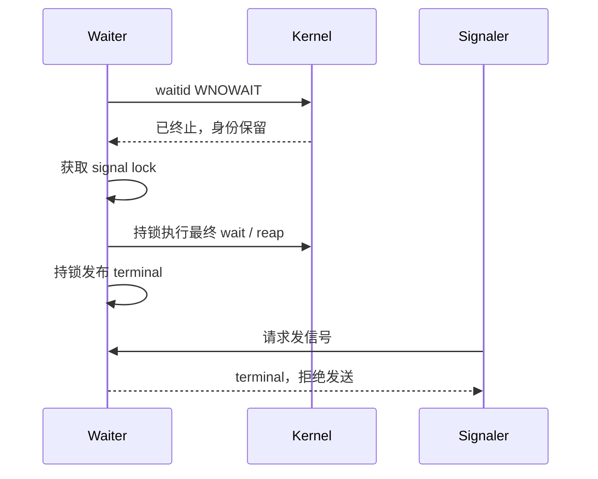
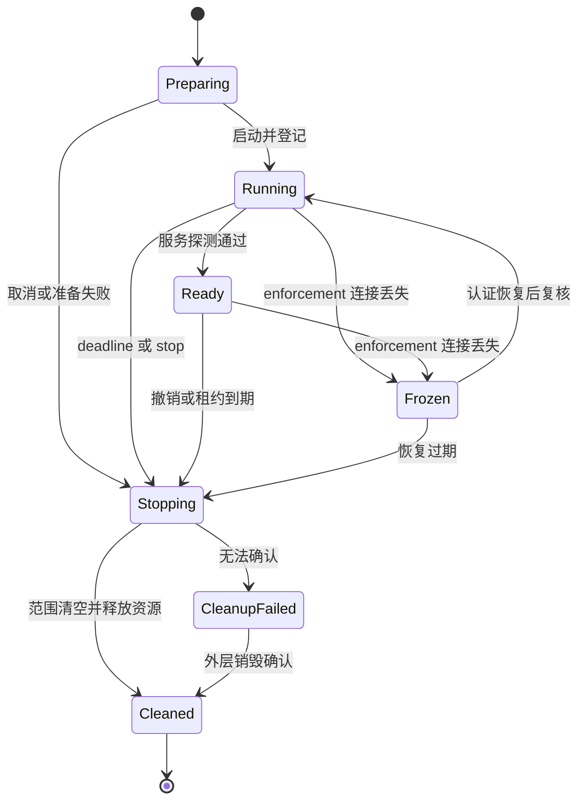

# Agent 沙盒的进程生命周期与风险控制：OpenShell、DeepSeek Harness 与 Sandbox Runtime 源码分析

> 核验日期：2026-10-02。本文围绕进程启动、等待、取消、后台运行、长期服务、输出收集和边界销毁展开。源码固定到下表 commit；“源码事实”“分析”和“建议”分别表达已观察的实现、基于实现的推论和推荐设计。摘录中的注释属于原仓库，正文解释属于本文。

## 1. 结论与阅读范围

Agent runtime 的进程安全，核心是**可验证的所有权与生命周期**：谁允许启动，谁持续跟踪，谁能停止，停止覆盖哪些后代，什么时候能够证明资源已经释放。限制文件写入只是其中一个维度。

三种方案分别强调不同层级：

| 实现 | 本文核验的进程设计重点 | 最容易误解的地方 |
|---|---|---|
| DeepSeek Harness，简称 DSH | Bash 调用与 Job 注册表衔接；subprocess owner；Linux systemd scope；独立的直接结果与进程范围退出观察；PTY 状态机 | 等待超时可能转后台；bwrap 的文件策略不等于完整资源隔离；fallback 的进程树回收较弱 |
| NVIDIA OpenShell | 持续保留的 boundary；独立 agent/exec/loopback 接口；受管子进程与 orphan reaper；控制连接丢失时冻结和终止 | 主 agent 进程结束不代表 boundary 销毁；接口契约与某个后端的清理证据强度需要分别评估 |
| Anthropic Sandbox Runtime，简称 SRT | 命令包装、Linux bwrap、网络代理桥、辅助进程和挂载点清理 | 命令沙盒包装层没有自动提供完整的长期服务编排、租约与健康检查 |

这里分析的是公开仓库中的具体机制，不把它们当作“完整防逃逸证明”，也不从某段代码缺少配置推断整个产品没有该能力。容器、VM、外层调度器和部署参数可能提供额外约束，需另行核验。

| 仓库 | 固定版本 | 核心源码入口 |
|---|---|---|
| [deepseek-ai/deepseek-harness](https://github.com/deepseek-ai/deepseek-harness) | `639ed015397290b3745d163aafe02ffee4aa3f84` | `tool-bash`、`bash-local`、`subprocess-local`、`terminal-bash`、`sandbox-local` |
| [NVIDIA/OpenShell](https://github.com/NVIDIA/OpenShell) | `8719fc9f37a93dd96435cf6753ae53c8ee8809e6` | isolation interface、delegated、boundary exec/io/server、managed children、main session |
| [anthropics/sandbox-runtime](https://github.com/anthropics/sandbox-runtime) | `117eb928202b53c80d3cb6527d88d1b90e4ca7a9` | `linux-sandbox-utils.ts`、`sandbox-manager.ts` |

OpenShell 文档入口：[官方文档](https://docs.nvidia.cn/openshell/index.html)。本文件中的具体代码结论以固定版本的源码为依据，避免文档和移动分支发生版本漂移。

## 2. 必须区分的四种对象与三个“结束”

### 2.1 四种运行对象

| 对象 | 常见例子 | 正常结束条件 | 所有者与推荐约束 |
|---|---|---|---|
| 短任务 | 搜索、编译、测试、一次性 Python 脚本 | 主命令退出，输出完成有限排空 | 调用级 owner；执行截止时间；取消传播；后代回收 |
| 后台 Job | 较长构建、批处理、数据处理 | Job 达终态，结果可查询，范围最终清空 | Job owner；数量上限；明确的运行截止时间或租约；输出游标 |
| 长期 server | 开发预览、HTTP 服务、推理服务 | 显式停止、租约到期、健康失败、环境销毁 | Service owner；启动就绪检查；暴露策略；持续资源配额 |
| 沙盒环境 / boundary | 容器、VM、隔离的工作环境 | 后端确认终止，或外层环境销毁得到确认 | Environment owner；包含所有 exec、服务、转发和辅助进程 |

“脚本”不一定是短任务，“server”也不等于必须永远运行。关键是选择生命周期契约，不能依赖模型对命令名称的判断。

### 2.2 三个独立的终点

1. **结果终点**：直接子进程退出，`exitCode` 和输出摘要可返回。
2. **静止终点**：受管范围内没有继续运行的工作负载；不会再产生写入、网络请求或 CPU 消耗。
3. **环境终点**：boundary、挂载、代理、端口暴露、临时文件等资源释放或转交给另一个受信任 owner。

例如 `bash -c 'python worker.py & exit 0'` 可以先得到退出码 0，但 worker 仍在运行，并可能继承 stdout。相反，用户取消一次 `wait` 只结束观察，并不天然结束进程。

推荐在结果中分别表达 `execution_state`、`cleanup_state`、`output_state` 和 `service_state`。不能用一个 `success: true` 同时代表业务成功、全部后代退出和环境已销毁。

## 3. DSH：Bash 调用、超时与 Job 所有权

### 3.1 `onExpiry` 控制的是执行截止语义

**源码事实。** `bash-local` 区分 `kill` 与 `none`。前者合并本地 deadline 和上游取消，并区分本地超时与外部 abort；后者不设置执行 deadline，依靠显式 kill 或上游 signal 停止。准备阶段也参与取消：先检查 abort，异步准备与取消竞争，准备后再次检查。

源码：[packages/shell/bash-local/src/index.ts，L205–L238](https://github.com/deepseek-ai/deepseek-harness/blob/639ed015397290b3745d163aafe02ffee4aa3f84/packages/shell/bash-local/src/index.ts#L205-L238)。以下为原文节选，未改写。

```typescript
  ): Promise<ShellExecution> {
    // Deadline wiring by expiry policy. Each arm supplies the spawn signal,
    // the result projection's first-cause classification, and the disarm the
    // settlement continuation runs. `ShellExpiryPolicy` has exactly these two
    // members, so the `else` arm is `'none'`.
    let spawnSignal: AbortSignal | undefined
    let classify: () => { timedOut: boolean; aborted: boolean }
    let disarm = (): void => {}
    if (spec.onExpiry === 'kill') {
      // One fused deadline combines timeout and upstream cancellation; only
      // this executor's timeout reason counts as timedOut, outer deadlines as aborts.
      const d = deadline(spec.signal, spec.timeoutMs, 'BASH_TIMEOUT')
      spawnSignal = d.signal
      classify = () => {
        const timedOut = timeoutOf(d.signal, 'BASH_TIMEOUT') !== undefined
        return { timedOut, aborted: d.signal.aborted && !timedOut }
      }
      disarm = () => { d[Symbol.dispose]() }
    } else {
      // No deadline: callers stop the process through kill() or spec.signal.
      spawnSignal = spec.signal
      classify = () => ({ timedOut: false, aborted: spec.signal?.aborted === true })
    }

    let argv: readonly string[] = []
    let preparationTimedOut = false
    if (typeof argvOrPrepare === 'function') {
      const signal = spawnSignal ?? new AbortController().signal
      const cancelled = Promise.withResolvers<never>()
      const abort = (): void => { cancelled.reject(signal.reason) }
      signal.addEventListener('abort', abort, { once: true })
      try {
        argv = await Promise.race([
          Promise.resolve().then(() => { signal.throwIfAborted(); return argvOrPrepare(signal) }),
```

**分析。** 把取消接入准备阶段，是为了处理“模型已取消，但环境准备稍后结束并启动命令”的竞态。`Promise.race` 本身不等于取消另一项异步工作，因此真正的准备函数还需响应 signal，且最终 spawn 前要再次检查。第一原因分类也有价值：用户取消和执行超时应给模型不同结果，避免它错误地认为任务只是慢。

### 3.2 前台等待超时可以变成后台 Job

**源码事实。** `tool-bash` 配置支持后台运行，`promoteOnTimeout` 默认开启，并受后台功能可用性约束。具备 Job registry 且允许 promotion 时，前台任务从开始就被注册；超时后返回同一个 Job id，而非临时发现进程仍存活后才补登记。显式后台调用使用 `onExpiry: 'none'`。没有 registry、禁用功能或注册被拒绝时，则回落到带 kill deadline 的前台执行。

源码：[packages/shell/tool-bash/src/index.ts，L499–L530](https://github.com/deepseek-ai/deepseek-harness/blob/639ed015397290b3745d163aafe02ffee4aa3f84/packages/shell/tool-bash/src/index.ts#L499-L530)。以下为原文节选，未改写。

```typescript
        if (args.run_in_background === true) {
          // Undeclared keys are allowed, so schema omission also needs enforcement.
          if (!backgroundEnabled) {
            throw new Error('run_in_background is disabled for this deployment (enableRunInBackground: false)')
          }
          if (jobs === undefined) {
            throw new Error('background jobs unavailable: load @deepseek-ai/dsh-jobs and @deepseek-ai/dsh-tool-jobs')
          }
          // The caller owns cancellation until ctx.jobs commits detached ownership.
          if (exec.signal.aborted) throw toolAborted()
          return { kind: 'background' as const, jobId: startJob(jobs, args, exec, ctx.shell.resolve({ ...request, onExpiry: 'none' })).id }
        }
        // A foreground call is a job the tool waits on, so the command is
        // visible and killable from the moment it starts and outlives the wait
        // when the timeout passes. Admission refused at the start (the owner's
        // job limit, no controller) runs the command under the deadline kill
        // instead, exactly as a composition without a registry does.
        if (jobs !== undefined && promote) {
          const spec = ctx.shell.resolve({ ...request, onExpiry: 'none' })
          let attached: StartedJob | undefined
          try {
            attached = startJob(jobs, args, exec, spec)
          } catch (error) {
            ctx.logger.warn(`bash: job registration refused, running in the foreground with the timeout kill instead: ${String(error)}`)
          }
          if (attached !== undefined) return waitOnJob(jobs, attached, exec, spec)
        }
        const foreground = await ctx.shell.execute(ctx.shell.resolve({ ...request, signal: exec.signal }))
        const result = await foreground.result()
        if (result.aborted) throw toolAborted()
        return { kind: 'foreground' as const, ...canonicalBashResult(result) }
      },
```

源码：[packages/shell/tool-bash/src/index.ts，L338–L361](https://github.com/deepseek-ai/deepseek-harness/blob/639ed015397290b3745d163aafe02ffee4aa3f84/packages/shell/tool-bash/src/index.ts#L338-L361)。以下为原文节选，未改写。

```typescript
          timedOut: true,
          aborted: false,
          timeoutMs,
          stdout: { text: '', truncated: false },
          stderr: { text: '', truncated: false },
          ...spec.sandboxPolicy !== undefined ? { sandbox: { mode: spec.sandboxPolicy.mode, denied: false } } : {},
        }
      }
      if (view.status === 'running' || view.status === 'stopping') {
        // The wait timed out: the job keeps running. One consuming read seeds
        // the result with the output so far, so `job_output` continues exactly
        // where this result stops.
        const read = registry.read(attached.id, owner)
        return {
          kind: 'promoted' as const,
          jobId: attached.id,
          timeoutMs,
          output: renderJobRead(
            ringDelta(read.chunks), read.lossy, read.job.output.spillPaths ?? [], attached.process()?.sandbox, escalationModes,
          ),
        }
      }
      // Settled while the call waited: the model never saw the id, so the
      // record leaves the registry with this result. The process handle keeps
```

**分析。** 先登记、再执行避免“进程启动了，但运行限额检查失败，已没人拥有它”。超时 promotion 保持 Job id、输出游标和取消入口一致，符合 Agent 经常需要启动后稍后回来查询的工作方式。源码还把“准备阶段超时但尚无已发布进程”单独处理，不把没有真正启动的任务包装成可继续运行的后台任务。

**建议。** 工具协议明确区分：

| 字段 | 含义 | 超时后的动作 |
|---|---|---|
| `wait_timeout_ms` | 本次工具调用等待多久 | 返回 running / Job id；任务可继续 |
| `run_deadline_ms` | 任务最多执行多久 | owner 发起 TERM → KILL → 清空验证 |
| `startup_timeout_ms` | 环境准备或服务就绪最多多久 | 未启动则取消准备；已启动则回收 |
| `lease_expires_at` | 后台所有权授权何时到期 | 必须续租或回收 |

DSH 的这条显式后台路径没有本地 Bash deadline，不应对用户声称它必然会被某个默认 timeout 终止。生产系统可以在 Job 层增加独立 deadline 和租约，而不是把“后台”解释为“无限授权”。

### 3.3 取消等待与取消任务，需要明确所有权交接

`waitOnJob` 中，本次前台调用 abort 会停止自己仍拥有的 Job，等待其状态收敛再抛出工具取消。显式后台路径则注释说明：直到 Job 系统提交 detached ownership 前，取消仍由调用方负责。

这揭示一个重要不变量：**进程任何时候都必须由调用 owner 或后台 owner 持有；不能出现空档。** RPC 取消、Future 丢弃、界面关闭分别是不同事件。提交后台所有权之后，停止任务应该通过 Job API，而不是简单沿用已结束工具调用的 AbortSignal。

当前摘录能验证上述意图和工具入口；后台 registry 的完整并发语义需要连同 Job 实现继续核验，不能只从调用端注释推导其所有竞态都已解决。源码使用 Agent id 作为 owner 维度，也不等于企业系统所需的 tenant/user/session 多级授权。

## 4. DSH：bwrap 隔离与 subprocess 所有权是两个层次

### 4.1 bwrap 的文件影响策略及其进程意义

源码：[packages/sandbox/sandbox-local/src/profiles.ts，L11–L23](https://github.com/deepseek-ai/deepseek-harness/blob/639ed015397290b3745d163aafe02ffee4aa3f84/packages/sandbox/sandbox-local/src/profiles.ts#L11-L23)。以下为原文节选，未改写。

```typescript
/**
 * Build the bwrap profile arguments for one file-effect policy.
 * @param policy - file-effect policy to express as bwrap mounts.
 * @returns profile arguments before the trailing separator and command argv.
 */
export function bwrapProfileArgs(policy: SandboxPolicy): string[] {
  const args = ['--ro-bind', '/', '/', '--dev', '/dev', '--unshare-pid', '--proc', '/proc', '--die-with-parent']
  if (policy.mode === 'workspace-write') {
    args.push('--tmpfs', '/tmp')
    args.push('--bind', policy.workspaceRoot, policy.workspaceRoot)
  }
  return args
}
```

**源码事实。** 这个 profile 将 `/` 只读绑定，创建 `/dev`，隔离 PID namespace、挂载 `/proc`，并使用 `--die-with-parent`。`workspace-write` 增加私有 `/tmp` 和工作区可写绑定。

**分析。** 文件写权限在 OS 挂载层生效，Bash、Python、编译器及其后代都受到同一视图约束，避免绕过原子文件工具直接写入。PID namespace 限定进程可见范围，也为 namespace 内的回收提供基础。

但这段 profile 中没有独立网络 namespace、CPU、内存、pids 或磁盘限额配置。只读宿主根目录也不等于禁止读取宿主敏感文件。它表达的是特定文件影响策略，不能被描述成完整的机密性隔离或资源隔离。

`--die-with-parent` 关注 OS 父进程死亡；模型一轮返回、工具等待结束、HTTP 客户端断开通常不会使该 OS 父进程死亡。它是异常退出时的一道保护，不能代替 runtime owner、后台 registry 和可确认的 teardown。

### 4.2 Linux systemd scope 处理逃离进程组的后代

**源码事实。** `subprocess-local` 探测原生 containment；Linux 可走 systemd scope，Windows 有 Job 路径，无法建立原生 owner 时使用较弱 fallback。Linux scope 的实际启动参数如下：

源码：[packages/subprocess/subprocess-local/src/linux-scope.ts，L440–L453](https://github.com/deepseek-ai/deepseek-harness/blob/639ed015397290b3745d163aafe02ffee4aa3f84/packages/subprocess/subprocess-local/src/linux-scope.ts#L440-L453)。以下为原文节选，未改写。

```typescript
function scopeArgs(unitBase: string, invocation: RunnerInvocation, argv: readonly string[]): string[] {
  return [
    '--user',
    '--scope',
    '--quiet',
    '--collect',
    '--expand-environment=no',
    `--unit=${unitBase}`,
    '--',
    ...invocation,
    '--',
    ...argv,
  ]
}
```

源码：[packages/subprocess/subprocess-local/src/linux-scope.ts，L211–L238](https://github.com/deepseek-ai/deepseek-harness/blob/639ed015397290b3745d163aafe02ffee4aa3f84/packages/subprocess/subprocess-local/src/linux-scope.ts#L211-L238)。以下为原文节选，未改写。

```typescript
  signal(signal: 'SIGTERM' | 'SIGKILL'): void {
    if (this.stopped) return
    this.terminationRequested = true
    if (this.direct.running()) this.startup.terminationSignals.add(signal)
    this.observeRequestConsumption()
    const directFallbackRequired = this.establishment === 'pending'
    let directSignalled = false
    if (directFallbackRequired && this.direct.running()) directSignalled = this.direct.signal(signal)
    const result = this.runSync(this.systemctl, [
      '--user',
      'kill',
      '--kill-whom=all',
      `--signal=${signal}`,
      this.unit,
    ], { encoding: 'utf8', env: managerEnvironment(), timeout: SYSTEMCTL_TIMEOUT_MS })
    this.wakeObservation()
    if (result.error === undefined && result.status === 0) {
      if (signal === 'SIGKILL') {
        this.killFailure = undefined
        this.directKillSettlement = undefined
      }
      return
    }
    if (!directFallbackRequired && this.direct.running()) directSignalled = this.direct.signal(signal)
    if (signal === 'SIGKILL') {
      const output = `${result.stdout}\n${result.stderr}`
      if (!MISSING_UNIT.test(output)) {
        this.killFailure = result.error ?? new Error(
```

**分析。** `killpg` 依据 PGID，工作负载可以通过 `setsid` 或新进程组改变归属；cgroup 范围与进程组独立，后代通常仍留在 scope 中。因此 systemd scope 用于更强的范围所有权与任务计数，而 `bwrap` 用于工作负载可见环境与文件影响策略，两者可以组合。

`--expand-environment=no` 防止 systemd-run 再次展开命令参数中的环境表达式；两层 `--` 分开启动器、内部 runner 与目标 argv，减少解释层混淆。scope 尚在建立时不能假定 unit 已存在，所以代码先保留 direct fallback，再尝试 `systemctl ... --kill-whom=all`。

观察 scope 使用 `LoadState`、`ActiveState`、`TasksCurrent` 等状态，还处理启动请求已消费与否。**启动中的 `TasksCurrent=0` 不能简单视为“已经结束”**，否则取消与延迟启动竞争可能让任务在 owner 释放后才进入范围。未知状态和观察失败也不能被静默当成“空”。

scope 是生命周期原语；使用 scope 不意味着已经设置 CPU、memory 或 pids 限额。要用于不受信任多租户任务，还需阻止工作负载操作 systemd manager、迁移 cgroup 或访问控制 socket，并明确配置资源预算。

### 4.3 fallback 必须公开较弱保证

DSH 在 fallback 中明确警告：逃离进程组或直接父子树的后代，不保证会被终止，也不保证会阻止 `waitForExit()` 返回。POSIX fallback 通过 detached 进程组和组信号回收；Windows fallback 依赖进程树操作。ConPTY 路径也不能未经核验当作原生 Windows Job containment。

**建议。** 将 `containment_mode` 和 `containment_guarantee` 暴露给控制面。允许可信本地开发使用 fallback；对高风险任务，要求已验证的 cgroup、Job、独占 namespace 或 VM 外层销毁能力。不要在探测失败后悄悄降级，继续宣称同一安全等级。

## 5. DSH：两阶段停止、输出排空和进程范围退出

### 5.1 `done` 与 `waitForExit()` 分离

源码：[packages/subprocess/subprocess-local/src/index.ts，L107–L126](https://github.com/deepseek-ai/deepseek-harness/blob/639ed015397290b3745d163aafe02ffee4aa3f84/packages/subprocess/subprocess-local/src/index.ts#L107-L126)。以下为原文节选，未改写。

```typescript
  private async disposeManagedProcesses(): Promise<void> {
    // Request termination, then await MANAGED-RANGE exit — not just the
    // direct command's settlement — so even a surviving descendant cannot
    // outlive the fiber. Keep both sets authoritative while these waits are
    // pending so a shorter process-level exit bound can still force-kill them.
    const pending: Promise<unknown>[] = []
    for (const handle of this.live) {
      handle.terminate()
      // Direct result and range observation are independent. Start both so an
      // unreadable owner cannot hide behind a result that never settles.
      pending.push(Promise.all([
        handle.done.catch(() => {}),
        handle.waitForExit(),
      ]).then(() => { this.live.delete(handle) }))
    }
    for (const terminal of this.terminals) {
      pending.push(terminal.terminate().then(() => { this.terminals.delete(terminal) }))
    }
    const outcomes = await Promise.allSettled(pending)
    await Promise.all([...this.controlChannels].map(control => new Promise<void>((resolveClose) => {
```

**源码事实。** teardown 同时等待直接结果和 managed range 退出，两个集合在等待期间仍保留权威记录。只有都满足后才删除 live handle。失败会汇总而不是逐个忽略。

**分析。** 主命令可以已退出而孙进程还活着；反过来，范围观察也可能出错，输出仍阻塞。把二者一起启动观察，避免一项永不结束时隐藏另一项错误。`waitForExit(signal)` 的 signal 只能中断等待，不能证明清理成功。

### 5.2 TERM → grace → KILL 的计时器不能随直接结果释放

源码：[packages/subprocess/subprocess-local/src/spawn.ts，L335–L367](https://github.com/deepseek-ai/deepseek-harness/blob/639ed015397290b3745d163aafe02ffee4aa3f84/packages/subprocess/subprocess-local/src/spawn.ts#L335-L367)。以下为原文节选，未改写。

```typescript
   * escalation before stale identity can be used.
   */
  const observeRangeExit = (): Promise<void> => {
    rangeExitObservation ??= (async () => {
      await launch.owner.waitForExit()
      rangeExitObserved = true
      if (graceTimer !== undefined) clearTimeout(graceTimer)
      graceTimer = undefined
      spec.signal?.removeEventListener('abort', onAbort)
      scheduleOwnerCleanup()
    })().catch((error: unknown) => {
      if (!settled || !scheduleOwnerCleanup()) rangeExitObservation = undefined
      throw error
    })
    return rangeExitObservation
  }

  const kill = (sig: 'SIGTERM' | 'SIGKILL', cancellationReason?: unknown): void => {
    if (rangeExitObserved) return
    launch.owner.signal(sig, cancellationReason)
  }

  const terminateWithReason = (cancellationReason: unknown): void => {
    if (rangeExitObserved || terminationStarted) return
    terminationStarted = true
    // Keep the shared observation rejection available to waitForExit() without
    // leaking an unhandled rejection when a caller only invokes terminate().
    void observeRangeExit().catch(() => {})
    kill('SIGTERM', cancellationReason)
    graceTimer = setTimeout(() => {
      graceTimer = undefined
      kill('SIGKILL')
    }, spec.graceMs)
```

源码：[packages/subprocess/subprocess-local/src/spawn.ts，L417–L427](https://github.com/deepseek-ai/deepseek-harness/blob/639ed015397290b3745d163aafe02ffee4aa3f84/packages/subprocess/subprocess-local/src/spawn.ts#L417-L427)。以下为原文节选，未改写。

```typescript
    function cleanup(): void {
      // graceTimer deliberately NOT cleared: forced termination must still
      // reach range survivors after the spawned command settles.
      if (pipeDrainTimer !== undefined) clearTimeout(pipeDrainTimer)
    }
  })

  const waitForExit = async (signal?: AbortSignal): Promise<boolean> => {
    if (rangeExitObserved) return true
    return waitWithAbort(observeRangeExit(), signal)
  }
```

**源码事实。** 终止请求幂等；先观察 owner 范围，再发 TERM，grace 后发 KILL。确认范围已经退出后设置永久的 `rangeExitObserved`，清除 escalation timer，并禁止后续信号。直接命令 `done` 的 cleanup 特意不清除 grace timer。

**分析。** 一个常见 bug 是父 shell 收到 TERM 后立刻退出，于是框架清掉 KILL 定时器；忽略 TERM 的孙进程会永久残留。DSH 保留定时器直到真正的范围退出。永久的 no-more-signals 边界则防止迟来的定时器或取消事件，对已经释放并可能复用的 PID/PGID 再发信号。

“观察失败”应保留为失败，不能把证据文件删掉后，下一次查询因文件不存在而伪造成功。对需要强保证的环境，可将无法确认的 owner 标记为 `cleanup_failed`，阻止 workspace/端口复用，再由外层销毁兜底。

### 5.3 有限排空解决后代继承 stdout 导致的挂死

`spawn.ts` 在直接结果到达后等待采集流关闭，同时设置有限的 drain timer。只有 harness 收集的流会在 drain 边界强制关闭；`pipe` 模式属于调用方，不能随意夺走调用方的流所有权。

**分析。** stdout EOF 由所有写端关闭决定，父进程退出不保证 EOF。如果后台后代继承管道，永远 `await stream.closed` 会挂住工具调用。有限排空保持结果可返回，但必须标明输出完整性，不把截断的结果误报为完整日志。

推荐区分 `process_exit_at` 与 `output_drained_at`，输出注明 tail、截断、丢失和 spill 文件状态。停止进程范围和停止输出采集是两件事，不能只关闭 pipe 来冒充杀掉任务。

## 6. OpenShell：持续边界与主进程分离

### 6.1 boundary 是所有权单位，agent 只是其中一个进程

源码：[crates/openshell-isolation-interface/src/contract.rs，L623–L635](https://github.com/NVIDIA/OpenShell/blob/8719fc9f37a93dd96435cf6753ae53c8ee8809e6/crates/openshell-isolation-interface/src/contract.rs#L623-L635)。以下为原文节选，未改写。

```rust
pub trait RunningBoundary: Send + Sync {
    /// The admitted agent process handle.
    fn agent(&self) -> Arc<dyn BoundaryProcess>;
    /// The in-boundary exec interface.
    fn exec(&self) -> Arc<dyn BoundaryExec>;
    /// The loopback connection interface used by port forwarding and service exposure.
    fn loopback_connector(&self) -> Arc<dyn BoundaryLoopbackConnector>;
    /// Permanently terminate the boundary's owned process tree and return only
    /// after the backend has acknowledged terminal state. A driver may use
    /// destruction of the outer runtime as fallback proof when this operation
    /// cannot complete.
    async fn terminate(&self) -> Result<(), BackendError>;
}
```

**源码事实。** `RunningBoundary` 独立提供 agent、exec、loopback connector 和 boundary terminate。terminate 契约要求后端确认 terminal；无法完成时允许 driver 用外层运行环境销毁作为 fallback proof。

源码：[crates/openshell-sandbox/src/delegated.rs，L189–L211](https://github.com/NVIDIA/OpenShell/blob/8719fc9f37a93dd96435cf6753ae53c8ee8809e6/crates/openshell-sandbox/src/delegated.rs#L189-L211)。以下为原文节选，未改写。

```rust
    /// Wait for the canonical process to exit, enforcing its admitted
    /// wall-clock timeout. Completion does not end the boundary: exec and
    /// loopback forwarding remain available until the boundary owner tears
    /// down the retained runtime.
    pub async fn wait(&mut self) -> Result<ProcessStatus> {
        let signaler = self.signaler();
        let status = if self.timeout_secs == 0 {
            self.handle.wait().await.into_diagnostic()?
        } else if let Ok(status) =
            tokio::time::timeout(Duration::from_secs(self.timeout_secs), self.handle.wait()).await
        {
            status.into_diagnostic()?
        } else {
            let _ = signaler.term();
            tokio::time::sleep(Duration::from_millis(100)).await;
            let _ = signaler.kill();
            self.handle.wait().await.into_diagnostic()?
        };
        self.boundary_runtime
            .unregister_process_group(self.handle.pid(), &self.terminal);
        let _ = self.main_session.finish(status.code(), false).await;
        self.main_session.mark_terminal_reported();
        Ok(status)
```

**分析。** 主进程的 admitted wall-clock timeout 为 0 时，此函数不设置 deadline；非零时 timeout 后 TERM、100ms、KILL、wait。这个 100ms 是此路径的实现值，不能泛化为所有 OpenShell 清理路径的统一 grace。

主进程结束后 boundary 仍保留，使进一步 exec、检查产物、访问预览服务等成为可能。这特别适合交互式 Agent 环境，也要求控制面额外管理边界租约。否则进程“完成”的日志可能掩盖仍然存活的 exec、server 和端口。

**建议。** 生命周期形成 Environment → Job/Service → Process 的所有权树；关闭一层必须清理其全部子对象，或通过明确操作把子对象转交给新 owner。需要跨 Agent 会话持续运行的服务，由受信任 Service owner 接管，不依赖旧 Agent 的状态对象继续存活。

## 7. OpenShell：spawn 取消竞态与 RAII 所有权

### 7.1 启动成功、响应丢失时谁负责回收

源码：[crates/openshell-sandbox/src/boundary_exec.rs，L399–L417](https://github.com/NVIDIA/OpenShell/blob/8719fc9f37a93dd96435cf6753ae53c8ee8809e6/crates/openshell-sandbox/src/boundary_exec.rs#L399-L417)。以下为原文节选，未改写。

```rust
struct SpawnedExec {
    session: Option<ExecSession>,
    process: Arc<LocalExecProcess>,
    armed: bool,
}

impl SpawnedExec {
    fn into_session(mut self) -> ExecSession {
        self.armed = false;
        self.session.take().expect("spawned exec session")
    }
}

impl Drop for SpawnedExec {
    fn drop(&mut self) {
        if self.armed {
            let _ = self.process.deliver(Signal::SIGKILL);
        }
    }
```

**源码事实。** exec 在 blocking 启动任务与异步请求之间交接 session。`SpawnedExec` 的 armed guard 在 session 未成功接收前保有清理责任；转为 session 时 disarm，armed drop 时发 SIGKILL。

**分析。** `spawn_blocking` 不能因为外层 Future 被取消就自动停止已经发生的 spawn。客户端取消可能发生在进程启动后、handle 交付前。guard 使“未交付的进程”仍有最后一个明确 owner；没有它，取消 RPC 很容易留下无人可见的进程。

这里的 Drop 发起强制停止，并不单独证明所有后代已清空。实际范围归属、等待和 boundary 回收仍由其它对象完成。不要把一个析构函数的 kill 调用当成完整清理确认。

### 7.2 推荐的启动事务

1. 验证请求身份、环境归属、策略版本和预算。
2. 预留容量，创建稳定的请求 id 和 generation。
3. 安装 cleanup guard，再进行 spawn。
4. 将进程登记到 owner；登记前的失败仍归 guard 管理。
5. 交付 opaque handle；交付成功才转移所有权。
6. 任意步骤失败都进入回收，保留失败证据。

“创建进程”和“交付成功”之间不能存在无 owner 的状态。对远程重试，还需 idempotency key，避免网络超时后模型重试而启动两份 server。

## 8. OpenShell：PID 复用、状态发布与 orphan reaper

### 8.1 spawn 与登记必须共享 reaper 的锁

源码：[crates/openshell-sandbox/src/managed_children.rs，L41–L70](https://github.com/NVIDIA/OpenShell/blob/8719fc9f37a93dd96435cf6753ae53c8ee8809e6/crates/openshell-sandbox/src/managed_children.rs#L41-L70)。以下为原文节选，未改写。

```rust
/// Identity of one registry entry. The generation prevents an old waiter from
/// removing a newer child that reused the same numeric PID after reap.
#[derive(Clone, Copy)]
pub struct ManagedChild {
    pid: i32,
    generation: u64,
}

/// Exclusive access to the managed-child registry.
///
/// A process spawner holds this guard from immediately before `spawn` or
/// `fork` until the returned PID is registered. The orphan reaper holds the
/// same guard while deciding whether to reap an exited child. This closes the
/// otherwise unavoidable window in which a fast-exiting managed child exists
/// but its PID has not yet been published.
pub struct RegistryGuard(MutexGuard<'static, HashMap<i32, u64>>);

impl RegistryGuard {
    /// Add a newly spawned managed child.
    pub fn register(&mut self, pid: u32) -> Option<ManagedChild> {
        let Ok(pid) = i32::try_from(pid) else {
            return None;
        };
        if pid <= 0 {
            return None;
        }
        let generation = NEXT_GENERATION.fetch_add(1, Ordering::Relaxed);
        self.0.insert(pid, generation);
        Some(ManagedChild { pid, generation })
    }
```

**源码事实。** spawner 在 spawn/fork 前取得 registry guard，登记返回 PID 后才释放；reaper 检查是否受管也使用同一锁。每条登记含 generation。

**分析。** 很短的命令可能在父进程登记前已经退出。如果 reaper 抢先回收，普通 waiter 将失去退出状态，甚至遇到复用 PID。共享锁把“建立进程并公布管理责任”做成原子交接，generation 则阻止旧 waiter 删除新登记。

源码：[crates/openshell-sandbox/src/managed_children.rs，L93–L123](https://github.com/NVIDIA/OpenShell/blob/8719fc9f37a93dd96435cf6753ae53c8ee8809e6/crates/openshell-sandbox/src/managed_children.rs#L93-L123)。以下为原文节选，未改写。

```rust

/// Remove exactly this supervised-child registration. A newer registration
/// for a reused PID is preserved.
pub fn unregister(child: ManagedChild) {
    if let Ok(mut children) = MANAGED_CHILDREN.lock()
        && children.get(&child.pid) == Some(&child.generation)
    {
        children.remove(&child.pid);
    }
}

/// Return `true` if `pid` is currently in the supervised-child set.
#[must_use]
pub fn is_managed(pid: i32) -> bool {
    lock().contains(pid)
}

/// Wait until a managed child is terminal without reaping it.
///
/// Keeping the child as a zombie prevents PID/process-group reuse until the
/// owner publishes terminal state and performs the final wait.
pub fn wait_until_terminal(pid: u32) -> io::Result<()> {
    use nix::sys::wait::{Id, WaitPidFlag, waitid};
    let pid = i32::try_from(pid)
        .map_err(|_| io::Error::new(io::ErrorKind::InvalidInput, "PID out of range"))?;
    waitid(
        Id::Pid(nix::unistd::Pid::from_raw(pid)),
        WaitPidFlag::WEXITED | WaitPidFlag::WNOWAIT,
    )
    .map(|_| ())
    .map_err(io::Error::other)
```

### 8.2 `WNOWAIT` 保留内核身份，避免迟到信号误伤

**源码事实。** `wait_until_terminal` 使用 `waitid(WEXITED | WNOWAIT)`，观察 terminal 但暂不 reap。exec waiter 随后持有 signal lock，执行最终 wait/reap，再发布 terminal 状态，之后才释放锁。

**分析。** zombie 暂时保留 PID/进程组标识，缩小“内核已复用身份，但 runtime 还以为它可发信号”的危险窗口。关键次序是：



仅给用户一个 generation handle 不能消除内核层 PID 复用；它解决的是控制面对象复用。内核身份保持、同一把锁、稳定句柄如 pidfd，以及最终 reap 的次序，需要一并设计。

下面的实际代码明确显示 `child.wait()` 在 `terminal.store()` 之前；安全性依靠二者都处于同一个 signal lock 内，而非先发布 terminal 再 reap。

源码：[crates/openshell-sandbox/src/boundary_exec.rs，L579–L590](https://github.com/NVIDIA/OpenShell/blob/8719fc9f37a93dd96435cf6753ae53c8ee8809e6/crates/openshell-sandbox/src/boundary_exec.rs#L579-L590)。以下为原文节选，未改写。

```rust
                #[cfg(target_os = "linux")]
                {
                    let terminal_observed = crate::managed_children::wait_until_terminal(pid);
                    let _signal_guard = signal_lock_for_wait
                        .lock()
                        .unwrap_or_else(std::sync::PoisonError::into_inner);
                    let result = child.wait();
                    terminal_for_wait.store(true, std::sync::atomic::Ordering::Release);
                    if let Some(managed_child) = managed_child {
                        crate::managed_children::unregister(managed_child);
                    }
                    match (terminal_observed, result) {
```

### 8.3 PID 1 的 orphan reaper 不应抢普通 waiter 的结果

独占 namespace 中，双重 fork 或父进程退出的后代可能被 PID 1 收养。OpenShell 启动 orphan reaper，跳过 managed registry 内的进程，只收未登记的收养后代。

SIGCHLD handler 仅执行原子读取和 async-signal-safe 的 nonblocking eventfd write，真正的扫描在 worker 中做；还保留周期恢复扫描。动机是既及时处理退出，又不在 signal handler 内取得复杂锁、分配内存或执行不安全操作。reaper 的职责是回收 zombie，它本身不等于停止仍在运行的孤儿。

## 9. OpenShell：进程组、namespace 与清理确认的边界

### 9.1 组信号之外，还扫描新的组和 session

源码：[crates/openshell-sandbox/src/boundary_io.rs，L260–L285](https://github.com/NVIDIA/OpenShell/blob/8719fc9f37a93dd96435cf6753ae53c8ee8809e6/crates/openshell-sandbox/src/boundary_io.rs#L260-L285)。以下为原文节选，未改写。

```rust
        {
            let roots = groups.iter().map(|group| group.pid).collect::<Vec<_>>();
            // A workload may create another process group or session. Once its
            // registered roots are stopped they cannot fork again, so bounded
            // repeated descendant scans close the signal-to-scan race without
            // requiring ptrace or a capability.
            let mut previous = Vec::new();
            for _ in 0..4 {
                let owned = owned_process_ids(&roots, self.exclusive_pid_namespace);
                for pid in &owned {
                    if roots.contains(pid) {
                        continue;
                    }
                    if let Ok(pid) = i32::try_from(*pid) {
                        let _ = nix::sys::signal::kill(nix::unistd::Pid::from_raw(pid), signal);
                    }
                }
                if owned == previous {
                    break;
                }
                previous = owned;
            }
        }
    }
}

```

源码：[crates/openshell-sandbox/src/boundary_io.rs，L315–L328](https://github.com/NVIDIA/OpenShell/blob/8719fc9f37a93dd96435cf6753ae53c8ee8809e6/crates/openshell-sandbox/src/boundary_io.rs#L315-L328)。以下为原文节选，未改写。

```rust

    // When openshell-sandbox is PID 1, every other process in its exclusive
    // namespace is workload-owned, including an orphan reparented during the
    // scan. Outside that deployment shape, restrict the walk to registered
    // roots so unit tests and development runs cannot affect sibling tasks.
    if exclusive_pid_namespace && std::process::id() == 1 {
        let mut owned = parents
            .keys()
            .copied()
            .filter(|pid| *pid != 1)
            .collect::<Vec<_>>();
        owned.sort_unstable();
        return owned;
    }
```

**源码事实。** runtime 维护注册组及其 terminal/signal lock。发送组信号后，通过 `/proc` 做有限重复后代扫描，覆盖自行建立新组/session 的工作负载。若是独占 PID namespace 且 sandbox 为 PID 1，namespace 中除 PID 1 外的进程均视为 workload-owned；非此部署形态则限制于登记根的后代，避免影响开发环境中的旁系任务。

**分析。** namespace 的价值不止隐藏宿主 PID：它提供更明确的“谁属于本环境”的集合，尤其能识别已重设 PPID 的孤儿。只按 PPID 扫描共享 namespace，祖先关系一旦消失就可能失去后代。

有限扫描有工程实用性，但不是 cgroup/VM 外层销毁级别的普遍证明：持续 fork、扫描权限、`/proc` 读取错误及状态变化都会影响证据。源码注释关于“根已停止无法继续 fork”的推理在冻结路径最直接；TERM/KILL 路径的并发情况仍需独立分析。

### 9.2 “清理成功”必须匹配实际确认条件

源码：[crates/openshell-sandbox/src/boundary_server.rs，L1859–L1889](https://github.com/NVIDIA/OpenShell/blob/8719fc9f37a93dd96435cf6753ae53c8ee8809e6/crates/openshell-sandbox/src/boundary_server.rs#L1859-L1889)。以下为原文节选，未改写。

```rust
        async fn terminate_process_tree(
            process: &ManagedProcess,
            enforcement_was_lost: bool,
        ) -> Result<(), String> {
            if enforcement_was_lost {
                let _ = process
                    .boundary_runtime
                    .begin_enforcement_loss_termination();
            } else {
                let _ = process.boundary_runtime.begin_termination();
            }
            if Self::wait_for_process_tree_exit(process, ENFORCEMENT_LOSS_TERMINATION_GRACE).await {
                return Ok(());
            }

            process.boundary_runtime.force_kill();
            if Self::wait_for_process_tree_exit(process, FORCE_KILL_REAP_TIMEOUT).await {
                Ok(())
            } else {
                Err("owned workload processes remain after forced termination".to_string())
            }
        }

        async fn wait_for_process_tree_exit(process: &ManagedProcess, timeout: Duration) -> bool {
            let deadline = tokio::time::Instant::now() + timeout;
            while process.boundary_runtime.has_registered_processes()
                && tokio::time::Instant::now() < deadline
            {
                tokio::time::sleep(Duration::from_millis(25)).await;
            }
            !process.boundary_runtime.has_registered_processes()
```

**源码事实。** boundary 回收先请求正常或 enforcement-loss 终止，grace 内等待；未完成则 force kill，再等强杀后的 reaping timeout，仍残留则返回错误。这里 `wait_for_process_tree_exit` 的判断是 **registered process groups 记录已空**。

**关键限制。** 不能把该函数名或错误文案直接当作“扫描全 namespace，已证明不存在任何孤儿”的证据。登记集合、后代扫描、PID 1 reaper、独占运行环境以及外层 driver 的销毁，共同决定最终保证。registered groups 空是一个具体确认条件，不自动等同全部 namespace 进程为空。

**建议。** 在产品级 SLA 中写清楚 termination acknowledgement 的证据类型：`registered_groups_empty`、`cgroup_empty`、`namespace_destroyed`、`vm_destroyed`。如果内层证据不足，先隔离资源并触发外层销毁，确认后再允许 workspace 或服务身份复用。

## 10. OpenShell：控制连接丢失时冻结、恢复与 fail-closed

### 10.1 失联的是执行控制连接，不是普通页面连接

源码：[crates/openshell-sandbox/src/boundary_server.rs，L1750–L1767](https://github.com/NVIDIA/OpenShell/blob/8719fc9f37a93dd96435cf6753ae53c8ee8809e6/crates/openshell-sandbox/src/boundary_server.rs#L1750-L1767)。以下为原文节选，未改写。

```rust
                let mut connection = lock(&self.supervisor_connection);
                if !matches!(
                    *connection,
                    SupervisorConnectionState::Connected(active) if active == connection_id
                ) {
                    return;
                }
                if let Some(process) = &process {
                    let _ = process.boundary_runtime.freeze();
                }
                *connection = SupervisorConnectionState::Frozen { recovery_id };
            }
            tracing::warn!(
                recovery_id,
                "Sandbox Protocol connection lost; workload frozen pending authenticated recovery"
            );
            openshell_ocsf::ocsf_emit!(
                openshell_ocsf::DetectionFindingBuilder::new(openshell_ocsf::ctx::ctx())
```

**源码事实。** 当前 supervisor connection 丢失后，boundary workload 被冻结，状态记录 recovery id，启动 authenticated reconnect deadline。固定版本中恢复窗口为 30 秒。恢复必须重新认证、attach 并 reconfirm boundary；旧恢复计时器通过 recovery id 检查，不能终止已经恢复到新连接的 workload。

源码：[crates/openshell-sandbox/src/boundary_io.rs，L162–L183](https://github.com/NVIDIA/OpenShell/blob/8719fc9f37a93dd96435cf6753ae53c8ee8809e6/crates/openshell-sandbox/src/boundary_io.rs#L162-L183)。以下为原文节选，未改写。

```rust

    /// Begin fail-closed termination after authenticated recovery times out.
    /// Frozen tasks are continued before `SIGTERM` so they can run their
    /// ordinary shutdown handlers.
    #[must_use]
    pub fn begin_enforcement_loss_termination(&self) -> bool {
        if self
            .state
            .compare_exchange(
                RUNTIME_FROZEN,
                RUNTIME_ENFORCEMENT_LOST,
                Ordering::AcqRel,
                Ordering::Acquire,
            )
            .is_err()
        {
            return false;
        }
        self.signal_registered_processes(nix::sys::signal::Signal::SIGCONT);
        self.signal_registered_processes(nix::sys::signal::Signal::SIGTERM);
        true
    }
```

**分析。** “权限判断和凭据移出 Agent 工作负载”意味着工作负载依赖持续存在的外部执行约束。控制链路失效时继续无期限运行，会削弱授权撤销和审计保证。冻结提供短暂恢复窗口；到期后终止体现 fail-closed。

先 SIGCONT 再 SIGTERM 是为了让已冻结进程运行 shutdown handler；在停止状态直接发 TERM，任务可能无法执行清理逻辑。冻结不回滚之前的文件写入、网络请求或远端事务。

### 10.2 长期 server 的冻结代价

server 冻结会让健康检查超时、客户端连接停顿、锁和事务长期持有。外部支付、数据库写入或队列确认可能已经发生，本地停止不能撤销它们。

**建议。** 区分 UI 连接、日志订阅连接与安全执行连接：浏览器断开通常不应冻结服务；承载 enforcement 的控制连接失效则可以触发保护状态。恢复之后重新验证凭据版本、policy epoch、端口暴露和服务健康。不可安全暂停的生产服务应交给独立受信任服务 owner，而不是无限延长 Agent 会话。

## 11. 输出不是附属品：内存、磁盘、背压与可观测性

### 11.1 DSH：有界 tail 与安全 spill

源码：[packages/subprocess/subprocess-local/src/output.ts，L191–L220](https://github.com/deepseek-ai/deepseek-harness/blob/639ed015397290b3745d163aafe02ffee4aa3f84/packages/subprocess/subprocess-local/src/output.ts#L191-L220)。以下为原文节选，未改写。

```typescript
  private spillAll(spill: SpillOptions, chunk: Buffer): void {
    if (this.total > spill.maxBytes) {
      this.discardSpill()
      return
    }
    try {
      if (this.spillFd === undefined) {
        // Random suffix + O_EXCL + no-follow-equivalent ('wx' fails on any
        // existing path, symlink or not) + owner-only mode: defeats spill-path
        // prediction and symlink planting in shared tmp dirs. The path is
        // published only once the open succeeded, so a failed open (EEXIST on a
        // planted entry included) never lets discardSpill unlink a path this
        // process did not create.
        const file = join(
          spill.dir,
          `dsh-subprocess-${process.pid}-${++spillCounter}-${randomBytes(6).toString('hex')}-${this.label}.log`,
        )
        const fd = openSync(file, 'wx', 0o600)
        this.spillFile = file
        this.spillFd = fd
        for (const prior of this.chunks) writeSync(fd, prior)
      }
      writeSync(this.spillFd, chunk)
    } catch (error) {
      // ENOENT (spill directory removed by a temp cleaner), EACCES/EPERM,
      // EMFILE, or ENOSPC: the spill file is a recovery aid, not a
      // precondition of collection.
      this.discardSpill()
      try {
        spill.onFailure(error, this.label)
```

**源码事实。** collector 保留有界内存 tail，记录总字节，溢出后可 spill。spill 超过配置上限时丢弃，避免把截断文件冒充完整日志；随机文件名、`wx` 排他创建和 `0600` 防止预测路径、软链接预植与其它用户读取。文件创建成功后才公布路径，失败时不会误删攻击者预置文件。

**分析。** 日志既是资源攻击面，也是敏感数据载体。ENOSPC、EMFILE、权限错误不应在 `'data'` 回调中变成未捕获异常；代码把失败局限于 spill 并继续保留 bounded tail。日志包含秘密时，`0600` 只降低文件暴露风险，不能替代输出脱敏和秘密不进入 workload 的设计。

spill 保存后仍需保留时限和垃圾回收；宿主 SIGKILL 不运行正常 exit cleanup。对 server 必须设置累计磁盘预算和轮转，不能只限制当前内存 tail。

### 11.2 OpenShell：无损输出的背压会影响进程

源码：[crates/openshell-sandbox/src/main_session.rs，L188–L205](https://github.com/NVIDIA/OpenShell/blob/8719fc9f37a93dd96435cf6753ae53c8ee8809e6/crates/openshell-sandbox/src/main_session.rs#L188-L205)。以下为原文节选，未改写。

```rust
                self.version.send_replace(version);
                return true;
            }
            let timed_out = if self.subscribers.load(Ordering::Acquire) == 0 {
                tokio::time::timeout(stall_timeout, space.changed())
                    .await
                    .is_err()
            } else {
                let _ = space.changed().await;
                false
            };
            if timed_out && self.subscribers.load(Ordering::Acquire) == 0 {
                self.fail();
                return false;
            }
        }
    }

```

**源码事实。** lossless 输出受有界缓冲和消费游标约束。满缓冲时，有订阅者则等待消费；没有订阅者时使用 stall timeout，固定版本为 30 秒，仍无人消费则 fail。相关 reader 失败路径可请求终止进程。post-exit 阶段继续排空继承管道，但不无限保留新增输出。

**限定。** 30 秒不是“任何慢消费者一律 30 秒后杀进程”。上面分支明确区分无订阅者和存在订阅者，存在订阅者时使用另一种等待行为。

**建议。** 对短任务可以选择有界完整日志、失败后报错；对长 server 通常选择独立日志 sink、轮转和有损 tail，并显式报告 dropped bytes。不要让一次 Agent 日志订阅消失成为生产服务是否存活的隐含条件。

| 输出策略 | 好处 | 代价 | 适用情形 |
|---|---|---|---|
| 无损背压 | 结果可完整追溯 | 堵住 stdout 会改变程序时序甚至挂住 | 受控短任务、审计敏感任务 |
| 有界 tail | 内存和模型上下文可控 | 老日志丢失 | 常规 Job、server 状态查询 |
| 有界 spill | 保留较多原始证据 | 磁盘、隐私、保留期管理 | 构建、诊断、失败复盘 |
| 独立日志服务 | 生命周期独立于 Agent | 额外基础设施与访问控制 | 长期服务 |

## 12. PTY：终端不是普通 stdin/stdout

源码：[packages/terminal/terminal-bash/src/session.ts，L755–L769](https://github.com/deepseek-ai/deepseek-harness/blob/639ed015397290b3745d163aafe02ffee4aa3f84/packages/terminal/terminal-bash/src/session.ts#L755-L769)。以下为原文节选，未改写。

```typescript
  private async interruptOnce(operation: LocalSendOperation): Promise<void> {
    try {
      const activeWrite = this.activeWrite
      if (activeWrite !== undefined && !await activeWrite) return
      await this.terminal.signalForeground('SIGINT')
    } catch (error: unknown) {
      if (this.active === operation && !this.closing) this.onTransportFailure(error)
      return
    } finally {
      if (this.interrupting === operation) this.interrupting = undefined
    }
    if (this.active === operation && operation.settled) {
      this.releaseSettledActive()
    } else if (this.active === operation && !this.closing) {
      this.pollingReady = operation
```

源码：[packages/terminal/terminal-bash/src/session.ts，L774–L791](https://github.com/deepseek-ai/deepseek-harness/blob/639ed015397290b3745d163aafe02ffee4aa3f84/packages/terminal/terminal-bash/src/session.ts#L774-L791)。以下为原文节选，未改写。

```typescript
  private async closeOnce(reason: string): Promise<void> {
    // Stop readiness polling but retain the active operation: teardown settles
    // it as session_exit below, so an in-flight send is never mis-settled as
    // stdin_read/inferred_idle/timeout during the grace period.
    this.stopPolling()
    this.closeEmulator()
    try {
      await this.terminal.terminate()
    } catch (error: unknown) {
      throw new Error(`PTY cleanup failed (${reason})`, { cause: error })
    }
    // Quiescence is the active send's terminal outcome.
    this.settleActive('session_exit')
    await this.completion
    this.terminal.output.off('data', this.onTerminalData)
    this.terminal.output.off('end', this.onTerminalEnd)
    this.terminal.output.off('error', this.onTerminalError)
    if (this.transportFailure !== undefined) throw this.transportFailure
```

**源码事实。** DSH 终端 session 保持一个 active send，包含正在排空或中断的状态。取消先等待当前 write，再向前台进程组发 SIGINT；不立即允许下一条命令抢入。关闭时先停止 readiness polling，等待 terminal terminate，再把 active send 结算为 `session_exit` 并解绑 listener。就绪判断结合 prompt candidate、前台 PGID 和 input-waiting 状态，避免只用屏幕文字。

**分析。** shell、前台程序和后台程序的组身份可以不同。只给 shell PID 发 SIGINT 可能打不到当前命令；过早释放 active slot，迟到的 SIGINT 又可能击中下一条命令。程序还能输出假的 prompt，诱使纯文本检测过早判定执行完成。

**建议。** PTY 应是明确租约对象，具备单写入者、命令串行化、foreground group 跟踪和关闭确认。读工具与写工具分别控制访问。`terminal_interrupt` 是交互语义，不等于完整终止；需要 `terminal_close` 或 boundary teardown 才能确认后代回收。

## 13. SRT：命令包装与网络桥的生命周期

### 13.1 辅助进程也属于环境 owner

源码：[src/sandbox/linux-sandbox-utils.ts，L1464–L1477](https://github.com/anthropics/sandbox-runtime/blob/117eb928202b53c80d3cb6527d88d1b90e4ca7a9/src/sandbox/linux-sandbox-utils.ts#L1464-L1477)。以下为原文节选，未改写。

```typescript
  const shellPath = shell || 'bash'
  // Host filesystem is bind-mounted into the sandbox, so an explicit
  // socatPath resolves to the same binary inside bwrap.
  const socat = quote([socatPath ?? 'socat'])
  const socatCommands = [
    `${socat} TCP-LISTEN:3128,fork,reuseaddr UNIX-CONNECT:${httpSocketPath} >/dev/null 2>&1 &`,
    `${socat} TCP-LISTEN:1080,fork,reuseaddr UNIX-CONNECT:${socksSocketPath} >/dev/null 2>&1 &`,
    // The trap saves the status the script is exiting with and exits with
    // it. A bare `exit` inside an EXIT trap is not portable: bash and dash
    // keep the script's status, zsh takes the status of the trap's own last
    // command (the kill), so under zsh a failing command reported 0. Single
    // quotes, so $? and $rc are read when the trap runs, not when it is set.
    "trap 'rc=$?; kill %1 %2 2>/dev/null; exit $rc' EXIT",
  ]
```

**源码事实。** Linux 网络桥在沙盒内启动 socat，将 HTTP/SOCKS TCP listener 接到 Unix socket；shell EXIT trap 停止两个桥任务，并保存目标退出状态。`bwrap` 使用 `--new-session` 与 `--die-with-parent`。宿主侧还有桥接子进程、socket 路径与清理入口。挂载点清理使用 active invocation 计数，仍有活跃 sandbox 时延后清理。

**分析。** 代理桥、Unix socket、临时挂载与 namespace 内 helper 都是工作负载带来的资源，不能只追踪用户命令。保存 `$?` 很重要：否则 trap 中最后一个 kill 的结果可能覆盖命令真实错误，使模型看到虚假的成功。

EXIT trap 在 SIGKILL、OOM 或宿主异常终止时不可靠；runtime exit callback 同样不能作为唯一资源回收路径。需要外层 namespace/container ownership、过期资源清扫和启动时残留恢复。

### 13.2 包装器没有自动成为服务控制器

SRT 的这些代码强项在于限制命令环境与网络访问，并管理包装器的辅助资源。仅有 wrap/cleanup API，不能推导已经具备完整 service id、readiness、租约、重启策略或 exposure revocation。Agent harness 要承担这些上层职责，并保证只在实际运行结束后调用关联 cleanup。

活动计数解决普通并发清理次序，但不等价于全局 ownership registry。多个宿主进程、崩溃残留和服务长期存活，还需要稳定记录和可恢复的 owner 状态。

## 14. 长期 server：如何从“执行 Bash”提升为受控服务

### 14.1 Loopback 连接能力与公网暴露授权分开

源码：[crates/openshell-isolation-interface/src/contract.rs，L806–L819](https://github.com/NVIDIA/OpenShell/blob/8719fc9f37a93dd96435cf6753ae53c8ee8809e6/crates/openshell-isolation-interface/src/contract.rs#L806-L819)。以下为原文节选，未改写。

```rust
impl LoopbackTarget {
    /// Build a loopback target, rejecting any non-loopback host.
    ///
    /// # Errors
    ///
    /// Returns [`BackendError::Process`] when `host` is not a loopback address.
    pub fn new(host: IpAddr, port: u16) -> Result<Self, BackendError> {
        if !host.is_loopback() {
            return Err(BackendError::Process(format!(
                "port-forward target {host} is not loopback"
            )));
        }
        Ok(Self { host, port })
    }
```

源码：[crates/openshell-isolation-interface/src/contract.rs，L839–L848](https://github.com/NVIDIA/OpenShell/blob/8719fc9f37a93dd96435cf6753ae53c8ee8809e6/crates/openshell-isolation-interface/src/contract.rs#L839-L848)。以下为原文节选，未改写。

```rust
/// Protected connector to services listening inside the boundary.
///
/// Higher layers use this primitive for both end-user port forwarding and
/// service exposure. Authentication, public listeners, routing, and exposure
/// lifecycle remain outside the isolation backend.
#[async_trait]
pub trait BoundaryLoopbackConnector: Send + Sync {
    /// Connect to `target` inside the boundary.
    async fn connect(&self, target: LoopbackTarget) -> Result<BoundaryDuplexStream, BackendError>;
}
```

**源码事实。** OpenShell connector 只接受 boundary 内 loopback 地址；公网 listener、认证、routing 和 exposure lifecycle 留在隔离后端外的上层。

**分析。** 这让“进程在内部监听”与“谁可从外部访问”分别授权，也符合把权限与凭据移出 Agent workload 的方向。但 loopback 验证只证明目标地址范围，不能证明端口上的进程身份或访问的业务安全性。

进程重启后，旧端口可能由另一进程占据。服务句柄应绑定 environment id、service id、generation 与 exposure lease；健康检查识别当前 generation。停止服务先撤销暴露，再结束进程，最后释放端口。内部端口允许访问也应校验用途，防止把高权限调试接口、数据库或控制接口间接暴露。

### 14.2 server 成功的证据

`spawn()` 成功仅代表启动器创建了进程；“Listening on …”日志可以伪造，也可能在实际 bind 前输出。推荐流程：启动 → 限时 readiness probe → 校验进程仍活跃与服务 generation → 创建 exposure → 返回稳定句柄。

readiness 与 liveness 分开：readiness 决定是否可接流量，liveness 决定是否需要处理失活；两者都不代表应用业务正确。自动重启应有次数与累计预算，避免模型循环重试引发重启风暴。

### 14.3 服务不能仅靠 `nohup ... &` 授权

`nohup`、`disown`、`setsid` 改变 signal/session 行为，不创建新的受信任所有者；模型可用它们隐藏任务，但控制面仍应按 cgroup/environment 归属追踪。后台服务持有的文件描述符、network connection 和已读入内存的凭据，不会因为工具返回而消失。

**建议。** 原型可以用后台 Job 承载 server；产品层给 server 独立类型，避免把无限运行和端口暴露隐含在任意 Bash 字符串中。

## 15. 面向你的 Agent runtime：工具、权限与模型行为设计

### 15.1 原子工具与 Bash 共用同一策略边界

读、写、搜索工具应使用结构化路径、范围与输出预算；Bash 是通用执行能力，必须由 OS 隔离与资源 owner 兜底。限制原子 `write_file` 而给 Bash 更宽的挂载权限，模型可以通过重定向、Python 或编译出的程序绕过。

建议工具面如下，属于本文设计建议，并非这些仓库已实现的统一 API：

| 工具 | 主要输入 | 返回的稳定证据 | 主要权限 |
|---|---|---|---|
| `read_file` / `search` | 规范路径、查询、预算 | 内容摘要、截断、资源引用 | 文件读权限、范围限制 |
| `write_file` / `apply_patch` | 路径、预期版本、修改 | 新版本、冲突、变更摘要 | 写策略与可写挂载一致 |
| `process_run` | argv、cwd、env profile、deadline | 退出状态、输出状态、cleanup 状态 | 启动授权、资源预算 |
| `job_start` / `job_wait` / `job_output` | Job spec 或 opaque handle | running/terminal、游标、丢失信息 | owner 校验与租约 |
| `job_stop` | handle、可选 grace | stopping/cleaned/cleanup_failed | 授权停止，不接收裸 PID |
| `service_start` / `service_status` | server spec、probe、lease | service generation、ready、内部 endpoint | 长期运行授权 |
| `service_expose` / `service_stop` | service handle、访问策略 | exposure lease、撤销状态 | 暴露与运行分开授权 |
| `terminal_open/send/read/interrupt/close` | session handle、输入与预算 | 串行操作状态、关闭确认 | 单写入者与 session 租约 |

优先 argv 形式可以减少控制面额外 shell 展开；模型仍可请求执行 shell 或解释器，因此 argv 不是安全边界。涉及任意代码时，OS 隔离始终需要存在。

### 15.2 权限判断与凭据移出 workload

权限服务应验证 tenant、user、environment、handle generation、policy epoch 和工具用途，再由可信 launcher 执行。workload 使用最小环境变量集；高价值凭据由外部 broker 按目的地与操作注入，避免把通用 token 放进所有子进程。

撤销授权后：先阻断新请求与 exposure，通知 owner 停止相关 Job/Service，再验证范围清空。仅删除环境变量不会清除旧进程的内存副本；仅停止 Agent 主进程也可能保留已经读取凭据的后台后代。

父进程应清理不需继承的 FD；控制 socket、systemd manager socket、Docker socket、凭据文件和宿主调试接口不应因“只读挂载”而默认可见。还应分别限制网络出站、服务入站和 IPC。

### 15.3 越狱防护依靠不变量，提示负责引导

提示注入可能诱导模型创建后台进程、启动额外服务、无限写日志、关闭监控或请求更宽权限。拒绝某些命令字符串无法覆盖解释器、动态加载、编码命令和运行时派生行为。

应维持的硬不变量：

- 每个启动的进程有外部 owner；每个 owner 有预算、租约和清理路径。
- 所有后代继承环境策略；工作负载不能修改自己的 enforcement owner。
- 授权基于受信任身份与结构化目标，不能直接采用模型提供的 owner/PID。
- 输出和源码内容属于数据，不能自动变成权限扩大或新的控制指令。
- 终止失败与观察失败都可见；不能通过返回一句“已停止”消除残留。

模型的 shortcut 和按需加载可以提高效率：提供 `service_start` 这一受控宏操作，避免模型手工拼接后台启动、端口检查和日志重定向；工具描述先给 concise contract，按需加载细节；状态查询返回摘要与资源引用，完整日志另取。

shortcut 应展开成相同的授权和生命周期步骤，不能成为绕过检查的特权通道。按需加载的说明可以改变模型认知，不能改变实际权限。权限提升、租约续期和暴露授权始终由控制面决策。

### 15.4 建议状态机与实现不变量



这是建议状态机。Ready 的恢复仍须重新 probe；普通短任务自然退出也应进入结果结算与清理，图为保持紧凑未列出所有结果分支。进程退出状态与这个 owner 状态机分别存储，避免退出码 0 直接跳过清理。

关键实现属性：创建/登记原子交接；终止幂等；信号与 terminal 发布互斥；稳定 handle 防复用；观察失败不产生成功；资源释放迟于停止确认；外层 owner 可以最终销毁整个环境。

## 16. 风险—机制—残余限制对照

| 风险 | 已观察机制 | 仍需明确的边界 / 建议 |
|---|---|---|
| 工具返回后仍运行 | DSH Job 注册与 promotion；OpenShell retained boundary | 独立 deadline/lease，明确后台授权 |
| 父进程退出，后代存活 | DSH scope/range observer；OpenShell 组信号与 namespace 扫描 | fallback 降级可见；外层销毁确认 |
| `setsid` 逃离组 | cgroup scope；独占 namespace 归属 | 不能允许迁移 cgroup 或控制 manager |
| spawn 成功但请求取消 | OpenShell armed guard；DSH 准备阶段取消 | guard 负责发起停止，范围清空另确认 |
| PID/PGID 复用误伤 | generation；WNOWAIT；terminal + signal lock | 控制面 handle 与内核身份分别保护 |
| orphan/zombie 积累 | OpenShell PID 1 reaper、eventfd 唤醒 | 回收退出进程不等于停止活进程 |
| 后代继承 stdout 阻止 EOF | DSH 有限 drain；OpenShell post-exit drain | 明示截断；不能把关闭管道当作停止 |
| 内存/磁盘日志耗尽 | bounded tail、spill 上限、bounded output log | 持续 server 累计预算、轮转、保留期 |
| 控制连接失效仍无监督运行 | OpenShell freeze/recovery/fail-closed | 界面断连与 enforcement 断连分开 |
| 快速退出抢先被 reaper 收走 | spawn-register 与 reaper 同锁 | 高并发与重试也需稳定请求身份 |
| 辅助代理残留 | SRT trap、桥 cleanup、活动计数 | SIGKILL/OOM 依靠外层 owner 与扫残留 |
| 服务端口被复用 | OpenShell loopback 原语 + 上层 exposure | port 不是身份；generation 与 lease |
| fork bomb / CPU / FD 耗尽 | 生命周期追踪可定位 owner | 必须另设 memory、cpu、pids、FD 和磁盘配额 |
| 旧进程持有旧凭据 | 外部权限/credential broker 可缩小暴露 | 撤销后止新请求、回收所有后代与服务 |
| 跨租户 kill | owner 校验与 containment 归属 | 不接受模型指定裸 PID；tenant 绑定 handle |

## 17. 建议验证矩阵：从“能运行”到“能证明停止”

以下是建议补充的验证，不代表本文已执行这些仓库的测试。所有用例应在专用测试环境运行，使用虚拟凭据和有限资源。

| 场景 | 必须观察的结果 |
|---|---|
| 父 shell 退出，后代持续计数 | 结果可先返回；owner 保留；stop 后计数停止且范围为空 |
| 后代新建 session，忽略 TERM | 强 containment 仍回收；fallback 必须体现较弱保证 |
| 准备阶段取消 | 不出现晚到 spawn；容量预留释放 |
| spawn 后、响应交付前取消 | guard 回收；无不可查询的残留进程 |
| 高频短进程 + 并发 reaper | waiter 取得稳定 exit status；登记无泄漏 |
| 终态与迟到 kill 并发 | 旧 handle 不再发信号；新 generation 不受影响 |
| 主进程退出，后代保持 stdout | 有界时间返回；输出完整性明确 |
| 快速输出、无消费者、磁盘满 | 内存/磁盘有界；失败可见；进程策略符合约定 |
| 强杀后仍无法观察范围 | 返回 cleanup_failed；阻止资源复用；触发外层销毁 |
| server 只输出伪造 readiness 文本 | 未通过真实 probe，不暴露 |
| stop 与 expose 并发 | 暴露被撤销；旧 generation 不能重新开放 |
| enforcement 断连后快速恢复 | 冻结、认证恢复、policy 复核；旧 timer 不终止新连接 |
| enforcement 恢复超时 | CONT→TERM→KILL；结果包含实际确认条件 |
| PTY cancel 与下一条 send 并发 | 下一条不会吃到上一条迟到 SIGINT |
| host SIGKILL / OOM | 外层回收或重启扫残留；临时文件和 bridge 最终释放 |

审计记录至少关联 `request_id`、tenant、owner、environment、process/job/service id、generation、containment mode、policy epoch、deadline、实际退出状态和 cleanup evidence。PID 可用于诊断，不能作为用户授权的稳定标识。

## 18. 采用建议与优先级

**第一阶段：建立可验证 owner。** 保留原子文件工具，Bash 统一走隔离 launcher；短任务设置执行 deadline；所有启动先登记；使用强 containment；将 `done` 与 range quiescence 分开；实现幂等停止和显式 cleanup failure。

**第二阶段：受控后台与服务。** 用稳定 handle、增量输出游标和 Job 限额支持模型异步工作；给长期 server readiness、lease、日志预算和 exposure owner；关闭环境时先撤销暴露，再回收进程与 helper，最后确认外层资源释放。

**第三阶段：持续授权与恢复。** 把凭据和高权限控制留在 workload 外；引入 policy epoch 与撤销流程；对 enforcement 丢失定义冻结或销毁策略；通过故障注入验证取消、重连、OOM 与 host crash，而不只测试正常命令退出。

对你的关注点，最值得组合借鉴的是：DSH 的 Job promotion、scope owner 与输出/范围双终点；OpenShell 的 retained boundary、原子 spawn/reaper 交接与执行连接恢复；SRT 的 wrapper helper ownership 与退出状态保真。把这些机制组合成清晰的 runtime 契约，比仅增加一个 bwrap 命令前缀更能解决 Agent 的长期运行和越狱诱导风险。

## 附录 A：源码索引与校验

本文件的代码块均直接摘自固定版本源文件；正文中的示例、状态机、工具协议和验证矩阵属于分析或建议，不是原仓库实现。下表 SHA-256 对应本地读取的 UTF-8 文件内容，用于本次分析副本的追溯，不作为 Git blob id。

| 项目 / 源文件 | SHA-256 |
|---|---|
| [dsh/packages/shell/bash-local/src/index.ts](https://github.com/deepseek-ai/deepseek-harness/blob/639ed015397290b3745d163aafe02ffee4aa3f84/packages/shell/bash-local/src/index.ts) | `95539cfed2272fa592faaedef3b36de33e6ebf948c14b50d55792d42efdd9434` |
| [dsh/packages/shell/tool-bash/src/index.ts](https://github.com/deepseek-ai/deepseek-harness/blob/639ed015397290b3745d163aafe02ffee4aa3f84/packages/shell/tool-bash/src/index.ts) | `a0b0b0c6eec7a2f99c013f2c60ba74fbf8049c4731c241e52a984ccb45fc0437` |
| [dsh/packages/sandbox/sandbox-local/src/profiles.ts](https://github.com/deepseek-ai/deepseek-harness/blob/639ed015397290b3745d163aafe02ffee4aa3f84/packages/sandbox/sandbox-local/src/profiles.ts) | `b94dd0d0c49c8df63edcbdfe036fafb90eb0bb96e7613e73d46e27b009ae6aaa` |
| [dsh/packages/subprocess/subprocess-local/src/linux-scope.ts](https://github.com/deepseek-ai/deepseek-harness/blob/639ed015397290b3745d163aafe02ffee4aa3f84/packages/subprocess/subprocess-local/src/linux-scope.ts) | `858e13272ad7e1184f0e932731d70ccce382338837272350df39e4a3f74b7079` |
| [dsh/packages/subprocess/subprocess-local/src/index.ts](https://github.com/deepseek-ai/deepseek-harness/blob/639ed015397290b3745d163aafe02ffee4aa3f84/packages/subprocess/subprocess-local/src/index.ts) | `12b649a7fa22c2add5ad5221048c86a17ca424dddd5c50ded36e3b0381fa1b64` |
| [dsh/packages/subprocess/subprocess-local/src/spawn.ts](https://github.com/deepseek-ai/deepseek-harness/blob/639ed015397290b3745d163aafe02ffee4aa3f84/packages/subprocess/subprocess-local/src/spawn.ts) | `7dc8e9a57ab3f4a8dcd32b308f966463d39dc73c713c79fbd49d0ffc34409bde` |
| [openshell/crates/openshell-isolation-interface/src/contract.rs](https://github.com/NVIDIA/OpenShell/blob/8719fc9f37a93dd96435cf6753ae53c8ee8809e6/crates/openshell-isolation-interface/src/contract.rs) | `90657629e63f0a07eb791775d9e89e6d3b6ddf657b7ac3cf4d9b05858e8c0ff6` |
| [openshell/crates/openshell-sandbox/src/delegated.rs](https://github.com/NVIDIA/OpenShell/blob/8719fc9f37a93dd96435cf6753ae53c8ee8809e6/crates/openshell-sandbox/src/delegated.rs) | `6a9c42cb6751766f1df7521c2b26a002d4689ebe77e1b74e78f8b80bf10dd162` |
| [openshell/crates/openshell-sandbox/src/boundary_exec.rs](https://github.com/NVIDIA/OpenShell/blob/8719fc9f37a93dd96435cf6753ae53c8ee8809e6/crates/openshell-sandbox/src/boundary_exec.rs) | `f13689272838bd8cf34df673bdb4f7fffa52d0134eb4d785dbe607b46cc67d0c` |
| [openshell/crates/openshell-sandbox/src/managed_children.rs](https://github.com/NVIDIA/OpenShell/blob/8719fc9f37a93dd96435cf6753ae53c8ee8809e6/crates/openshell-sandbox/src/managed_children.rs) | `07fb4bfd9302fe8d3b720362cbb83a17718ac69f46196772f89ac2f14738395f` |
| [openshell/crates/openshell-sandbox/src/boundary_io.rs](https://github.com/NVIDIA/OpenShell/blob/8719fc9f37a93dd96435cf6753ae53c8ee8809e6/crates/openshell-sandbox/src/boundary_io.rs) | `43039e40cc1622d186410c919fcfec5a267041cefc44da50d4de68219afebc12` |
| [openshell/crates/openshell-sandbox/src/boundary_server.rs](https://github.com/NVIDIA/OpenShell/blob/8719fc9f37a93dd96435cf6753ae53c8ee8809e6/crates/openshell-sandbox/src/boundary_server.rs) | `fcbc83073ff08103522a76d97b017f3db25defb4173c4af219fa1741fca25020` |
| [dsh/packages/subprocess/subprocess-local/src/output.ts](https://github.com/deepseek-ai/deepseek-harness/blob/639ed015397290b3745d163aafe02ffee4aa3f84/packages/subprocess/subprocess-local/src/output.ts) | `5a67e93c0e3816a735ac33f61ad055eab300680996f4fef3f6c066f85730fdb9` |
| [openshell/crates/openshell-sandbox/src/main_session.rs](https://github.com/NVIDIA/OpenShell/blob/8719fc9f37a93dd96435cf6753ae53c8ee8809e6/crates/openshell-sandbox/src/main_session.rs) | `823611a7020c3762b35cfd1ab2b0dd644bde454521758332375149c69e758b1a` |
| [dsh/packages/terminal/terminal-bash/src/session.ts](https://github.com/deepseek-ai/deepseek-harness/blob/639ed015397290b3745d163aafe02ffee4aa3f84/packages/terminal/terminal-bash/src/session.ts) | `dc0721ce27baa1579f4a83a28b42366e4abf8440a215a6e9c4a8f8f7c9f5664d` |
| [anthropic-srt/src/sandbox/linux-sandbox-utils.ts](https://github.com/anthropics/sandbox-runtime/blob/117eb928202b53c80d3cb6527d88d1b90e4ca7a9/src/sandbox/linux-sandbox-utils.ts) | `98a06355737620dcb4f8b9ba464cce8ddd1ae681d9842d3338fe83022799c096` |

## 附录 B：源码许可与归属

DSH 源码版权：Copyright (c) 2026 DeepSeek，MIT License。本文附其许可全文。OpenShell 源码版权：Copyright (c) 2026 NVIDIA CORPORATION & AFFILIATES. All rights reserved.；Apache License 2.0。SRT 源码采用 Apache License 2.0。各项目原始许可与可能存在的 NOTICE 以对应固定版本仓库为准；本文不改变原代码许可。

- [DSH LICENSE](https://github.com/deepseek-ai/deepseek-harness/blob/639ed015397290b3745d163aafe02ffee4aa3f84/LICENSE)
- [OpenShell LICENSE](https://github.com/NVIDIA/OpenShell/blob/8719fc9f37a93dd96435cf6753ae53c8ee8809e6/LICENSE)
- [SRT LICENSE](https://github.com/anthropics/sandbox-runtime/blob/117eb928202b53c80d3cb6527d88d1b90e4ca7a9/LICENSE)
- [Apache License 2.0 全文](https://www.apache.org/licenses/LICENSE-2.0)

```text
MIT License

Copyright (c) 2026 DeepSeek

Permission is hereby granted, free of charge, to any person obtaining a copy
of this software and associated documentation files (the "Software"), to deal
in the Software without restriction, including without limitation the rights
to use, copy, modify, merge, publish, distribute, sublicense, and/or sell
copies of the Software, and to permit persons to whom the Software is
furnished to do so, subject to the following conditions:

The above copyright notice and this permission notice shall be included in all
copies or substantial portions of the Software.

THE SOFTWARE IS PROVIDED "AS IS", WITHOUT WARRANTY OF ANY KIND, EXPRESS OR
IMPLIED, INCLUDING BUT NOT LIMITED TO THE WARRANTIES OF MERCHANTABILITY,
FITNESS FOR A PARTICULAR PURPOSE AND NONINFRINGEMENT. IN NO EVENT SHALL THE
AUTHORS OR COPYRIGHT HOLDERS BE LIABLE FOR ANY CLAIM, DAMAGES OR OTHER
LIABILITY, WHETHER IN AN ACTION OF CONTRACT, TORT OR OTHERWISE, ARISING FROM,
OUT OF OR IN CONNECTION WITH THE SOFTWARE OR THE USE OR OTHER DEALINGS IN THE
SOFTWARE.
```
