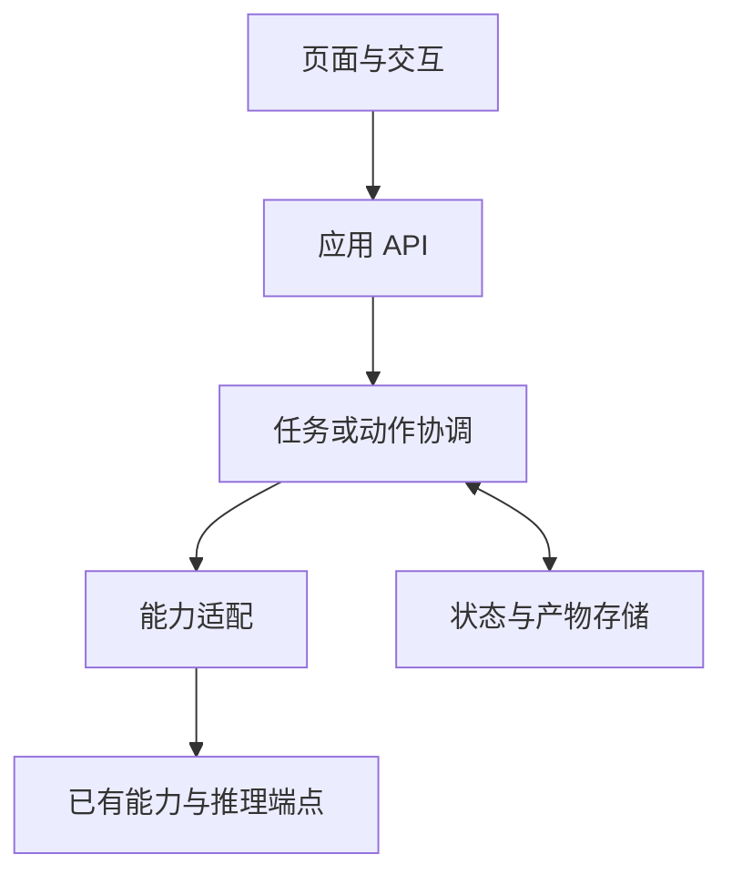

# 从场景到工程闭环

## 可删减的分层



小应用可以同文件实现部分层；保持职责清楚，不为了分层增加空服务。业务工具不返回页面 HTML，页面不直接持有模型 Key，模型不直接写数据库。

## 最小纵向切片

1. 先能提交一个真实场景的输入，并通过一个已接好的能力得到可核对结果。
2. 完成所需模型适配，在演示/协议替身/真实端点三种状态下分别显示实际情况。
3. 加上本任务必要的澄清与失败恢复。
4. 有持续产物时再增加草稿、当前对象与版本。有长任务时再加进度、取消、刷新恢复。
5. 完成对应业务验收和浏览器操作，整理启动配置。

避免先搭完整通用 Agent 平台，直到交付前仍没有一条真实业务路径。

## 按需使用的对象

| 对象 | 常见字段 | 使用条件 |
| --- | --- | --- |
| Task | id、owner、goal、confirmed_scope、status | 多步/跨请求任务 |
| Run | id、task_id、budget、cancelled、base_version | 重试、取消、异步产物 |
| Event | id、run_id、kind、time、user_summary、artifact_ref | 可观察执行 |
| Proposal | id、run_id、base_version、changes/body、evidence_refs | 需核对的候选结果 |
| Artifact | id、version、content/ref、source_scope | 持续共编与导出 |

身份、run_id 和基准版本由服务器设置。模型提供业务参数与候选内容，不能自行填入更高权限或绕过版本检查。

## 状态语义

简单任务只需 idle/running/succeeded/failed。需要协作时扩展：

```text
running → waiting_input → 新一轮 running
running → awaiting_review → accepted / discarded / 新一轮 running
running → failed / cancelled / interrupted
```

“模型完成输出”“草稿已就绪”“用户已采纳”“外部动作已完成”是不同事件。终态后拒绝旧 run 写入；新一轮使用新 run_id，并明确保留/废弃哪些旧候选。

HTTP 创建任务返回 task_id；读取状态是只读操作。继续任务需要明确输入，取消不等于撤销。任何持久修改都在服务端做范围、版本或幂等检查。轮询满足任务反馈需求时先用轮询；已有事件流或低延迟需求再采用 SSE/WebSocket。

## 领域结果优先

上传数据应用显示输入版本与校验；分析应用显示统计口径与来源；写作应用以当前文档和修改为主体；业务动作应用显示目标对象与影响范围。不要把所有场景统一成“对话 + JSON 工具日志”。

最终应用可使用 README、配置样例与必要测试说明；这些是用户应用的交付文件，不是要求给技能自身附加重复说明文档。
