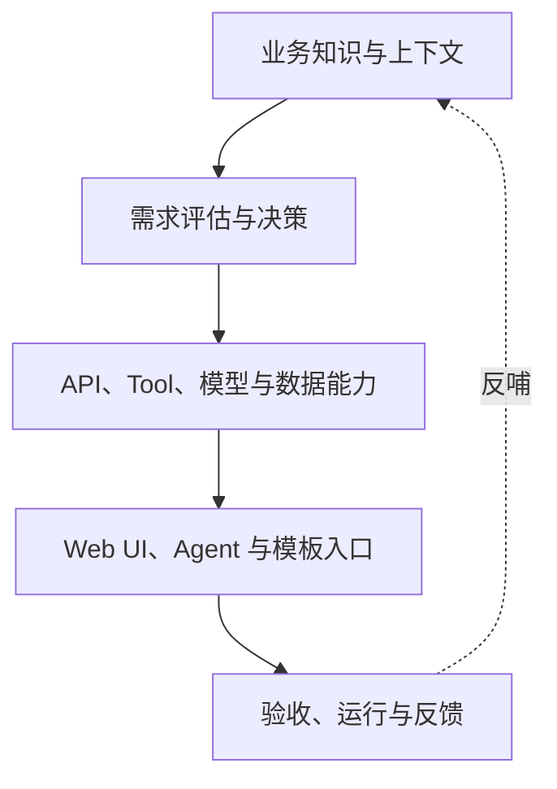

# 从“接需求”到“共同经营能力”

## 算法开发与业务协作的六个演进命题（讨论稿）

> 本文用于内部讨论和抛砖引玉，不是一套已经确定的组织制度，也不是要求一次性建设六个 Agent。
>
> 当前材料主要来自技术/算法开发方视角，因此文中涉及业务价值、业务优先级和验收取舍的内容，只能作为待业务 Owner 确认的讨论假设，不能被当成双方已经达成的共识。

## 一、我想讨论的可能不只是六个孤立问题

在和业务方合作的过程中，我们经常把问题描述为：业务方不懂技术、需求说不清楚、需求总在变化、开发资源不够、上线后没人维护。

但如果把这些现象连起来看，它们可能指向同一个更底层的问题：**我们目前主要以“一张需求单”为协作单位，却还没有把合作过程中形成的知识、能力、决策、证据和运行经验沉淀为可复用资产。**

于是，每来一个需求，很多工作都要重新发生一遍：

1. 重新解释业务术语和流程；
2. 重新判断需求到底要解决什么问题；
3. 重新寻找数据、接口和现有代码；
4. 重新讨论哪些指标算“做得好”；
5. 重新应对需求变化；
6. 上线后再由开发人员承担咨询和运维。

从这个角度看，AI 的价值不只是“多做几个问答机器人”，而是帮助减少四次翻译中的损耗：

`业务现象 → 可定义的问题 → 可复用的技术能力 → 可验证的业务结果`

我先抛出三个总判断：

- **AI 可以补充信息、调查事实、暴露矛盾，但不能替业务 Owner 决定价值和优先级，也不能替技术 Owner 承诺可行性、资源与排期。**
- **稳定部分应继续沉淀为数据定义、规则、代码、API 和权限；变化部分可以由 Agent 理解和编排。** Agent 不是用来掩盖底层能力混乱的。
- **Agent 不应成为新的事实源。** 知识、需求状态、能力契约、验收结果和运行记录仍需落在可追踪、可审查、可版本化的载体中。

六个问题可以被放进同一条演进链路：

| 当前问题 | 真正缺失的协作资产 | 建议的演进方向 |
|---|---|---|
| 01 认知差距 | 业务—技术共同语义 | SOP → 业务技术映射 → 实例上下文包 |
| 02 排期长、个人 loading 大 | 可自助获取的知识与分诊机制 | 人工咨询 → 有依据的问答 → 自助处理与升级 |
| 03 需求模糊 | 可确认的需求评估和决策状态 | 口头描述 → 结构化澄清 → Ready Gate |
| 04 频繁变更 | 稳定能力与变化编排之间的边界 | 一需求一开发 → API/Tool 能力 → Agent 组合 |
| 05 验收不明确 | 业务收益与技术收益的证据契约 | “效果不错” → 基线、指标、验证与责任人 |
| 06 运维不足 | 可支持、可观测、可授权的自助能力 | 开发人工兜底 → Runbook/API → 运维 Agent |



这张图想表达的重点是：**六个问题不是六套系统，而是一套协作闭环的不同断点。**

---

## 二、问题 01：认知差距——缺的可能不是更多文档，而是共同语义

### 1. 常见现象

- 同一个词，业务方指某个操作口径，算法方理解为数据字段或模型标签；
- 业务 SOP 记录“怎么做”，但没有说明为什么这样做、异常如何判断、系统里对应哪些数据；
- 数据字典解释了字段，却没有解释字段在真实业务动作中的含义；
- 很多上下文只存在于某位业务专家或某位开发人员脑中；
- 新需求看起来不同，背后其实在复用同一套实体、指标、判断规则和系统能力。

因此，单纯要求业务方“多写 SOP”可能还不够。SOP 主要面向人完成操作，而 Agent 和算法开发还需要知道：业务对象是什么、指标如何计算、规则为何成立、数据从哪里来、哪些例外不能自动处理。

### 2. 建议的三层业务—技术映射

| 层级 | 回答的问题 | 典型内容 | 主要确认人 |
|---|---|---|---|
| 通用层 | 这个领域里的基本概念是什么？ | 实体、术语、指标、规则、常见异常、合规边界 | 业务专家为主，技术协助结构化 |
| 业务层 | 本部门现在怎样完成工作？ | 角色、流程、输入输出、决策点、例外、当前基线 | 业务 Owner |
| 实例层 | 这次需求具体落到哪些资源和约束？ | 表、字段、接口、样例、时间范围、权限、假设、验收数据 | 业务与技术共同确认 |

这里可以参考 [Open Knowledge Format（OKF）](https://github.com/GoogleCloudPlatform/knowledge-catalog/blob/main/okf/SPEC.md) 的思路：用带 YAML frontmatter 的 Markdown 文件组织可由人和 Agent 共同消费的知识，并用链接表达概念关系。它更适合作为**知识表达格式的参考**，不是一装就能解决企业知识治理的成品。真正困难的仍然是来源、Owner、有效期、冲突处理和审核机制。

一个轻量目录可以是：

```text
knowledge/
├── domain.md
├── glossary/
├── processes/
├── metrics/
├── rules/
├── systems/
└── instances/REQ-001/
    ├── context.md
    ├── resource-map.md
    └── open-questions.md
```

每个知识节点至少包含：`owner`、`status`、`source`、`last_verified_at`、适用范围和失效条件。AI 可以起草和发现冲突，但不能把自动抽取结果直接标成“已确认事实”。

### 3. 轻量 Skill 样例：`business-tech-context-builder`

```yaml
name: business-tech-context-builder
trigger: 新领域接入、新需求缺少背景、业务术语与数据口径发生冲突时
input:
  - 业务 SOP、制度、历史需求和会议记录
  - 数据字典、API 文档、代码与样例数据的可用说明
actions:
  - 区分事实、规则、经验、假设和待决策项
  - 建立业务对象到流程、指标、数据和接口的映射
  - 发现同名异义、口径冲突、缺少 Owner 或过期内容
output:
  - 一个可版本化的上下文包
  - 最多三个阻塞性的待确认问题
stop_when:
  - 关键概念和资源已有证据或明确 Owner
  - 剩余未知只能通过现场确认或数据试验解决
boundary:
  - 不替业务方确认业务规则
  - 不替技术方确认数据可用性和实现可行性
```

### 4. 可配套的 SOP

`材料收集 → AI 初步抽取 → 业务确认语义 → 技术核对资源 → 冲突记录 → 版本发布 → 使用反馈回流`

### 5. 值得讨论的问题

- 我们最应该先沉淀“完整知识库”，还是只沉淀高频需求反复依赖的 20% 核心知识？
- 知识节点的最终 Owner 是业务部门、技术部门，还是共同 Owner？
- 如何识别“文档已经存在，但实际上没人相信或使用”的知识？

---

## 三、问题 02：需求排期长、一人 loading 大——先区分哪些工作真的需要专家

### 1. 不是所有咨询都应进入同一条开发队列

技术人员的大量时间，可能消耗在以下四类工作中：

| 咨询类型 | 例子 | 是否适合 Agent 首先承接 |
|---|---|---|
| 知识查询 | 某指标定义、某接口怎么用、历史上如何处理 | 适合，但必须给出处和适用范围 |
| 初步诊断 | 为什么没有数据、常见报错如何判断 | 适合在受限 Runbook 内处理 |
| 标准执行 | 重跑任务、导出报告、执行已批准脚本 | 条件适合，需权限、校验、审计和幂等 |
| 价值或风险决策 | 是否值得做、接受多大误报、是否改变业务规则 | 不应由问答 Agent 决定 |

如果不做分类，只做一个“什么都能问”的 Agent，很容易出现两个问题：一是把过期文档更快地传播出去，二是让真正需要责任人决策的问题看起来已经被回答。

### 2. 建议从“问答”演进到“分诊与自助”

可以逐级建设，而不是一开始追求自动闭环：

1. **有依据的回答**：检索受控知识，明确引用、适用范围和更新时间；
2. **引导式自助**：按 Runbook 帮用户完成检查、准备参数或生成请求；
3. **需求分诊**：识别这是知识问题、故障、权限问题、数据问题还是新需求；
4. **受限执行**：只执行低风险、可逆、可验证的批准动作；
5. **人工升级**：把已收集的上下文和证据一起交给专家，而不是让用户从头再讲一次。

### 3. 轻量 Skill 样例：`support-and-intake-router`

```yaml
name: support-and-intake-router
input: 用户问题、当前系统/项目、可访问知识、运行状态摘要
classify_as:
  - knowledge_question
  - known_incident
  - access_or_data_issue
  - new_requirement
  - owner_decision
output:
  - answer_with_evidence
  - guided_checklist
  - escalation_card
escalation_card_fields:
  - 用户目标与影响
  - 已检查项与证据
  - 复现条件
  - 当前阻塞和建议 Owner
boundary:
  - 无依据时不生成确定性答案
  - 不执行高风险、不可逆或越权动作
```

### 4. 不建议只看“问答拦截率”

拦截率很高，可能只是用户放弃继续求助。更值得跟踪的是：

- 有证据的一次解决率；
- 错误回答和错误分诊率；
- 重复问题随时间是否减少；
- 转人工时是否带齐上下文；
- 技术人员从重复咨询中真正释放的时间；
- 被释放的时间是否回到了核心开发，而不是被新的维护工作吞掉。

### 5. 值得讨论的问题

- 当前一个人 loading 大，主要是问题数量多，还是只有他掌握知识、权限或最终决策权？
- 哪三类高频咨询最适合先做自助？
- 哪些问题即使重复出现，也必须保留人工判断？

---

## 四、问题 03：需求模糊、问题定义不清——把“追问”升级为有边界的需求评估

### 1. Grill Me 的启发与局限

[Grill Me](https://github.com/mattpocock/skills/blob/main/docs/productivity/grill-me.md) 的核心启发，是不要急着实现，而是沿着设计和决策分支持续追问，把隐含假设暴露出来。它很适合启发需求澄清，但若直接照搬到业务—技术协作，也可能出现过度追问、询问本可自行查明的事实、或者让在场一方替缺席方作决定。

因此，需求评估智能体不应只是“问得狠”，还要做到：

- 先调查已有材料、代码、数据目录和接口文档，再提问；
- 区分业务决策、技术决策、可调查事实和必须试验的问题；
- 每轮只问会改变价值、范围、可行性、验收或风险的少量问题；
- 允许低风险、可逆的临时假设继续评估，但写明 Owner 和推翻条件；
- 到达停止条件后给出明确的就绪结论，而不是无限追问。

### 2. 三种参与模式与“替缺席方思考”的边界

| 模式 | AI 可以做什么 | AI 不能替谁决定什么 |
|---|---|---|
| 仅业务方在场 | 梳理业务链路，基于证据提出最简单候选方案，生成技术交接问题 | 不承诺数据、架构、工作量和排期 |
| 仅技术方在场 | 盘点资源和约束，从材料重建业务背景，形成业务待确认项 | 不决定业务价值、优先级、错误成本和验收取舍 |
| 双方都在 | 中立转译、事实调查、记录选项和影响 | 不把多数意见或更强势的表达当成事实，不替双方裁决价值取舍 |

需求节点可使用以下状态：

- `confirmed`：已有证据或相应 Owner 已确认；
- `assumption`：有边界的临时假设；
- `needs-decision`：等待责任人取舍；
- `needs-evidence`：需要调查数据或环境；
- `needs-spike`：只能通过最小试验判断；
- `out-of-scope`：明确排除。

最终不是输出一个容易掩盖阻塞项的总分，而是给出类似结论：`READY`、`READY_WITH_SPIKE`、`NEEDS_BUSINESS_DECISION`、`NEEDS_TECHNICAL_EVIDENCE`、`BLOCKED`、`NOT_AN_ALGORITHM_PROBLEM` 或 `DEFER`。

### 3. Agent 与 ONES 的合理分工

这里可以把 Agent 和流程管理平台分开理解：

- **评估 Agent 负责语义工作**：理解描述、调查事实、暴露假设、生成评估；
- **ONES 负责组织状态**：需求工作项、负责人、自定义字段、状态流转、关联任务和历史追踪。根据 [ONES Project 官方资料](https://ones.cn/products/project)，其支持需求管理、自定义需求状态和属性，可用来承载评估结果及责任流转，而不必让 Agent 自己再发明一套项目管理系统。

一个轻量状态流可以是：

`草稿 → 评估中 → 待业务决策 / 待技术证据 / 待最小试验 → Ready → 已排期 → 开发中 → 待验收 → 已关闭`

Agent 只更新有证据支持的字段；优先级、排期和关键取舍仍由对应 Owner 确认。

### 4. 轻量 Skill 样例：`requirement-alignment`

```yaml
name: requirement-alignment
input:
  - 原始需求描述
  - 业务材料与历史需求
  - 可用数据、接口、代码和环境说明
core_chain: 谁在什么场景遇到什么问题 → 当前怎么做 → 系统输出什么 → 谁据此采取什么动作 → 怎样算更好
output: requirement-assessment.md
required_sections:
  - 业务问题、用户与当前基线
  - 范围与不做事项
  - 输入输出和资源证据
  - 业务/技术假设与 Owner
  - 验收、错误成本和人工兜底
  - 风险、阻塞、最小试验和就绪结论
interaction_rule: 每轮最多提出三个高影响问题
boundary: 评估完成前不进入开发，不替 Owner 确认决定
```

### 5. 一个简单转译例子

原始描述：

> 希望做一个更智能、准确率高、能实时预警的算法。

评估后至少要转成：

- 谁会收到预警，收到后采取什么动作；
- 当前漏掉了什么、每周耗费多少人工、造成什么影响；
- “实时”是秒级、分钟级还是班次级；
- 误报和漏报哪个代价更高，人工是否复核；
- 可用历史数据是否覆盖目标场景，标签如何产生；
- 用规则、报表或流程调整能否更简单地解决；
- 试点成功后，怎样进入真实业务流程。

### 6. 值得讨论的问题

- 我们现在排期的是“一个想法”，还是已经通过 Ready Gate 的需求？
- 有多少需求实际上是知识、权限、流程或报表问题，而不是算法问题？
- 评估 Agent 的结论是否允许业务方和技术方分别确认，而不是一次会议里笼统地“都同意”？

---

## 五、问题 04：需求频繁变更——稳定能力接口化，变化需求 Agent 化

### 1. 这个方向成立，但要先找到变化边界

把成熟代码做成 API/Tool，通过 Agent 承接灵活的自然语言需求，是一个很有潜力的方向。但不能把所有变化都推给 Agent。更合适的拆分是：

|  | 确定性强 | 需要判断与组合 |
|---|---|---|
| 稳定、高频 | 固化为 API、批处理、规则或 Web UI | 固化常见策略，保留少量可选参数 |
| 变化、低频 | 参数化模板或受控脚本 | 由 Agent 规划和组合已批准能力 |

稳定层应包含：

- 数据读取和写入边界；
- 核心算法、规则与计算；
- 参数 Schema、输入输出和错误码；
- 权限、审计、幂等、超时和回滚；
- 可重复的测试和结果校验。

Agent 层负责：

- 理解用户目标；
- 选择已注册能力；
- 补齐必要参数并解释缺口；
- 生成执行计划和 Dry Run；
- 在授权范围内调用；
- 对结果做业务可读的解释和验证。

### 2. 关键不是“接口 Agent 化”，而是能力契约 Agent 可消费

只给 Agent 一个 URL 和接口文档远远不够。每个能力还应描述：

```yaml
capability_id: anomaly_report.generate
purpose: 生成指定范围的异常分析报告
input_schema: ...
output_schema: ...
permissions: ...
side_effect: read_only
cost_and_timeout: ...
preconditions: ...
examples: ...
validation: ...
fallback_and_escalation: ...
owner: ...
```

### 3. 轻量 Skill 样例：`capability-composer`

```yaml
name: capability-composer
input: 用户目标、允许使用的能力目录、当前权限与上下文
actions:
  - 将目标拆成可验证步骤
  - 只选择已注册且权限允许的 API/Tool
  - 对有副作用的步骤先生成 Dry Run
  - 执行后核对输出 Schema 与业务验收条件
output:
  - 执行计划
  - 调用记录与结果
  - 未满足条件和升级建议
boundary:
  - 不调用未注册能力
  - 不通过自然语言绕过源系统权限
  - 高风险或不可逆操作必须由人确认
```

### 4. 必须设计“成熟路径回流”

Agent 承接变化，不代表变化永远停留在对话里。如果某种调用方式开始高频、稳定、可验证，就应从 Agent Trace 中识别出来，沉淀为模板、API 编排、按钮或固定工作流。否则 Agent 层会逐渐变成不可测试的“自然语言胶水”。

一个健康循环应是：

`新变化由 Agent 探索 → 记录成功路径 → 人工审查 → 高频路径产品化 → Agent 继续承接长尾变化`

### 5. 值得讨论的问题

- 当前频繁变化的是业务目标、输入参数、展示形式，还是底层业务规则本身？
- 哪些变化可以被参数化，哪些实际上意味着需求范围变了？
- 哪些对话路径一旦重复三到五次，就应该回流为固定能力？

---

## 六、问题 05：验收标准不明确——把业务收益和算法收益都变成可验证假设

### 1. “双收益”适合做优先级输入，但不应被压成一个总分

你提出用“算法方收益 + 业务收益”衡量优先级，我认为是一个很好的起点：

- **业务收益**：是否产生可观察、可量化的业务改善；
- **算法/技术收益**：是否打通一类可复用能力，而不是只完成一次性定制。

但有两个补充：

1. **优先级判断应在需求 Ready 之后进行。** 一个价值很高但数据、责任人或验收都不明确的需求，不应因为得分高就直接进入开发；
2. **不要让加权总分掩盖风险和阻塞。** 安全、合规、权限、关键数据缺失和不可接受的错误成本应作为门槛，而不是被其他高分抵消。

可以先用一个二维讨论框架：

|  | 技术复用收益低 | 技术复用收益高 |
|---|---|---|
| 业务收益高 | 场景型 Quick Win，严格控制定制成本 | 战略优先，适合建设共用能力 |
| 业务收益低 | 通常延后或不做 | 作为能力投资或小规模 Spike，不伪装成业务项目 |

### 2. 验收至少分四层

| 验收层 | 回答的问题 | 示例 |
|---|---|---|
| 功能验收 | 系统是否按约定输入输出工作？ | 支持的场景、权限、异常处理、结果格式 |
| 算法验收 | 在固定数据和规则下效果如何？ | 指标、阈值、基线、分层表现、稳定性 |
| 业务验收 | 是否改变了业务动作并产生收益？ | 人工耗时、处理周期、损失、产能、采用率 |
| 运行验收 | 上线后是否可持续使用？ | 时延、可用性、漂移、成本、告警、人工兜底 |

算法指标不能自动代表业务收益。例如准确率提高，可能没有改变任何业务动作；业务耗时下降，也可能只是把成本转移给了下游复核人员。

### 3. 轻量 Skill 样例：`acceptance-contract-designer`

```yaml
name: acceptance-contract-designer
input: 需求评估、当前业务基线、候选方案、可用验收数据
output:
  - 业务价值假设及测量方式
  - 技术能力假设及复用范围
  - 功能/算法/业务/运行四层验收表
  - 失败条件、人工兜底和复评时间
rules:
  - 每个指标必须有基线、目标、观察窗口、数据源和 Owner
  - 离线指标与线上业务指标分别记录
  - 没有可靠测量方式时标记 needs-spike，而不是编造目标
```

### 4. 一个更完整的验收描述

不建议只写：

> 模型准确率达到 90%。

可以改为：

> 在冻结的验收集 V1 上，按约定分层口径评估召回率、误报率及关键场景表现；试点期由业务人员复核全部高风险输出。业务侧比较试点前后的平均处理时长、有效采用率和漏处理数量。若误报超过约定上限、业务采用率不足或新增复核成本抵消节省时间，则不进入全面推广。具体阈值由业务 Owner 与技术 Owner 基于基线共同确认。

### 5. 值得讨论的问题

- 我们验收的是模型、一个软件功能，还是整个业务结果？
- 业务收益由谁测量，算法方是否拿得到上线后的反馈数据？
- 技术复用收益是真实存在的第二个场景，还是开发方对未来复用的乐观想象？

---

## 七、问题 06：运维不足——把“能跑”升级为“用户可安全自助”

### 1. Web UI 之外，确实需要新的自助入口

传统 Web UI 适合稳定、高频、输入明确的操作；对话 Agent 更适合目标明确但路径、参数或组合方式有变化的任务。两者不是替代关系，而是不同复杂度的入口。

可以形成一条自助阶梯：

1. 固定 Web UI：标准高频操作；
2. 参数化模板：允许用户在安全范围内调整；
3. 对话 Agent：理解目标并组合已批准能力；
4. API/SDK：面向有开发能力的高级用户；
5. 新代码开发：只有现有能力确实无法覆盖时才进入排期。

“成熟代码接口化、接口 Agent 化”的核心，是把开发人员从每次手工处理请求中释放出来。但运维 Agent 不能只会调用接口，还需要知道怎样判断成功、怎样诊断失败、什么时候停止、怎样升级人工。

### 2. 轻量 Skill 样例：`operations-copilot`

```yaml
name: operations-copilot
input: 用户目标、服务状态、脱敏日志、Runbook、权限范围
actions:
  - 判断是使用问题、已知故障、数据异常还是新需求
  - 按 Runbook 执行只读检查
  - 给出证据、影响范围和建议动作
  - 对低风险可逆动作生成 Dry Run 并按权限执行
  - 验证恢复结果，失败时带上下文升级人工
output:
  - diagnosis.md
  - execution_trace
  - escalation_card
hard_stops:
  - 权限不足、证据冲突或影响范围未知
  - 涉及密钥、敏感数据、安全合规或不可逆变更
  - 连续执行未改善或超出 Runbook
```

### 3. 配套能力不是可选项

要让用户安全自助，至少需要：

- 源系统权限继续生效，Agent 不继承开发人员的过大权限；
- 输入校验、限流、幂等、超时、审计和版本控制；
- 脱敏日志、Trace、告警和可观测性；
- Dry Run、人工确认、回滚或补偿动作；
- 每个能力和 Runbook 都有 Owner、适用版本和失效条件；
- 防止用户把多个“单独允许”的工具组合成越权结果。

运维不足并不是上线后的附加问题，而是产品设计的一部分。一个必须长期靠原开发者解释、重跑和救火的算法能力，还不能算真正完成交付。

### 4. 值得讨论的问题

- 当前运维压力中，有多少是产品能力缺失，有多少是文档、权限或监控缺失？
- 哪些操作可以完全自助，哪些必须保留“人批准、Agent 执行”？
- 用户定制的边界应停在参数、能力组合，还是允许生成并运行新代码？谁为其结果负责？

---

## 八、六个 Skill 不应成为六个孤岛

如果真的分别建设六个 Agent，而每个 Agent 都维护自己的知识、需求状态和用户画像，最终可能出现：

- 问答 Agent 认为某个规则有效，需求评估 Agent 使用了另一个版本；
- 接口 Agent 完成了调用，但验收 Agent 不知道当初的业务目标；
- 运维 Agent 发现了高频问题，却没有回流到知识和产品规划；
- 每个 Agent 都在“智能总结”，却没有一个权威产物可以由人确认。

因此建议共享五类基础资产：

| 共享资产 | 作用 | 建议权威载体 |
|---|---|---|
| 上下文包 | 共同语义、流程、指标、资源映射 | 可版本化 Markdown/OKF-like bundle |
| 需求评估 | 当前需求唯一的事实、假设、决定和阻塞 | `requirement-assessment.md` + ONES 关键字段 |
| 能力目录 | API、Tool、脚本和模型能力契约 | 机器可读 Schema + 示例 + Owner |
| 验收证据 | 业务与技术结果是否成立 | 测试报告、试点数据、签署记录 |
| 运行追踪 | 谁在何时基于什么调用了什么 | Trace、日志、反馈与 Runbook 记录 |

一种可能的协作目录如下：

```text
collaboration-kit/
├── knowledge/                 # 通用与业务知识
├── capabilities/             # API/Tool 能力目录
├── requirements/REQ-001/
│   ├── requirement-assessment.md
│   ├── acceptance-evidence/
│   └── execution-traces/
├── runbooks/                  # 运行与故障处理
├── templates/                 # 需求、验收和升级模板
└── skills/                    # 只保存操作知识，不复制事实源
```

这里有一个重要边界：**Skill 保存“何时读取什么、怎样判断、怎样操作、何时停止”的流程知识；业务事实和运行状态应从权威文件或系统读取，不应大段复制进每个 Skill。**

---

## 九、一个更克制的落地顺序：先做一条闭环，不要同时做六个 Agent

### 第一个迭代：建立最小共同语言

选择一个咨询频繁、业务价值可观察、已有数据和接口基础的场景，只产出四个东西：

1. 一个三层业务—技术上下文包；
2. 一份 `requirement-assessment.md`；
3. 一张可复用能力卡；
4. 一份四层验收与 Runbook。

本阶段只需两个轻量 Skill：`business-tech-context-builder` 和 `requirement-alignment`。其他四个先以 SOP/模板存在。

### 第二个迭代：让重复咨询可以自助

基于同一上下文包增加问答与分诊入口。要求每个回答带证据和适用范围；无法解决时，生成带上下文的升级卡。观察哪些问题是真正被解决，哪些只是被转移。

### 第三个迭代：让变化需求组合现有能力

挑选两到三个稳定 API/Tool，补齐能力契约、权限、Dry Run 和验证，再让 Agent 做受控编排。高频成功路径应回流为模板或固定功能。

### 证据充分后：建设运行闭环

最后再增加运维 Agent、自动回流和跨场景复用。不要在知识、能力契约、权限和验收都不稳定时，先追求全自动执行。

最小试点可以观察这些指标：

- 从原始诉求到 Ready 的时间及往返次数；
- 重复咨询量和一次解决率；
- 转人工时上下文完整率；
- 一个能力被多少真实场景复用；
- 从变化提出到安全交付的时间；
- 上线后的人工兜底次数、恢复时间和业务采用率。

---

## 十、我希望和大家重点讨论的几个非共识判断

1. **认知差距不一定主要靠更强模型解决。** 如果组织内部没有可确认的共同语义，更强模型可能只是更流畅地猜测。
2. **问答 Agent 不一定减少 loading。** 如果没有知识 Owner、升级机制和使用反馈，它会新增一套需要开发人员维护的系统。
3. **需求模糊不等于业务方不会写需求。** 很多未知本来就只能由业务与技术共同调查、取舍或试验后确定。
4. **频繁变更不应全部 Agent 化。** Agent 适合承接长尾变化；一旦路径变得高频稳定，就应重新固化为产品能力。
5. **算法指标不等于算法方收益，业务指标也不自动等于业务收益。** 真正的技术收益是能力被可靠复用，真正的业务收益是决策或流程发生了可验证改善。
6. **运维不是交付之后的工作。** 没有权限、观测、停止、回滚和升级机制的“接口 Agent 化”，只是把人工风险换成自动化风险。
7. **真正值得建设的可能不是六个 Agent，而是一套让知识、需求、能力、证据和反馈可以被人和 Agent 共同消费的协作环境。**

---

## 十一、建议用这组问题结束第一次讨论

1. 六个问题中，哪个目前消耗的有效开发时间最多？有没有数据而不只是体感？
2. 哪个真实场景同时满足“高频、可观察、有 Owner、有基础数据或接口”，适合做最小闭环？
3. 当前哪些资料已经存在，哪些只是缺少业务—技术映射，而不是缺少内容？
4. 哪三类决策必须由业务 Owner 确认，哪三类承诺必须由技术 Owner 确认？
5. 第一阶段我们愿意明确“不做什么”，以避免把试点变成新的平台建设？

## 参考资料

- [Open Knowledge Format v0.2 规范](https://github.com/GoogleCloudPlatform/knowledge-catalog/blob/main/okf/SPEC.md)：人和 Agent 友好的 Markdown + YAML 知识表达格式。
- [Google Cloud：Introducing the Open Knowledge Format](https://cloud.google.com/blog/products/data-analytics/how-the-open-knowledge-format-can-improve-data-sharing)：OKF 的设计动机和协作定位。
- [Grill Me 使用说明](https://github.com/mattpocock/skills/blob/main/docs/productivity/grill-me.md)：通过持续访谈暴露计划与决策中的未知分支。
- [Grill Me Skill 源文件](https://github.com/mattpocock/skills/blob/main/skills/productivity/grill-me/SKILL.md)：当前 Skill 的轻量入口定义。
- [ONES Project 官方产品说明](https://ones.cn/products/project)：需求、任务、状态、属性、迭代和研发协作能力说明。
