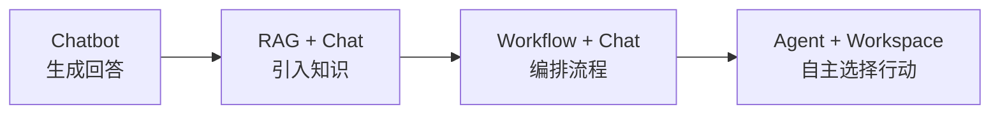
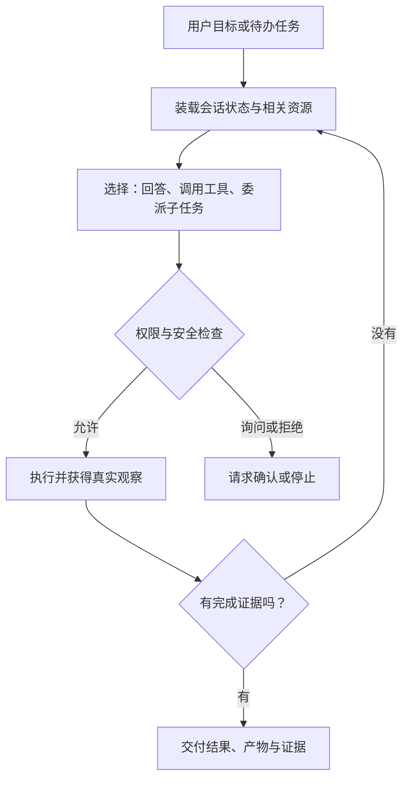
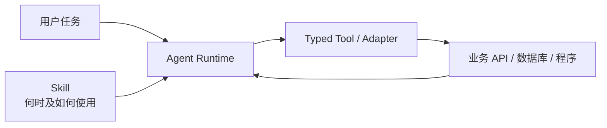
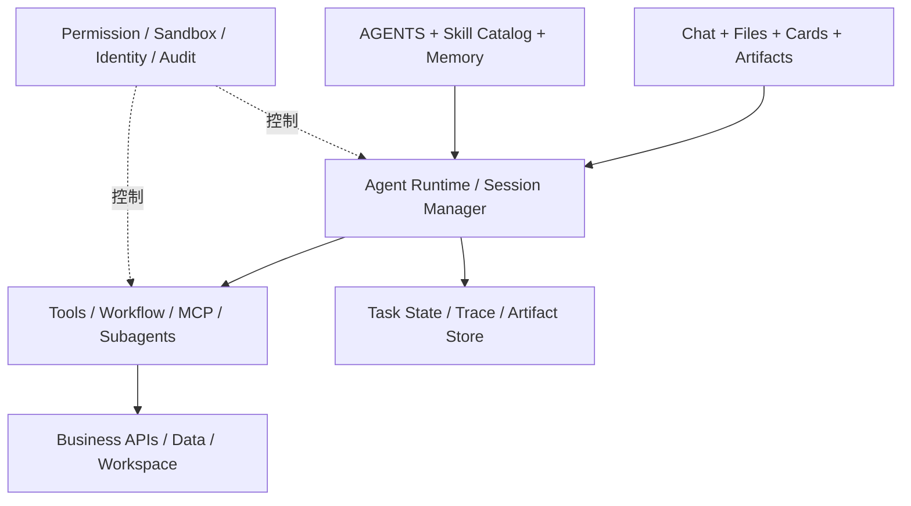

# Agent 平台架构、Skill 与 Vibe Coding

> 从 Chatbot、RAG、Workflow 到 Agent：模型逐渐从“只能说话的脑”，进入一个有工具、有状态、有权限、有反馈、能交付可验证结果的数字工作环境。

## 课程定位

这门课不把 Agent 简化成“会调用工具的聊天机器人”，也不把 Vibe Coding 理解成“随便描述一句，让 AI 把代码写完”。课程希望回答五个更实际的问题：

1. Chatbot、RAG、Workflow 和 Agent 分别解决了什么问题，为什么它们会同时存在？
2. 一个以 OpenCode 为代表的 Agent 平台，运行时到底发生了什么？
3. AGENTS.md、Skill、Tool、API、MCP、Subagent、A2A 分别应该放什么，不应该放什么？
4. 怎样测试 Skill 是否会在正确场景命中，并避免多 Skill 误触发、冲突和递归？
5. 怎样把已有 WebUI 应用改造成对话式 Agent 应用，同时保留确定性、可审计性和操作效率？

课程的核心判断是：

> 模型能力决定 Agent 的认知上限；Harness、资源接口、权限边界、状态管理和验证闭环，决定它能否稳定进入生产。

---

# 第一部分：应用形态为什么从 Chatbot 走向 Agent

## 1. 开场：模型为什么像“缸中之脑”

### 讲师讲解

一个只接收文本、再返回文本的大模型，即使很聪明，也仍然像“缸中之脑”：

- 它不知道企业当前真实数据是什么；
- 它不能直接读取项目文件、数据库和业务系统；
- 它不能可靠地持续完成一个长任务；
- 它做完一个动作后，不一定能看到真实反馈；
- 它不知道哪些动作被允许，哪些动作不可逆；
- 它可能给出看起来合理、实际没有执行过的答案。

过去几年的应用演进，本质上是在逐步补齐五类条件：

1. **Grounding**：让模型看到真实知识和真实环境；
2. **Action**：让模型能调用工具、API、文件系统和程序；
3. **State**：让任务、会话、文件和中间结果能够延续；
4. **Feedback**：让模型看到动作的真实结果，并据此调整；
5. **Governance**：用权限、沙箱、审计和验收限制其行动范围。

因此，从 Chatbot 到 Agent 并不是简单的产品名词升级，而是模型与数字世界之间的接口逐渐完整。

## 2. 四个阶段的演进



这条线是能力扩展关系，不是严格的替代关系。一个 Agent 可以调用 RAG 和 Workflow；一个 Workflow 里也可以包含 Agent 节点。

| 阶段 | 主要控制者 | 基本执行单元 | 补齐的关键能力 | 优势 | 典型局限 | 代表性工具 |
| --- | --- | --- | --- | --- | --- | --- |
| Chatbot | 用户与应用 | 一轮消息 | 自然语言理解与生成 | 上手快、交互自然 | 只能“说”，事实和行动能力弱 | 各类模型聊天应用 |
| RAG + Chat | 检索程序 | 文档片段与回答 | 外部知识、私有知识、时效知识 | 降低知识缺口，便于更新 | 检索错误会传导；通常仍不执行真实任务 | LangChain、FastGPT 等 |
| Workflow + Chat | 开发者预定义图 | 节点、条件、变量 | 确定性编排、系统集成 | 可视化、稳定、易审计 | 长尾需求和异常路径需要不断加分支 | Dify、Coze（扣子）等 |
| Agent + Workspace | 模型在 Harness 边界内决策 | Task、Tool Call、Artifact | 动态规划、工具选择、反馈循环、状态延续 | 能处理开放任务和异常情况 | 概率性、成本、延迟、安全与验证更复杂 | OpenCode、Pi、OpenClaw 等 |

### 2.1 Chatbot：暴露模型的“说话能力”

Chatbot 的中心是 `message → model → message`。应用可以保留多轮历史，但模型通常没有可靠的外部状态和行动能力。

适合：

- 解释、翻译、改写、头脑风暴；
- 低风险、结果由人直接判断的任务；
- 用户愿意自己复制结果、继续操作的场景。

不适合：

- 必须读取实时业务状态的任务；
- 需要执行、验证、回滚的长任务；
- 高风险且必须留下证据链的操作。

### 2.2 RAG + Chat：先给模型接入“可查阅的资料室”

RAG 在推理时检索相关内容，将其作为上下文提供给模型。它解决的是“模型不知道或记不准”的问题，而不是天然解决“模型会不会做”的问题。

以 [LangChain 的 RAG 教程](https://docs.langchain.com/oss/python/langchain/rag/)和 [FastGPT 的 RAG 文档](https://doc.fastgpt.io/en/guide/dataset/rag)为例，典型链路是：

```text
用户问题 → 查询改写 → 召回 → 重排/过滤 → 上下文拼装 → 模型回答 → 引用来源
```

RAG 的生产重点通常不在“有没有向量库”，而在：

- 查询是否被正确理解；
- 数据是否有来源、版本、权限和有效期；
- 召回结果是否覆盖真正需要的证据；
- 模型能否区分“资料中没有”与“自己不知道”；
- 回答能否追溯到原始材料。

### 2.3 Workflow + Chat：把工作过程变成可执行图

Workflow 把模型、知识库、代码、HTTP 请求、判断条件等变成节点，由开发者提前决定大部分控制流。Dify 当前将 Workflow 和 Chatflow 建立在共同的节点画布之上，区别主要在交互和会话方式；Coze 也提供工作流、插件、知识库等资源。[Dify Workflow/Chatflow](https://docs.dify.ai/en/cloud/use-dify/build/workflow-chatflow) · [Coze Workflow](https://www.coze.com/open/docs/guides/workflow)

Workflow 适合：

- 路径稳定、输入输出明确的业务；
- 审批、批处理、内容流水线；
- 需要清楚观察每个节点的场景；
- 模型只应在局部节点内发挥灵活性的任务。

它的代价是：长尾问题越多，分支越复杂；业务变化后，开发者需要持续修改流程图。

### 2.4 Agent：把“下一步做什么”的部分决定权交给模型

Agent 不等于完全自治。更准确的定义是：

> Agent 是一个在受控环境中，根据当前目标、状态和观察结果，循环选择下一步行动，直到完成、阻塞或被停止的运行系统。

以终端和工作区 Agent 为例：

- [OpenCode](https://opencode.ai/docs/)提供会话、文件与命令工具、规则、Skills、Primary/Subagent、权限以及 Server/SDK；
- [Pi](https://github.com/earendil-works/pi)强调可扩展的终端 Coding Harness、工具调用与状态管理；
- [OpenClaw](https://github.com/openclaw/openclaw)更接近持续运行的个人助手 Gateway，把模型、工具、设备和消息渠道连接起来。

这些产品形态不同，但共同点不是“有聊天框”，而是给模型提供了一个可以持续观察和行动的环境。

## 3. 一个重要修正：演进不是“确定性越来越少”

Agent 的出现不意味着应该删除 Workflow、表单、规则和程序。更合理的分工是：

| 问题类型 | 更适合的承担者 |
| --- | --- |
| 理解模糊意图、处理例外、选择策略 | 模型 / Agent |
| 计算、格式转换、查询、写入 | Tool / API / Script |
| 稳定且高频的固定路径 | Workflow |
| 企业共识与项目约定 | AGENTS.md / Rules |
| 场景化操作方法 | Skill |
| 不可突破的限制 | Permission / Sandbox / Policy |
| 成功与否的判断 | 测试、断言、业务验收、人类评审 |

一句话总结：

> 把不确定性留给模型，把确定性沉淀到环境；把灵活性放在决策层，把安全和正确性放在模型无法绕过的边界上。

---

# 第二部分：Agent、Harness 与 Skill 的核心定义

## 4. Agent 不是一个 Prompt，也不只是一个模型

可以用一个工程公式理解 Agent：

```text
Agent = Model
      + Harness（循环、上下文、工具中介）
      + State（会话、任务、文件、检查点）
      + Resources（规则、Skill、Tool、API、数据）
      + Policy（权限、沙箱、密钥和审计）
      + Feedback & Verification（观察、测试、验收）
```

其中，**Harness** 是模型外部的运行脚手架。它负责：

- 组织消息和上下文；
- 把工具以结构化 Schema 暴露给模型；
- 执行工具调用并把结果送回模型；
- 保存 Session、Message、Artifact 和事件；
- 管理重试、超时、压缩、取消与恢复；
- 在行动前执行权限检查；
- 判断继续循环、请求用户输入还是停止。

因此，更强的模型并不会让 Harness 失去意义。模型越能自主行动，Harness 对安全、状态、观察和验证的责任反而越重。

## 5. Agent 的运行时：带状态的决策循环

[ReAct](https://arxiv.org/abs/2210.03629)把推理与行动交错起来：行动从外部环境得到观察，观察再影响后续决策。生产 Agent 通常采用 ReAct-like 循环，但不一定逐字暴露模型的内部思维过程。



### 5.1 “观察—思考—行动—反馈”的工程含义

| 环节 | 工程含义 | 应保留的可观测信息 |
| --- | --- | --- |
| 观察 | 读取用户输入、文件、工具结果、环境状态 | 输入来源、版本、时间、权限范围 |
| 决策 | 选择下一步行动、更新计划 | 简明计划、选择理由、风险提示；不要求记录完整隐式思维链 |
| 行动 | 调用 Tool、API、脚本、Subagent | 工具名、参数摘要、调用身份、幂等键 |
| 反馈 | 接收 stdout、API 响应、测试结果、用户回复 | 结构化结果、错误类型、证据与 Artifact |
| 状态更新 | 写入 Session、Task、文件或检查点 | 状态迁移、差异、可恢复位置 |
| 停止 | 完成、阻塞、失败或超预算 | 停止原因、未完成项、下一步建议 |

### 5.2 Agent 必须知道何时停止

常见停止条件包括：

1. **完成停止**：验收断言通过，并产生了约定的 Artifact；
2. **需要输入**：缺少会显著改变结果的用户选择；
3. **权限阻塞**：动作被拒绝，且没有同等安全的替代路径；
4. **失败停止**：同一错误重复出现，继续尝试没有新增信息；
5. **风险停止**：即将执行不可逆、越权或高影响操作；
6. **预算停止**：达到时间、Token、调用次数或费用上限；
7. **外部停止**：用户取消、服务超时或依赖系统不可用。

“还可以继续想”不是继续循环的充分理由。每次循环都应回答：这一步能否获得新的信息、产生新的证据或推进状态？

## 6. Skill 的定义：可按需加载的操作知识包

[Agent Skills 规范](https://agentskills.io/home)把 Skill 定义为以 `SKILL.md` 为核心、可以附带脚本、参考资料和资产的可复用知识包。OpenCode 也通过原生 `skill` 工具按需装载 Skill。[OpenCode Skills](https://opencode.ai/docs/skills/)

Skill 通常包含：

```text
my-skill/
├── SKILL.md              # 触发边界、流程、判断与资源路由
├── scripts/              # 可重复、确定性的执行逻辑
├── references/           # 需要时读取的领域或接口资料
├── assets/               # 模板、样例、静态资源
└── evals/                # 触发与输出质量测试
```

一个合格的 Skill 回答的不是“我是谁”，而是：

- 什么用户意图应该触发它？
- 哪些相邻场景不应该触发它？
- 开始前需要检查什么？
- 以什么顺序使用哪些资源？
- 哪些判断可以由模型做，哪些必须交给程序？
- 失败时如何分类、重试、降级或停止？
- 最终交付什么，如何验证？

### 6.1 Skill 不是什么

| 容易混淆的对象 | 与 Skill 的区别 |
| --- | --- |
| Prompt | Prompt 通常是一次性指令；Skill 是带触发边界、流程和配套资源的可复用包 |
| Tool/API | Tool 提供“能做什么”；Skill说明“何时做、按什么方法做、怎样验收” |
| Workflow | Workflow 固化控制流；Skill 给模型一套可适应上下文的操作方法 |
| Agent | Agent 是运行主体；Skill 是 Agent 可加载的程序性知识 |
| Subagent | Subagent 有独立上下文与任务生命周期；Skill 默认注入当前 Agent 上下文 |
| RAG 知识库 | RAG 提供事实材料；Skill 更偏程序性知识、边界和资源导航 |

### 6.2 按需加载：不是把所有资料塞进上下文

Skills 的渐进式披露通常分三级：

1. **发现**：会话开始只暴露 `name + description`；
2. **激活**：命中后读取完整 `SKILL.md`；
3. **执行**：仅在流程需要时读取某个 reference、脚本或资产。

这使 Agent 可以“知道有哪些能力”，又不必为每个 Skill 预先支付完整上下文成本。官方实现指南也建议在目录中只列出资源，不要一次性读取全部内容。[Progressive disclosure](https://agentskills.io/client-implementation/adding-skills-support)

---

# 第三部分：以 OpenCode 为例理解 Agent 平台分层

## 7. 从自然语言到机器资源的分层

下面的层次越向下，越接近机器可执行资源，约束通常越明确；但安全层不是最下面的一段提示词，而是贯穿整个系统的控制面。

| 层次 | OpenCode 中的典型载体 | 主要内容 | 装载方式 | 约束强度 |
| --- | --- | --- | --- | --- |
| 对话与任务层 | 用户消息、附件、当前 Session | 本次目标、背景、偏好、反馈 | 每轮直接进入上下文 | 软；可变化 |
| 资源引导与规则层 | `AGENTS.md`、`instructions` | 项目结构、构建命令、团队规范、注意事项 | 项目/全局规则进入上下文 | 软到中；仍是自然语言 |
| 应用流程层 | `SKILL.md` | 场景流程、资源路由、错误处理、验收 | 元数据常驻，正文按需加载 | 中；可被模型解释执行 |
| 能力接口层 | Built-in Tool、Custom Tool、MCP、Script、API | 文件、命令、搜索、数据库、业务动作 | Tool Schema 或命令接口 | 中到强；参数有结构 |
| 运行与状态层 | Session、Message、Task、Event、Workspace、Artifact | 当前进度、工具结果、文件与检查点 | Harness 持续维护 | 强；由运行时控制 |
| 安全与治理控制面 | `opencode.json` permission、OS 沙箱、网络、密钥、审计 | 允许、询问、拒绝、隔离和追踪 | 每次动作前后检查 | 最强；模型不能自行解除 |

### 7.1 对话层：只描述本次任务

适合放：

- 为什么做；
- 这一次处理哪些输入；
- 用户真正关心的结果；
- 临时偏好和当前反馈。

不适合反复放：

- 每个会话都相同的项目规范；
- 很长的 API 文档；
- 需要机器严格执行的权限规则；
- 大量与当前任务无关的领域资料。

### 7.2 AGENTS.md：告诉 Agent “这是怎样的项目”

OpenCode 会把项目级和全局规则加入模型上下文，官方建议在其中记录构建、测试、项目结构、约定与容易踩坑的地方。[OpenCode Rules](https://opencode.ai/docs/rules/)

一个简洁的示例：

```markdown
# Project Guide

## Goal
这是一个多租户数据分析服务。任何修改都不能破坏租户隔离。

## Structure
- `api/`: 对外接口
- `core/`: 业务逻辑
- `tests/`: 单元与隔离测试

## Commands
- 单元测试：`pytest -q`
- 隔离测试：`pytest -q tests/isolation`
- 静态检查：`ruff check .`

## Rules
- 不在源码中写入密钥。
- 修改数据库 Schema 前先生成迁移计划，不直接执行生产迁移。
- 完成后必须报告改动文件、验证命令和仍未覆盖的风险。
```

AGENTS.md 是高频、跨任务的上下文，不应变成百科全书。场景性长流程应拆到 Skill；机器硬限制应放入权限或沙箱。

### 7.3 Skill：告诉 Agent “这种任务应该怎样完成”

```markdown
---
name: tenant-isolation-review
description: >
  Review changes that may affect tenant data or filesystem isolation.
  Use for authentication, storage, workspace mapping, database queries,
  or cross-tenant access paths. Do not use for unrelated UI-only edits.
---

# Tenant Isolation Review

1. Identify the tenant boundary and authoritative tenant ID.
2. Trace all read/write paths affected by the change.
3. Run `scripts/check-isolation.sh`.
4. Read `references/isolation-invariants.md` only if a boundary changes.
5. Report PASS/FAIL for each invariant with file or test evidence.
6. Do not modify production credentials or execute production migrations.
```

### 7.4 Tool 与 API：告诉 Agent “环境允许做什么”

OpenCode 内置文件、搜索和命令等工具，也可以接入自定义 Tool 或 MCP Server。Tool 应提供稳定、窄而清楚的输入输出，而不是把整个业务系统变成一个模糊的“万能接口”。[OpenCode Tools](https://opencode.ai/docs/tools/)

### 7.5 Session 与 Workspace：让任务不只存在于一条回复里

OpenCode 的 TUI 本身是 Server 的客户端；`opencode serve` 可以提供 OpenAPI 接口，SDK 可用于创建会话、发送消息和订阅事件等集成。[OpenCode Server](https://opencode.ai/docs/server/) · [OpenCode SDK](https://opencode.ai/docs/sdk/)

工程上要区分：

- **Conversation state**：用户与 Agent 说了什么；
- **Task state**：任务现在处于 planning、working、blocked 还是 completed；
- **Workspace state**：文件、代码和中间产物是什么；
- **External state**：数据库、工单、部署环境当前是什么；
- **Checkpoint**：失败后从哪里恢复；
- **Artifact**：最终可交付的文件、结构化数据或变更集。

聊天记录不能替代业务数据库；模型总结也不能成为生产状态的唯一真相来源。

## 8. 安全层：自然语言规则不是硬隔离

OpenCode 的 permission 配置可以对工具、命令、Skill、Subagent、外部目录和重复循环设置 `allow / ask / deny`。规则采用模式匹配，具体规则应放在通配规则之后。[OpenCode Permissions](https://opencode.ai/docs/permissions/)

下面是教学用的最小示例，实际项目应按威胁模型调整：

```json
{
  "$schema": "https://opencode.ai/config.json",
  "permission": {
    "edit": "ask",
    "bash": {
      "*": "ask",
      "git status*": "allow",
      "git diff*": "allow",
      "rm *": "deny",
      "sudo *": "deny"
    },
    "external_directory": "deny",
    "webfetch": "ask",
    "skill": {
      "*": "ask",
      "trusted-*": "allow"
    },
    "task": {
      "*": "deny",
      "reviewer": "allow"
    },
    "doom_loop": "ask"
  }
}
```

需要强调：

- Permission 是 Harness 的动作门，不等于完整 OS 沙箱；
- `AGENTS.md` 中写“禁止删除”不能替代真正的 `deny`；
- 对不可信代码，应增加容器或 bwrap 等系统隔离、只读挂载、网络出口控制和独立凭据；
- 密钥应由运行环境或凭据代理注入，不能写入 Prompt、Skill 或仓库；
- 高风险写操作应具备 dry-run、幂等键、显式确认、审计和回滚方案。

---

# 第四部分：Vibe Coding 的正确打开方式

## 9. Vibe Coding 有两个不同语境

“Vibe Coding”最初用于描述一种高度依赖自然语言和快速反馈、甚至不仔细阅读代码差异的开发体验。[Karpathy 的原始表述](https://x.com/karpathy/status/1886192184808149383)

在教学中应区分两种模式：

| 模式 | 目标 | 可接受做法 | 不可接受做法 |
| --- | --- | --- | --- |
| 原型式 Vibe Coding | 快速验证想法、一次性个人工具 | 快速生成、边看效果边调整、允许重做 | 用于生产后仍不理解权限、数据和依赖 |
| 生产式 Agentic Coding | 在 Agent 主导执行下交付可维护结果 | 自然语言定义目标，机器执行测试，人审阅风险与验收证据 | “Accept All”、只看 UI 正常、让同一 Agent 无证据地自我宣布完成 |

生产环境中的合理升级不是取消“Vibe”，而是把它变成：

```text
自然语言意图
→ 可确认的规格与边界
→ Agent 在受控工作区执行
→ 自动测试与真实反馈
→ 人类体验和风险审阅
→ 检查点、交付和知识沉淀
```

GitHub 的 Spec-driven development 资料也指出，直接从一句描述跳到代码适合快速原型，但对严肃项目需要更清楚的规格和验证。[Spec-driven development](https://github.blog/ai-and-ml/generative-ai/spec-driven-development-with-ai-get-started-with-a-new-open-source-toolkit/)

## 10. 推荐的 Vibe Coding 八步工作流

### 第 0 步：先判断任务风险

先回答：这是一次性原型、内部工具，还是生产系统？是否涉及生产数据、外部消息、付费、部署、删除、权限或隐私？

风险越高，越需要：

- 明确验收标准；
- 分离计划与执行；
- 限制工具权限；
- 使用独立验证；
- 保留回滚与审计。

### 第 1 步：布置可执行环境，而不只是写一个 Prompt

建议至少提供七类信息：

```markdown
## 目标
要解决谁的什么问题，最终产生什么结果。

## 背景
为什么做；现状、已有尝试和业务语义是什么。

## 输入
文件、接口、数据源、样例分别在哪里，哪个是权威来源。

## 可用资源
可以使用哪些 Tool、API、Skill、脚本和测试环境。

## 约束
哪些路径不可访问，哪些行为禁止，哪些动作需要确认。

## 验收
哪些命令、断言、截图、业务指标或人工体验代表完成。

## 工作方式
先只读分析和计划；按小批次实施；失败时报告证据，不隐藏问题。
```

### 第 2 步：让 Agent 先做只读环境勘察

Agent 应先确认：

- 项目入口和真实目录结构；
- AGENTS.md 与相关 Skill；
- 构建、测试、格式化命令；
- 当前 Git 状态和用户已有修改；
- 接口、数据和依赖是否可用；
- 哪些假设仍需确认。

### 第 3 步：把计划变成可验证的小切片

计划不应只是“先分析、再实现、最后测试”，而应说明：

- 每一步改动哪些边界；
- 产生什么中间 Artifact；
- 用什么命令或证据判断通过；
- 失败后回退到哪里；
- 哪些步骤可以并行，哪些有依赖。

### 第 4 步：让 Agent 主导执行，人类管理方向和边界

人类不需要逐行指导模型写代码，但应控制：

- 目标是否漂移；
- 是否出现超范围重构；
- 是否触碰高风险操作；
- 是否产生大量 fallback、mock、placeholder 或硬编码；
- 是否用真实路径完成，而不是只让测试表面通过。

### 第 5 步：每个小切片都接入真实反馈

反馈优先级通常是：

1. 类型检查、单元测试和静态分析；
2. 集成测试、真实 API 或沙箱数据；
3. 页面截图、Artifact、日志和性能数据；
4. 人类体验反馈；
5. 模型自评。

模型自评可以发现问题，但不能替代可执行验证。

### 第 6 步：独立验收关键结果

高风险改动应让验证者只看：

- 原始需求与验收标准；
- Diff 或最终 Artifact；
- 测试结果和关键日志；
- 已知风险和未覆盖项。

验证者不应继承实现 Agent 为自己辩护的全部上下文。上下文隔离的价值是减少同一套错误假设被重复接受。

### 第 7 步：交付可恢复、可继续的结果

交付内容至少包括：

- 结果与使用方法；
- 改动文件或 Artifact 链接；
- 实际运行过的验证；
- 没有验证的部分；
- 风险、回滚点和下一步。

### 第 8 步：把重复经验沉淀回环境

| 发现的信息 | 应沉淀到哪里 |
| --- | --- |
| 每次任务都适用的项目约定 | AGENTS.md |
| 某类任务的稳定做法 | Skill |
| 重复生成的确定性逻辑 | Script / Tool |
| 大量详细领域资料 | references / RAG |
| 严格禁止或必须确认的动作 | Permission / Sandbox |
| 可机器判断的完成条件 | Tests / Evals |
| 本次任务的过程与中间结果 | Session / Trace / Artifact |

这一步使“对话中的偶然成功”逐渐变成“环境中的可复用能力”。

---

# 第五部分：Tool、API、MCP 与 Agent Harness

## 11. 工具如何进入 Agent 架构



不要把“接入 API”理解成把几百行 API 文档粘进 Prompt。正确的拆分是：

| 内容 | 最适合的位置 |
| --- | --- |
| Endpoint、参数类型、枚举、返回 Schema | Tool 定义、OpenAPI、SDK |
| 鉴权、重试、分页、限流、幂等、错误归一化 | Tool Adapter / Script |
| 什么业务意图下调用、先后顺序、结果如何解释 | Skill |
| 所有任务都适用的接口使用约定 | AGENTS.md |
| 密钥、租户身份、网络范围 | Credential / Runtime / Policy |
| 调用过程、耗时、结果摘要 | Trace / Observability |

### 11.1 Tool 设计的五条原则

1. **窄接口**：`get_order_status(order_id)` 优于 `execute_business_action(payload)`；
2. **强 Schema**：使用 enum、required、范围约束和稳定字段；
3. **可诊断错误**：区分参数错误、权限错误、限流、依赖不可用和业务冲突；
4. **安全重试**：读操作可重试，写操作必须考虑幂等键；
5. **结果可验证**：返回 ID、版本、时间、来源和状态，不只返回“成功”。

## 12. API 融入 Skill 的推荐结构

```text
skills/order-investigation/
├── SKILL.md
├── scripts/
│   └── order_api.py
├── references/
│   ├── field-semantics.md
│   └── error-codes.md
└── evals/
    ├── trigger_queries.json
    └── cases.json
```

`SKILL.md` 只保留核心流程：

```markdown
1. 从用户描述中提取 `order_id`；缺失时询问，不猜测。
2. 调用 `scripts/order_api.py status --order-id <id> --format json`。
3. 如果返回 `AUTH_EXPIRED`，停止并报告需要重新授权。
4. 如果返回 `NOT_FOUND`，核对订单 ID 格式后最多重试一次。
5. 只有在状态为 `SHIPPED` 时才读取物流详情。
6. 最终区分：已确认事实、推断、需要业务人员确认的事项。
```

详细字段语义和低频错误码放入 `references/`，只有遇到对应情况时再读。

## 13. stdin/stdout：为人设计的 CLI 和为 Agent 设计的 CLI 不一样

Agent 调用脚本时主要通过参数、stdin、stdout、stderr 和退出码理解结果。[Agent Skills 的脚本设计指南](https://agentskills.io/skill-creation/using-scripts)建议避免交互式输入、提供清晰的 `--help`、使用结构化输出，并把数据与诊断信息分开。

### 13.1 推荐契约

| 通道 | 用途 | 规则 |
| --- | --- | --- |
| argv / stdin | 输入参数 | 参数少用 flags；复杂对象用单个 JSON；不要等待 TTY 交互 |
| stdout | 机器结果 | 默认只输出一个合法 JSON；不要混入进度文字 |
| stderr | 诊断 | 日志、警告、进度和可读错误 |
| exit code | 失败类别 | 为参数、鉴权、依赖、业务冲突设置稳定代码 |
| output file | 大结果 | 把大表、图片、报告写入文件，stdout 只返回 manifest |

输入示例：

```json
{
  "project_id": "p-123",
  "date_range": {
    "start": "2026-07-01",
    "end": "2026-07-31"
  },
  "limit": 20,
  "dry_run": true
}
```

成功输出：

```json
{
  "ok": true,
  "data": {
    "count": 20,
    "items": []
  },
  "artifacts": [
    {
      "path": "outputs/report.csv",
      "mime_type": "text/csv",
      "sha256": "..."
    }
  ],
  "provenance": {
    "source": "analytics-api",
    "retrieved_at": "2026-08-09T18:00:00Z",
    "api_version": "v2"
  },
  "warnings": [],
  "next_cursor": null
}
```

失败输出：

```json
{
  "ok": false,
  "error": {
    "code": "AUTH_EXPIRED",
    "message": "The service credential has expired.",
    "retryable": false,
    "suggested_action": "Ask an administrator to reconnect the integration."
  }
}
```

### 13.2 人类可读与 Agent 可读的分工

- 脚本和 Tool 返回稳定、紧凑、可解析的数据；
- Agent 根据用户角色把数据翻译成解释、表格或建议；
- WebUI 用卡片、图表、进度和 Artifact 预览渲染同一份结构化结果；
- 不要让脚本同时承担数据接口、业务解释和最终文案三种责任。

## 14. 响应持久化与 Runtime 记忆

不是所有 Tool 结果都应该永久塞进对话，也不是所有对话都应该变成长时记忆。

| 层级 | 保存什么 | 典型寿命 | 目的 |
| --- | --- | --- | --- |
| Turn context | 当前输入与短工具结果 | 一轮到数轮 | 支持下一步决策 |
| Session state | 已确认目标、选择和工作摘要 | 一次会话 | 保持连续性 |
| Task checkpoint | 当前阶段、待办、幂等键、恢复点 | 任务完成前后 | 中断恢复 |
| Raw response | 原始 API 响应或引用 | 按审计策略 | 追溯与重放 |
| Normalized result | 统一后的结构化数据 | 按业务版本 | 跨工具消费 |
| Artifact | 报告、代码、数据、图像 | 按交付策略 | 用户真正使用的结果 |
| Curated memory | 经确认且会重复使用的事实/偏好/规则 | 长期并带作用域 | 改善后续任务 |

信息进入长期记忆前至少要有：

- 明确来源；
- 作用域（个人、项目、团队或租户）；
- 是否经过用户或系统确认；
- 版本和过期策略；
- 删除和纠错机制。

禁止沉淀：密钥、临时授权、未经确认的推测、跨租户数据，以及无法解释来源的“模型印象”。

---

# 第六部分：Skill 命中率测试与优化

## 15. Skill 有两类质量：会不会被用，以及用了有没有帮助

| 评测层 | 核心问题 | 典型指标 |
| --- | --- | --- |
| Trigger eval | 该触发时是否触发，不该触发时是否保持安静 | Precision、Recall、FPR、触发稳定率 |
| Outcome eval | Skill 被加载后是否提升任务结果 | 断言通过率、Artifact 质量、耗时、Token、失败率 |

只测试“Skill 被明确点名时能运行”是不够的；只测试“运行结果不错”也不能发现误触发。

## 16. 触发测试集怎么设计

[Agent Skills 的 description 优化指南](https://agentskills.io/skill-creation/optimizing-descriptions)建议同时准备 should-trigger 与 should-not-trigger 查询，并多次运行以观察非确定性。第一版可以用约 20 条查询，每条运行 3 次。

### 16.1 六类测试语句

| 类别 | 示例 | 预期 |
| --- | --- | --- |
| 明确点名 | “使用 `$tenant-isolation-review` 检查这个 PR” | 必须触发 |
| 明确业务意图 | “这个改动可能让 A 租户读到 B 租户文件，帮我审查” | 自动型 Skill 应触发 |
| 隐含但真实相关 | “我们把 workspace 路径从用户级改成应用级，有什么风险？” | 视 Skill 边界触发 |
| 关键词近邻 | “帮我改一下租户设置页面的颜色” | 不触发 |
| 同文件、不同意图 | “给 isolation.py 补 docstring” | 通常不触发 |
| 多意图冲突 | “先修隔离漏洞，再更新发布说明” | 触发主 Skill，并按策略组合或分阶段 |

负样例应该是“很像但不该触发”的近邻场景，而不是天气、笑话等毫无关联的问题。

### 16.2 指标

```text
Precision = TP / (TP + FP)   # 触发后有多少次是对的
Recall    = TP / (TP + FN)   # 应触发的请求覆盖了多少
FPR       = FP / (FP + TN)   # 不该触发的请求中误触发多少
```

还应记录：

- 同一 Prompt 三次运行的触发率；
- 平均激活 Skill 数量；
- 激活后首次有效行动所需轮数；
- 误触发带来的 Token、延迟与错误动作；
- Skill 与无 Skill / 旧版本相比的任务成功增量。

## 17. description 如何写得更容易正确命中

description 要同时写“用户想完成什么”和“边界在哪里”。

不推荐：

```yaml
description: Handle security.
```

推荐：

```yaml
description: >
  Review code or configuration changes that can affect tenant data,
  filesystem, authentication, database filters, workspace mapping,
  or cross-tenant isolation. Do not use for UI-only changes, copy edits,
  or general code style review.
```

优化时不要简单堆积失败样例里的关键词。应该找到它们背后的意图类别，否则容易对训练语句过拟合。触发测试最好固定 train/validation 划分。

## 18. 如果只允许用户明确指定 Skill，应该怎么做

这是“软提示”和“硬保证”的区别。

### 18.1 软边界：只改 description

```yaml
---
name: production-release
description: >
  Use only when the user explicitly types $production-release,
  /production-release, or says “use production-release”.
  Do not infer activation from generic release, deployment,
  changelog, Git, or production-related requests.
---
```

它可以显著降低误触发，但不能给出 100% 的运行时保证，因为模型仍然看得到 Skill，并自行判断是否加载。

### 18.2 强边界：由 Harness 拦截显式指令

真正的 explicit-only 方案应由平台完成：

1. 默认不把该 Skill 放入模型可见目录；
2. WebUI 或 Harness 识别 `$production-release`、slash command 或 Skill 按钮；
3. 只有明确点名后才把 Skill 注入本轮上下文；
4. 记录 `activated_by=user_explicit`；
5. 对高风险 Skill 再叠加 permission `ask` 或业务审批。

Agent Skills 客户端指南也把 slash command / mention interception 作为用户显式激活的常见方式，并建议对不允许模型自主加载的 Skill 从 Catalog 中过滤。[User-explicit activation](https://agentskills.io/client-implementation/adding-skills-support)

伪代码：

```python
mentioned = parse_explicit_skill_mentions(user_message)
visible_catalog = auto_invokable_skills

for skill_name in mentioned:
    skill = explicit_only_registry.get(skill_name)
    if skill:
        inject_skill(skill, activated_by="user_explicit")
```

在 OpenCode 中，Skill permission 可以控制 `allow / ask / deny`，但它本身不是“只有本轮包含特定文字才允许”的语义条件。因此，需要硬保证时应在 OpenCode 外层应用或自定义 Harness 中拦截，而不能只依赖 description。[OpenCode Skill permissions](https://opencode.ai/docs/skills/#configure-permissions)

## 19. 输出质量评测

[Agent Skills 的评测指南](https://agentskills.io/skill-creation/evaluating-skills)建议每个用例分别运行“with skill”和“without skill / previous version”，再比较断言、耗时和 Token。

一个用例至少包含：

```json
{
  "id": "isolation-001",
  "prompt": "Review this workspace mapping change for tenant isolation.",
  "files": ["fixtures/change.diff"],
  "expected_output": "An invariant-by-invariant review with PASS/FAIL evidence.",
  "assertions": [
    "The output identifies the authoritative tenant ID.",
    "Every filesystem read/write path is traced.",
    "Each isolation invariant has PASS or FAIL evidence.",
    "The reviewer does not modify source files."
  ]
}
```

机械断言优先用程序验证；主观质量可用盲评和人工评审补充。每次评测使用干净 Session，避免 Skill 开发过程中的上下文泄漏到测试。

---

# 第七部分：多 Skill、MCP、A2A 与 Multi-Agent

## 20. 先分清六种组合机制

| 机制 | 解决的问题 | 控制流 | 是否新上下文 | 典型产物 |
| --- | --- | --- | --- | --- |
| Tool / API | 执行一个可定义的能力 | Agent 调用函数 | 否 | 结构化结果 |
| Skill | 告诉 Agent 一类任务怎样做 | 模型按说明执行 | 默认否 | 方法、流程和 Artifact |
| Workflow | 固定或半固定步骤编排 | 开发者定义图 | 通常否 | 节点结果、最终输出 |
| MCP | 标准化 Agent 与 Tool/Data/Prompt/UI 的连接 | Client–Server 协议 | 不等于新 Agent 上下文 | Tool result、Resource 等 |
| Subagent | 把子任务放入独立 Agent 会话 | Primary 委派 | 是 | 子任务结论与 Artifact |
| A2A | 跨进程或组织委托有状态 Agent 任务 | Agent Client–Agent Server | 是，且远端拥有生命周期 | Task、Status、Message、Artifact |

[MCP](https://modelcontextprotocol.io/docs/2026-07-28/learn/architecture)用于让应用以标准方式发现和调用 Server 暴露的 Tools、Resources、Prompts 等；它不是天然的多 Agent 编排器。[A2A](https://a2a-protocol.org/latest/specification/)则围绕 Agent Card、Task、状态更新、消息和 Artifact 描述远程 Agent 协作。

### 20.1 一个实用选型顺序

1. 能否写成确定性函数？能，则优先 Tool / API；
2. 缺的是“如何正确完成”的场景知识？用 Skill；
3. 步骤稳定、需要清楚审计？用 Workflow；
4. 需要跨客户端标准接入外部能力或数据？考虑 MCP；
5. 需要上下文隔离、独立探索或独立验证？考虑 Subagent；
6. 远端是一个拥有自身状态、能力发现和长任务生命周期的 Agent？考虑 A2A。

不要因为“多 Agent”听起来更先进，就把一个函数拆成三个角色互相聊天。

## 21. OpenCode 中的 Primary 与 Subagent

OpenCode 区分 Primary Agent 与 Subagent：Primary 承担主对话，Subagent 可由 Primary 调用，也可由用户点名。[OpenCode Agents](https://opencode.ai/docs/agents/)

推荐职责：

| 角色 | 应负责 | 不应负责 |
| --- | --- | --- |
| Primary | 理解用户目标、拆分任务、管理状态、处理确认、最终验收和交付 | 把所有原始上下文无差别复制给每个 Subagent |
| Explore Subagent | 在只读条件下查找代码、资料和候选方案 | 直接修改主工作区 |
| Builder Subagent | 实现边界清楚的独立子任务 | 替 Primary 改变需求或接受风险 |
| Reviewer Subagent | 在独立上下文中检查 Diff、证据和规则 | 继承实现者的自我辩护并默认通过 |

使用 Subagent 的充分理由通常只有三类：

- 需要隔离大量上下文，避免污染主会话；
- 子任务彼此独立，确实可以并行；
- 需要不同信息条件下的独立验证。

角色扮演本身不是充分理由。

## 22. 多 Skill 融合策略

### 22.1 优先做单选，而不是默认全加载

| 组合模式 | 适用场景 | 做法 | 主要风险 |
| --- | --- | --- | --- |
| 单 Skill | 一个 Skill 已完整覆盖任务 | 只激活命中最高者 | 覆盖不足 |
| 主 Skill + 辅助 Skill | 一个负责主流程，另一个提供局部能力 | 主 Skill 持有任务所有权，辅助 Skill 只返回局部结果 | 指令优先级冲突 |
| 顺序管道 | A 的 Artifact 是 B 的输入 | 显式定义 A → Artifact → B | 错误传导 |
| 分阶段切换 | 用户请求包含多个不同目标 | 完成并验收 A 后再激活 B | 会话过长 |
| Subagent 隔离 | Skill 很大、相互冲突或需独立验证 | 每个子任务独立上下文，只回传摘要与 Artifact | 协调成本 |

### 22.2 组合时的最小协议

每个 Skill 至少应能回答：

- `intent`：解决哪类用户目标；
- `inputs`：需要哪些已确认输入；
- `outputs`：返回什么 Artifact 或结构化结果；
- `side_effects`：是否写文件、发消息、写数据库；
- `stop_conditions`：何时完成或阻塞；
- `conflicts`：与哪些 Skill 不应同时激活；
- `owner`：谁对最终验收负责。

这些字段可以维护在团队自己的 `skill-registry.yaml` 中。它们不是 Agent Skills 标准字段，不要假装成跨平台通用协议。

```yaml
skills:
  - name: data-analysis
    intent: analyze_experiment_data
    provides: [analysis_report, cleaned_dataset]
    consumes: [dataset, metric_definition]
    side_effects: [write_workspace_files]
    conflicts_with: [quick-unverified-summary]
    composition: primary

  - name: report-publisher
    intent: publish_approved_report
    provides: [published_report_url]
    consumes: [approved_report]
    side_effects: [external_write]
    composition: terminal
```

### 22.3 防止语义递归和循环

常见坏循环：

```text
Skill A 要求调用 Skill B
→ Skill B 判断任务仍属于 A
→ 再次加载 Skill A
→ 上下文膨胀、重复工具调用或 doom loop
```

最低限度的防护：

1. Harness 记录本 Session 已激活的 Skill，重复加载时去重；
2. 维护 `activation_chain` 和最大深度；
3. 依赖由 Router/Primary 解析，不让 Skill 通过自然语言无限递归调用；
4. 组合前检查 `conflicts_with`；
5. 同一 Tool 输入重复多次时触发 loop guard；
6. 每个 Skill 返回明确的终止状态：`completed / blocked / handoff_required`。

### 22.4 多 Skill 测试矩阵

至少测试：

- A 单独运行；
- B 单独运行；
- A → B；
- B → A；
- A 与 B 同时满足但只能选一个；
- 显式点名 A、语义上更像 B；
- A 完成后不应再次触发；
- 无关 Skill C 不应被加载；
- 权限拒绝 B 后，A 能否安全停止；
- 上下文压缩后，已加载 Skill 的关键规则是否仍有效。

---

# 第八部分：把 WebUI 应用迁移为 Agent 对话式应用

## 23. 目标不是“把所有按钮删掉，只留一个输入框”

现有 WebUI 往往已经沉淀了：

- 参数 Schema；
- 业务校验；
- API 和权限；
- 状态机与错误处理；
- 图表、表格、文件预览；
- 用户已经熟悉的快捷操作。

迁移时最有价值的做法是复用这些确定性能力，让 Agent 负责意图理解、补全条件、选择流程、解释结果和处理长尾，而不是让 Agent 通过浏览器点击来模拟所有操作。

## 24. 三种迁移架构

| 方案 | 架构 | 优点 | 缺点 | 建议 |
| --- | --- | --- | --- | --- |
| 浏览器/DOM 操作 | Agent 像人一样点击原 WebUI | 接入快，不改后端 | 脆弱、慢、难审计、UI 改版即失效 | 仅作过渡或无 API 时使用 |
| API Tool 化 | 把原有 API 封装为 Typed Tools | 稳定、快、可测试、可授权 | 需要整理 Schema 和错误 | 默认推荐 |
| Workflow as Tool | 把原有固定流程作为一个 Tool | 最大限度复用确定性流程 | 中间过程的交互灵活性有限 | 稳定主流程推荐 |
| 对话 + 结构化 UI | Agent 编排，卡片/表单/工作区承载精确交互 | 灵活且可控，用户体验最好 | 前端与状态设计工作较多 | 生产目标形态 |

## 25. UI 元素如何映射到 Agent 交互

| 原 WebUI 元素 | Agent 应用中的映射 | 设计注意 |
| --- | --- | --- |
| 文本输入框 | 对话中的 Slot | 能从上下文推断时填充；高影响值必须确认 |
| 下拉框 | Enum Tool 参数 + 可点击选项卡 | 不让模型生成不存在的选项 |
| 多选框 | 数组参数 + 选择卡片 | 显示当前选择，允许一键修改 |
| 多步 Wizard | 分阶段对话或一次性参数卡 | 不要每个字段都问一轮 |
| “运行”按钮 | Tool / Workflow 调用 | 调用前展示关键参数和副作用 |
| 进度条 | Task status / Event stream | 区分排队、运行、等待输入、完成、失败 |
| Toast 错误 | 结构化错误 + 恢复建议 | 保留错误代码和 trace ID |
| 表格与图表 | Artifact Preview / 可视化卡片 | 不强迫模型把大表复述成文本 |
| 下载按钮 | Artifact 链接 | 标注类型、大小、版本和来源 |
| 保存/提交 | 外部写操作 + 显式确认 | 使用幂等键和审计记录 |
| 历史任务 | Session / Task 列表 | 任务状态不只存在于聊天消息里 |

最实用的 Agent UI 往往是：

> Chat + 文件区 + 参数卡 + 任务时间线 + Artifact 预览 + 权限确认，而不是只有 Chat。

## 26. 一个迁移示例：算法实验分析平台

### 原 WebUI

用户需要：

1. 上传 CSV；
2. 选择层别；
3. 选择日期范围；
4. 勾选清洗策略；
5. 选择模型；
6. 设置 Top N；
7. 点击运行；
8. 下载报告。

### 对话式 Agent

用户说：

> 用我刚上传的 MCH 数据分析最近三个月的异常，沿用上次的清洗规则，比较常用模型，给我 Top 10 参数组合和一份可下载报告。

Agent 的合理行为：

1. 从附件和会话状态解析 dataset、layer、date range、cleaning profile 和 Top N；
2. 对“上次规则”读取已经确认且仍有效的配置，不从模糊记忆猜测；
3. 在参数卡中一次性展示解析结果；
4. 只询问真正缺失且会改变结果的指标定义或约束；
5. 调用原有数据校验 API；
6. 把稳定分析 Workflow 作为 Tool 执行；
7. 在任务时间线中展示阶段状态；
8. 返回摘要、图表和报告 Artifact，并说明数据版本与验证结果。

这里 Agent 消除了用户理解所有表单字段的负担，但没有删除底层参数校验、Workflow 和可视化能力。

## 27. WebUI 迁移的九步方法

### 第 1 步：盘点真实能力，而不是盘点页面

把每个页面动作追踪到后端 API、数据库读写、文件操作或第三方系统，形成 capability inventory。

### 第 2 步：给动作分级

| 等级 | 示例 | 默认策略 |
| --- | --- | --- |
| Read | 查询状态、预览数据 | 可自动执行，记录来源 |
| Compute | 分析、转换、生成草稿 | 可自动执行，限制资源 |
| Workspace Write | 写入用户工作区 | 执行后展示 Diff / Artifact |
| External Write | 发消息、建工单、更新业务系统 | 明确参数并确认 |
| Destructive / Financial | 删除、支付、生产发布 | 强审批、幂等、审计、回滚 |

### 第 3 步：把 API 封装成窄而稳定的 Tool

不要直接把整个内部 OpenAPI 暴露给模型。按用户意图组合成少量高内聚工具，并设置租户身份、权限和返回上限。

### 第 4 步：把表单 Schema 变成 Slot Schema

每个 Slot 标记：

- 类型与合法值；
- 是否必需；
- 默认值来自哪里；
- 能否从上下文推断；
- 是否需要用户确认；
- 过期条件。

### 第 5 步：复用稳定 Workflow

固定主流程不要重新让 Agent 每次自由发明。可以把 Workflow 暴露为一个 Tool，Agent 负责选择、补参和解释。

### 第 6 步：设计 Session、Task 和 Artifact

- Session 保存对话与用户意图；
- Task 保存真实任务状态；
- Artifact 保存结果；
- 业务数据库仍是外部状态的权威来源。

### 第 7 步：补齐确认和恢复

对副作用操作提供 preview / dry-run；展示即将执行的关键参数；失败后允许重试、修改参数或从检查点恢复。

### 第 8 步：保留结构化 UI

高维参数、精确比较、大表格、图像和进度更适合可视化组件。对话负责“为什么、做什么、下一步”，UI 负责“精确选择和观察”。

### 第 9 步：灰度上线并做任务级评测

关注：

- 任务完成率；
- 平均澄清轮数；
- 错误 Tool 选择率；
- 参数纠正率；
- 外部写操作撤销率；
- 延迟、Token 和 API 成本；
- 用户从请求到获得可用 Artifact 的时间；
- 与原 WebUI 相比的成功率和满意度。

## 28. 对话式改造的利弊

| 价值 | 代价 |
| --- | --- |
| 用户按目标表达，不必先理解产品信息架构 | 能力发现不如菜单直观，需要建议语句和能力目录 |
| 能组合多个原本分散的页面与流程 | 模型路由错误会调用错误流程 |
| 更适合模糊需求、异常情况和个性化任务 | 多轮澄清可能比直接填表更慢 |
| 能解释参数、结果和失败原因 | 延迟与 Token 成本增加 |
| 可以在会话中读取文件并持续迭代 | 状态、权限和记忆治理更复杂 |
| Agent 可把结果交付为 Artifact | 必须建立可观测、验证和恢复机制 |

不宜完全对话化的场景：

- 用户已经非常熟练、每天重复录入大量结构化数据；
- 毫秒级响应或极低成本要求；
- 每个字段都必须逐项人工确认；
- 医疗、金融、生产控制等高风险动作没有完善审批；
- 后端没有稳定 API，只能靠脆弱 UI 自动化；
- 任务不能定义成功证据，也无法安全回滚。

---

# 第九部分：一版可落地的参考架构

## 29. 推荐的整体结构



### 29.1 最小可用组件

1. **Agent Runtime**：模型调用、Tool Loop、取消、超时和停止；
2. **Session Manager**：用户、项目、会话和 Task 的映射；
3. **Context Loader**：AGENTS.md、Skill 目录和按需资源；
4. **Tool Gateway**：统一 Schema、身份、错误、幂等、限流和审计；
5. **Workspace**：文件上传、执行、Artifact 与隔离；
6. **Policy Layer**：permission、沙箱、网络和凭据；
7. **Observability**：事件、Trace、Tool Call、成本和失败原因；
8. **Eval Harness**：触发测试、任务测试、安全测试和回归测试；
9. **Hybrid UI**：对话、参数卡、任务状态与 Artifact 预览。

### 29.2 “先简单做”的优先级

第一版不要一开始就建设复杂 Multi-Agent 网络。建议顺序：

1. 一个 Primary Agent；
2. 3–8 个窄而稳定的 Tools；
3. 一份简洁 AGENTS.md；
4. 1–3 个高价值 Skills；
5. Session + Workspace + Artifact；
6. permission + 系统隔离；
7. 任务级验收与 Trace；
8. 确认存在上下文隔离或独立验证需求后，再加 Subagent；
9. 确认存在跨系统 Agent 委托后，再考虑 A2A。

---

# 第十部分：课堂练习与讨论

## 30. 练习一：判断应该使用什么机制（10 分钟）

针对每个需求选择 Tool、Skill、Workflow、MCP、Subagent 或 A2A，并说明理由：

1. 查询订单实时状态；
2. 按团队规范完成一次生产发布；
3. 每晚固定抽取数据、生成报表并发到指定系统；
4. 让多个不同客户端统一访问企业知识与数据库查询能力；
5. 让独立上下文中的 Reviewer 检查实现 Agent 的 Diff；
6. 委托远程法务 Agent 完成一个可能持续数小时、有状态和 Artifact 的审查任务。

参考答案：

1. Tool / API；
2. Skill + Tools + permission；
3. Workflow；
4. MCP；
5. Subagent；
6. A2A。

## 31. 练习二：为一个 Skill 写触发边界（15 分钟）

选择团队中的一个真实 SOP，交付：

- 一段不超过 1024 字符的 description；
- 5 条 should-trigger；
- 5 条 should-not-trigger，其中至少 3 条是近邻场景；
- 3 条输出质量断言；
- 明确它是自动激活还是 explicit-only；
- 如果有外部写操作，写出确认与停止条件。

## 32. 练习三：把一个 WebUI 页面 Agent 化（20 分钟）

选择现有页面，画出：

1. 页面动作背后的 API；
2. Slot Schema；
3. Tool 列表；
4. 仍应保留的参数卡、图表和按钮；
5. 一条自然语言任务示例；
6. Agent 需要询问的最少问题；
7. 成功 Artifact 与验收证据。

讨论重点不是“能否全部用聊天替代”，而是“哪些不确定部分交给 Agent 后，用户路径真正变短了”。

---

# 第十一部分：常见误区

## 33. 八个需要避免的结论

### 误区一：有系统 Prompt 就是 Agent

Prompt 只定义行为倾向；Agent 还需要循环、工具、状态、反馈和停止机制。

### 误区二：Skill 就是一个 Tool

Tool 是能力接口，Skill 是使用这类能力的程序性知识。Skill 可以不用 Tool，Tool 也可以不依赖 Skill。

### 误区三：MCP 是多 Agent 协议

MCP 的中心是 Agent 应用与外部 Tools/Resources/Prompts 等能力连接；A2A 才更直接处理远程 Agent 的发现、任务状态和 Artifact。

### 误区四：工具和 Skill 越多，Agent 越强

过多相似能力会增加选择错误、上下文污染、权限面和维护成本。能力目录的精度往往比数量更重要。

### 误区五：在 AGENTS.md 写禁止事项就足够安全

自然语言约束可能被误解或遗忘。高风险边界必须由 permission、sandbox、identity、network policy 和审计实现。

### 误区六：对话式应用应该删除表单和可视化

自然语言适合理解目标与例外；结构化 UI 适合精确输入、比较、审批和观察。两者应组合。

### 误区七：多 Agent 会自动提高正确率

共享同一错误前提的多个角色可能只会增加自洽文本。Multi-Agent 的价值来自上下文隔离、并行独立性、不同权限或独立验证，不来自角色数量。

### 误区八：记忆就是把所有聊天永久保存

日志用于追溯，记忆用于改善决策。长期记忆必须经过确认、限定作用域、支持过期和纠错。

---

# 第十二部分：课程总结

## 34. 十句话带走本课

1. Chatbot 暴露模型的语言能力，Agent 暴露模型在受控世界中持续工作的能力。
2. RAG 解决“知道什么”，Tool 解决“能做什么”，Skill 解决“应该怎样做”。
3. Workflow 把控制流交给开发者，Agent 把部分下一步决策交给模型。
4. Agent 的核心不是人格，而是带状态的观察—决策—行动—反馈循环。
5. AGENTS.md 是项目共识，Skill 是场景方法，Permission 和 Sandbox 才是硬边界。
6. API 应先变成稳定、结构化、可审计的 Tool，再由 Skill 教 Agent 正确使用。
7. stdout 给机器数据，stderr 给诊断，大结果给 Artifact，聊天给人解释。
8. Skill 要分别测试触发质量和输出质量；explicit-only 必须由 Harness 强制。
9. Multi-Agent 应服务于上下文隔离、独立并行或独立验证，而不是模拟组织架构。
10. 最好的 Agent WebUI 通常不是纯聊天框，而是“对话 + 结构化控件 + 工作区 + 可验证产物”。

最后可以用一句话概括 Agent 平台的设计目标：

> 不是让模型拥有尽可能多的自由，而是给它一个足够丰富、反馈真实、状态可恢复、边界不可绕过、结果可验证的工作世界。

---

# 附录 A：项目检查表

## A.1 Agent Runtime

- [ ] 是否有明确的循环与停止条件？
- [ ] 是否能取消、超时和从检查点恢复？
- [ ] 是否区分 Session、Task、External State 和 Artifact？
- [ ] Tool 结果是否进入可观察事件流？
- [ ] 上下文压缩后，关键规则和已激活 Skill 是否仍有效？

## A.2 Context 与 Skill

- [ ] AGENTS.md 是否只保留跨任务高频信息？
- [ ] Skill description 是否同时定义正边界和负边界？
- [ ] references 是否按需读取，而不是全量注入？
- [ ] Script 是否非交互、可重试、可诊断？
- [ ] 是否有 should-trigger / should-not-trigger 测试？
- [ ] 是否有 with-skill / baseline 结果对比？

## A.3 Tool 与 API

- [ ] Tool 是否窄、强 Schema、稳定命名？
- [ ] 是否区分数据 stdout 与诊断 stderr？
- [ ] 错误是否有 code、retryable 和 suggested_action？
- [ ] 写操作是否支持幂等、dry-run 和审计？
- [ ] 大结果是否写入 Artifact，而不是污染上下文？
- [ ] API 密钥是否完全位于 Skill 和 Prompt 之外？

## A.4 Multi-Agent

- [ ] 使用 Subagent 是否有明确的隔离或并行收益？
- [ ] Primary 是否仍拥有用户沟通和最终验收？
- [ ] Handoff 是否包含目标、输入、约束、预期 Artifact 和验收？
- [ ] Reviewer 是否在独立上下文中根据证据判断？
- [ ] 是否限制委派深度、并发数和预算？

## A.5 Security

- [ ] 高风险限制是否由硬策略而不是自然语言实现？
- [ ] 工作区、网络、进程和凭据是否最小权限？
- [ ] 外部写与不可逆动作是否需要显式确认？
- [ ] 是否防止跨用户、跨租户和跨项目访问？
- [ ] 是否保留身份、参数、结果和时间的审计记录？

## A.6 WebUI Agent 化

- [ ] 是否优先复用 API，而不是模拟点击？
- [ ] 是否保留高效的结构化输入和可视化？
- [ ] 是否把表单字段转成有来源、有有效期的 Slots？
- [ ] 业务状态是否仍由后端系统权威维护？
- [ ] 是否能展示任务状态、错误、确认和 Artifact？
- [ ] 是否与原 WebUI 做任务完成率和时间对比？

---

# 附录 B：主要参考资料

> 资料核对日期：2026-08-09。Agent 平台和协议变化很快，具体配置应以部署版本的官方文档为准。

## Agent 与 ReAct

- [ReAct: Synergizing Reasoning and Acting in Language Models](https://arxiv.org/abs/2210.03629)
- [LangChain: RAG](https://docs.langchain.com/oss/python/langchain/rag/)
- [FastGPT: RAG Fundamentals](https://doc.fastgpt.io/en/guide/dataset/rag)
- [Dify: Workflow & Chatflow](https://docs.dify.ai/en/cloud/use-dify/build/workflow-chatflow)
- [Coze: Workflow](https://www.coze.com/open/docs/guides/workflow)

## OpenCode

- [OpenCode Documentation](https://opencode.ai/docs/)
- [OpenCode Rules / AGENTS.md](https://opencode.ai/docs/rules/)
- [OpenCode Agent Skills](https://opencode.ai/docs/skills/)
- [OpenCode Tools](https://opencode.ai/docs/tools/)
- [OpenCode Agents](https://opencode.ai/docs/agents/)
- [OpenCode Permissions](https://opencode.ai/docs/permissions/)
- [OpenCode Server](https://opencode.ai/docs/server/)
- [OpenCode SDK](https://opencode.ai/docs/sdk/)

## Skills、MCP 与 A2A

- [Agent Skills Overview](https://agentskills.io/home)
- [Agent Skills Specification](https://agentskills.io/specification)
- [Adding Skills Support to an Agent](https://agentskills.io/client-implementation/adding-skills-support)
- [Optimizing Skill Descriptions](https://agentskills.io/skill-creation/optimizing-descriptions)
- [Evaluating Skill Output Quality](https://agentskills.io/skill-creation/evaluating-skills)
- [Using Scripts in Skills](https://agentskills.io/skill-creation/using-scripts)
- [MCP Architecture](https://modelcontextprotocol.io/docs/2026-07-28/learn/architecture)
- [MCP Specification](https://modelcontextprotocol.io/specification/2026-07-28)
- [A2A Protocol Specification](https://a2a-protocol.org/latest/specification/)
- [A2A Core Concepts](https://a2a-protocol.org/latest/topics/key-concepts/)

## Vibe Coding 与工程化

- [Andrej Karpathy: Original “Vibe Coding” Post](https://x.com/karpathy/status/1886192184808149383)
- [GitHub: Spec-driven development with AI](https://github.blog/ai-and-ml/generative-ai/spec-driven-development-with-ai-get-started-with-a-new-open-source-toolkit/)

