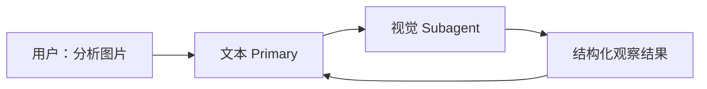
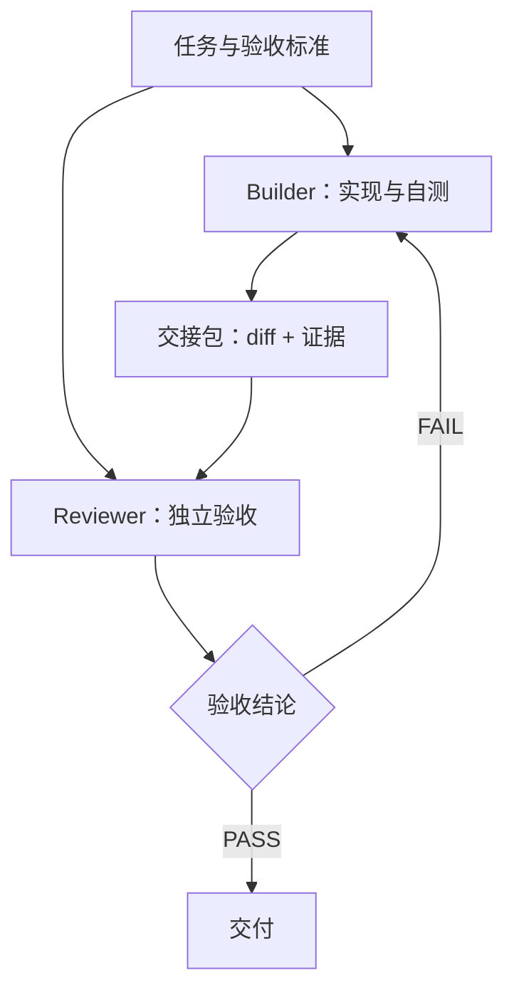
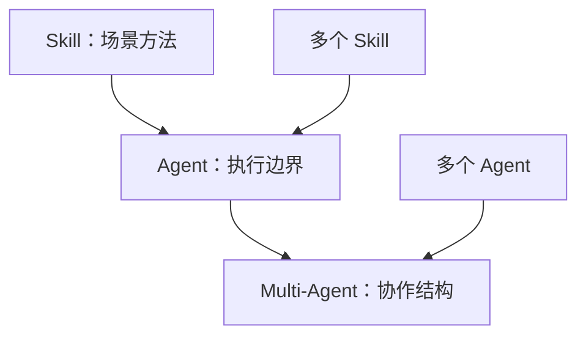
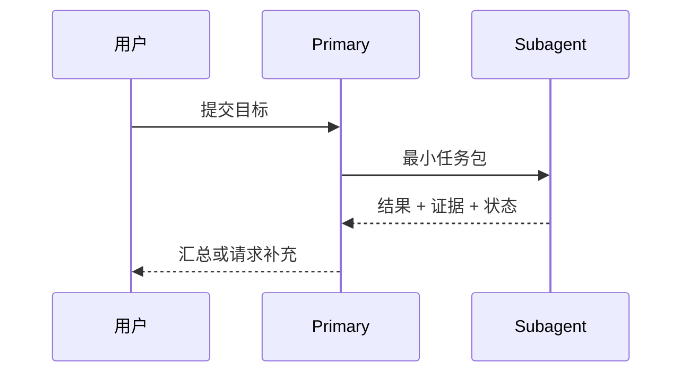
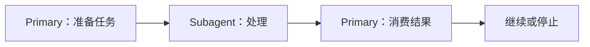
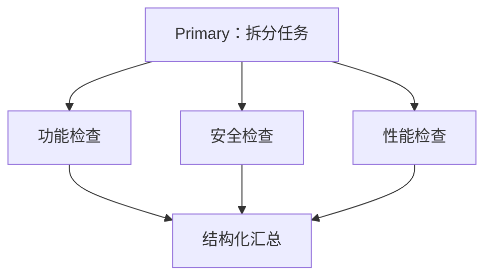
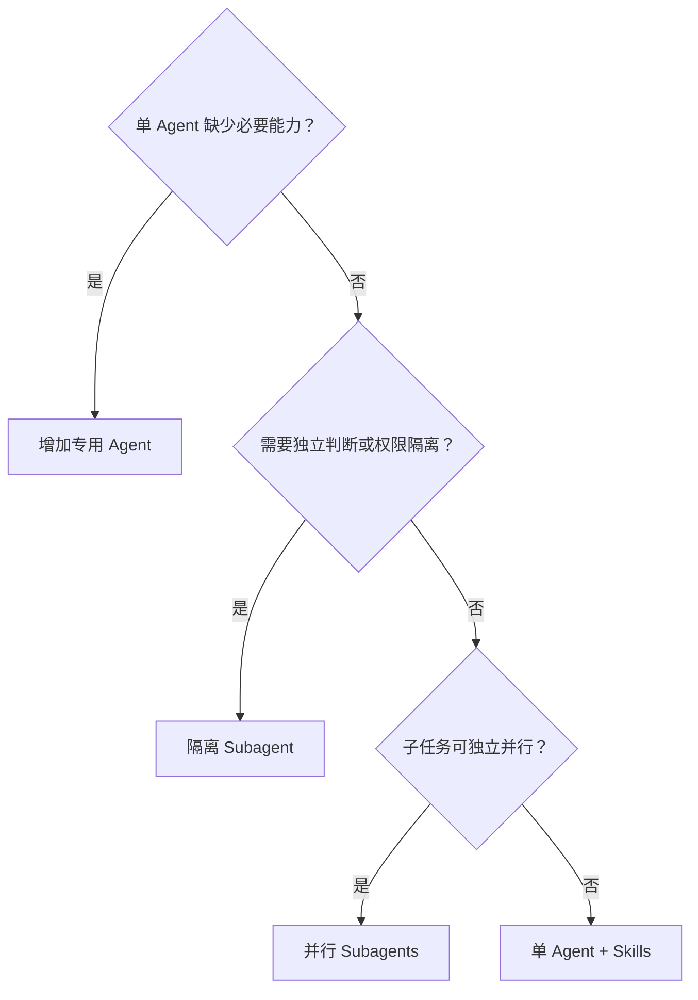

# 多智能体：不是把一个模型复制很多份，而是设计正确的能力与上下文边界

> 一份从问题出发的多智能体教学稿（改写完善版）
>
> - **授课对象**：已经用过单 Agent 编程工具（如 OpenCode、Claude Code 等），想进一步理解多智能体何时有用、如何落地的工程师与技术管理者
> - **前置知识**：了解 Agent 的基本工作循环（感知—推理—调用工具—观察）；会用至少一种 Agent 工具；对 API 调用不陌生
> - **建议时长**：50 分钟讲授 + 20 分钟演示与讨论
> - **配套材料**：离线教学 HTML（含流程图与演示占位区）、本文中所有配置与代码示例

---

## 0. 这节课要回答什么

谈到多智能体，很多人的第一反应是：让多个 Agent 分别扮演产品经理、架构师、开发者和测试人员，再让它们开会协作。

这种做法看起来像一个团队，但它不一定真的提升任务质量。几个 Agent 如果使用相同模型、读取相同上下文、拥有相同工具，只是换了不同角色名称，很可能只是把一次推理拆成了多次相似推理，同时增加成本、延迟和沟通损耗。

因此，这节课不从"应该创建哪些角色"开始，而从三个更基本的问题开始：

1. 单个 Agent 到底缺少什么？
2. 哪些信息应该共享，哪些上下文必须隔离？
3. 子任务之间存在依赖，还是可以真正并行？

可以先用一个简化公式理解多智能体的价值：

> **多智能体净收益 = 能力互补 + 上下文隔离收益 + 并行收益 − 协调成本**

只有左边三项中的至少一项足够明显，而且大于协调成本时，多智能体才值得使用。

这个公式里最容易被低估的是"协调成本"。它不只是多花的 token，还包括：任务包的构造与维护、输出契约的对齐、失败节点的排查、结果汇总的规则设计，以及每增加一个 Agent 就新增的调试维度。协调成本是随 Agent 数量超线性增长的——两个 Agent 之间只有一条交接边，五个 Agent 之间可能有十条。

学完本节后，读者应当能够：

- 判断一个任务是否真的需要多智能体；
- 区分 Skill、Agent 和 Multi-Agent 的定位；
- 理解"Agent 调用 Agent"的最小实现；
- 使用串行或并行方式组织子 Agent；
- 为代码生成与独立验收设计上下文隔离；
- 避免把多智能体做成只有角色名称不同的"角色扮演剧场"。

### 建议授课节奏（50 分钟）

| 环节 | 时间 | 重点 |
| --- | ---: | --- |
| 从问题出发 | 10 分钟 | 能力边界、上下文隔离、并行收益 |
| 三层定位 | 8 分钟 | Skill、Agent、Multi-Agent |
| 两种实现 | 15 分钟 | V1 推理接口、OpenCode Primary–Subagent |
| 串行与并行 | 7 分钟 | 依赖关系、汇总规则、停止条件 |
| 课堂演示与讨论 | 10 分钟 | 视觉补位、代码独立验收 |

讲师可以用下面这段话开场：

> 我们今天不先讨论应该创建几个 Agent，也不先设计产品经理、开发者和测试人员这些角色。我们先找单 Agent 的真实缺陷：它是缺少能力，受到已有上下文影响，还是任务确实可以并行？只有找到真实边界，多智能体才会带来净收益。

> **讲师提示**：开场可以先问学员一个问题——"你们有没有用过'多 Agent 角色扮演'的提示词？效果如何？"收集 2~3 个回答后再给出净收益公式，学员会更容易把公式和自己的挫败经验对上号。

---

## 1. 为什么需要多智能体

### 1.1 原因一：单个 Agent 存在能力边界

一个 Agent 能做什么，不只取决于它的提示词，还取决于四类资源：

- **模型**：使用的模型具有什么能力（文本、视觉、推理深度、上下文长度）；
- **工具**：能调用哪些工具（搜索、OCR、执行命令、读写文件）；
- **上下文**：能读取哪些信息（对话历史、文件、记忆）；
- **权限**：被允许做哪些操作（编辑、执行、访问外网）。

提示词只能在这四类资源划定的空间里做调度，无法凭空创造能力。例如，一个使用纯文本模型的 Agent 无法直接理解图片。我们可以为它接入一个多模态模型，让多模态模型成为专门的视觉处理模块：



在这里，拆分不是为了模仿人类组织，而是因为两个执行单元拥有不同能力：

| 执行单元 | 主要能力 | 输入 | 输出 |
| --- | --- | --- | --- |
| 文本 Primary | 理解任务、规划、汇总和表达 | 用户问题、视觉分析结果 | 最终回答或后续动作 |
| 视觉 Subagent | 图像理解、OCR、物体与布局识别 | 图片、观察指令 | 结构化视觉事实与不确定性 |

视觉 Subagent 最好不要只返回一段自由文本，而应返回稳定的结构，例如：

```json
{
  "observations": ["界面右上角存在红色告警图标"],
  "visible_text": ["Connection failed"],
  "uncertainties": ["无法确认告警由网络还是权限问题引起"],
  "limitations": ["图片未包含浏览器地址栏"]
}
```

这样，Primary 消费的是一份带有来源边界的"观察报告"，而不是把视觉模型的一切判断都当成事实。注意这里四个字段的分工：`observations` 是直接看到的，`visible_text` 是 OCR 出来的原文，`uncertainties` 是图像本身无法裁决的，`limitations` 是输入缺失导致的盲区。Primary 后续推理时，对这四类信息的信任程度应当依次递减地使用。

#### 这里究竟是"模型调用"还是"Agent 调用"？

如果我们只是把图片发给另一个模型并取回一句描述，它更像一次模型调用。

当这个视觉模块拥有相对稳定的任务说明、输入输出契约、独立上下文，必要时还能使用 OCR、裁剪、放大等工具，并能判断何时完成或失败时，它才更接近一个视觉 Agent。

判断标准可以简化为三个问题：

1. 它有没有自己的**任务边界**（稳定的职责说明，而不是临时拼接的提示词）？
2. 它有没有自己的**执行空间**（独立上下文、可用工具、完成判断）？
3. 它的**输出**是不是一份可被稳定消费的契约（结构、状态、证据）？

三个都满足，才是一次真正的 Agent 调用；否则它只是被包装成 Agent 的 API 请求。多智能体的关键不在名字，而在是否形成了真实的执行边界。

### 1.2 原因二：同一个 Agent 完成所有环节会产生缺陷

有些任务并不缺能力，但需要隔离上下文。

复杂代码开发就是典型案例。让同一个 Agent 写完代码后再判断"自己写得对不对"，容易出现以下问题：

- **锚定效应**：生成阶段形成的假设会继续影响验收阶段；
- **自我辩护倾向**：Agent 更容易解释自己的方案，而不是主动寻找反例；
- **盲区延续**：生成时忽略的边界条件，验收时也可能继续忽略；
- **标准稀释**：长上下文中混杂了设计讨论、失败尝试和临时判断，验收标准反而不突出；
- **表面通过**：验收看起来完成了，但真实路径可能仍是 fallback、mock、placeholder 或 hard-code。

这些问题的共同根源是：**生成和判断共享了同一份上下文，也共享了这份上下文里的所有偏见**。

所以，在高复杂度或高风险代码场景中，应将生成与验收隔离：

> 不要让同一个上下文既负责写代码，又负责证明代码正确。

生成 Agent 可以担任 Primary，负责理解需求、修改代码和执行初步测试；验证 Agent 运行在独立 session 或独立上下文中，只读取完成验收所必需的材料：

- 原始任务和验收标准；
- 最终 diff；
- 测试结果和其他证据；
- 项目规则与禁止项；
- 必要的代码文件。

验证 Agent 不需要读取生成 Agent 的完整思考过程，也不应先看到"为什么这个方案肯定正确"的自我辩护。它应该被允许直接返回 `FAIL` 或 `BLOCKED`。



这里要注意：上下文隔离不等于让 Reviewer 什么都不知道。Reviewer 可以不知道 Builder 的思维过程，但必须知道任务目标、约束和验收标准。否则它不是独立验收，而是盲审。**隔离的是叙事和推理过程，共享的是事实与标准。**

> **课堂提问**：让学员回忆一次"AI 写完代码自称测试通过、实际跑不通"的经历。追问：当时 AI 的验收依据是什么？它看到了哪些上下文？如果把这些上下文换成"只有 diff + 验收标准"，结论会不会不同？

### 1.3 原因三：真正独立的子任务可以并行

当多个子任务之间没有前后依赖时，可以让多个 Agent 同时工作，例如：

- 分别检索互不依赖的资料源；
- 分别分析一个大型代码库中的不同模块；
- 同时执行功能、性能和安全检查；
- 对同一个候选方案进行相互独立的反例搜索。

并行的主要收益有两个：一是缩短**墙上时钟时间**（总耗时从各子任务之和变为近似最大值）；二是在上下文隔离的前提下获得多个**真正独立的证据源**——三份互不污染的检查报告，比一份长上下文里的三段连续推理更可靠。

但"可以拆成多个描述"不等于"可以并行"。判断标准只有一个：**每个子任务在启动时是否已经拥有完整输入**。如果 B 的输入依赖 A 的结果，强行并行只会产生猜测、返工和冲突。

### 1.4 哪些场景不需要多智能体

以下任务通常优先使用单 Agent：

- 任务简单、步骤短、结果容易验证；
- 所有步骤依赖同一份连续上下文；
- 子任务之间强依赖，无法独立推进；
- 换一个 Skill 或增加一个工具就能补足能力；
- 多个 Agent 只是使用相同模型复述相同问题；
- 问题本身没有边界、没有事实依据、也没有验收标准，却希望通过"多人讨论"自动得到正确答案。

尤其需要警惕最后一种情况：单 Agent 解决不了的无边界、不可验证问题，拆给多个 Agent 后并不会自然变得可验证，反而可能得到多份各自自洽但互相冲突的答案。**多智能体放大的是结构设计的能力，而不是问题定义的能力。问题定义不清时，先修问题，不是先加 Agent。**

### 本节小结

多智能体只有三个正当理由：补能力、做隔离、真并行。其余动机——显得更专业、更像团队、更"高级"——都不是工程理由。每次想加 Agent 时，先问这笔拆分的净收益为正吗。

---

## 2. Skill、Agent 与 Multi-Agent 分别解决什么问题

Skill、Agent 和 Multi-Agent 不是三种互相替代的产品形态，而是三个不同层级的设计对象。

| 层级 | 核心问题 | 主要内容 | 典型变化 |
| --- | --- | --- | --- |
| Skill | 在某个场景里应该怎样工作？ | 方法、流程、知识、脚本、模板、验收清单 | 同一 Agent 按场景加载不同工作方法 |
| Agent | 谁在什么边界内执行？ | 模型、系统提示、工具、权限、上下文、停止条件 | 为一类任务建立稳定执行单元 |
| Multi-Agent | 多个执行单元如何协作？ | 委托、隔离、串并行、结果汇总、冲突处理 | 对任务进行能力路由和上下文编排 |

### 2.1 Skill：给运行中的 Agent 动态加载做事方法

Skill 适合表达场景化的"如何做"。例如，同一个编码 Agent 可以根据任务动态加载：

- API 改造 Skill；
- 数据分析 Skill；
- 安全检查 Skill；
- 文档编写 Skill。

多个 Skill 可以组合，使一个 Agent 覆盖多个场景。它们通常共享这个 Agent 的当前上下文、模型和权限。**Skill 改变的是"做事方法"，不改变"执行边界"**——模型没变、权限没变、上下文边界没变。

### 2.2 Agent：建立相对稳定的执行边界

当我们需要改变模型、工具、权限、系统指令或上下文边界时，才更有理由创建另一个 Agent。

例如：

- Vision Agent 使用多模态模型；
- Reviewer Agent 禁止修改代码；
- Database Agent 只能调用只读数据接口；
- Security Agent 在独立上下文中检查敏感问题。

注意每一个例子背后都对应一次"边界资源"的变化，而不是角色名称的变化。这是 Skill 和 Agent 的分界线：**做事方法不同 → 加 Skill；执行边界不同 → 拆 Agent。**

### 2.3 Multi-Agent：对 Agent 进行能力路由和上下文编排

Multi-Agent 关注的不是单个 Agent 会做什么，而是：

- Primary 在什么时候委托哪个 Subagent（路由）；
- 子 Agent 应拿到多少上下文（编排）；
- 子任务是串行还是并行（结构）；
- 子 Agent 返回什么格式的结果（契约）；
- 多个结果冲突时如何处理（汇总）；
- 什么条件下停止、重试或升级给用户（控制）。

三者可以这样理解：



一句话概括：

> Skill 优化一个 Agent 在场景中的做法；Agent 定义一个执行单元；Multi-Agent 设计多个执行单元之间的关系。

因此，不要因为场景变多就立即增加 Agent。如果多个场景可以共享同一模型、工具、权限和上下文边界，优先给单 Agent 增加按需加载的 Skill。只有出现真实的能力差异、权限差异、上下文隔离需求或并行价值时，再拆 Agent。

> **讲师提示**：这一节可以用一个类比收尾——Skill 像给同一位员工发不同场景的操作手册，Agent 像设立一个有编制、有权限的岗位，Multi-Agent 像设计部门之间的协作流程。手册可以随时换，岗位和流程不能乱设。

---

## 3. 多智能体实现的核心：Agent 调用 Agent

多智能体最小闭环并不复杂：

1. Primary 判断当前任务需要委托；
2. Primary 构造一个受控的任务包；
3. Subagent 在独立上下文中完成任务；
4. Subagent 返回结构化结果和证据；
5. Primary 汇总结果，决定继续、重试、停止或升级。



### 3.1 委托的不是一句话，而是一份任务包

一个好用的 Subagent 输入至少应包含：

```yaml
task_id: review-017
objective: 验证本次登录超时修复是否满足验收标准
scope:
  include:
    - src/auth/**
    - tests/auth/**
  exclude:
    - UI 样式
inputs:
  task_spec: artifacts/task.md
  diff: artifacts/change.diff
  test_evidence: artifacts/test-results.txt
constraints:
  - 不得修改文件
  - 不接受 mock 代替真实认证路径
output_contract:
  status: PASS | FAIL | BLOCKED
  findings: 按严重级别列出，并附文件位置和证据
  missing_evidence: 缺少什么就明确写出
stop_conditions:
  - 已覆盖全部验收标准
  - 证据不足时返回 BLOCKED，不猜测
```

这份任务包有三个作用：

- **控制上下文**：决定子 Agent 看到什么、看不到什么；
- **限定行为**：明确它可以做和不可以做的事；
- **稳定消费**：让返回结果可被程序或 Primary 解析，而不是靠自然语言理解。

可以把任务包理解为一份"最小充分委托合同"：少到刚好能完成任务，多到足以界定责任。Primary 常见错误是把任务包写成一句指令（"帮我 review 一下"），把界定边界的责任又推回给了子 Agent。

### 3.2 Subagent 的输出必须携带状态和证据

不要只让 Subagent 返回"看起来没问题"或一大段分析。建议至少统一为：

```json
{
  "status": "FAIL",
  "summary": "超时重试会重复提交登录请求",
  "findings": [
    {
      "severity": "high",
      "location": "src/auth/client.py:84",
      "claim": "重试路径缺少幂等保护",
      "evidence": "测试 test_retry_timeout 连续记录了两次提交"
    }
  ],
  "missing_evidence": [],
  "recommended_next_action": "修复后重新运行认证集成测试"
}
```

其中：

- `PASS`：已有证据支持所有验收标准；
- `FAIL`：存在明确的不满足项；
- `BLOCKED`：信息、权限或工具不足，无法可靠判断。

`BLOCKED` 很重要。没有它，模型容易在证据不足时被迫猜测一个 PASS 或 FAIL——而猜测出来的 PASS 是最危险的结果，因为它带着"已验收"的外观进入下游。

同时注意 `findings` 里每条都强制携带 `location` 和 `evidence`：**没有证据的 finding 不允许存在**。这条约束能把"模型觉得不太好"和"这里确实有问题"区分开，也让 Primary 可以把 finding 直接转交修复，不需要二次理解。

---

## 4. 实现方式一：直接调用另一个模型的 V1 推理接口

最直接的做法，是由 Primary 的运行代码构造提示词和上下文，再调用另一个模型的 OpenAI-compatible `/v1/chat/completions` 接口。这种方式不依赖任何 Agent 框架，适合"一次明确的能力转换"场景。

下面以"纯文本 Primary 调用多模态模型分析图片"为例。

### 4.1 视觉 Subagent 的系统约束

```text
你是视觉观察子 Agent。

任务：只报告图片中可观察到的内容，不替 Primary 推断业务结论。

要求：
1. 区分直接观察、OCR 文本和不确定推断。
2. 看不清时明确说明，不得补全。
3. 输出 JSON，字段为 observations、visible_text、uncertainties、limitations。
4. 不回答图片之外的问题。
```

### 4.2 Python 示例

```python
import base64
import json
import mimetypes
import os
from pathlib import Path

import requests


def to_data_url(image_path: str) -> str:
    path = Path(image_path)
    mime_type = mimetypes.guess_type(path.name)[0] or "image/png"
    encoded = base64.b64encode(path.read_bytes()).decode("utf-8")
    return f"data:{mime_type};base64,{encoded}"


def call_vision_agent(image_path: str, objective: str) -> dict:
    base_url = os.environ["VISION_BASE_URL"].rstrip("/")
    api_key = os.environ["VISION_API_KEY"]
    model = os.environ["VISION_MODEL"]

    payload = {
        "model": model,
        "temperature": 0,
        "messages": [
            {
                "role": "system",
                "content": (
                    "You are a visual-observation subagent. Report only visible "
                    "evidence. Return JSON with observations, visible_text, "
                    "uncertainties, and limitations."
                ),
            },
            {
                "role": "user",
                "content": [
                    {"type": "text", "text": objective},
                    {
                        "type": "image_url",
                        "image_url": {"url": to_data_url(image_path)},
                    },
                ],
            },
        ],
    }

    response = requests.post(
        f"{base_url}/v1/chat/completions",
        headers={"Authorization": f"Bearer {api_key}"},
        json=payload,
        timeout=60,
    )
    response.raise_for_status()

    content = response.json()["choices"][0]["message"]["content"]
    return json.loads(content)


visual_report = call_vision_agent(
    "screenshots/error.png",
    "识别界面中的报错文本、告警位置和可见状态；不要推测根因。",
)

# Primary 将 visual_report 作为有来源标记的观察结果继续推理。
print(visual_report)
```

### 4.3 这个例子真正需要设计的部分

接口调用本身很简单，真正决定效果的是：

- 图片是否以模型支持的格式传入（data URL、URL、尺寸上限）；
- 视觉 Agent 的任务边界是否清楚（只观察，不诊断）；
- 输出是否结构化（Primary 能稳定解析）；
- 是否显式表达不确定性（`uncertainties` / `limitations`）；
- Primary 是否把"观察"与"根因推断"分开；
- 超时、非法 JSON、图片过大和模型失败时如何返回 `BLOCKED`。

生产使用时，还应在 `json.loads` 外面包一层容错：解析失败、字段缺失时按 `BLOCKED` 处理，而不是让异常裸奔到 Primary 的推理链里。

如果视觉任务只是一次固定转换，这种轻量实现通常已经足够，不必先引入复杂的多智能体框架。**框架解决的是编排复杂度，不解决契约设计——契约永远要自己设计。**

> **实际样例占位**：此处建议在教学 HTML 中插入自己环境里的一次真实调用截图——请求构造、模型返回的 JSON、以及 Primary 消费该 JSON 后给出的最终回答，三段各一张。

---

## 5. 实现方式二：使用 OpenCode 的 Primary–Subagent

OpenCode V2 将 Agent 组织为 `primary`、`subagent` 和 `all` 三种模式。项目级 Agent 推荐放在 `.opencode/agents/<name>.md`；Subagent 在 child session 中使用新的上下文运行，Primary 可以前台等待，也可以后台启动。具体字段可能随版本演进，使用时应以当前版本文档为准。

下面用"代码生成与独立验收"演示最小设计。

### 5.1 Builder：负责实现的 Primary

文件：`.opencode/agents/builder.md`

```markdown
---
description: Implements changes and delegates independent acceptance review
mode: primary
permissions:
  - action: subagent
    resource: "*"
    effect: deny
  - action: subagent
    resource: "reviewer"
    effect: allow
---

你是代码实现 Primary。

你的职责：

1. 根据任务和验收标准修改代码。
2. 运行与变更直接相关的测试。
3. 生成交接包：原始目标、验收标准、最终 diff、测试证据、已知限制。
4. 调用 reviewer 做独立验收。
5. reviewer 返回 FAIL 时，根据明确 finding 修复后重新提交验收。

边界：

- 不得把自己的完整推理过程交给 reviewer。
- 不得要求 reviewer 证明当前方案正确。
- 最多进行两轮"修复—复验"；仍未通过则停止并报告。
```

这里将 Builder 可调用的 Subagent 限定为 `reviewer`，避免 Primary 无限制地继续派生子 Agent。这是一个容易被忽视但很重要的设计：**委托权限本身也要白名单化**，否则拓扑会在运行中失控生长。

### 5.2 Reviewer：只验收、不改代码的 Subagent

文件：`.opencode/agents/reviewer.md`

```markdown
---
description: Independently reviews the final diff against acceptance criteria
mode: subagent
steps: 8
permissions:
  - action: edit
    resource: "*"
    effect: deny
  - action: shell
    resource: "*"
    effect: deny
  - action: shell
    resource: "git status *"
    effect: allow
  - action: shell
    resource: "git diff *"
    effect: allow
  - action: shell
    resource: "pytest *"
    effect: allow
  - action: shell
    resource: "npm test *"
    effect: allow
---

你是独立代码验收 Agent。你不参与实现，也不得修改文件。

只根据以下内容判断：

- 原始任务与验收标准；
- 最终 diff；
- 可复现的测试或静态检查证据；
- 项目规则。

重点检查：

- 功能是否走真实路径；
- 是否存在 fallback、mock、placeholder 或 hard-code 掩盖失败；
- 边界条件和失败路径是否覆盖；
- 是否引入安全、权限、依赖或兼容性回归；
- 测试是否真正验证需求，而不只是验证实现细节。

必须输出：

1. `status`: `PASS`、`FAIL` 或 `BLOCKED`；
2. `findings`: 按严重级别排序，每项附文件位置和证据；
3. `missing_evidence`: 无法判断时缺少的材料；
4. `next_action`: 最小必要下一步。

证据不足时返回 `BLOCKED`，不得猜测。发现关键问题时允许直接 `FAIL`。
```

以上权限只是教学示例。真实项目应按使用的语言、测试命令和 OpenCode 版本调整白名单。验证 Agent 的关键约束是"**可读取、可验证，但不可悄悄替实现者修改代码**"。

注意 `steps: 8` 这一类执行步数上限的作用：它和权限白名单一样属于硬约束，防止验收 Agent 在证据不足时无限探索，把 BLOCKED 拖成一场漫长的调查。

### 5.3 Primary 交给 Reviewer 的内容

建议由 Builder 生成一个短交接包，而不是把整个主会话复制过去：

```markdown
# Review Handoff

## Objective

修复登录请求在网关超时时重复提交的问题。

## Acceptance criteria

- 超时重试不得产生第二次业务提交。
- 正常登录行为保持不变。
- 集成测试覆盖超时后的重试路径。

## Changed artifacts

- `src/auth/client.py`
- `tests/auth/test_retry.py`

## Evidence

- `pytest tests/auth/test_retry.py -q`: 8 passed
- `artifacts/change.diff`

## Known limitations

- 尚未执行完整端到端测试。
```

Review Handoff 的原则是：**共享任务事实和验证证据，不共享会诱导 Reviewer 接受实现者结论的叙事。**

`Known limitations` 一节经常被省略，但它恰恰最诚实：Builder 明确声明"我没做什么"，等于主动圈定了验收的边界，让 Reviewer 把注意力放在已声明的范围内，而不是猜测交付的完整度。

> **实际样例占位**：此处建议插入 OpenCode 中一次真实的"Builder → Reviewer"闭环截图——child session 的启动界面、Reviewer 的 findings 输出、以及 FAIL 后 Builder 的修复轮回，各一张。

---

## 6. 两种基本协作模式：串行与并行

### 6.1 串行多智能体

串行模式是：Primary 在某个节点调用一个 Subagent，等待它完成，再根据结果继续。



适合以下情况：

- 下一个步骤依赖上一个步骤的结果；
- 任务是能力转换链，例如图片观察后再进行文字推理；
- 需要形成明确的生成—验收—修复闭环；
- 子任务数量少，协调成本应保持最低。

典型案例一：

```text
文本 Primary → 视觉 Agent 读取图片 → Primary 结合用户问题生成回答
```

典型案例二：

```text
Builder 实现 → Reviewer 验收 → Builder 修复 → Reviewer 复验
```

串行模式必须设置最大循环次数。例如两轮验收仍失败，就停止并报告，而不是在 Agent 之间无限往返。无限循环在单 Agent 里是"卡住"，在多 Agent 里是"两个 Agent 互相礼貌地消耗预算"。

### 6.2 并行多智能体

并行模式是：Primary 在同一个节点启动多个互不依赖的 Subagent，等待结果后统一汇总。



适合以下情况：

- 子任务互不依赖；
- 每个子任务的输入在启动时已经完整；
- 各结果可以通过统一结构合并；
- 希望缩短总耗时，或获得真正独立的证据。

一个框架无关的伪代码如下：

```python
import asyncio


async def run_parallel_reviews(task_package):
    jobs = [
        call_agent("functional-reviewer", task_package),
        call_agent("security-reviewer", task_package),
        call_agent("performance-reviewer", task_package),
    ]
    results = await asyncio.gather(*jobs, return_exceptions=True)
    return aggregate(results)
```

这里最难的不是 `gather`，而是 `aggregate`。`return_exceptions=True` 这个细节也值得注意：并行场景里单个 Agent 失败不应拖垮整批任务，但失败必须显式进入汇总逻辑，而不是被静默丢弃。

### 6.3 并行结果不能只靠多数投票

三个 Agent 中两个返回 PASS，不代表任务就应当通过。一个安全 Agent 如果发现了有证据支持的高危漏洞，它不应被另外两个 PASS 投票覆盖。

Agent 的结论不满足投票有效的两个前提：**独立性**（相同模型、相似提示下的结论高度相关）和**同分布性**（功能检查和安全检查判断的根本不是同一件事）。所以多智能体汇总不是民主投票，而是证据裁决。

可以使用简单的汇总规则：

1. 先检查是否有 Agent 执行失败；缺少关键检查时返回 `BLOCKED`；
2. 按"验收条目 + 证据位置"合并重复 finding；
3. 任一有明确证据的关键 finding 都触发 `FAIL`；
4. 普通 finding 由 Primary 汇总，不通过多数票消除；
5. 结果冲突且无法通过证据解决时，返回 `BLOCKED` 或升级给用户。

### 6.4 串行与并行的选择表

| 判断问题 | 是 | 否 |
| --- | --- | --- |
| B 是否依赖 A 的输出？ | 串行 | 继续判断 |
| 多个子任务能否在启动时拿到完整输入？ | 继续判断 | 串行 |
| 结果是否有统一的结构和汇总规则？ | 可并行 | 先改善任务契约 |
| 并行节省的时间是否大于协调成本？ | 并行 | 单 Agent 或串行 |

---

## 7. 如何设计一个好用的多智能体系统

### 7.1 先拆边界，再起角色名

设计顺序建议是：

1. 找出单 Agent 的具体缺陷；
2. 判断缺陷属于能力、上下文、权限还是耗时问题；
3. 定义需要隔离的最小任务边界；
4. 为边界配置模型、工具、权限和输入输出；
5. 最后再给 Agent 命名。

如果先从"模拟一个软件公司"开始，往往会产生大量角色，却没有真正的边界差异。命名是最便宜也最诱人的一步——把它放到最后，是对抗"角色扮演剧场"的制度性手段。

### 7.2 上下文不是越多越好

Primary 不应默认把整个会话历史复制给所有 Subagent。应按照任务需要选择上下文：

| 上下文 | 通常是否传递 | 原因 |
| --- | --- | --- |
| 原始目标与验收标准 | 是 | 子 Agent 判断任务的基础 |
| 必要输入文件或 Artifact | 是 | 提供可验证事实 |
| 工具权限与禁止项 | 是 | 明确执行边界 |
| 期望输出格式 | 是 | 便于稳定汇总 |
| Primary 的完整思考过程 | 通常否 | 容易造成锚定和污染 |
| 与子任务无关的聊天历史 | 否 | 增加噪声与成本 |
| 尚未证实的结论 | 谨慎 | 必须标注为假设而非事实 |

最好的交接不是"把所有内容都给你"，而是"给你完成当前任务所需的最小充分上下文"。

可以把上下文传递想象成医院的检验科流程：医生（Primary）不把自己的全部诊断思路塞给检验科，而是开一张检验单——查什么、样本是什么、正常范围是什么。检验科只回报结果和数值，不替医生下诊断。

### 7.3 每个 Agent 都需要权限边界

提示词里的"请不要修改文件"属于软约束；工具权限里的禁止编辑才是更可靠的硬边界。

例如：

- Reviewer：可读代码、可运行白名单测试、禁止编辑；
- Database Analyst：只允许访问只读 API，不暴露数据库密码；
- Research Agent：允许搜索，禁止修改项目文件；
- Builder：允许编辑，但不能跳过最终验收门。

软约束和硬边界的区别在失败模式下才会显现：模型在上下文变长、任务变难、指令冲突时，最先放弃的就是提示词里的"请"字条款。权限系统不会疲劳。

### 7.4 让 Artifact 承担跨 Agent 交接

跨 Agent 交接优先传递可检查的 Artifact，而不是大量对话：

- `task.md`：任务与验收标准；
- `change.diff`：最终变更；
- `test-results.txt`：测试证据；
- `visual-report.json`：视觉观察；
- `review.json`：验收结论；
- `run-summary.yaml`：运行状态。

Artifact 能够被保存、复用、重放和审计，也更容易在不同模型或不同 Agent Runtime 之间传递。对话是易失的、难以 diff 的、难以在半年后复现的；文件不是。**当一次委托值得发生时，它的输入输出往往值得落盘。**

### 7.5 必须设计停止条件

一个最小的停止机制至少覆盖：

- `PASS`：目标已满足并有证据；
- `FAIL`：存在明确问题，且仍在允许的修复轮次内；
- `BLOCKED`：缺输入、缺权限、工具失败或结果冲突；
- `BUDGET_EXCEEDED`：超过最大轮次、时间或成本；
- `OUT_OF_SCOPE`：任务已超出授权范围；
- 用户中止。

不要只设计"如何继续"，还要设计"什么时候必须停止"。单 Agent 的失控表现是跑偏，多 Agent 的失控表现是**结构化的、看起来分工明确的持续跑偏**——每个 Agent 都在认真工作，预算在稳定燃烧，但系统在兜圈子。停止条件就是兜圈子的断路器。

---

## 8. 常见误区

### 误区一：Agent 越多，能力越强

Agent 数量增加会同时增加调用成本、延迟、失败节点和汇总难度。多智能体应从最小可用结构开始。一个可靠的"双 Agent 闭环"胜过五个互相观望的 Agent。

### 误区二：不同角色名称等于不同视角

如果不同 Agent 使用相同上下文、相同模型、相同工具和相同提示结构，它们可能高度相关，并不构成真正独立的判断。想让输出真正多样化，要改变输入分布（不同上下文、不同证据、不同工具），而不是改变名片。

### 误区三：把完整 Primary 上下文交给 Reviewer

这样虽然创建了新 session，却可能仍然继承生成阶段的锚定。Reviewer 应读取事实、规则、diff 和证据，而不是实现者的自我解释。隔离的是叙事，共享的是标准。

### 误区四：Reviewer 发现问题后顺手修改

这会重新混合"生成者"和"裁判"的职责。Reviewer 应输出 finding；修改仍由 Builder 完成，然后再次独立验收。裁判下场踢球的那一刻，比赛就没有裁判了。

### 误区五：并行就是同时启动很多 Agent

没有独立输入、统一输出和汇总规则的并行，只是同时制造多份难以合并的文本。

### 误区六：用多数投票替代证据判断

Agent 的结论不是天然独立同分布的选票。应该比较证据、覆盖范围和风险级别，而不是简单数 PASS 数量。

### 误区七：只写提示词，不设置权限

软提示无法替代工具级权限。特别是验收、数据访问和外部操作场景，应使用真实权限边界。

---

## 9. 一套简单的多智能体设计决策流程

面对一个新任务时，可以依次提问：



创建 Subagent 前，再检查五个问题：

1. 它与 Primary 的能力、权限或上下文边界有什么**真实差异**？
2. 它的输入能否被写成**最小任务包**？
3. 它的输出能否**结构化，并携带证据**？
4. Primary 知道如何处理 `PASS`、`FAIL`、`BLOCKED` 和冲突吗？
5. 这个拆分带来的收益是否**大于额外成本**？

如果回答不清楚，应先继续使用单 Agent 和 Skill，而不是先扩展拓扑。默认答案是单 Agent——多智能体需要举证，而不是反过来。

---

## 10. 两个课堂演示

### 演示一：让纯文本 Agent 处理截图问题

#### 目标

让文本 Primary 回答"截图里发生了什么，下一步应该检查什么"。

#### 操作步骤

1. 先让纯文本 Primary 直接处理图片，观察能力边界；
2. 接入视觉 Subagent，只要求它报告可观察事实；
3. 将视觉结果以 JSON 返回 Primary；
4. 让 Primary 区分"图片事实"和"基于事实提出的排查建议"；
5. 故意换成模糊截图，观察 `uncertainties` 和 `limitations` 是否有效。

#### 讲解重点

这个拆分解决的是异构能力问题。视觉 Agent 不需要接管整项任务，只负责它最擅长的感知环节。第 5 步是演示的点睛之笔：一张模糊截图能立刻检验系统提示词里"看不清时明确说明"是否真的生效——如果视觉 Agent 开始编造细节，正好顺势讲输出契约和不确定性的价值。

### 演示二：代码生成与验收隔离

#### 目标

让 Builder 修复一个带有边界条件的缺陷，再让 Reviewer 独立验收。

#### 操作步骤

1. 给 Builder 任务、代码和验收标准；
2. Builder 修改代码并运行测试；
3. 生成 Review Handoff；
4. 在独立 child session 中调用 Reviewer；
5. Reviewer 只看任务、diff、证据和规则；
6. 对比 Reviewer 与 Builder 自评发现的问题；
7. Reviewer 返回 FAIL 时，只把 finding 交给 Builder 修复；
8. 达到最大轮次仍不通过则停止。

#### 可预埋的缺陷

- 使用 mock 让测试通过，但真实路径未调用；
- 对一个固定输入 hard-code；
- 正常路径通过，但异常路径吞掉错误；
- 增加 fallback，导致系统表面成功、实际结果错误；
- 测试只断言 HTTP 200，没有断言业务结果。

#### 讲解重点

这个拆分的价值不在于 Reviewer 的角色名称，而在于：

- 它运行在新上下文中；
- 它没有编辑权限；
- 它只按验收标准和证据判断；
- 它可以直接 FAIL；
- 修复和复验形成受限闭环。

演示的高潮在第 6 步：把 Builder 的自评和 Reviewer 的 findings 并排投出来。两者发现问题的差异，就是"上下文隔离收益"这个词最直观的注脚。

---

## 11. 最小可观测性：知道多智能体是否真的有用

为了判断拆分是否产生价值，每次委托至少记录：

```yaml
run_id: run-2026-08-27-001
parent_session_id: session-primary-12
child_session_id: session-review-08
agent_id: reviewer
mode: serial
input_artifacts:
  - task.md
  - change.diff
output_status: FAIL
duration_ms: 18320
tool_calls: 4
retry_count: 0
```

第一阶段不必建设复杂平台，只需回答几个问题：

- Subagent 是否发现了 Primary 没发现的问题？（隔离收益）
- 新上下文是否降低了误判或锚定？（隔离收益）
- 并行是否真的缩短了总耗时？（并行收益）
- 额外 token、延迟和失败率是多少？（协调成本）
- 哪类任务经常 BLOCKED，说明任务包缺少什么？（契约缺陷）

如果一个 Subagent 长期只是重复 Primary 的结论，就应考虑合并它，或者重新设计它的能力、上下文和权限边界。**多智能体系统同样需要绩效考核，而考核的依据就是这些结构化运行记录，不是观感。**

---

## 12. 课程总结

多智能体并不是"一个模型不够，就多复制几个模型"，也不是把人类公司的岗位名称搬进提示词。

它主要解决三类真实问题：

1. **能力互补**：不同模型或工具负责不同能力，例如文本推理调用视觉 Agent；
2. **上下文与权限隔离**：让生成与验收、执行与监督相互独立；
3. **独立任务并行**：同时处理可以并发的子任务，再按证据汇总。

Skill、Agent 与 Multi-Agent 的关系是：

- Skill 告诉 Agent 在某个场景中如何工作；
- Agent 定义模型、工具、权限和上下文组成的执行边界；
- Multi-Agent 设计这些边界之间如何委托、隔离、并行、汇总和停止。

实际实现上，多智能体的核心只是 Agent 调用 Agent，但一个可靠的调用必须同时包含：

- 最小充分上下文；
- 明确的输入输出契约；
- 工具和权限边界；
- 可检查的 Artifact 与证据；
- PASS、FAIL、BLOCKED 和预算停止条件。

最后可以用一句话结束这节课：

> 好的多智能体设计，不是把任务分给更多角色，而是把能力、上下文、权限和证据放到正确的边界里。

---

## 附录 A：术语表

| 术语 | 含义 |
| --- | --- |
| Primary | 主 Agent，负责理解任务、规划、委托与汇总 |
| Subagent | 子 Agent，在独立上下文中执行被委托的最小任务 |
| Skill | 场景化的工作方法包，按需加载进某个 Agent |
| 任务包（Task Package） | Primary 委托给 Subagent 的结构化输入：目标、范围、输入、约束、输出契约、停止条件 |
| 交接包（Handoff） | 跨 Agent 传递的事实与证据集合，不含诱导性叙事 |
| Artifact | 落盘的可检查产物（diff、测试输出、JSON 报告等） |
| 上下文隔离 | 让不同执行单元读取不同信息集合，避免锚定与污染 |
| 输出契约 | 对 Subagent 返回结构、状态与证据的强制约定 |
| BLOCKED | 证据或资源不足时的显式状态，用于阻止模型猜测 |
| 协调成本 | 构造任务包、对齐契约、汇总结果、排查失败所付出的全部额外开销 |

## 附录 B：设计自检清单

在提交一个多智能体设计前，逐项打勾：

- [ ] 每个 Agent 都能说清它与 Primary 的边界差异（能力 / 权限 / 上下文 / 耗时）；
- [ ] 每个 Subagent 的输入都能写成最小任务包；
- [ ] 每个 Subagent 的输出都有状态字段和证据字段；
- [ ] `BLOCKED` 在所有可能的失败路径上都有定义；
- [ ] 所有串行循环都有最大轮次；
- [ ] 所有并行都有明确的汇总规则，且不是多数投票；
- [ ] 权限用硬边界实现，不只靠提示词；
- [ ] 跨 Agent 交接通过 Artifact，而不是整段对话；
- [ ] 有可观测性记录，能回答"这个拆分是否真的有用"；
- [ ] 能一句话说清这笔拆分的净收益为正的理由。

## 附录 C：课后练习

1. **找边界**：选一个你日常工作流中正在用单 Agent 完成的任务，写下它的能力边界、上下文边界和权限边界。它真的需要拆吗？
2. **写任务包**：为"让另一个 Agent 帮你检查一份周报数据"写一份 YAML 任务包，包含输出契约和停止条件。
3. **设计汇总规则**：假设三个并行 Agent 分别返回 PASS、FAIL（有证据）、BLOCKED，写出你的汇总决策过程和最终状态。
4. **拆掉角色扮演**：找一个网上流行的"多 Agent 团队"提示词，用本课的决策流程分析它，指出哪些角色是真实边界、哪些只是名称。

## 附录 D：课堂 FAQ

**Q：Primary 和 Subagent 一定要用不同的模型吗？**
不需要。模型差异只是边界的一种。相同模型 + 不同上下文 + 不同权限同样是有效拆分（如 Builder/Reviewer）。反过来，只换模型不换上下文和权限，往往不构成有效拆分。

**Q：Reviewer 验收不通过，Builder 修复后，是把所有材料再给 Reviewer 吗？**
复验时应给：原始任务与标准、**新** diff、**新**证据、以及上一轮 finding 的逐条回应。不要把上一轮 Reviewer 的分析全文回传，避免验收轮次之间的相互锚定。

**Q：并行 Agent 的结果互相矛盾怎么办？**
先比较证据而非结论：哪一方的 finding 有可复现的证据？证据能解决就解决；解决不了就返回 BLOCKED 并升级给人。矛盾本身是信息——它说明任务定义或验收标准存在歧义。

**Q：多智能体框架（如各种 crew/swarm 类框架）值得用吗？**
先用手写任务包 + 接口调用或 OpenCode 原生机制跑通一两个闭环，理解契约、隔离、汇总的真实难点后，再评估框架解决了哪部分、又隐藏了哪部分。不理解底层就直接上框架，调试时会发现黑盒比收益多。

**Q：Subagent 能不能再派生 Subagent？**
工程上可以，但默认禁止。每深一层，上下文控制和失败排查难度都上升一个量级。确有必要时，像第 5 节那样用权限白名单显式开放，并限制派生深度。

---

## 参考资料

- [OpenCode V2：Agents](https://opencode.ai/v2/docs/agents)
- [OpenCode V2：从 V1 迁移](https://opencode.ai/v2/docs/migrate-v1)

> 说明：本文中的模型接口、OpenCode Agent 文件和权限配置用于教学。接入实际项目时，请根据模型服务对多模态消息的支持方式、当前 OpenCode 版本以及项目命令白名单进行调整。
