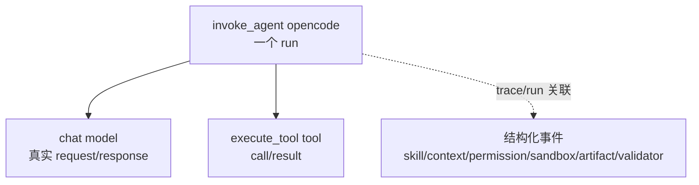

# OpenCode 会话可观测最小基线

这套方案的核心不是“把所有日志都塞进一张表”，而是建立一个可关联的最小闭环：

- 一次用户提交到 `session.idle/error` 是一个 `run`，对应根 span：`invoke_agent opencode`。
- 每次模型请求和工具调用是一个 `step`，分别对应 `chat <model>` 与 `execute_tool <tool>` 子 span。
- skill、context、权限、sandbox、artifact、validator 是事件/结构化日志。
- latency、token、cost、failure 进入 span 属性与少量低基数 metrics。
- 全部信号用 `trace_id + task/run/step/attempt` 关联。



## 1. 为什么分成两层采集

OpenCode 插件可以稳定捕获 session/message、permission、file 和 `tool.execute.before/after`；OpenCode 也通过原生 `skill` tool 按需加载技能。因此插件层很适合记录 run、tool、skill 与权限事件。

但是，仅靠插件不能稳定取得“发送给模型的最终序列化请求体”和完整流式响应。参考实现增加一个很薄的 OpenAI-compatible 代理，专门记录真实 request/response、provider token usage 和 context 分布。这样无需修改 OpenCode 核心代码。

两层职责如下：

| 层 | 负责记录 | 不负责猜测 |
| --- | --- | --- |
| `.opencode/plugins/opencode-otel.ts` | run、tool、skill、permission、artifact、OpenCode token/cost 汇总 | 最终模型 HTTP body、bwrap 内部结果 |
| `src/model-proxy.ts` | `/v1/chat/completions` request/response、stream、usage、context、估算成本 | OpenCode 内部 session 状态 |
| `POST /events` | bwrap/sandbox、validator、外部 artifact 生命周期 | 自动推断业务含义 |

第一版明确只覆盖 OpenAI-compatible `/v1/chat/completions`。如果当前 provider 使用 `/v1/responses` 或 Anthropic 原生协议，保持字段模型不变，只替换代理中的协议解析器。

## 2. ID 定义：先固定语义，再做 Dashboard

| ID | 定义 | 生成方式 |
| --- | --- | --- |
| `agent.task.id` | 跨会话的业务任务 | 平台注入 `AGENT_TASK_ID`；没有时退化为 session ID |
| `agent.run.id` | 一次用户提交到 idle/error | 插件收到 user `message.updated` 时生成 UUID |
| `agent.step.id` | 一次模型请求或工具调用 | `<run_id>:<递增序号>` |
| `agent.attempt` | 同一逻辑 step 的重试序号 | 由调度器显式注入；无法判断时固定为 `1` |
| `gen_ai.conversation.id` | OpenCode 会话 | OpenCode session ID |

不要根据“连续两次调用了相同工具”自动推断 retry；它可能是合法的多步操作。等平台真正实现 retry scheduler 时，再让 scheduler 保持 step key 并递增 attempt。

## 3. 最小信号与字段

### Trace

根 span：

```text
name: invoke_agent opencode
gen_ai.operation.name: invoke_agent
gen_ai.agent.name: opencode
agent.task.id / agent.run.id / agent.attempt
gen_ai.conversation.id
agent.run.model_calls / agent.run.tool_calls
gen_ai.usage.input_tokens / gen_ai.usage.output_tokens
agent.cost.usd / agent.run.end_reason / error.type
```

模型 span：

```text
name: chat <model>
gen_ai.operation.name: chat
gen_ai.provider.name
gen_ai.request.model / gen_ai.response.model
gen_ai.usage.input_tokens / gen_ai.usage.output_tokens
gen_ai.response.finish_reasons
agent.model.request.sha256 / agent.model.response.sha256
agent.cost.usd / error.type
```

工具 span：

```text
name: execute_tool <tool>
gen_ai.operation.name: execute_tool
gen_ai.tool.name / gen_ai.tool.call.id
gen_ai.tool.call.arguments / gen_ai.tool.call.result   # 受内容策略控制
agent.tool.arguments.sha256 / agent.tool.result.sha256
error.type
```

### Event / structured log

| 事件 | 关键字段 | 来源 |
| --- | --- | --- |
| `agent.run.started/finished` | run IDs、duration、end reason | 插件 |
| `agent.skill.load.requested/loaded/unloaded` | skill name、step、unload reason | `skill` tool + compaction/run end |
| `agent.context.summary` | source 列表、估算 token、provider input token | 模型代理 |
| `agent.permission.asked/replied/decision` | permission、pattern、decision | OpenCode event/hook |
| `agent.sandbox.event` | engine、action、decision、reason | bwrap wrapper 主动上报 |
| `agent.artifact.changed` | artifact id/name/path/action | `file.edited` 或外部上报 |
| `gen_ai.evaluation.result` | validator name、score/label、error | validator 主动上报 |
| `gen_ai.client.inference.operation.details` | request/response、usage、model | 模型代理 |

OpenCode 没有一个对应“skill 从模型上下文中被物理卸载”的稳定事件。本实现把它定义成逻辑生命周期：skill tool 成功后 `loaded`，发生 compaction 或 run 结束时 `unloaded`。这比伪造一个精确的上下文删除时刻更可靠。

### Metric

只保留 8 个：

- `gen_ai.client.operation.duration`
- `gen_ai.client.token.usage`
- `gen_ai.invoke_agent.duration`
- `gen_ai.invoke_agent.inference_calls`
- `gen_ai.invoke_agent.tool_calls`
- `gen_ai.execute_tool.duration`
- 自定义 `agent.cost`
- 自定义 `agent.failures`

`task_id/run_id/step_id/session_id/path` 只放 trace/log，禁止作为 metric label。metric label 只使用低基数字段，例如 model、provider、tool、end reason、failure reason、validator name。

## 4. Context token 的诚实口径

- 模型返回的 input/output usage 是总 token 的权威值。
- 每种 context 来源的 token 仅使用 `字符数 / 4` 估算，并明确写入 `agent.context.token_method`。
- 来源至少分成 `system_instructions`、`conversation.user`、`conversation.assistant`、`skill`、`tool_result`、`tool_definitions`。
- 需要精确分源 token 时，再按实际模型接入 tokenizer；不要在第一版同时维护多套 tokenizer。

## 5. 内容与安全策略

环境变量 `AGENT_OTEL_CAPTURE_CONTENT` 支持：

- `off`：不记录正文，只记录 byte size 与 SHA-256。生产默认建议。
- `redacted`：记录限长正文，按 secret key、Bearer token、常见 API key 进行基础脱敏。开发/灰度建议。
- `full`：记录完整正文（仍受长度上限控制）。仅限明确授权的隔离环境。

`AGENT_OTEL_MAX_CONTENT_CHARS` 默认 `65536`。代理会在转发上游前剥离 `x-agent-*` 私有头；仅当 OpenCode 指向本地代理时设置 `AGENT_OTEL_INJECT_PRIVATE_HEADERS=1`。

基础脱敏只能减少误采集，不能替代企业 DLP、租户隔离、保留周期和访问审计。

## 6. 本地运行

要求：Node.js 20+、npm、Docker。

```bash
docker compose up -d
cp .env.example .env
set -a
. ./.env
set +a
npm install
npm run typecheck
npm test
npm run proxy
```

打开 `http://localhost:18888` 查看 traces、metrics 和 structured logs。

把以下文件合并到要观测的 OpenCode 项目：

```text
.opencode/plugins/opencode-otel.ts
.opencode/lib/otel.ts
.opencode/lib/content.ts
.opencode/package.json 中的 OTel dependencies
```

OpenCode 会自动加载项目级 `.opencode/plugins/`。然后参考 `opencode.example.jsonc`，把模型 provider 的 `baseURL` 指向：

```text
http://127.0.0.1:8787/v1
```

`MODEL_PROXY_UPSTREAM_BASE_URL` 指向真实 OpenAI-compatible 服务；API key 通过 `MODEL_PROXY_UPSTREAM_API_KEY` 注入，不写进代码和 telemetry。

## 7. bwrap、validator 与 artifact 如何补齐

插件通过 `shell.env` 将当前 task/run/step/attempt、traceparent 和事件地址注入 shell 工具环境。bwrap launcher 或 validator 在关键节点调用同一个事件入口即可。

Sandbox 示例：

```bash
npm run event -- agent.sandbox.event '{"agent.sandbox.engine":"bwrap","agent.sandbox.action":"exec","agent.sandbox.decision":"allow"}'
```

Sandbox 拒绝示例：

```bash
npm run event -- agent.sandbox.event '{"agent.sandbox.engine":"bwrap","agent.sandbox.action":"mount","agent.sandbox.decision":"deny","agent.failure.reason":"sandbox_denied"}'
```

Validator 示例：

```bash
npm run event -- gen_ai.evaluation.result '{"gen_ai.evaluation.name":"unit_tests","gen_ai.evaluation.score":1,"gen_ai.evaluation.score.label":"pass"}'
```

外部 artifact 示例：

```bash
npm run event -- agent.artifact.changed '{"artifact.id":"report-sha256","artifact.name":"report.html","artifact.action":"created"}'
```

生产里不要让每个脚本各自实现 OTLP；统一向 sidecar 的 `/events` 发这个小 JSON，sidecar 负责 OTel 导出。

## 8. Dashboard 最小五屏

1. **Run 总览**：run 数、成功率、P50/P95 duration、tokens/run、cost/run。
2. **Trace 详情**：根 `invoke_agent` 下的 model/tool 瀑布图，直接定位慢模型、慢工具和 retry/doom loop。
3. **Tool/Skill**：tool 调用数/失败率/P95；skill load 次数与关联 validator pass rate。
4. **安全**：permission ask/deny、sandbox deny、failure reason 分布。
5. **质量**：按 validator/model/skill 查看 pass rate；能回跳到具体 trace。

第一阶段不要先做复杂聚合表。先用 Aspire 验证字段和 trace 是否正确；字段稳定后，再接企业 OTel Collector，把 traces/logs/metrics 分别路由到现有后端。

## 9. 验收清单

- 发起一次只聊天的 run：应看到 1 个根 span、至少 1 个 chat 子 span、准确 provider token。
- 发起一次工具调用：应看到 `execute_tool` 子 span，call ID、args/result hash 能对应。
- 加载 skill：应看到 requested → loaded → run_end/compaction unloaded。
- 触发 permission deny：事件和 `error.type` 使用低基数原因，不把错误全文放进 metric label。
- 运行 validator：结果能通过 run ID/trace 关联到产物和工具调用。
- `AGENT_OTEL_CAPTURE_CONTENT=off` 时，Dashboard 中没有 prompt、tool args/result 正文。
- OpenCode 直连外部 provider 时，`AGENT_OTEL_INJECT_PRIVATE_HEADERS` 必须关闭。

## 10. 当前实现边界

- `attempt` 默认 1；只有调度器知道 retry 语义时才应递增。
- OpenCode 插件 API 没有稳定的 model-response hook，真实模型调用由代理补齐。
- 工具异常没有统一的 `tool.execute.error` hook；代码同时监听 tool part 的 error state。
- source token 是估算值，总 input/output token 才是 provider 权威值。
- 参考代理暂未做请求排队、熔断、鉴权和多租户限流；生产部署应复用现有企业 API gateway。

## 参考

- [OpenTelemetry: Inside the LLM Call — GenAI Observability](https://opentelemetry.io/blog/2026/genai-observability/)
- [OpenTelemetry GenAI Semantic Conventions](https://github.com/open-telemetry/semantic-conventions-genai)
- [OpenTelemetry GenAI spans](https://github.com/open-telemetry/semantic-conventions-genai/blob/main/docs/gen-ai/gen-ai-spans.md)
- [OpenTelemetry GenAI metrics](https://github.com/open-telemetry/semantic-conventions-genai/blob/main/docs/gen-ai/gen-ai-metrics.md)
- [OpenTelemetry GenAI events](https://github.com/open-telemetry/semantic-conventions-genai/blob/main/docs/gen-ai/gen-ai-events.md)
- [OpenCode Plugins](https://opencode.ai/docs/plugins/)
- [OpenCode Agent Skills](https://opencode.ai/docs/skills/)
- [OpenCode Providers / Base URL](https://opencode.ai/docs/providers/)
