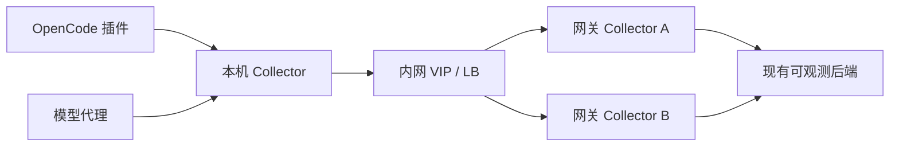
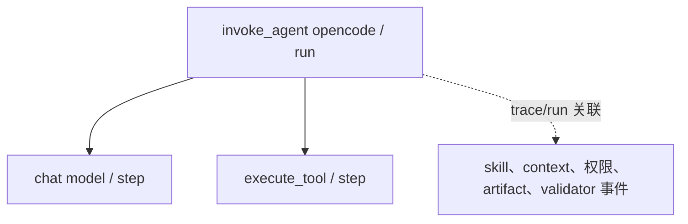

# OpenCode 会话可观测最小基线 v0.2.1（无 Docker）

> v0.2.1 交付标识：安装与运行流程中不包含 `docker compose`、Aspire 或 `localhost:18888`。如果看到这些内容，说明打开的是已经废弃的 v0.1.0 README。

这版不再要求 Docker，也不自带重型可观测平台。生产运行只需要：

- Node.js 20+：运行 OpenCode 插件和可选的模型代理。
- `otelcol-contrib` 单个可执行文件：接收、缓冲并转发 OTLP。
- systemd：守护进程并自动重启。
- 内网已有的 OTLP 后端：例如企业 APM，或 Grafana + Tempo/Loki/Prometheus。

推荐链路：



本机 Collector 监听回环地址，使用磁盘 WAL 队列和无限时限重试；上游用现成的 F5、HAProxy、Nginx 或服务发现地址连接两个网关实例。这样不会为了采集 OpenCode 再引入一套容器编排或新数据库。

## 1. 三种运行方式

| 模式 | 依赖 | 适用 | 可靠性边界 |
| --- | --- | --- | --- |
| 直连 OTLP | Node.js + 现有 OTLP 后端 | 先验证字段、最低成本 | 进程或网络中断时只有 SDK 内存缓冲 |
| 本机 Collector（推荐） | Node.js + 一个 `otelcol-contrib` 二进制 | 生产基线 | Collector 重启后可恢复磁盘队列；磁盘满仍可能丢数据 |
| 本地滚动文件 | Node.js + 一个 `otelcol-contrib` 二进制 | 暂无后端、断网审计 | 有文件但无检索 UI；不是跨主机高可用后端 |

推荐默认使用第二种。它解决的是采集链路的重启恢复和短中期断网，不承诺跨机房零丢失。只有已经具备 Kafka 且确实要求跨网络故障期间持久化时，才值得把 Kafka 放到网关层；不要为第一版单独建设 Kafka。

## 2. 采集模型

一次用户提交到 `session.idle/error` 是一个 `run`；模型请求和工具调用是其子 `step`；重试由真正的调度器递增 `attempt`。所有信号通过 `trace_id + task/run/step/attempt` 关联。



| 对象 | 最小字段 |
| --- | --- |
| run | `agent.task.id`、`agent.run.id`、`agent.attempt`、conversation、duration、end reason、cost、failure reason |
| model | provider、request/response model、token、finish reason、request/response hash、latency、cost |
| tool | `agent.step.id`、tool name/call id、args/result hash、latency、error type |
| skill | requested/loaded/unloaded、skill name、step、unload reason |
| context | source、估算 token、provider 总 input token、token method |
| sandbox/权限 | engine、action、decision、reason |
| artifact | id、name、path/action；生产可按策略去除 path |
| validator | name、score/label、failure reason |

Metric 只保留 8 个低基数指标：

- `gen_ai.client.operation.duration`
- `gen_ai.client.token.usage`
- `gen_ai.invoke_agent.duration`
- `gen_ai.invoke_agent.inference_calls`
- `gen_ai.invoke_agent.tool_calls`
- `gen_ai.execute_tool.duration`
- `agent.cost`
- `agent.failures`

`task_id/run_id/step_id/session_id/path` 只进 trace/log，不能作为 metric label。

## 3. 代码分层

| 组件 | 负责记录 | 说明 |
| --- | --- | --- |
| `.opencode/plugins/opencode-otel.ts` | run、tool、skill、permission、artifact、OpenCode token/cost | 项目级 OpenCode 插件 |
| `src/model-proxy.ts` | 实际 model request/response、stream、usage、context、估算成本 | 可选；当前覆盖 OpenAI-compatible `/v1/chat/completions` |
| `POST /events` | sandbox、validator、外部 artifact 生命周期 | shell/bwrap/validator 的统一入口 |
| `otelcol/config-upstream.yaml` | 回环 OTLP 接收、磁盘队列、重试、转发 | 推荐的执行机配置 |
| `otelcol/config-gateway.yaml` | 对内网接收、磁盘队列、转发到最终后端 | 可选；同配置部署两台并置于 VIP 后 |
| `src/health-check.ts` | Collector、代理、导出队列检查 | JSON 输出，便于 Nagios/Zabbix/systemd timer 复用 |

仅靠 OpenCode 插件无法稳定获取最终序列化的模型 HTTP 请求和流式响应，因此模型代理是独立、可关闭的一层。不需要 model request/response 正文时，可以让 OpenCode 直连模型服务，只保留插件采集。

## 4. 最短启动路径

### 4.1 直连现有 OTLP 后端

```bash
cp .env.example .env
# 将 OTEL_EXPORTER_OTLP_ENDPOINT 改成内网 OTLP/HTTP 地址
set -a
. ./.env
set +a
npm ci
npm run typecheck
npm test
npm run proxy
```

这条路径完全不需要 Collector，适合先确认字段。但生产更建议让 `OTEL_EXPORTER_OTLP_ENDPOINT` 保持为 `http://127.0.0.1:4318`，由本机 Collector 负责可靠转发。

### 4.2 本机 Collector + systemd

1. 从审批过的内网制品库取得与目标 CPU/系统匹配的 `otelcol-contrib`。不要在生产机执行互联网下载脚本。
2. 在构建机从内网 npm registry/cache 安装并测试：

```bash
npm ci
npm run typecheck
npm test
npm run build
```

3. 构建一个目标机无需 npm、无需编译器的运行包：

```bash
scripts/build-runtime-bundle.sh /approved/path/otelcol-contrib
```

构建脚本会先执行 TypeScript 检查、单测、编译，并用该 Collector 二进制的 `validate` 子命令验证全部 YAML；运行包内同时记录二进制版本和 SHA-256，便于制品审计。

4. 把生成的 `opencode-observability-runtime.tar.gz` 复制到目标机，解压后安装：

```bash
tar -xzf opencode-observability-runtime.tar.gz
sudo ./opencode-observability/install-systemd.sh
```

脚本只安装文件和 unit，不自动启动服务。先编辑：

```text
/etc/opencode-observability.env
```

至少设置：

```text
OTEL_UPSTREAM_ENDPOINT=https://内网稳定OTLP地址
MODEL_PROXY_UPSTREAM_BASE_URL=https://内网模型网关
MODEL_PROXY_UPSTREAM_API_KEY=通过主机秘密管理注入
```

然后启动：

```bash
sudo systemctl enable --now opencode-otelcol opencode-model-proxy
sudo systemctl status opencode-otelcol opencode-model-proxy
/usr/bin/env node /opt/opencode-observability/dist/src/health-check.js
```

生产目标机只需要 Node.js、systemd 和运行包；TypeScript、tsx、npm 只留在构建机。

## 5. Collector 配置

### 5.1 推荐：向现有后端转发

`otelcol/config-upstream.yaml` 已包含：

- OTLP/gRPC `127.0.0.1:4317` 和 OTLP/HTTP `127.0.0.1:4318`。
- `memory_limiter` + `batch`。
- `file_storage` 持久化 sending queue。
- 失败后指数退避，`max_elapsed_time: 0s` 表示持续重试。
- `127.0.0.1:13133` 健康端点。
- `127.0.0.1:8888/metrics` Collector 自监控指标。

队列目录为 `/var/lib/opencode-observability/queue`。必须给该目录配置磁盘告警和容量上限；WAL 不能在磁盘已满时继续保证可靠性。

若上游需要自签 CA 或认证头，在企业配置管理中给 `otlphttp/upstream` 增加 `tls.ca_file` 或 `headers`，不要把令牌提交到 YAML 和源码包。

### 5.2 没有后端：滚动文件

在 `/etc/opencode-observability.env` 改为：

```text
OTELCOL_CONFIG=/opt/opencode-observability/otelcol/config-local-file.yaml
```

重启 Collector 后，traces、metrics、logs 会按大小和天数滚动到 `/var/lib/opencode-observability/archive`。这个模式只作为短期审计和开发兜底：file exporter 仍是 alpha，字段编码可能随版本变化，也没有查询、索引和多副本能力。

## 6. OpenCode 接入

把以下文件合并到需要观测的 OpenCode 项目：

```text
.opencode/plugins/opencode-otel.ts
.opencode/lib/otel.ts
.opencode/lib/content.ts
.opencode/package.json 中的 OTel dependencies
```

OpenCode 自动加载项目级 `.opencode/plugins/`。如果启用模型代理，参考 `opencode.example.jsonc`，将 provider 的 `baseURL` 指向：

```text
http://127.0.0.1:8787/v1
```

`MODEL_PROXY_UPSTREAM_BASE_URL` 指向真实 OpenAI-compatible 模型服务。代理会剥离 `x-agent-*` 私有头，再把请求转发到上游。

当前 provider 如果使用 `/v1/responses` 或 Anthropic 原生协议，保留字段模型，但需要增加对应协议解析器；不要把 `/chat/completions` 的响应结构硬套过去。

## 7. sandbox、validator 与 artifact

插件通过 `shell.env` 注入当前 task/run/step/attempt、`traceparent` 和事件地址。bwrap launcher 或 validator 调用统一事件入口即可：

```bash
npm run event -- agent.sandbox.event '{"agent.sandbox.engine":"bwrap","agent.sandbox.action":"exec","agent.sandbox.decision":"allow"}'

npm run event -- gen_ai.evaluation.result '{"gen_ai.evaluation.name":"unit_tests","gen_ai.evaluation.score":1,"gen_ai.evaluation.score.label":"pass"}'

npm run event -- agent.artifact.changed '{"artifact.id":"report-sha256","artifact.name":"report.html","artifact.action":"created"}'
```

生产脚本不需要各自实现 OTLP，统一向本地代理的 `/events` 发小 JSON 即可。

## 8. 内容与 token 策略

`AGENT_OTEL_CAPTURE_CONTENT`：

- `off`：仅记录 byte size 与 SHA-256；生产默认。
- `redacted`：限长正文并做基础 secret/Bearer/API key 脱敏；仅灰度使用。
- `full`：仍有限长，只能在明确授权的隔离环境使用。

Provider 返回的 input/output usage 是总 token 权威值。分来源 token 使用 `字符数 / 4` 估算，并写明 `agent.context.token_method`；来源包括 system instructions、user/assistant conversation、skill、tool result、tool definitions。

## 9. 健康和告警

运行：

```bash
npm run health
# 或生产编译版
npm run health:built
```

返回单个 JSON，检查代理、Collector 健康端点及导出队列。建议告警：

| 条件 | 级别 | 含义 |
| --- | --- | --- |
| Collector/模型代理健康失败 | critical | 本机采集链路不可用 |
| `queue_size / queue_capacity >= 0.7` | warning | 上游变慢或不可达 |
| `queue_size / queue_capacity >= 0.9` | critical | 即将耗尽队列容量 |
| `send_failed_*` 在时间窗口持续增长 | warning/critical | 上游拒绝或网络失败 |
| receiver refused 指标增长 | critical | 本机限流或内存压力 |
| WAL 所在磁盘使用率 >= 80%/90% | warning/critical | 持久队列面临磁盘耗尽 |
| systemd 重启次数增长 | warning | 进程崩溃或配置错误 |

`send_failed_*` 是累计值，应该由 Prometheus/Zabbix 比较时间窗口增量，不能仅凭当前总数报警。

## 10. 高可用边界

最小、可复用的高可用做法是：

1. 每台 OpenCode 执行机各跑一个本机 Collector，回环接入，磁盘队列隔离。
2. `OTEL_UPSTREAM_ENDPOINT` 指向现有稳定 VIP/LB。
3. VIP 后部署至少两个相互独立的网关 Collector，后端自身按企业标准做副本和保留。
4. 本机 WAL、队列占用、失败计数和磁盘同时监控。

网关节点使用同一运行包，把 `OTELCOL_CONFIG` 改为 `config-gateway.yaml`，将 `OTEL_UPSTREAM_ENDPOINT` 指向最终后端。该配置会开放 4317/4318 和用于 LB 探活的 13133；必须用主机/网络 ACL 限制来源，或在 LB 终止 TLS。两个网关不共享状态，各自有 WAL，VIP 只做健康检查与转发。

这里刻意不在本机 Collector 使用 `loadbalancing` exporter：该 exporter 的内部 OTLP exporter 不支持 persistent queue；当所有目标都不可用时，不能替代持久化队列。把负载均衡交给成熟的 VIP/LB，Collector 保持单一上游，结构更简单且磁盘重试语义清晰。

## 11. 验收清单

- 聊天 run：1 个根 span、至少 1 个 chat 子 span、provider token 可见。
- 工具 run：`execute_tool` 子 span 的 call ID、args/result hash 对应。
- skill：requested → loaded → run_end/compaction unloaded。
- permission deny：低基数 `error.type/failure reason`，错误全文不进 metric label。
- validator：能通过 run ID/trace 关联 artifact 和工具调用。
- `AGENT_OTEL_CAPTURE_CONTENT=off`：没有 prompt、tool args/result 正文。
- 停止上游 2 分钟再恢复：本机队列先增长后回落，Collector 重启后队列仍存在。
- 停止 Collector 后 systemd 能拉起；磁盘和队列阈值能触发监控。
- OpenCode 直连外部 provider 时必须关闭 `AGENT_OTEL_INJECT_PRIVATE_HEADERS`。

## 12. 参考

- [OpenTelemetry Collector Linux 安装](https://opentelemetry.io/docs/collector/install/linux/)
- [OpenTelemetry Collector resilience](https://opentelemetry.io/docs/collector/resiliency/)
- [OpenTelemetry Collector internal telemetry](https://opentelemetry.io/docs/collector/internal-telemetry/)
- [OpenTelemetry load balancing exporter](https://github.com/open-telemetry/opentelemetry-collector-contrib/tree/main/exporter/loadbalancingexporter)
- [OpenTelemetry file exporter](https://github.com/open-telemetry/opentelemetry-collector-contrib/tree/main/exporter/fileexporter)
- [OpenTelemetry GenAI Semantic Conventions](https://github.com/open-telemetry/semantic-conventions-genai)
- [OpenCode Plugins](https://opencode.ai/docs/plugins/)
- [OpenCode Agent Skills](https://opencode.ai/docs/skills/)
- [OpenCode Providers](https://opencode.ai/docs/providers/)
