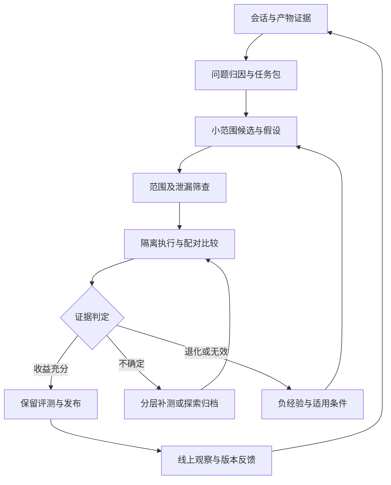

# Skill 与 Agent 的 RSI：论文核心设计、适用边界与平台实施建议

日期：2026-10-09  
面向：基于 OpenCode 二次开发、采用 bwrap 沙盒的企业多租户智能体平台  
依据：用户提供的 RRSI、SICA、HGM 论文，以及腾讯技术工程文章和 Lilian Weng 的 Harness Engineering 博客

## 1. 建议先落实的方向

对当前平台，最有价值的 RSI 实现是：把真实会话中可核查的问题，转成针对 Skill、Agent 或配套脚本的改动假设；在冻结的任务与环境中生成、比较小范围候选；把经过验证的版本发布，并保留失败实验和适用条件，供下一轮使用。

建议以腾讯文章组织工程闭环，以 RRSI 约束候选生成和接纳，以 HGM 分配探索与补测预算，以 SICA 提供最小运行循环。Weng 博客则提醒我们：优化对象应覆盖信息如何进入上下文、任务如何交接和状态如何持久化，而不能局限于改写提示词。

优先建设五项能力：

1. **可复跑任务包**：从会话恢复任务发生时可见的输入、工具状态和验收目标。
2. **可归因的小改动**：每个候选说明证据、假设、目标组件、预期收益和可能退化。
3. **独立比较**：同一任务上比较旧版本与候选，单列质量、必要过程、成本和不确定性。
4. **组合版本与发布**：绑定 Agent、Skill、脚本、工具契约和模型配置，能够回滚整个组合。
5. **条件化经验**：记录什么改法在什么环境有效、什么失败是证据不足，以及什么变化发生后允许重试。

这些能力可以接到现有 session-observe、harness-diagnose、eval-curate、harness-compare、experience-screen 及资产快照平台上。本文只做设计建议，不假定这些组件已经完成工程集成。

## 2. 阅读范围与证据口径

本文基于上传文本的正文、方法、实验和相关附录做分析，没有独立复跑实验，也没有核验最新仓库实现。以下用三种表述区分证据：

- **原文机制／结果**：上传材料明确描述的算法或报告结果。
- **分析**：对其设计动机、假设及局限的解释。
- **平台建议**：针对你的场景提出的适配，不代表论文已经验证。

材料编号见文末。`Agentrsi.md` 与 `Agent自进化飞轮.md` 的文件哈希相同，属于同一篇材料，不能当作两份独立证据。腾讯文章中明确标注“据上下文推断”的配图说明也不作为独立证据。

MinerU 转换稿存在部分符号、表格错位及正文数值不一致。本文只引用结构明确的数据；例如 SICA 的部分结果表与结论描述不一致，不据此复述醒目的性能提升数字。HGM 的最终分位数选择记号也需要在真正复现时对照原始公式和实现核验。

## 3. 先定义：平台究竟在优化什么

把一次 Agent 执行写成：

\[
Y = \operatorname{Run}(M,H,X,E)
\]

其中，模型及推理配置为 \(M\)，Harness 为 \(H\)，任务输入为 \(X\)，工具、数据、权限和运行环境为 \(E\)。Harness 包括 Agent 文档、Skill、脚本、工具说明、检索和上下文组织、交接和停止机制。

RSI 实验需要回答的是：在可比较的 \(M,X,E\) 下，改变 \(H\) 是否让后续任务更可靠、更高效。若模型、数据源和工具也同时变化，收益便无法单独归因给 Skill 或 Agent。

### 3.1 优化对象分层

| 层级 | 应修改的内容 | 常见问题 | 验证重点 |
|---|---|---|---|
| Skill 方法层 | 输入要求、步骤、输出契约、异常恢复、参考资料 | 方法缺失、要求不明确、资料难以定位 | 强制加载后的能力增量 |
| Agent 调度层 | 场景识别、Skill 选择、阶段拆分、交接、停止 | 选错能力、重复调度、交接丢信息 | 自主路由与端到端完成 |
| 脚本／工具层 | 参数转换、结构化错误、返回摘要、校验实现 | API 不兼容、解析错误、错误被吞掉 | 确定性契约和执行结果 |
| Runtime 层 | 上下文管理、进程生命周期、状态恢复 | 无效循环、上下文溢出、任务串扰 | 平台级集成验证 |
| 改进器层 | 信号筛选、提案策略、实验分配 | 反复改同一处、浪费补测预算 | 相同总预算下的改进产出 |

初期以局部 Skill、相邻契约、Agent 路由为主。Runtime 与改进器的修改进入单独实验通道，避免业务资产迭代同时改变评测和运行基础。

### 3.2 区分任务改进与改进器改进

一个固定外部 Agent 持续优化业务 Skill，已经构成有价值的 Harness 自改进；但它不能自动证明“改进能力本身越来越强”。

建议分两层推进：

- **业务层**：优化执行任务的 Skill／Agent，衡量任务收益。
- **元层**：优化如何诊断、提案、补测和筛选，衡量相同实验预算下得到的、通过独立验证的收益。

元层也需要冻结任务家族、固定预算和独立裁判。不能以候选数量、文档长度或改动次数作为改进器进步的依据。

## 4. RRSI 深读：正则化约束的是搜索轨迹

### 4.1 核心问题：有限反馈被反复自适应使用

**原文机制。** RRSI 保持模型权重冻结，允许修改 Harness 的多种组件。每轮执行任务、分析轨迹、提出候选、在 evolve 集上比较，并更新当前版本。[R1 §2–3]

风险来自自适应复用：下一轮候选依赖前几轮在同一组题上的反馈。即使没有显式复制答案，系统也会逐步针对这组题的措辞、接口、错误模式和裁判偏好优化。

因此，RRSI 同时约束：

- **提案端**：一轮能改多少、改哪里、如何利用历史证据。
- **筛选端**：什么证据足以让一个改动成为永久状态。

**平台启发。** “不让提案器看验证题”是必要隔离，但不是完整防护。反复返回总分、排名和通过／不通过，同样会形成适配压力。需要一起管理候选数量、查询次数、任务家族隔离及保留评测。

### 4.2 稀疏更新：限制可独立归因的改动数量

原文使用随轮次下降的余弦预算：

\[
b_t=\operatorname{round}\left[b_{\min}+(b_{\max}-b_{\min})\frac{1+\cos(\pi t/T)}2\right]
\]

其作用是让早期能够尝试少量协调改动，后期逐步收敛到更容易归因的更新。[R1 §3.2，附录 C.2]

这里限制的是候选中的独立行为修改数量，不是文件数、代码行数或 Token 数。“增加一次输出契约验证，并同步两个 Skill 的接口”可能是一项改动；在一个 Markdown 文件里同时改路由、重试和输出格式，则可能是三项。

**动机分析。** 大量捆绑改动会提高对有限反馈的拟合能力，同时破坏信用分配：总分升高后，不知道该保留哪项；下一轮又容易继续叠加。

**平台建议。** 初期直接固定“一候选一主要假设”，暂不实现退火曲线。只有发现某类能力确实需要协调改变时，才允许有明确依赖关系的改动组。需要时对赢家补做消融，拆出真正产生收益的部分。

### 4.3 历史账本：必须区分未获选与假设被否定

原文为每项改动记录组件、假设、diff、分数变化、成本变化及是否进入获选路径。捆绑候选中的多项改动会共享候选级测量。[R1 附录 C.2]

一个容易误用的细节是：原文的未获选记录，既可能是没有通过门槛，也可能是通过门槛但输给了更高分候选。因此，`accepted=false` 不能直接翻译成“这条机制没有价值”。

建议用明确状态替代单一布尔值：

| 状态 | 含义 | 下一轮如何使用 |
|---|---|---|
| screen_rejected | 变更范围、任务泄漏或契约不符合要求 | 说明具体原因；不写成能力无效 |
| invalid_run | 环境或执行协议使比较无效 | 修复环境后重试 |
| inconclusive | 证据不足或收益处于噪声范围 | 补测，或暂存 |
| evidence_negative | 有效比较支持无收益／退化 | 记录适用条件与反例 |
| admissible_not_selected | 可接受但本轮未胜出 | 可以保留为探索或组合来源 |
| selected | 成为下一轮搜索基线 | 不等于已经发布 |
| released | 通过发布验证并生效 | 继续监测实际适用范围 |

还应记录 `revisit_condition`：例如模型版本变化、工具错误已修复、出现新类型数据后可以重试。负经验也需要版本和有效期。

### 4.4 停滞时探索未尝试组件

原文用最近若干轮收益是否超过经验噪声带判断停滞，并为未被有效测量的组件预留提案名额。组件词表包括 Prompt、control flow、config、output plumbing、context management、client tool、Skill、memory、subagent。[R1 附录 C.2]

**动机分析。** 提案器容易反复改写最容易编辑的 Prompt。探索约束让搜索转向结构性原因。

**平台建议。** 为诊断器提供组件导航表。连续几轮同类 Prompt 改写无收益时，优先检查：

1. 工具是否真的返回了正确数据。
2. 正确 Skill 是否被加载，加载时机是否太晚。
3. 大返回是否淹没了关键字段。
4. 上下游契约是否不一致。
5. 是否缺少可执行校验或有界恢复机制。

不要为满足“多样性”强行增加 Subagent。探索方向需要有观测依据；预算可允许小部分证据较弱但可检验的假设。

### 4.5 泄漏筛查：业务知识与评测答案必须分清

原文在完整评测前使用 critic 审查 diff，过滤显式任务名称、实体、特定值、答案以及无实际作用的机制。[R1 §3.3]

**动机分析。** 如果先给泄漏候选打出高分，即使后面拒绝它，这个高分也可能污染后续搜索对“什么有用”的判断。

但企业 Skill 本来就需要具体的表名、字段、工艺术语和业务规则。简单禁止专有名词，会误伤有价值的领域知识。

建议以**来源与适用范围**审查：

- 来自正式 API 文档或业务规则，且覆盖一类任务：允许进入对应领域 Skill。
- 来自单次会话的临时结果：保留为带来源的案例，不晋升为通用规则。
- 来自隐藏答案、事后结论、评测专用路径：不进入候选。
- 只有某一个测试实例才成立的分支：要求解释其业务依据，并用反事实样本验证。

可增加“输入表面变化而业务语义保持”的探针，例如换文件名、实体名、字段顺序。若行为随无关细节改变，才是值得追查的拟合信号。

### 4.6 接纳规则：质量下限、成本和新颖性分别起作用

原文要求候选满足历史最佳分数的噪声调整下限：

\[
\hat S(H')\ge S^*-\delta
\]

这能阻止系统连续接受小幅退化，最终离最佳状态越来越远。

对超过噪声带的收益，令：

\[
\Delta S=\hat S(H')-\hat S(H_t),\qquad
\Delta C=\frac{\hat C(H')-\hat C(H_t)}{\hat C(H_t)}
\]

成本条件为：

\[
\Delta C\le\beta_0+\beta_1\Delta S
\]

对收益没有超过噪声带的候选，附录使用另一条规则：

\[
w_s\Delta S-w_c\Delta C+w_n\nu_t(H')>0
\]

其中 \(\nu_t\) 只奖励此前尚未进入获选路径的某些结构类型：client tool、Skill、memory、subagent。普通 Prompt 等改动不获得该新颖性奖励。编码实验中 \(w_s=0\)，因此噪声带内的小幅涨分本身不足以接纳候选。[R1 附录 C.3]

**动机分析。** 接纳机制允许系统保留质量近似持平但更便宜的版本，也允许探索新结构，避免纯粹追逐最高经验分数。

**平台适配。** 将“搜索接纳”和“生产发布”拆开。新颖性可以支持探索分支继续获得实验预算，不应直接作为上线收益。质量关键项不允许被成本节省抵消。

经验噪声带也不是统计显著性保证。历史最大值可能含幸运噪声；若基线模型或环境漂移，长期使用旧的最佳值会失真。建议在同一评测周期内固定配置，并对拟发布候选与基线重新做同期配对验证。

### 4.7 剪枝：近期没有改进，不等于组件没有贡献

原文按组件汇总最近窗口内关联改动的最大收益；近期未产生严格正收益的组件成为后续删除提案的目标。捆绑改动的收益仍共享，窗口内没有记录时形式化定义取负无穷。[R1 附录 C.2]

这里有两个边界：

1. “最近修改这个组件没提高分数”不能证明“删除整个组件没有损失”。
2. 组件级标签比较粗，某项改动无效不能否定同一类别的其他机制。

**平台建议。** 用具体规则、脚本步骤或子能力作为剪枝对象；先生成删除候选，再比较 `H` 与 `H-minus-component`。对依赖该组件的适用样本、异常场景和关键不变量做验证。没有覆盖到的低频机制标为“贡献未知”，不能自动删除。

因此，“删除和简化”应成为一种正式候选操作，但不能把低使用量当成无用证明。

### 4.8 消融实验真正说明了什么

上传论文 Table 2 报告如下（分数沿用原文百分制，Token 为原文 million／trial）：

| 方案 | Evolve | ID held-out | OOD 平均 | Token／trial |
|---|---:|---:|---:|---:|
| 初始 Harness | 89.4 | 86.9 | 39.7 | 1.56 |
| 无正则化进化 | 92.8 | 88.9 | 40.3 | 3.80 |
| 去掉提案约束 | 90.7 | 88.8 | 41.9 | 2.69 |
| 去掉接纳约束 | 91.5 | 88.7 | 41.0 | 3.59 |
| RRSI | 90.5 | 89.2 | 43.6 | 2.42 |

最值得借鉴的是：evolve 得分最高的方案，不是 OOD 最好的方案；约束提案和约束接纳都与更好的迁移表现相关。[R1 §4.3，Table 2]

同时，RRSI 的运行 Token 高于初始 Harness。它相对无约束进化更省，不能表述成“进化后一定比原版更便宜”。此表做的是机制组消融，不能独立证明每一条具体正则化都有因果收益；也不能替代企业任务上的验证。

对你的 Dashboard，应并列显示“诊断／筛选集收益、保留集收益、运行成本、搜索成本”。只显示搜索阶段最佳分数，会鼓励系统向表中无正则化的方向发展。

## 5. HGM 深读：把预算花在有潜力的谱系与有价值的补测上

### 5.1 它拆开了三个不同决策

HGM 将搜索分为：[R2 §2–3]

1. **Selection policy**：现在生成候选，还是继续评测已有候选？
2. **Expansion policy**：若生成候选，从哪个父版本继续改？
3. **Evaluation policy**：若评测，应该给哪个候选分配下一道任务？

传统固定循环往往是“生成一个→完整测一遍→生成下一个”。这会让很差的新候选持续消耗预算，也让早期评测不充分但有希望的旧候选被忽略。

**平台建议。** 调度器显式支持 `propose / evaluate_more / stop / archive`。没有必要每轮都产出新的 Skill 文件。已有候选的结论不确定时，补测可能比继续提案更有价值。

### 5.2 CMP：表现一般的祖先可能孕育更好的后代

原文区分节点当前效用与其后代谱系的改进潜力。理想 CMP 关心在未来预算内，该谱系最终能产生的最佳后代效用；实际算法用谱系内已完成任务的成功／失败计数近似。[R2 §3.2–3.3]

简化表示为：

\[
\widehat{CMP}(a)=\frac{n_s^C(a)}{n_s^C(a)+n_f^C(a)}
\]

它是按评测次数加权的谱系表现。评测策略优先测较好的节点，使高性能后代获得更大权重，从而近似偏向最佳后代的效果。

**动机分析。** 如果只从当前最高分版本继续修改，就容易丢掉短期持平、长期更易改进的结构。例如：把混杂文档拆成稳定接口与独立参考，第一轮可能没有得分收益，但让后续检索优化和局部修复成为可能。

**边界。** 理想 CMP 与这个经验均值不是同一个量。树由搜索策略生成，评测次数又由策略选择，因此估计受到选择偏差、任务难度和祖先／后代相关性影响。不能把 Beta 采样解释成对真实长期潜力的精确后验。

### 5.3 Beta 与调度温度的实际作用

HGM 对扩展使用谱系统计，对补测使用节点统计，通过 Thompson Sampling 选择对象。原文采样参数形如：

\[
Z_a\sim \operatorname{Beta}\bigl(\tau(1+n_s),\tau(1+n_f)\bigr)
\]

随着预算消耗，\(\tau\) 增大。两个参数同时放大时，均值不变，方差变小，使后期更偏向已有高均值对象。[R2 §3.3、§4]

注意：这里的集中程度变化部分来自人为调度，并非全部来自新增证据。你的产品界面不宜把这种采样分布直接标为“统计置信度”。

原文还使用类似 progressive widening 的准则，按总评测量与候选数量决定是否继续扩展。其作用是避免候选池无限扩张，却没有足够证据区分候选。

**简化适配。** 初期保留少量方向不同的分支，用固定预算和分层补测即可。只有在候选与谱系记录积累后，再引入 Beta 采样。若任务分数是连续量，不应直接把它当作未经校准的二项成功／失败计数；先明确有效的成功定义，或改用适合该指标的估计方法。

### 5.4 异步评测的坑：先完成的不代表更好

HGM 附录明确指出，容易任务通常更早完成，异步早期结果会偏乐观；候选评测较少时更明显。原文还讨论了初期扩展完成时间造成的调度偏差。[R2 附录 B]

你的平台有多租户、不同工具和长短任务，这个问题更明显。建议记录：

- 计划任务数、已完成数、运行中数、超时数、基础设施错误数。
- 每个难度／任务家族的完成覆盖。
- 已预留的评测预算和未完成扩展任务，避免并发调度重复下注。

不能按“当前已完成样本的成功率”直接发布。可以等待预定分层批次完成，或明确把证据不足的结果标为暂定。候选引起的超时／崩溃应计入其失败；确证的公共基础设施故障应按预先规则对新旧版本一起处理，保留完整数量，不按结果好坏事后剔除。

### 5.5 理论和实验边界

HGM 关于 CMP oracle 的理论结果依赖简化假设，包括最终只看被选 Agent 的效用、任务可重复、修改消耗单位预算等。企业场景中的持续服务收益、不同实验成本、历史污染和发布风险并不满足全部假设。[R2 §3.1]

原文在 SWE-Lite 迁移评测中剔除了与 SWE-Verified 重叠的 93 道题，另外报告全量成绩。这一点比排行榜名次更值得复制：**迁移验证必须检查家族与实例重叠。** 同一份输入文件的改名版本、同一任务的多次重试，不应分别进入诊断集和保留集。[R2 §4.3.2]

谱系潜力实验也专门排除了与目标最佳后代直接相关的统计，避免用目标解释目标。但这仍不是无限期、实时预测未来潜力的保证。[R2 §4.1，附录 D]

## 6. SICA 深读：从执行摩擦入手，往往比增加推理流程更有效

### 6.1 最小循环与真正发生的改进

SICA 保存历史 Agent 与评测档案，选择表现较好的版本继续自改进；效用综合质量、成本与时间。[R3 §3]

附录中的改进包括 Smart Editor、diff 编辑、输入规范化、编辑验证、AST 符号定位、上下文摘要和更精简的 diff 输出。[R3 附录 D]

这些改进的共同点是减少机械操作摩擦，让有限预算更多用于任务本身。原文也说明，较短超时会使编辑速度和成本优化显著影响最终成绩。[R3 §5.1]

**平台启发。** 首批 RSI 候选可以优先选择：

- 常见参数格式规范化。
- 工具结果的结构化摘要和原始证据路径。
- 文件定位、参考索引和精确跳转。
- 输出校验后有限次数的修复。
- 可恢复错误与不可恢复错误的分流。

这些方向更容易验证，也更可能跨任务复用。单纯增加“再想一遍”“多派一个 Agent 审查”可能增加成本，却没有改变实际信息和工具能力。

### 6.2 子 Agent 的价值：隔离上下文并压缩交接

SICA 使用子 Agent 完成专门任务，让子任务内部上下文在返回后被丢弃，主 Agent 接收摘要。它同时关注上下文组织和缓存复用。[R3 §3.1]

对你而言，多 Agent 的收益应来自明确机制：专门能力、独立验证、并行工作或上下文隔离。Agent 文档可以规定何时分工、交付哪些证据，而把执行方法留在 Skill。

建议交接包含：任务目标、输入引用、已完成动作、关键发现、产物路径、尚未解决问题和验证状态。不要把上一段完整对话无差别转发给下游。

### 6.3 异步 overseer：可借鉴事件触发，不必照抄固定频率

原文初始系统有周期或事件触发的 LLM overseer，读取调用图和事件流，发现重复工作、偏离任务、卡住等情况，可提示或取消执行。[R3 §3.1]

平台可先用规则捕获明显异常，例如同参数反复失败、无产物变化、超出预算；只有规则无法判断时，才调用语义审查。审查依据使用工具事件、状态和产物，不依赖获取模型隐藏推理。

os／沙盒的超时和进程回收仍由外层控制。LLM overseer 是诊断辅助，不承担进程资源硬限制。

### 6.4 路径依赖与模型能力上限

SICA 的局限部分明确提到：早期想法会强烈影响后续提案，系统容易围绕同一主题反复变体；坏想法还会消耗编辑和完整评测成本。[R3 §5.1]

因此，历史不能只作为“好例子”塞给提案器，还应整理为“尝试过的假设、结果和未探索方向”。

原文在推理任务上的收益较弱，并怀疑粗糙的推理诱导机制可能干扰已有推理模型。这提示平台在模型升级后应重新检查旧 Skill 的必要性。某些补丁可能曾经有效，但在新模型上变得重复甚至有害。[R3 §4.1]

## 7. 腾讯文章与 Weng 博客：把论文循环变成可持续工程

### 7.1 腾讯文章最有价值的是环节之间的契约

它把评测、记忆、落地和控制串成完整流程，并强调 Playbook 服务于“如何改 Agent”，业务记忆服务于“如何做任务”。[R4 §2–5]

建议明确保留两类知识：

| 类型 | 内容 | 使用者 | 更新依据 |
|---|---|---|---|
| 业务知识／执行经验 | 术语、业务规则、任务方法、可验证案例 | 执行 Agent | 业务来源和任务证据 |
| 改进 Playbook | 哪类改动有效、失败条件、实验结果、重试条件 | 诊断器与提案器 | 对照实验和发布反馈 |

原始失败记录可以完整归档，但未经筛选的失败总结不应直接注入所有执行 Agent。归档门槛可以低，成为可复用行为指导的门槛应高。

### 7.2 几条表述需要在工程实现中修正

腾讯文章提供了实用方法，但一些绝对化表述不宜原样写进平台规范：[R4 §1.3–1.4、§5.3]

| 原文思路 | 更适合平台的解释 |
|---|---|
| 规则校验“零成本、100% 客观、无偏差” | 规则通常便宜且确定，但实现可能有缺陷，覆盖目标也可能有偏差 |
| temperature=0 确保一致可复现 | 有助减少随机性，仍需固定模型与配置并监控重复评测差异 |
| 无 Skill 也做对，则贡献为零 | 还应比较成本、延迟、稳定性及必要过程，不能只看最终成败 |
| 路径必须遵循 Skill | 应约束必要不变量，允许等价而更有效的路径 |
| 真实业务指标不存在漂移 | 用户、任务难度、业务环境和工具都可能漂移，需要分层和同期对照 |
| 通过样本写入金标集或记忆 | 已暴露的样本不能继续充当独立保留题；通过也不自动等于金标 |

文章给出的固定灰度比例、观察天数、样本划分比例和人工占比，可作为讨论起点，不能作为你的平台已校准参数。灰度结束要看任务覆盖和证据量，而不只是日历天数。

### 7.3 Weng：内容与生成内容的机制都可以优化

博客讨论 ACE 的逐条合并更新，以及 MCE 区分静态内容与动态检索、筛选、组织机制。[R5 Context Engineering]

对应你的 Skill：

- 静态内容：SKILL.md、业务规则、示例、参考文档。
- 动态机制：什么时候读哪份资料、选哪些工具、保留哪些返回、交接什么摘要。

若正确知识已经存在但一直未被读到，优化检索入口和加载顺序更直接。若频繁重复转换工具输出，应该考虑可测试的适配脚本。只有确实缺少知识，才补充正文。

博客还总结了 AHE 的组件、经验和决策可观测：每次修改都关联失败证据、原因假设、目标修复和预期风险。[R5 Self-Improving Harness]

你的平台已有大量工具与文件信号，下一步需要补的是“这些信号支持哪一个可证伪的改动判断”，而非把更多原始日志一次性放进 Prompt。

## 8. 从平台信号到改动假设：先保证证据可用

### 8.1 已有信号能说明什么，不能说明什么

基于当前已知的平台字段，可先做如下映射。这里描述的是信号用途，不假定所有字段已经有可靠采集实现。

| 信号 | 可以支持的判断 | 不能直接推出 |
|---|---|---|
| 工具调用／返回 | 错误集中在哪些 API、参数、阶段 | 整个任务是否失败、根因是否属于 Skill |
| Skill／Agent 加载记录 | 哪个版本进入了执行过程 | 内容被有效采用、该资产有因果贡献 |
| 模型调用与时间戳 | 成本、等待、重试和切换 | 时间越长质量越差 |
| 文件指纹、读写事件 | 输入／产物接触、重复产物、家族去重 | 文件语义正确、用户实际采用 |
| 部门／岗位 | 任务分布、使用差异、抽样分层 | 部门能力排名、工具质量可直接横比 |
| 用户纠正与确认 | 需求缺口、显式反馈 | 无反馈就是成功、确认就是真实正确 |

原生工具与用户自建工具应分开统计；开发打磨期的错误与稳定生产错误也应分开。否则会把“正在开发工具”的部门误判为 Skill 质量差。

### 8.2 使用三层证据，而不是直接从日志生成建议

建议采用：

1. **原始层**：工具参数／返回、事件、文件版本、模型配置。
2. **任务层**：阶段、观察到的错误、可用证据、未确定原因。
3. **模式层**：多个独立任务中反复出现的机制、适用范围、候选方向。

模式层要能够回到任务层和原始层。每个原因标记为 `observed / hypothesized / tested`，防止“模型推测的原因”经过几轮摘要后变成“已确认事实”。

文件指纹可用于聚合同一原始资料，但同一任务的重试、复制和多人转发不应被当成多份独立支持证据。

### 8.3 选题优先级：影响大、可修复、能验证

建议先用少量人工可理解的字段排序，不急于构造复杂总分：

- 覆盖多少独立任务家族、用户和时间窗口。
- 错误造成的业务影响与返工量。
- 是否有清晰的目标组件和机制假设。
- 是否能够构造可信的复跑输入和验收条件。
- 改动与评测成本，以及预计复用次数。

同时抽取成功但低效的会话。RSI 可以降低无效调用、减少默认上下文、缩短交接，并非只有修复失败才有价值。

## 9. 可复跑任务包与评测集隔离

### 9.1 历史对话先转为任务，再转为评测

完整会话往往混有用户后来补充的信息、Agent 已经找到的答案和最终修复产物。直接重放全文会改变任务难度，并可能泄漏目标。

每个任务包至少包含：

```yaml
task_id: example-task-001
task_family_id: example-family-01
input_cutoff: before_first_execution
goal_ref: task.md
input_refs: [inputs/source.csv]
environment_snapshot: env-v1
tool_fixture_version: tools-v2
required_outputs: [result.json]
validator_version: validator-v1
available_information: initial_inputs_only
source_session_refs: [session-ref]
split: diagnostic
replay_status: reproducible
```

这是概念模板；具体字段可以适配现有接口。无法恢复工具状态或验收目标的会话标记为 `diagnostic_only`，继续用于选题，不伪装成可复跑任务。

### 9.2 用任务家族隔离，而不是按消息随机切分

同一原始文件、同一工单、同一业务模板的近似实例，以及同一失败的多次重试应尽量归为一个家族。然后按任务类型与难度分层，将家族整体分入集合。

| 集合 | 用途 | 提案器可以看到什么 |
|---|---|---|
| 诊断集 | 分析失败与提出候选 | 任务、轨迹、结果、必要答案与证据 |
| 筛选集 | 比较候选 | 经约束的汇总结果；不得读取题目与隐藏目标 |
| 保留集 | 拟发布版本最终验证 | 不进入日常提案；结果暴露后记录使用历史 |
| 前瞻观察集 | 新时间窗口真实任务 | 按预定窗口用于外部验证，之后再决定是否转入诊断 |

某个保留题一旦被用于解释失败并指导修改，就应转为诊断用途或明确标注已暴露。不能既让提案器学习，又继续作为独立最终证据。

### 9.3 合成扰动用于机制检查，真实新任务用于外部验证

可对已知任务改变文件名、字段顺序、缺失值、错误码、数据规模、表面实体或工具返回包装，检验机制适用边界。

这类变体适合验证“不是依赖某个表面细节”，但仍与原任务同源。不能把大量变体当成大量独立任务，也不能用它们完全替代真实后续任务。

## 10. Skill、Agent 和组合任务的评测设计

### 10.1 Skill：两种运行方式、三种对照

| 方式 | 无 Skill | 旧 Skill | 新 Skill |
|---|---|---|---|
| 显式指定能力 | 模型＋等价必要工具／输入 | 强制加载旧方法 | 强制加载新方法 |
| 自主路由 | Agent 自主完成 | Agent 自主选择旧能力 | Agent 自主选择候选能力 |

两类结果对应不同问题：

- 强制加载后也无收益：优先查方法或能力边界。
- 强制加载有效，自主路由无收益：优先查 description、触发条件、目录索引和 Agent 路由。
- 结果持平但成本下降：可能是有效的效率改进。
- 成功率上涨但必要校验被绕过：不应仅按平均质量接纳。

若脚本或参考资料是 Skill 独有资源，要明确对照是在测“整个能力包”还是“自然语言方法的增量”。必要时增加“工具和资料相同、仅去掉指导文本”的对照，避免混淆。

### 10.2 Agent：把路由与交接作为独立能力测

测试输入应包含：明确单场景、模糊但可澄清、多阶段组合、无需 Skill 的简单任务、能力缺失、工具不可用，以及容易触发相似 Skill 的边界任务。

重点指标包括：

- 正确能力选择与不必要调用。
- 必要背景是否在交接中保留。
- 未完成事项是否被误当成已完成。
- 任务是否在合理条件下停止或转交。
- Subagent 增量质量与调度成本。

“多 Agent 数量更多”不是改善。结构变化必须对应明确收益，例如上下文隔离消除了生成与验收互相影响，或专用能力补足了主 Agent 的限制。

### 10.3 多 Skill：局部、契约与端到端三层验证

对 A 查询、B 分析、C 报告的链路：

1. 局部测 B 的分析方法。
2. 测 A→B 的输入契约和 B→C 的输出契约。
3. 测 Agent 能否正确选择并组织完整链路。

契约不应只记录字段名，还应记录单位、时间口径、空值含义、证据引用、状态码和“部分成功”的语义。

Markdown 之间的语义约定无法仅靠 AST 检查保证。可使用轻量 JSON Schema、样例输入输出和执行断言验证可结构化部分，再对语义部分做定向评审。

### 10.4 质量、路径、成本分开，关键项不相互补偿

建议使用四个独立视图：

- **任务质量**：正确性、完整性、业务可用性。
- **必要过程**：证据是否可追溯、关键校验是否执行、交接状态是否正确。
- **运行效率**：Token、延迟、工具调用、重试、峰值资源。
- **实验可信度**：样本家族数、完成覆盖、环境错误、裁判一致性。

不建议一开始把它们压成一个可互相抵消的总分。先检查必要门槛，再看质量与成本的取舍。

LLM Judge 可沿用 v1 兼容端点、独立会话、分维度提示词和严格 JSON Schema。temperature=0 用于减少随机性；对一部分样本重复判定，监控一致性。A/B 比较交换顺序，并向裁判隐藏候选名称及提案器自述的“预期改善”，减少身份与锚定偏差。

### 10.5 统计比较的最小原则

同一任务上计算新旧差异，先按任务聚合重复运行，再按任务家族观察收益。若计算区间，可采用任务家族层面的配对重采样，而不是把每次工具调用当独立样本。

对不同用途设不同判定：

- **质量提升候选**：是否超过业务关心的最小收益，且证据足够。
- **成本优化候选**：质量是否满足预先规定的非劣界限，成本是否稳定下降。
- **探索候选**：是否有值得继续检验的机制；不声称已证明收益。

逐次补测也会引入反复窥视结果的问题。初期可以采用预先固定的补测批次和总预算，只在批次边界决策。样本太少就保留“不确定”，不用一个看似精确的概率掩盖证据缺口。

## 11. 平台运行架构：复用现有能力，补齐连接件

### 11.1 建议工作流



这些是逻辑角色，不要求每一步都创建一个 Agent。能用确定性脚本完成的版本管理、规则检查和状态流转优先用脚本；语义归因与候选生成使用模型。

### 11.2 对应现有 Skill 的职责

| 能力 | 主要输出 | 需要补强的连接 |
|---|---|---|
| session-observe | 随机与定向复核队列 | 按任务家族去重，显式记录字段缺口 |
| harness-diagnose | 证据、原因假设、目标组件 | 每个假设关联预测与反例 |
| eval-curate | 冻结任务与校准样本 | 输入截止点、环境状态、暴露记录 |
| 候选改动入口 | 可审阅 Patch | 改动预算、版本基线、范围限制 |
| harness-compare | 配对比较与分维度结论 | 不确定状态、补测、组合契约 |
| experience-screen | 条件化正负经验 | 区分未获选、无效实验、被否定假设 |
| 资产生命周期平台 | 组合发布与回滚 | 运行版本绑定、依赖清单、归属范围 |

### 11.3 bwrap 沙盒的角色

候选在独立工作目录或 worktree 中生成，每次执行使用独立会话和可重置的文件、工具及记忆状态。提案器只挂载允许修改的组件及诊断证据；隐藏验证输入、评分器和发布凭据不暴露给提案器。

验证进程运行候选时，执行 Agent 可以看到完成该验证任务所需的输入，但不应读取隐藏答案、裁判内部状态或其他题目的数据。提交产物后，由外部验证进程评分。不能为了让候选执行任务，顺带给提案器开放整个评测目录。

bwrap 负责隔离基础，外层调度器负责超时、子进程清理、资源预算和状态记录。独立目录仍需配合工具状态重置与网络侧隔离；共享数据库或缓存也可能让候选互相影响。

用户业务会话固定到一个组合版本。更新公共 Skill 时，不在活跃任务中间替换其内容。发布采用版本指针切换，新会话使用新版本，旧会话保留原依赖；回滚同步恢复组合清单。

### 11.4 不需要 Docker 的最小实现

可以沿用现有 Python／Shell、Git、bwrap 和进程管理方式。初期单调度进程加 SQLite 存实验索引，文件系统存不可变任务包、轨迹与产物即可；多进程并发通过事务和任务领取状态避免重复执行。

当并发和团队使用量达到单机存储边界，再迁移现有平台数据库与对象存储。不要先建设大型实验编排平台，再寻找可验证的首个业务问题。

### 11.5 最小数据对象

| 对象 | 核心字段 |
|---|---|
| AssetVersion | 资产 ID、所有者／范围、内容哈希、父版本、依赖 |
| TaskPack | 输入截止点、家族、数据与工具快照、验收版本、集合用途 |
| Candidate | 基线清单、假设、证据、Patch、目标组件、风险、允许范围 |
| Evaluation | 候选与任务版本、运行状态、各维结果、成本、裁判版本 |
| Decision | 接纳／补测／否决、原因、证据量、适用范围 |
| Experience | 原因判断级别、有效条件、反例、重试条件、来源 |
| Release | 组合清单、作用范围、生效时间、观察要求、回滚目标 |

跨租户复用时，原始会话和私有数据保留原访问范围。公共经验引用经允许共享的机制摘要和验证结果，不把私有文件内容写进公共 SKILL.md。

## 12. 一个具体示例：查询结果被误写成业务结论

以下是说明流程的假设案例，不是对现有平台的实测结论。

### 12.1 观察与归因

多个独立任务中，查询 API 返回空数组。部分原因是“确实无匹配记录”，部分原因是权限不足或上游异常被工具包装成空值。报告 Skill 把这些情况都写成“未发现异常”。

先检查工具返回契约。如果工具实现吞掉错误，主修复应在工具层；不能只在 Skill 增加“仔细判断空值”的文字。

### 12.2 候选与反例

| 候选 | 假设 | 验证内容 |
|---|---|---|
| A：结构化查询状态 | 区分 ok／empty／permission_error／upstream_error 可减少错误结论 | 返回契约、旧调用方兼容、状态传播 |
| B：明确报告输出条件 | 只在数据有效且完成必要校验时生成确定性结论 | 无数据、部分数据、证据不足的表达 |
| C：简化重复重试 | 对不可恢复状态停止重复查询 | 成功率非劣、调用与延迟下降 |

若 A 是 B 的必要前提，先单独验证 A，再验证 A＋B，并保留与 A 的增量比较。不要把两者全归功于报告 Prompt。

反例至少覆盖：正常非空、正常为空、权限错误、上游错误、部分结果、包装字段改变。换实体名和文件名检查是否存在表面拟合。

### 12.3 发布与经验

发布组合绑定工具适配版本、查询 Skill、报告 Skill 和 Agent 交接契约。业务所有者审阅结论语义变化，观察新时间窗口下的结果。

最后沉淀的经验应是：

> 当工具返回无法区分“无结果”和“执行失败”时，先补齐结构化状态；下游只在已验证有效的数据上生成确定性结论。此经验适用于采用该返回契约的链路。

不要沉淀为“遇到空数组就重试三次”或“空数组就是权限问题”。后两者把局部观察错误地晋升成通用规则。

## 13. 多租户场景：通用性有边界，专用化也有价值

### 13.1 明确改进的目标分布

RRSI 强调跨任务迁移，但你的业务 Skill 可以有明确领域边界。为某个部门的正式业务口径提供专用能力，并不自动属于有害过拟合。

关键在于声明用途：

- 个人偏好：只作用于个人工作流。
- 部门方法：在该部门不同任务家族、不同时间窗口上验证。
- 公共机制：在多个有代表性的场景中验证。

“适用于某业务”与“只适用于某道评测题”是不同层次。评测应覆盖预定用途，而非要求所有资产都成为全平台通用能力。

### 13.2 提升公共能力，保留业务配置

例如日期解析、错误分流、证据引用等机制可以共用；部门指标定义、工艺单位、审批条件应作为显式配置或领域参考。

个人 Skill 晋升为公共 Skill 时，需要：确认来源可共享、去除个人数据依赖、声明业务边界、检查调用契约、增加跨场景与反例验证。下载量、被加载次数和跨会话文件复用率可用于选题，不能替代质量证明。

### 13.3 采用范围分层的发布判断

低影响的个人候选、部门候选和公共候选可以采用不同审核强度。公共接口、业务规则和权限相关变更需要对应负责人参与；局部可逆、已有明确验证的改动可以按事先授权自动进入小范围观察。

自动回滚依据应预先定义。发生重要回归时先恢复稳定服务，再判断冻结哪个组件；不需要把一个局部失败解释成整个 RSI 系统必须停止。

## 14. 运行成本、搜索成本与“改进能力”的衡量

### 14.1 成本分两本账

**运行账**记录每个业务任务的 Token、工具、时间和资源。**搜索账**记录诊断、候选生成、评测、人工复核和维护成本。

一个简单的经济性估计是：

\[
V \approx N_{future}\cdot\Delta v_{task}
-C_{search}-C_{review}-C_{maintenance}
\]

其中任务收益可用节省时间、减少返工、提升成功交付等衡量，不必强行换算成营收。未来复用次数需要作为假设给出范围，不能把当前加载量直接当作未来收益。

### 14.2 Dashboard 重点展示五个问题

1. **改了什么**：目标组件、版本 diff、假设与证据。
2. **是否改善**：新旧配对差异、任务家族、关键退化、保留验证。
3. **花了多少**：搜索总成本、运行成本、人工复核时间。
4. **哪里不确定**：补测队列、环境缺口、裁判分歧、未完成任务。
5. **学到了什么**：被证伪假设、有效条件、重复提案减少情况、可删除机制。

搜索候选接纳率不应成为主要绩效目标：严格筛选可能降低接纳率，同时提高发布质量。版本数量、自动化比例和 Skill 总数也不能直接代表价值。

### 14.3 什么时候可以优化改进器本身

当任务包、比较与发布流程已经稳定后，才比较不同诊断提示词、提案策略或预算调度器。

公平比较需要：相同初始资产、相同诊断任务、相同模型配置或明确记录差异、相同总预算和独立保留家族。观察“最终候选的保留收益”和“达到有效收益所需成本”，而不是只比较提案器在已知失败案例上写出的分析质量。

诊断器、裁判和筛选规则应分别版本化。评价规则确需更新时，先在校准样本上单独验证，再进入新的实验周期，避免边改资产边改评分口径。

## 15. 推荐实施顺序与停止条件

以下是建议起点，不是论文参数或承诺工期。

### 阶段一：证明一轮闭环成立

选择一个高复用、工具状态可重现、输出可验证的 Skill；准备小规模但覆盖正常、异常和边界的真实任务包。可以从约 30–60 个可复跑任务起步，但样本数不能保证小幅收益可识别。

固定基线与模型，针对一个明确机制生成 2–3 个候选。先跑局部与契约验证，再做配对比较和少量人工复核。完整记录未获选与失败原因。

**完成条件**：能解释候选的增量、退化、成本和证据不足；能够复跑并恢复旧组合。即使没有候选胜出，也可以完成该阶段。

### 阶段二：接入真实信号与发布反馈

把会话筛选、诊断和任务包生成连起来；扩展 Agent 自主路由与多 Skill 契约评测。保存真实运行的组合版本，建立小范围发布与前瞻观察。

**完成条件**：至少有一个改进在新时间窗口的适用任务上得到支持，且能够追溯从线上问题到改动再到反馈的完整链路。

### 阶段三：加入结构探索和剪枝

维护少量相互不同的探索分支，正式支持删除候选、补测和预算停止。检验“长期没有收益的修改方向”与“已存在组件的真实贡献”。

**完成条件**：系统能够停止无效方向，能够给旧候选补充证据，也能够移除冗余而不损害目标能力。

### 阶段四：谨慎进入元优化

对比候选生成、诊断和调度策略，逐步验证 HGM 式预算分配是否优于简单策略。只有证据表明策略确有收益，才增加算法复杂度。

### 全阶段停止与转向条件

| 现象 | 建议动作 |
|---|---|
| 连续若干轮收益处于噪声范围 | 暂停同方向提案，检查可观测性、工具和新组件方向 |
| 裁判分歧增大或校准失败 | 暂停基于该裁判的发布决策，校准后重评 |
| 环境不稳定 | 修复复跑条件，保留无效实验，不继续解释分数 |
| 同家族变体越来越多 | 补充独立家族，降低同源样本的证据权重 |
| 必要校验或关键业务能力退化 | 阻断该候选或回滚对应发布 |
| 搜索成本超过预期复用价值 | 停止自动搜索，保留经验或转人工局部修复 |
| 结构新颖但没有业务收益 | 留在探索分支，受预算约束继续验证 |

## 16. 可直接采用的候选说明模板

```yaml
candidate_id: candidate-example-01
baseline_manifest: manifest-v1
scope: department
target_assets:
  - skill:query-result
  - skill:report-generation
mechanism: structured_status_propagation

evidence:
  source_task_families: [family-a, family-b]
  observations: [observation-ref-01]
  cause_status: hypothesized

hypothesis:
  change: 区分正常空结果与执行错误，并向下游传递状态
  expected_effect: 减少错误的确定性业务结论
  at_risk_behavior: 旧格式调用方可能无法解析
  falsifier: 状态正确传播后仍产生相同错误结论

edit_policy:
  independent_changes: 1
  allowed_paths: [skills/query-result, skills/report-generation]
  patch_ref: candidate.patch

evaluation_plan:
  task_pack_version: tasks-v1
  validator_version: validators-v1
  model_config: model-config-v1
  comparison: paired_old_vs_new
  required_slices: [normal, empty, permission_error, upstream_error]
  cost_dimensions: [tokens, latency, tool_calls]
  budget_ref: experiment-budget-v1

decision:
  status: pending
  rationale: null
  evidence_refs: []
  revisit_condition: null
```

这份说明由生成器起草、调度器验证字段与范围；验证器记录实测结果。生成器的预测应在验证前冻结，便于检查“是否修复了原定问题”，避免看到结果后重新解释成功。

## 17. 最重要的设计取舍

你目前最值得投入的是把“会话信号、资产版本、可复跑任务、改动证据、独立比较、发布反馈”连成一条可追溯链路。它既支撑日常价值评估，也为 benchmark 和后续模型训练的数据构建提供可信来源。

在这条链路上，RRSI 帮助控制有限反馈导致的复杂度累积；HGM 帮助保留长期探索机会；SICA 提醒我们优先改进操作和信息摩擦；腾讯文章与 Weng 博客补齐记忆治理、持久状态和工程衔接。

最理想的产出不一定是更长的 Skill 或更多 Agent，而可能是更短的入口、更清楚的契约、更少的错误重试、一个可复用脚本，或者一条有证据说明“当前不应再沿此方向搜索”的负经验。

## 参考材料与定位

### [R1] RRSI: Regularized Recursive Self-Improvement of Agent Harnesses

- 用户提供文件：`MinerU_markdown_RRSI_2609.24972_2103388288008347648.md`
- 定位：§2–3 方法与正则化；§4.3、Table 2 消融；附录 C.2 提案账本、探索与剪枝；C.3 接纳规则；D.1 参数；E 具体候选案例。
- [论文标识链接](https://arxiv.org/abs/2609.24972)

### [R2] Huxley–Gödel Machine

- 用户提供文件：`MinerU_markdown_HGM_2510.21614_2103388253342425088.md`
- 定位：§2 三种策略；§3.1 理论假设；§3.2–3.3 CMP 与采样；§4.1 估计分析；§4.3.2 去重迁移；附录 B 异步偏差；D 经验 CMP。
- [论文标识链接](https://arxiv.org/abs/2510.21614)

### [R3] A Self-Improving Coding Agent

- 用户提供文件：`MinerU_markdown_SICA_2504.15228_2103388204810129408.md`
- 定位：§3 效用与自改进循环；§3.1 子 Agent、上下文和 overseer；§4.1 推理任务表现；§5.1 路径依赖与预算；附录 D 实际改动。
- [论文标识链接](https://arxiv.org/abs/2504.15228)

### [R4] 一篇讲透 Agent 自进化飞轮怎么搭：评测→记忆→落地→控制

- 用户提供文件：`Agent自进化飞轮.md`，与 `Agentrsi.md` 内容相同。
- 文内署名：yannisyang、ethanytzhou；来源标注为腾讯技术工程。
- 定位：§1.3–1.4 评测；§2.3–2.5 记忆；§3.2–3.4 落地；§4 控制；§5 数据流与启动。
- [材料中提供的原文链接](https://mp.weixin.qq.com/s/5VDN-T9K8Wr-DaQ15-I6CA)

### [R5] Harness Engineering for Self-Improvement — Lilian Weng

- 用户提供文件：`Weng_harness_blog_2026-07-04.html`
- 定位：Harness Design Patterns；Context Engineering 中 ACE／MCE；Self-Improving Harness 中 AHE；Future Challenges。
- [材料中提供的原文链接](https://lilianweng.github.io/posts/2026-07-04-harness/)

以上链接用于来源定位；本文内容分析以本次上传版本为准。博客所综述的 ACE、MCE、AHE 等工作在本文中属于二手材料，不当作已独立复核的原论文结论。
