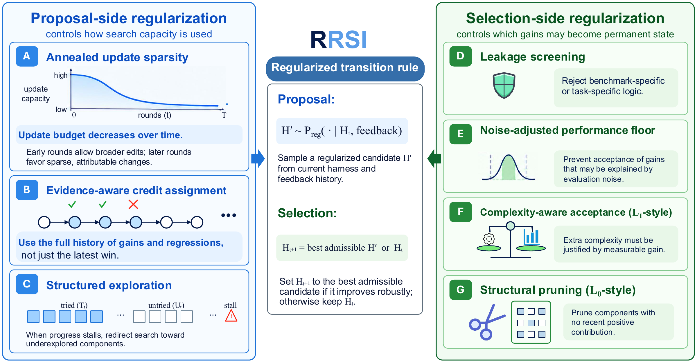

# RRSI: Regularized Recursive Self-Improvement of Agent Harnesses

Check out our [paper](https://arxiv.org/abs/2609.24972) and [project page](https://regularized-rsi.com/) for more details.

## 🔥 Updates

- [09/21/2026] Our [paper](https://arxiv.org/abs/2609.24972) is out! Check it out! [[project page]](https://regularized-rsi.com/)

## 🧬 Overview

<p align="center">
  
</p>

An LLM agent's capability is largely set by its harness: the prompts, control
flow, tools, memory and context management around a frozen model. Evolving the
harness against a fixed evolve set is effective but overfits: the harness
memorizes the training tasks, and large in-distribution gains shrink or vanish
out of distribution. RRSI keeps the harness edit space open and regularizes the
search trajectory through it instead.

On the proposal side, an annealed budget caps how many independent edits one
candidate may bundle, the proposer is conditioned on the full edit history so a
falsified hypothesis is not redrawn, and a stalled run is redirected toward
components it has never exercised. On the selection side, a critic screens
every candidate for suite-specific logic before it is evaluated, a
noise-adjusted floor blocks gains within evaluation variance, a cost rule
requires added inference tokens to be paid for by measured gain, and
components that stop helping are pruned.

### ✨ Key features

* **Open edit space, regularized search.** Prompts, control flow, configuration, context management, tools, skills, memory and sub-agents may all be modified; the constraints act on how the search moves, not on what the harness may contain.
* **One method, three instances.** The same loop drives a terminal agent (Terminal-Bench 2.1), a document-work agent (Harvey LAB) and an engineering-design agent (EngDesign); each instance is a `Domain` adapter plus its starting harness.
* **Candidates in git worktrees.** Every candidate harness is drafted, screened and evaluated in its own worktree on a branch off `evolve/<domain>`; accepting one fast-forwards the branch, so the incumbent is always a commit.
* **Evidence you can audit.** The edit history records, per edit, the component, the hypothesis, the measured score and cost change and the verdict; the prompts the proposer, analyst and critic receive are plain files in `domains/<name>/`.

## 🧩 Method to code

| Paper | Code |
|---|---|
| Empirical score and cost estimate | `rrsi/evaluate.py: aggregate` (weighted per-trial rewards; a missing trial counts 0 with the full denominator) |
| Annealed edit budget b_t | `rrsi/schedule.py: edit_budget`, enforced in the proposer's done() |
| Edit history L_t, tried set T_t, recent yield g_t | `rrsi/history.py: History` (one JSONL record per edit; a = 1 only for the edits of the candidate that became H_{t+1}) |
| Stall flag, untried components, exploration directives | `rrsi/history.py: stall_flag, exploration`; reserved slots enforced in `rrsi/propose.py` |
| Analyze(H_t, D) | `rrsi/analyst.py` dispatching `rrsi/digester.py` |
| Proposer with (component, hypothesis, diff) tags | `rrsi/propose.py`; tags validated against the diff by `rrsi/components.py` |
| Critic (leakage screen before evaluation) | `rrsi/critic.py` (domain regex denylist plus LLM review, bounded repair) |
| Evaluate in parallel | `rrsi/evaluate.py`, `Run.round` thread pool |
| Noise-adjusted floor, cost rule, within-band rule, argmax | `rrsi/selection.py` |
| Novelty nu_t (structural component types never in a winning edit) | `rrsi/components.py: novelty` over K_str = client_tool, skill, memory, subagent |
| Prune set B_t | `History.prune_set`, handed to the proposer with the accepted machinery to remove |
| Noise band delta | fixed per instance in `rrsi.json` (0.017 / 0.004 / 0.020); `rrsi/calibrate.py` re-estimates it when `delta` is `null` (bootstrap over trials of the base evaluation, or repeated base evaluations) |
| Non-compensatory domain criteria | `Domain.guards` (engineering: valid-rate drop, no-submission rise) |

---

## ⚡️ Quickstart

### 0. Install

```bash
git clone https://github.com/google-research/rrsi.git && cd rrsi
pip install -e ".[dev]"            # the search core (Python 3.10 or newer)
python3 -m pytest tests
```

The benchmark runners live in their own environments: harbor for the coding instance (`domains/coding/.venv`), and a Python 3.11 environment with `pip install -e ".[agentic]"` for the workspace and engineering instances (`RRSI_AGENT_PYTHON`).

### 1. LLM configuration

The proposer, the analyst, the critic and the frozen policy are Claude Opus 4.8 on Vertex AI (`policy_model` in `domains/coding/rrsi.json`, `ORCHESTRATOR_MODEL` for the other two instances; any LiteLLM model string works). The Harvey LAB judge is Gemini 3.5 Flash.

```bash
gcloud auth application-default login
export VERTEX_PROJECT="your-project-id" VERTEXAI_PROJECT="your-project-id"
export VERTEX_LOCATION=global VERTEXAI_LOCATION=global
export RRSI_VERTEX_PROJECTS="your-project-id"
```

### 2. Run an instance

Every instance follows the same shape:

```bash
python3 rrsi.py --domain <coding|workspace|eng> smoke     # liveness: compile, construct, a couple of tasks
python3 rrsi.py --domain <name> baseline                   # Evaluate(H_0), seed runs/<name>/frontier.json
python3 rrsi.py --domain <name> run                        # rounds 0..T-1, resumable; touch runs/<name>/STOP to stop
python3 rrsi.py --domain <name> status
```

Each round drafts two candidates in their own git worktrees, screens them, evaluates both on the full evolve set and fast-forwards `evolve/<name>` to the winner. `runs/<name>/` holds the frontier, the edit history and the raw trials. Hyperparameters live in `domains/<name>/rrsi.json` and can be overridden on the command line (`--T`, `--k`, `--delta`, `--beta1`, ...); `readjudicate --t <t>` re-applies Algorithm 2 to a stored round and `reevaluate --t <t>` re-measures one after an infrastructure failure.

Please refer to the specific document for the instance you want to run for its environment, its evaluation protocol and the out-of-distribution runs:

- [`domains/coding`](domains/coding/README.md): Terminal-Bench 2.1, then SWE-bench Verified
- [`domains/workspace`](domains/workspace/README.md): Harvey LAB, then JobBench, GDPval and APEX-Agents
- [`domains/eng`](domains/eng/README.md): EngDesign, then EngDesign v1 and Frontier-Eng

The short version of each:

```bash
# coding: Docker + harbor
python3 -m venv domains/coding/.venv && domains/coding/.venv/bin/pip install "harbor>=0.18"
python3 rrsi.py --domain coding baseline && python3 rrsi.py --domain coding run
bash domains/coding/scripts/swe_eval.sh                       # H_0 and the incumbent on SWE-bench Verified

# workspace: a Harvey LAB checkout at the pinned commit; the split is generated from it on first use
git clone https://github.com/harveyai/harvey-labs.git && (cd harvey-labs && git checkout 1da4750 && uv sync)
export HARVEY_LAB_ROOT=$PWD/harvey-labs RRSI_AGENT_PYTHON=~/venvs/rrsi-agentic/bin/python
python3 rrsi.py --domain workspace baseline && python3 rrsi.py --domain workspace run
python3 rrsi.py --domain workspace heldout --label champ      # the 40 held-out tasks; ood/run_{jobbench,gdpval,apex}.sh for the rest

# eng: the official EngDesign tasks in the verifier layout, a grading venv, a jailed tool gateway
git clone https://github.com/AGI4Engineering/EngDesign.git
python3 domains/eng/scripts/engdesign/build_engdesign_bench.py --engdesign-open EngDesign/EngDesign-Open --out domains/eng/engdesign_bench
python3 -m venv domains/eng/.venvs/engdesign && domains/eng/.venvs/engdesign/bin/pip install -r domains/eng/scripts/engdesign/requirements.txt
bash domains/eng/scripts/preflight.sh
python3 rrsi.py --domain eng baseline && python3 rrsi.py --domain eng run
bash domains/eng/scripts/final_eval.sh frontier               # Frontier-Eng, from a Frontier-Engineering checkout
```

## 📊 Results

Numbers from the paper, with Claude Opus 4.8 as the frozen policy in every instance and every number measured against the unevolved harness H_0 in the same window. "Evolve" is the split the harness was searched on; the other rows never entered selection. Terminal-Bench, SWE-bench, JobBench, GDPval, APEX-Agents and EngDesign report pass rate, Harvey LAB the fraction of rubric criteria passed and Frontier-Eng Medal points.

| Domain | Benchmark | Role | H_0 | RRSI | Δ |
|:---|:---|:---|:---:|:---:|:---:|
| Coding | Terminal-Bench 2.1 | evolve | 74.2 | **80.2** | +6.0 |
| Coding | SWE-bench Verified | OOD | 82.0 | **83.8** | +1.8 |
| Agentic workspace | Harvey LAB | evolve | 89.4 | **90.5** | +1.1 |
| Agentic workspace | Harvey LAB | ID held-out | 86.9 | **89.2** | +2.3 |
| Agentic workspace | JobBench | OOD | 36.0 | **40.7** | +4.7 |
| Agentic workspace | GDPval | OOD | 48.8 | **52.3** | +3.5 |
| Agentic workspace | APEX-Agents | OOD | 34.2 | **37.9** | +3.7 |
| Engineering design | EngDesign | evolve | 50.0 | **54.9** | +4.9 |
| Engineering design | Frontier-Eng | OOD | 17.7 | **22.0** | +4.3 |

The search is not tied to one policy family: with Gemini 3.5 Flash as the frozen policy, the same coding instance goes from 64.6 to 78.7 on Terminal-Bench 2.1 and from 76.8 to 79.0 on SWE-bench Verified.

## 🧱 Adding a domain

A domain is one module, `domains/<name>/adapter.py`, exporting `DOMAIN`, an
instance of `rrsi.domain.Domain` that implements:

* `evolve_ids`, `heldout_ids`, `smoke_ids`: the task splits;
* `run(root, runs_dir, job, ids, k)` and `score(runs_dir, job, ids, k)`: run the harness checked out under `root` and return per-task trial rewards (Evaluate);
* `load_trial`, `render_trace`, `task_row`: the evidence the analyst, digester and proposer read;
* `smoke`: a liveness check of a candidate before it is evaluated;
* `critic_patterns`, `component_signals`, `briefs`, `guards`: the domain's leakage denylist, diff-to-component signals, role prompts and non-compensatory acceptance criteria;

plus `harness_path` (the evolvable directory), `SKILL.md` and `PATTERNS.md`
(the proposer's constitution) and `rrsi.json` (hyperparameters). The core
never reads a trajectory format or a benchmark directory itself.

## 🧪 Tests

```bash
python3 -m pytest tests            # or: python3 tests/test_core.py
```

## 🙏 Acknowledgements

The starting harnesses are the Terminus-2 agent from [harbor](https://github.com/laude-institute/harbor) and the react_toolbelt agent and runner from [archipelago](https://github.com/Mercor-Intelligence/archipelago). The instances evaluate on [Terminal-Bench](https://github.com/harbor-framework/terminal-bench), [SWE-bench Verified](https://github.com/SWE-bench/SWE-bench), [Harvey LAB](https://github.com/harveyai/harvey-labs), [JobBench](https://github.com/Job-Bench/job-bench-eval), [GDPval](https://openai.com/index/gdpval/), [APEX-Agents](https://www.mercor.com/apex/apex-agents-leaderboard/), [EngDesign](https://github.com/AGI4Engineering/EngDesign) and [Frontier-Eng](https://github.com/Einsia/Frontier-Engineering).

## 💬 Citation

```bibtex
@article{xia2026rrsi,
  title={RRSI: Regularized Recursive Self-Improvement of Agent Harnesses},
  author={Xia, Peng and Han, Rujun and Wang, Zifeng and Chen, Yanfei and Zhuang, Yufan and Lee, Yoonho and Huang, Chengsong and Yu, Han and CuiZhu, Zhongying and Ming, Yifei and Yao, Huaxiu and Gokturk, Burak and Pfister, Tomas and Lee, Chen-Yu},
  journal={arXiv preprint arXiv:2609.24972},
  year={2026}
}
```

## Contributing

See [CONTRIBUTING.md](CONTRIBUTING.md).

## License

Apache 2.0; see [LICENSE](LICENSE). Third-party code under `third_party/` carries its own license.

## Disclaimer

This is not an officially supported Google product. This project is not eligible for the [Google Open Source Software Vulnerability Rewards Program](https://bughunters.google.com/open-source-security).
