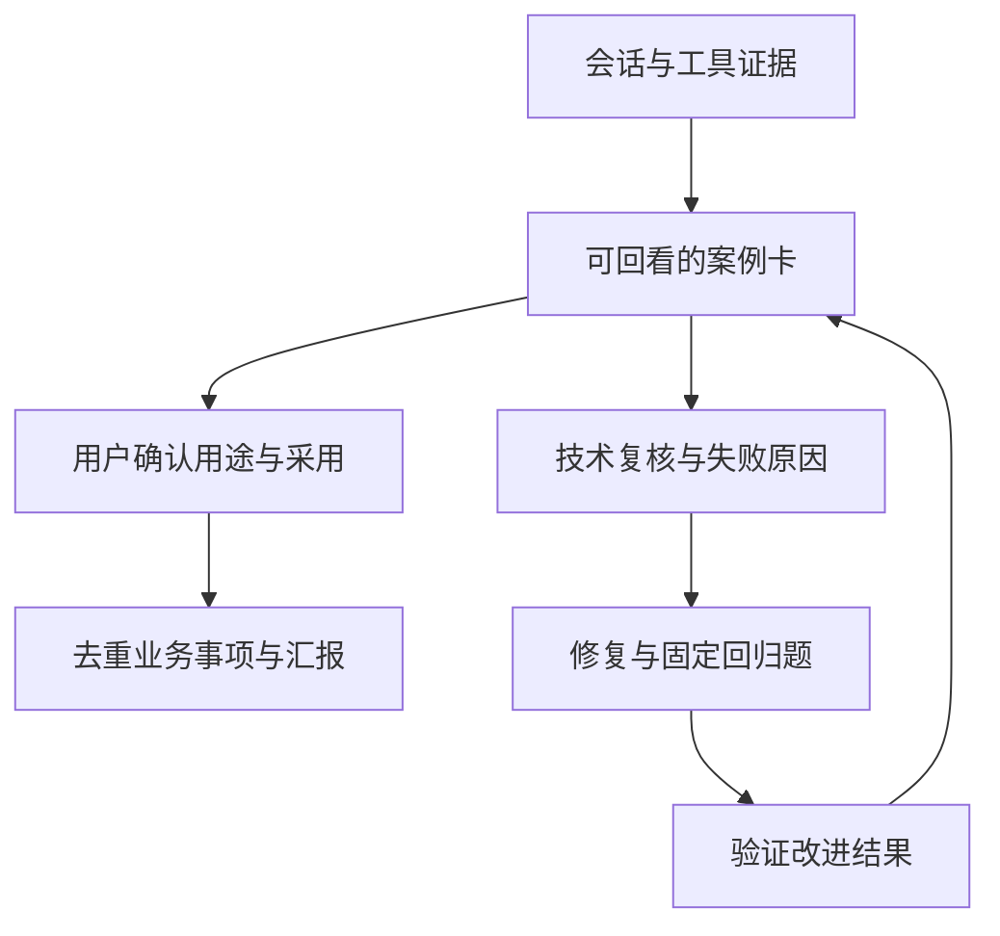

# 先把“花得值”变成几条能被核对的证据

你的平台已经有会话、工具、文件、用户和组织等数据。现在最缺的不是更多指标，而是一个连接：**这次用户想做什么 → 平台提供了什么 → 谁确认可用/采用 → 用在哪里 → 下一步改哪里**。这张可回溯的案例卡，应当成为汇报、用户优化、benchmark、训练候选共用的最小对象。

本方案基于你提供的能力与三份脚本，不假设能获取项目线、HR 职级、人工基线或完整工具日志。你列出的 43.1%、98.5%、0.18% 等数字是待核验的历史计算示例；本包没有实际原始数据，不能确认这些数值。

## 1. 优先完成什么

以下是小范围试点的工作量估计，前提是你已有可用导出；不是交付工期承诺。

| 优先级 | 做什么 | 为什么现在值得做 | 大致投入/依赖 | 首次产物与停止条件 |
|---|---|---|---|---|
| P0 | 统一字段与证据口径 | 先阻止“算得出来但名字错了”的汇报（实测同一用户 token 两口径差 11.6%，见 docs/06） | 1–2 天适配导出与抽查 | 抽 10 条覆盖 MD、JSON、工具失败、无文件问答；能回溯且未知不消失即可 |
| P0 | 全平台只读分析：组织×技能×可靠性归因 | 平台会话 API 实测可按用户全量拉取；这是成本最低、信号最强的第一步 | 一天内；`org_skill_map.py` + 契约 §4.1 字段 | 各部门内部失败表 + 排除开发测试后的修复候选清单；**不输出跨部门裸排名** |
| P0 | 一次性分层抽样复核 + `AUTO:heuristic` 待复核标记 | 无持续人工渠道时的现实路径；确认覆盖率本身是汇报内容 | 一次 1–2 天 + 自动化 | 见 docs/05 §5；启发式标签不去掉 AUTO 前缀不进汇报 |
| P0 | 修复 1 个高频工具/skill 问题，补回归题 | 这是最容易产生可证明增量的地方 | 根据错误来源，可能只需半天至数天 | 相同任务、数据与模型下，失败转通过且没有明显退步 |
| P1 | 冻结 20–30 个自包含任务，按组织分片 | 引入新模型时有自己的准绳；“BEOL 能不能用”比全公司均值更可信 | 先选 2–3 个高频、可判定任务族 | 当前模型基线、候选差异、退步题清单；不追求一次覆盖整个企业 |
| P1 | CPU 任务分类基线（含 keywords 对照） | 验证是否需要让大模型做每个简单判别；实证 TF-IDF+LR > keywords > 多数类 | 数百条独立来源人工标签更适合起步；少量先试 | 与规则/多数类比较；不足就保留规则，不强行升级模型 |
| P1 | 路由提示改写 A/B（route_hint.py） | 假设：路由分类后给提示词加引导，不换模型也可能加速 | 同一冻结题集跑两遍 | 通过不降且成本降才成立；先看路由错标的误导代价 |
| P2 | 狭窄抽取任务的合成 + 小规模 SFT/LoRA | 当规则/提示已到瓶颈且调用频繁时再尝试 | 冻结真实保留集、训练许可、离线模型与算力 | 在真实保留集上有增量，成本摊销合理才继续 |

**暂缓**：通用会话全量训练、自动偏好对、复杂价值象限、职级推断、全量“半导体专家模型”、全功能数据平台。先用一个 SQLite 文件和版本化文件目录足够。**跨部门对比可以做，但只用于定位问题落点**（哪个科的哪个工具），不做给部门排优劣的裸排名——工具开发部门打磨期的失败率天然偏高，裸排名惩罚的恰是贡献者。

你已有的 `stats/runs`、用户组织映射和导出逻辑最值得保留。旧包里最该先替换的是行为到“成功”的直接转换，以及未经整理的训练/评测导出。

## 2. 先修正几个“直接可算”指标的名字

“字段直接可得”只代表测量方便，不代表它能证明想表达的价值。

| 现有表述 | 问题 | 建议现在怎么报 |
|---|---|---|
| `stats.tokens_input` = 成本 | 输入 token 不含所有输出/缓存/模型差异；自建服务器账单不会随 token 线性变化 | 实测输入 token、输出 token、缓存字段，另列账面/现金成本 |
| 中止且 `n_w_files=0` = 浪费 | 问答可以没有文件；探索和主动止损也可能有用 | 中止/无文件会话候选，逐条看原因，不计“浪费率” |
| token / 写文件数 = 单位交付物成本 | 重写、临时文件、复制碎片都能抬高分母 | 同类、已验收任务的完整执行资源；文件数只是活动量 |
| 词表 + `tool_errors` = 完成率 | “可以解释吗”“谢谢但没解决”会误判，错误可能已恢复 | 收尾信号候选；另报已知结果中的可用率与确认覆盖率 |
| 单轮且有文件 = 首次命中 | 文件可能未被看过，单轮也可能是放弃 | “首次交付被明确接受率”，需一次交付与用户/验收结果配对 |
| 多轮 / token 多 = 复杂任务 | 也可能上下文重复、模型失败、工具低效 | 交互轮数、请求量；复杂度依照事先定义的业务任务难度单独标注 |
| 活跃分层 = 留存近似 | 累计次数没有回访时间，不能代表留存 | 叫累计使用强度分布；补事件日期后再做留存 |
| 2954 / 2999 = 活跃渗透率 | 分子与分母可能一个累计、一个当期，注册不等于主动使用 | 同窗口内有主动用户消息的人 / 当期有资格使用的人；资格数未知就只报人数 |
| 会话跨度 = 完成耗时 | 跨天挂起与等待被混入 | 会话跨度；有请求时间再报机器运行/等待，人工投入另采集 |
| basename 相同 = 资产复用 | `README.md`、`report.md`、`main.py` 同名常见；跨租户更严重 | 同租户稳定资产 ID + 版本的成功读取事件，且发生在写入之后 |
| 路径提及 = 复用/存活 | 提及不等于读取，读取不等于业务采用；没有持续观测不能估生命周期 | 引用候选、实际读取证据、业务采用分别记录 |
| 部门 + 文件扩展名 = 业务线 | 组织归属与项目用途不是同一个事实 | 部门作为切片；场景为待确认标签；项目由用户自选或可靠数据源提供 |

你对 token 上升先保留事实的态度值得延续，但不能因为会话量上升就自动称为健康扩张。量升、成功变少、循环更多也可能同时发生。

## 3. 交互价值只保留六个维度，不合成总分

| 维度 | 先用什么 | 能支持的判断 | 不支持的判断 |
|---|---|---|---|
| 使用覆盖 | 有时间戳的主动消息人数、部门覆盖、同窗口回访 | 平台是否被持续使用 | 人员价值、工作效率 |
| 结果可用性 | 已确认 usable/partial/not_usable/unknown，验收器结果 | 有多少结果被认可，哪些仍不知道 | 无反馈的会话已经成功 |
| 使用摩擦 | 工具错误与恢复、用户纠正候选、澄清/变更分类 | 哪个工具/步骤值得改 | 用户能力低、纠正必然是模型问题 |
| 资源效率 | 同类任务的实测请求/token/延迟，含失败尝试 | 哪种配置在相同质量下更省资源 | token 等于现金成本 |
| 可复用产物 | 已验证文件/回答/结构化结果，跨会话实际读取 | 平台是否积累可用工作材料 | 更多文件就是更有业务价值 |
| 改进增量 | 同题同环境修复前后、模型切换前后 | 平台建设具体改进了什么 | 简单前后趋势就证明因果 |

**组织（部门/科）是第一切片维度，不是第七个维度。** 实证显示失败率、token 占比、技能使用全部按科显著分化（docs/06）。但注意边界：部门回答“资源用在哪、问题出在哪”，不回答“这个部门产出了多少价值”——后者只有案例卡和用户确认能给。skill/agent 是另一类可复用资产：一个技能被多少部门、多少人实际使用，本身就该进汇报（`reuse_signals.py` 的 skill_reuse 表）。

技术验收、用户接受、业务采用是三种证据，可以同时存在也可以冲突。例如单测通过但用户仍未采用；用户满意但数值推导错误。保留冲突并复核，不用一个“成功”字段盖过去。

最小汇总格式是：`value, numerator, denominator, window, scope, coverage, source, metric_version`。没有适用分母就报计数；没有足够证据就报 unknown。新版报告按此原则实现主要项目。

## 4. 从交互到业务的桥梁：一条工作事项



用 `work_item_id` 把同一任务的多个会话/尝试归为一个事项。一个会话包含多个目标时，先标 `mixed` 或人工拆分；不要未经核对自动按每四轮切任务。初版台账以 session 为分析单位，业务确认层另去重，不宣称已实现完整任务分割。

用户身份只帮助找到适合的语言和确认人。例如“演示工艺部门 + recipe 差异整理”可形成候选场景；不能由此推出“提升良率”。好的确认句是：“这份比较表是否被用于实验准备？哪些部分能用，哪些还需修改？”

## 5. 成本花得值，如何讲得具体

领导通常需要回答三件事：钱用在哪里；是否得到被使用的成果；下一笔投入是否还有明确回报路径。建议并列两本账，不强求一个 ROI 数字。

**成本账**：按期列固定容量成本、变动现金支出和运维投入。购置额与折旧额不能在同一成本口径里重复相加；已有运维工资和新增人力也应区分。自建推理优先看 GPU 时间/占用与排队、各模型吞吐和缓存；缺这些时 token 只作工作负载代理。

**证据账**：确认采用的去重事项、使用场景、可验证产物、人工投入变化、修复闭环。采用数是已知子集，不把全平台成本直接除以这几个主动反馈案例来称“每成功任务成本”。

对一个完整观测、同类任务的试点，才考虑：

```text
每个验收成功任务的执行成本
  = 该任务族所有尝试成本（含失败与重试） / 该任务族验收成功数

净人工时间变化区间
  = [无 AI 人工投入下限 - 有 AI 人工投入上限,
     无 AI 人工投入上限 - 有 AI 人工投入下限]
```

有 AI 的投入要包含需求表达、检查、修订与返工。保留负值。机器运行等待不自动等于人工时间。用户估计与配对观测分列；没有 AI 时本来不会做的新增任务，先记能力增量，不假设原本要花若干小时。

如果需要讨论容量经济性，可以展示情景计算：`需释放的工时 = 该口径下的当期成本 / 约定的每小时内部价值`。这只是盈亏平衡情景，依赖小时价值与释放时间确实可用的假设，不是已兑现现金节省。不要把节省工时、复用节省、同一成果的质量价值再相加一次。

为了证明“平台建设”的增量，最便宜的试验通常是固定模型，比较同一批脱敏任务在 skill/API 修复前后；用相同验收规则。模型升级和环境升级一起发生时，只能归因于整体方案。必要时做小型 2×2 比较，但初版不必同时跑四条路线。

## 6. 当前 token 上升，做最小排查

1. 先统一输入/输出/cache 语义和时间窗，去掉父子 session 重复、重试重复导出。不要把每轮重复输入的上下文从实际 usage 中删掉；它是实际开销。
2. 按 **任务族 × 模型 × skill 版本** 看中位数、p90、通过情况、输入/输出分别变化；未标注任务族单列 unknown。
3. 用固定任务族权重比较月度均值，或直接比较重叠的同类任务。新出现/消失的任务族单列，别偷偷丢掉。
4. 抽最贵的 5 条，检查大文件反复读取、工具大返回、无效重试、上下文膨胀。找到一个可修复原因并做前后回放。

`总 token = 会话数 × 平均 token/会话` 是描述恒等式，不能再把“模型结构”作为独立乘数相乘。模型占比改变、复杂度变化只是解释线索，不是因果证明。

## 7. 参考依据的使用边界

评测方法上参考了 Anthropic 对 transcript 与 outcome 的区分，以及从具体任务和验收器建立评测的做法；本包据此把“模型说完成”与“结果验证/采用”分开。这是针对你现有条件的实现取舍。[Anthropic：Demystifying evals for AI agents](https://www.anthropic.com/engineering/demystifying-evals-for-ai-agents)
