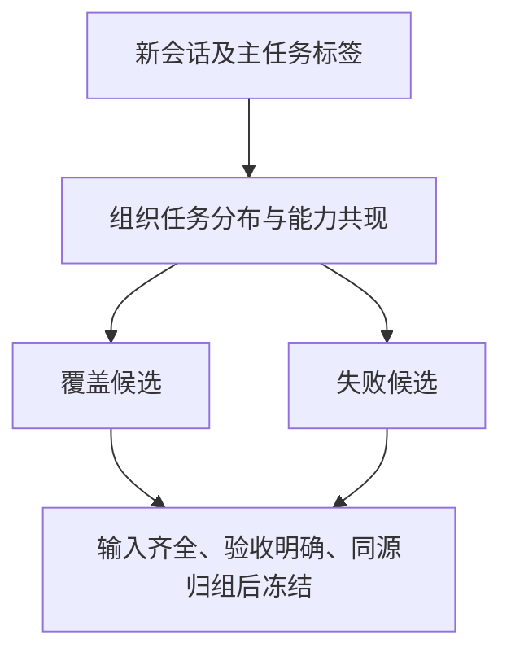

# 任务分布图谱与内部评测集：先做两张表

最小方案是：**一张“组织 × 任务”的分布表，一张“任务 × 如何验收”的选题表。** 不必先建图数据库、自动任务切割器或复杂标签体系。现有分类器和 skill/agent 事件已经足够开始。

本页方法针对你报告中的 IAD-D、BEOL、YAE 等组织场景；任务例子是假设性参考，不代表这些部门的真实数据已在此分析。

## 1. 先分清四个容易混淆的字段

| 维度 | 回答什么 | 示例 |
|---|---|---|
| 用户所属组织 | 谁在使用 | IAD-D、BEOL、YAE；不由此推职位或项目收益 |
| 会话主任务 | 用户想完成什么 | 查资料、分析数据、编写脚本、比较参数 |
| 所用能力 | 通过什么完成 | 某 skill/agent、原生工具、自定义工具 |
| 评测任务 | 这一题具体考什么 | 从首问判类别、从请求提字段、从两表算差异 |

例如“帮我写日志解析脚本”，会话主任务可以是 coding；把这句送进路由器考分类时，评测任务是 intent_routing。**画业务任务分布时，应统计它的 coding 标签，而不是把全部路由样本统计成 intent_routing。**

一段 SKILL.md 被加载，不表示用户任务是“编写 skill”；调用 etch-data，也不自动表示已完成工艺分析。任务类别来自请求，能力使用来自运行记录；连接只表示同会话共现。

## 2. 第一版类别控制在 5–8 个

如果已有 taxonomy，沿用即可，不必为了本包重新标注。尚未统一时可参考：

| 主任务标签 | 判定侧重点 | 可先做的下游评测 |
|---|---|---|
| knowledge | 找资料、解释术语、定位依据 | 固定资料下证据定位；有无依据、不足时是否说明 |
| data_analysis | 对给定数据计算、分组、统计 | 数值、分母、单位、缺失值处理 |
| coding | 写/改/调试代码 | 在隔离环境下运行固定输入与测试 |
| parameter_compare | 比较 recipe/参数/版本 | 新增、删除、改变字段及单位；不生成最优工艺真值 |
| document | 总结、翻译、结构化报告 | 必需字段与事实保留；开放表达需适合的验收方式 |
| capability_build | 开发或调试 skill/agent/工具 | 配置契约、接口与负例测试；不与普通使用混算失败率 |
| mixed | 多个独立目标，暂不拆分 | 待整理；不强行作为一道题 |
| unknown | 输入不足或未分类 | 用于发现 taxonomy 缺口，不悄悄删掉 |

不要同时新增复杂度 L1–L5、业务价值等级和几十个工艺子类。后续只有某个大类出现明确不同验收方式时再拆。例如 coding 可拆日志解析与代码修复；两者仍可共享 coding 主类。

你的 TF-IDF 分类器可以直接提供标签。保留 `label_source=heuristic/model/human`；若人工没有确认，分布图标题写“自动识别的任务标签分布”。高 unknown/mixed 应优先看标签适用范围，不先解释成用户需求低价值。

## 3. 分布脚本怎么用

可选标签文件，每行一条；从案例快照复制 case_id 与 source_revision：

```json
{"case_id":"复制案例ID","source_revision":"复制来源版本","task_type":"coding","label_source":"heuristic","reviewer_id":"AUTO:router-v1","source_group":"同源任务家族ID"}
```

`source_group` 没有时可先省略；脚本只能按 session 去重，稍后选题时再把同 recipe/lot/run/复制模板归为同一家族。不要用部门名当 source_group，否则整科所有任务都会被当成一个来源。

```sh
python3 scripts/task_atlas.py --cases evidence/cases.jsonl \
  --labels task_labels.jsonl --registry state/split_registry.json \
  --start '2026-08-01T00:00:00+08:00' --end '2026-09-01T00:00:00+08:00' \
  --per-cell 2 --out reports/task_atlas_001
```

没有标签文件/历史 registry 就省略相应参数。没有 labels 时尝试当前人工/自动记录中的 task_type，其余为 unknown，不自动联网分类。时间窗按**会话新建时间**取 cohort，不按每条消息活动时间；省略时间窗则描述当前会话快照。

| 输出 | 用法 |
|---|---|
| `task_atlas.md` | 组织 × 主任务表、简单 Mermaid 分布图、选题说明 |
| `org_task_distribution.jsonl` | 会话数、观测用户数、标签来源、有错误线索的会话数 |
| `task_capability_edges.jsonl` | 以 `action=load/invoke` 分开成功加载与调用共现，可供以后做交互图 |
| `bench_seed_candidates.jsonl` | 每个组织/任务格子少量候选，必要时补一个失败候选 |
| `development_regression_candidates.jsonl` | 已在 train/dev 的失败来源，保留原 split，只做已见问题调试，不升级为 holdout |
| `classification_review_candidates.jsonl` | mixed/unknown，待理解或拆分，不假装已有标准答案 |

分布中的会话数不是独立任务数，用户数跨格子可能重复。有错误线索也不是任务失败：默认只排除有测试定义且断言通过的预期负例，工具返回 success 但测试断言失败也保留，其余仍需结合阶段分析。

v2.2：人工只确认采用、没有填写任务类别时，保留自动任务标签及其来源。load/invoke 的会话可重叠，不能直接相加；只有加载事件的平台先展示材料接触图，不伪造调用事件。一个历史 train/dev 失败来源只产生一个调试指针，不自动授予训练用途。

## 4. 从“有很多会话”到“有几道好题”

候选只需经过这四个问题，不要先给每条会话写长分析：

1. **输入齐不齐？** 问题、必要历史限制、文件/数据、工具 schema 是否可冻结；不能只保留首问。
2. **怎样判对错？** 精确字段、计算结果、差异集合或隔离测试；开放回答暂时没有可靠验收就不硬塞 json_exact。
3. **与其它题是否同源？** 同会话、同实验/材料的改写和子任务归一组，整组分集。
4. **这题代表什么？** 真实常见任务、历史失败回归，还是合成能力边界；分别标记。

通过后再写成现有 `curated.jsonl`，交给 `build_datasets.py` 和 `bench.py`。本轮脚本不自动填 target、不自动 approved、不分配 train/dev/holdout，也不授予训练用途。

## 5. 首批 20–30 题的启发性配额

以下不是统计定律，只是减轻第一轮选题负担的例子：

| 子集 | 约占/题数示例 | 用来回答 | 不能回答 |
|---|---|---|---|
| 真实覆盖题 | 12–18 题 | 当前重点组织和任务族是否可用 | 小型、均衡配额题集不能估平台总体成功率 |
| 真实失败回归 | 4–6 题 | 已知问题是否改善、旧问题是否重现 | 不代表普通流量难度 |
| 合成边界题 | 4–6 题 | 缺字段、单位、非法输入等确定能力边界 | 不代表真实业务效果 |

任务最多的 IAD-D 不应自动拿走绝大多数题；BEOL/YAE 等小组织的重要任务至少有机会进入候选。`--per-cell` 产生的是候选池，最后可以少选，不必把所有格子都冻结成一个巨大 bench。

脚本的均衡覆盖抽取不是概率抽样；不要用其平均分声称线上完成率。若以后确实需要线上代表性估计，另建按流量随机抽取、保留 unknown 与不响应的样本；不要把它与失败优先题混为一谈。

**稀有但关键的失败不要被平均分盖住。** 你报告 coding 只有 3 条且 F1=0，这首先提示覆盖薄且不能稳定判断；不意味着需要马上训练更大模型。补几种不同来源的真实 coding 任务并明确验收，比重复合成同一题更有用。

已有题库时，可再接一段很短的“缺口表”伪代码，不需要另一个系统：

```python
# 接口伪代码：business_task 是会话主任务，不是 bench.task_type。
# coverage_org/business_task 由来源案例映射；缺失归 unknown，不凭部门猜任务。
for org, business_task in observed_org_task_cells:
    real_downstream = [q for q in frozen_bench
        if q.coverage_org == org and q.business_task == business_task
        and q.source_kind == "real" and q.reference_quality == "validated"
        and q.task_type != "intent_routing"]
    emit(org, business_task, n_real_downstream=len(real_downstream),
         next_action="补一条可验收下游题" if not real_downstream else "先看退步与来源多样性")
```

当前 task_atlas 脚本只做候选推荐，尚未读取现有 bench 计算缺口。不要把“存在一条合成题/路由题”误报成该组织的真实业务任务已被充分覆盖。

## 6. 路由评测与提示路由评测分成两套

| 套件 | 输入和目标 | 先看什么 |
|---|---|---|
| 路由诊断 | 用户请求 → 类别标签 | 三基线的宏 F1、每类 support、选中数/正确数、弃权覆盖；弱标签成绩称一致性 |
| 下游任务评测 | 完整请求/材料 → 实际结果 | 任务是否通过、关键退步、含追加提示和失败的 token/耗时 |

同模型四组 A 原提示、B 通用提示、C 关键词类别提示、D TF-IDF 类别提示，必须在第二套上比较。否则提示已经包含被考类别，就像把答案放进考卷。D 若不超过 B/C，就保留更简单策略。

`run_prompt_ablation.sh` 输出相对 A 的对照，并额外输出 `classifier_vs_generic.md`、`classifier_vs_keywords.md`。默认模板只有演示类别；公司类别不匹配时可能全部透传，先检查实际加提示覆盖。当前脚本适合固定 JSON 结果的模型层实验，代码执行和完整 Agent 链路需要接入已有隔离测试/回放器，尚未在本包实现。

只在获准使用内网模型网关后运行；阈值先在 dev 选择，下面 0.5 只是参数示例，第 7/8 个参数是你按已有 taxonomy 改过的配置：

```sh
sh run_prompt_ablation.sh frozen_downstream MODEL INTERNAL_API_BASE router/router.pkl \
  runs/new_ablation 0.5 company_keywords.json company_task_hints.json
```

按组织拆分用于测试新部门迁移；按来源组加未来时间窗口用于测试已有部门后续使用。两者是不同问题。报告中 IAD-D→BEOL 的跨科成绩不能直接当作每个部门日常生产准确率。

## 7. 更新循环只留一个固定集和一个候选池

固定 anchor 支持版本间可比；新会话每期更新图谱与候选池。模型或提示准备更换时，才整理一小批新题并跑同条件对照。



持续使用已有 split_registry；旧 holdout 及其衍生内容不能转训练。题库被多次用于调提示后，只能称已见回归集，另取未来独立来源作为未见 holdout。

暂不增加自动“高价值”标签、GraphRAG、无限合成或自动 DPO。图谱的价值在于回答“我们主要在解决什么、哪类任务没被测、下一题该从哪里来”，而不是画得更复杂。
