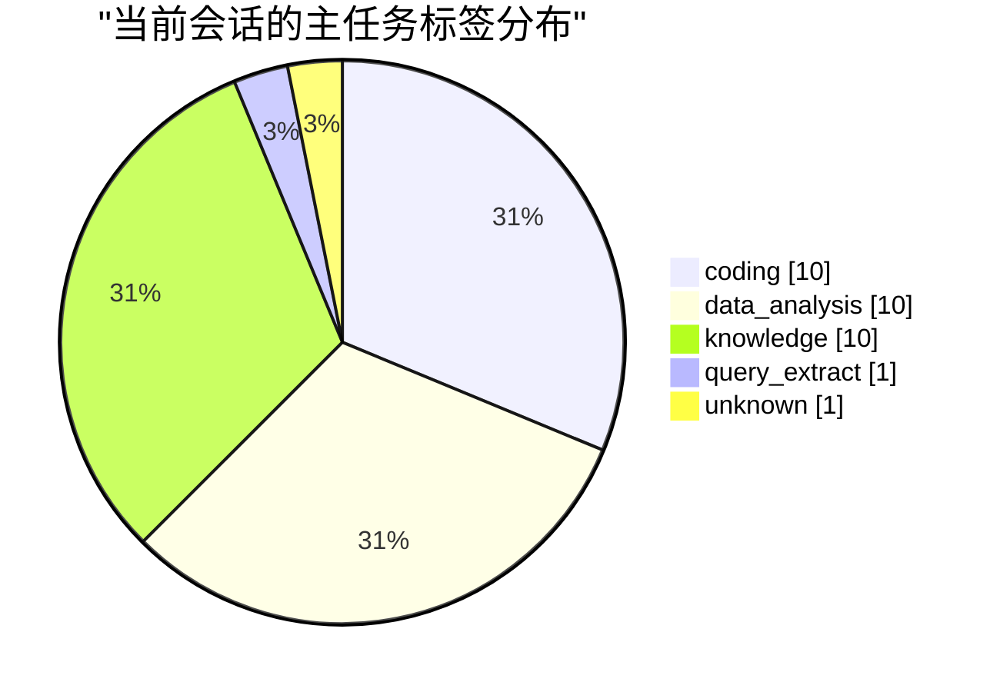

# 任务分布与评测选题

口径：current_session_snapshot；会话 32，未知/多任务 1。一个会话按一个主任务统计，不称为独立任务总量。

## 组织 × 主任务类型

| 租户 / 组织 | 主任务 | 会话数 | 用户数 | 标签来源 | 有错误线索会话 |
|---|---|---|---|---|---|
| DEMO / unknown | unknown | 1 | 1 | {'unknown': 1} | 0 |
| DEMO / 演示工艺 | coding | 6 | 4 | {'human': 6} | 1 |
| DEMO / 演示工艺 | data_analysis | 6 | 4 | {'human': 6} | 1 |
| DEMO / 演示工艺 | knowledge | 5 | 3 | {'human': 5} | 3 |
| DEMO / 演示工艺 | query_extract | 1 | 1 | {'human': 1} | 0 |
| DEMO / 演示研发 | coding | 4 | 3 | {'human': 4} | 1 |
| DEMO / 演示研发 | data_analysis | 4 | 2 | {'human': 4} | 1 |
| DEMO / 演示研发 | knowledge | 5 | 3 | {'human': 5} | 1 |

## 当前快照的任务分布图

标签未独立验证时，此图是‘自动标签分布’，不是业务任务真值分布。跨租户汇总仅供获准的内部离线分析。

## 评测候选

选出 6 条：覆盖候选与额外失败候选分别标记；unknown/mixed 共 1 条另存待整理清单。

- 候选仅有来源指针和请求预览，不是可直接执行的 benchmark。
- 相同来源组只选一个；未声明来源族时只能按 session 去重，仍需合并 recipe/lot/模板衍生题。
- 组织规模不决定所有名额，避免大部门淹没小部门；这不是线上代表性随机抽样。
- 已知 train/dev 来源不推荐为新 holdout；其中 6 个失败来源另存 development_regression_candidates.jsonl，可调试但不算未见泛化。正式构建仍由 build_datasets.py 校验。
- task_capability_edges.jsonl 以 action 分开成功加载与调用；同会话共现不证明该能力完成了任务或造成错误。不能把两种边的会话数相加成使用总会话数。

建议先人工/程序验收整理少量下游题；只有路由标签的候选继续作为路由诊断，不用来证明提示路由提升任务成功。
