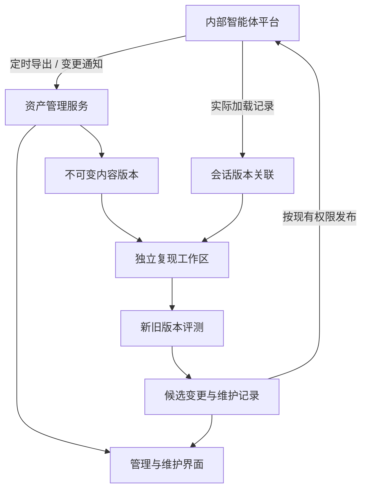

# Skill / Agent 资产快照与生命周期管理应用建议

面向内部 OpenCode 二开平台 · 2026-09-23

## 1. 建设目标与最重要的调整

建议把这个应用定义为：**记录资产历史、证明会话使用的版本、支持 owner 维护与评测的工作台。**

管理对象是个人/公共 Skill 目录，以及 `.opencode/agents/` 下个人/公共 primary、subagent 文档。`AGENTS.md` 不属于这里的 Agent 定义；若影响复现实验，可作为运行环境上下文另行记录。

你的现有文件同步接口已经足以启动资产清单、快照和 diff。最重要的调整是：

> 时间戳用于说明“什么时候观察到”；内容版本用于说明“保存了什么”；运行时关联用于说明“会话实际用了什么”。

三者需要分开。定时拉取可以保存历史，不能单独证明历史会话加载了哪个版本。

例如，10:00 抓到 A，10:05 用户临时改成 B 并运行会话，10:10 又恢复成 A。两次定时快照都只有 A，按前后时间匹配也无法恢复 B。

因此建议两条采集路径并行推进：**定时同步负责覆盖与补漏；发布、加载时的版本记录负责关键关联。** 历史缺失可以明确保留，不妨碍先开展基于现有版本的对照实验。

## 2. 建议采用的最小架构

沿用现有 Web 后端和数据库，加一个后台同步任务、一个受控文件存储即可。优先复用内网环境，不要求 Docker 或额外集群。



初期元数据用现有关系数据库，包内容存受控目录，按内容版本去重即可。如果内网已经有成熟 Git，可用它保存文本/目录历史与 diff；Git 本身提供内容寻址对象存储，适合承担版本存储层。[Git 对象说明](https://git-scm.com/book/en/v2/Git-Internals-Git-Objects)

选择一种主要历史存储方式即可。即使使用 Git，应用仍需维护 owner、访问范围、会话关联、评测和发布记录；这些不是一条 commit 能替代的。个人资产也不应因为统一存储而变成所有用户都可浏览的仓库。

平台上的当前文件在初期仍是运行来源；本应用保存观察历史和候选变更。开放写回后，经平台更新接口变更运行文件，再记录发布与回读结果。**同步动作本身不应把旧快照覆盖回平台。**

## 3. 用少量概念区分资产、版本与发布

这是一份数据关系建议，不要求第一版建成多个服务。

| 对象 | 最小内容 | 为什么需要 |
|---|---|---|
| 资产 Asset | 稳定 ID、tenant、个人/公共、owner、skill/agent、名称、来源；Agent 的 mode | 同名跨用户不混合，改名仍可追踪 |
| 内容版本 Revision | 内容指纹、文件清单、存储位置、首次入库时间 | 保存不可变内容，支持 diff 和恢复 |
| 采集记录 Capture | 范围、开始/结束时间、结果、完整性、各资产指向的版本 | 无变化也能证明采集成功；失败不等于删除 |
| 运行关联 Binding | session、事件或角色区间、实际资产/版本、证据来源 | 对应会话复现；保留精确或近似状态 |
| 变更/发布记录 Change | 原版本、候选版本、操作者、原因、评测、目标、发布结果 | 支持 owner 维护、冲突处理、回滚与追责 |

身份不要只用名字：公共 `doc-review` 与员工 A 的 `doc-review` 是不同资产。公共能力在不同用户下是否被个人定义覆盖，以平台实际解析结果为准，不在管理应用中猜优先级。

一个资产可以有多个已存版本，不同运行目标也可能仍在使用不同版本。因此分别显示：最新采集版本、候选版本、目标环境当前版本、最近运行确认的版本。不要让一个“最新版本”标签代表所有状态。

归档是资产的生命周期状态；版本内容保持不变。回滚是一次新的发布动作，引用旧内容版本，历史记录继续追加。

## 4. 快照怎样保存才有用

### 4.1 Skill 保存目录，Agent 保存文档，并标出外部依赖

Skill 快照应覆盖 `SKILL.md`、scripts、references、assets 及其实际运行必需文件。只保存入口 MD，无法判断脚本或参考规则变化，也难以复现。

Agent 本体仍是一份 Markdown：frontmatter 和正文都保存。它引用的其他 Skill、共享契约、工具配置等，进入依赖或运行清单，不强行把所有对象复制进 Agent 文件。

先区分运行资源、生成产物和临时缓存，再决定包含范围。不要机械地把整个目录全部打包，也不要盲目排除看起来像依赖目录的文件。排除规则应有版本和记录。

你已有一些 Skill 把 memory/context 放在自身目录内。这类可变状态应单独标识：它若参与推理，需要在复现材料里固定；它的每次追加不必都解释成 Skill 方法更新。缺失的外部引用与状态明确列出，不宣称已经完整保存运行环境。

### 4.2 内容版本不用 ZIP 文件的 hash 直接定义

ZIP 的打包时间、排列等变化可能使同一目录得到不同包字节。建议对包内原始文件内容计算指纹，再按稳定的相对路径、类型和必要执行属性形成排序清单；对清单计算内容版本。

保留原始内容字节，不能为了去重去掉空白、改大小写或换行。路径规范化也要检查冲突；脚本可执行位、链接等若影响执行，应明确保存或报告不支持。

同样内容只存一份，但每次采集仍追加观察记录。A → B → A 是三次状态观察，可以只引用两个内容版本，不能因此丢掉变化历史。

### 4.3 同步必须知道“是否拉完整”

现有接口若能补一点元数据，优先是：采集范围、完整/部分状态、返回数量、分页信息、源版本或快照标识、开始/结束时间、失败项。

只有完整范围清单或明确删除事件，才支持判断源端资产已消失。接口超时、无权限、分页未取完、单包下载失败，都不能当作资产被删除，更不能触发自动归档。

公共资产独立采集一次；个人按授权用户目录分批采集。个人使用公共 Skill 时记录引用，不必为每个用户重复复制同一个公共包。

### 4.4 导出期间也可能发生修改

服务器最好从一个已固定的目录版本或一致性副本导出。若目前只能边读边打包，先标记一致性未保证；前后版本检查可以发现一些变化，但不能保证绝无中间改动。

这不影响它用于备份与 diff，却影响能否宣称获得了运行时同一份资源。不要为了第一版完整而阻塞所有采集，先把证据强弱显示出来。

## 5. 支持会话复现，优先补什么

### 5.1 版本记录放在实际解析和加载位置

建议逐步记录：primary 进入/切换、subagent 实际启动、Skill 实际加载，以及必要的后续参考/脚本资源解析。至少包括 session/event、实际解析来源、内容版本和加载结果。

记录的是运行器实际加载的内容或固定包版本，不是收到同名请求后再去下载当前文件。后者仍可能读到已经更新的版本。

同一会话可能切换 Agent，也可能前后加载不同资源版本；一个 session 只挂一份开始时清单通常不够。若运行平台可以把依赖固定到不可变目录，再按该目录执行，会比事后拼接更容易追溯。

对于涉及路由、漏选、新建或归档的评测，还需要记录当时可见的候选能力与解析规则摘要。只保存最终加载者，适合方法复现，不能完整复现“为何选中了它”。

### 5.2 历史关联分级，复现准备程度另行表示

| 关联状态 | 含义 | 可以支持 |
|---|---|---|
| 已确认 | 有实际加载版本与对应内容的证据 | 该部分资产的准确重建 |
| 时间近似 | 只有临近快照或变更时间线 | 近似重建，限制归因 |
| 未知/缺失 | 无法关联，或有 hash 无内容 | 列出缺口，不能标成已复现 |

这些状态最好落到每个资源；一份 baseline 可能一部分确认、一部分近似。不要仅给整个会话一个模糊分数。

再单独显示复现准备：资产是否齐全、初始输入是否齐全、依赖是否可用、环境差异、是否已运行。版本已确认不等于环境齐全，材料齐全也不等于已成功复跑。

### 5.3 最小 baseline 是一个固定清单和独立工作区

```yaml
case_id: 待复现的任务
source_session: 原会话标识
input_cutoff: 从哪个用户输入或检查点开始
inputs: 初始材料引用与内容版本
resources:
  - asset_id: 指定资产
    revision: 指定内容版本
    binding: confirmed  # 也可为 time_inferred / unknown
runtime:
  model: 已知模型与参数，未知项明确列出
  platform: 运行平台版本或构建标识
  context_and_tools: 相关配置、权限与工具依赖引用
evaluation: 固定任务要求与评测题版本
gaps: 尚未保存或无法重建的条件
```

复现到隔离工作目录，沿用你已有的沙盒机制。初始输入与原会话的最终答案、后续修复材料分开；不能把最终产物当成原始输入，从而得到虚假的 baseline。

动态数据库、检索结果和 API 行为也可能变化。可选择固定响应做回放，或在当前服务上重新执行，但应标注模式和限制。凭据通过现有授权机制解析，不把实际密钥打进 baseline。

新旧文档比较时复制同一份初始工作区，再分别加载旧版和候选版，避免第一组产物污染第二组。准确恢复资源不保证模型逐字输出相同，评测应关注任务要求、质量和成本。

## 6. 至少需要哪些功能

| 优先级 | 功能 | 第一版做到什么程度 |
|---|---|---|
| P0 | 资产目录与访问范围 | 个人/公共、owner、Skill/Agent、primary/subagent；按实际权限查看 |
| P0 | 定时与手动同步 | 记录范围、成功/失败、完整性与最后成功时间；失败可重试 |
| P0 | 不可变版本与历史 | 保存目录/文档，内容去重，历史可下载，缺失可解释 |
| P0 | 文件和字段 diff | 增删改、文本差异、Agent frontmatter 差异；二进制显示变更和预览条件 |
| P0 | 恢复到独立工作区 | 指定版本重建资源，不改线上运行目录 |
| P0 | 会话关联入口 | 能记录已确认/近似/未知；先支持少量重点资源绑定 |
| P0 | 操作与变更记录 | 记录采集、导出、候选、发布/恢复操作者及范围 |
| P1 | owner 候选维护 | 编辑或上传候选、附问题来源、查看 diff、关联相关会话 |
| P1 | 评测与 baseline 导出 | 固定资源与输入清单，接现有评测结果，显示缺口 |
| P1 | 条件写回与回滚 | 防覆盖更新，验证生效，保留旧版本；回滚也是有记录的发布 |
| P1 | 依赖与归档 | 查看入站依赖，迁移或说明替代能力，保留恢复入口 |
| P2 | 自动改进建议 | 高频方法、新能力、修改/归档候选；由既有 creator 和评测能力处理 |

“保存历史”与“自动写回”分批落地。可先让 owner 导出候选包使用；写回前把并发保护和生效确认做好，再开放自动更新入口。

## 7. 自动更新接口应该遵守什么约定

### 7.1 候选先落成可比较的版本

owner 编辑、上传 ZIP 或 creator 生成内容，都先形成候选版本，附 base_revision、变更原因、相关问题与 diff。保存候选不代表已更新运行平台。

轻微文案调整做相关静态检查；影响行为、依赖或权限的变更运行对应的小评测。共享能力重点看调用方兼容性。检查强度跟随改动，不要求每次都跑全部 benchmark。

### 7.2 防止覆盖 owner 刚刚做的修改

写回携带预期源版本，例如 `expected_revision`。服务器对当前版本不匹配时返回冲突，让调用方重新获取并比较；不要默认最后写入者覆盖。

HTTP 场景可采用 ETag / `If-Match` 的条件请求语义。RFC 9110 明确将它用于避免并发修改造成更新丢失。[RFC 9110 §13.1.1](https://www.rfc-editor.org/rfc/rfc9110.html#section-13.1.1)

更关键的是服务端把“检查版本”和“切换内容”作为受保护操作；仅在客户端先比较再上传仍有竞争窗口。重复提交带请求标识，便于安全重试和查询结果。

### 7.3 目录更新与实际生效分别确认

Skill 用完整候选目录暂存，检查后切换，避免运行器读到半个新目录；具体锁定或切换方式遵循现有文件布局。正在执行的会话若能固定旧版本，就继续使用旧版本；新会话使用新版本。暂不支持时，应明确热更新范围与复现限制。

写入成功之后核对文件版本、发现/加载结果。运行器若缓存了旧定义，还需按实际机制刷新或等新会话加载。dashboard 区分“文件已更新”和“运行时已确认使用”。

Agent 与配套 Skill 一起变更公开契约时，记录兼容的版本组合；平台不能原子切换整个组合时，标注部分完成并采取兼容更新顺序，不假装整组同时发布成功。

### 7.4 权限由服务器验证

接口中的 user_id / owner_id 是目标范围，不能代替调用者认证。owner 可维护自己的资产，公共资产按既有维护权限处理；历史内容下载、diff 和恢复同样执行权限检查。

个人能力发布到公共范围建议作为明确的提升动作：新建公共身份并保留来源，核对依赖与内容可共享性。不要通过改一个 owner 字段，把个人历史版本一并变成公共内容。

### 7.5 归档保留历史，处理引用

低使用先看业务周期、发现问题和依赖；使用记录不完整时不做自动归档。归档从默认发现中退出或停用前，查看引用它的 Agent / Skill 与替代路径。

历史 baseline 引用的版本继续保留。存储清理以后再做，至少保护当前发布、评测/baseline 引用以及明确保留的版本，不能简单按时间全部删除。

## 8. 在现有接口上，最值得补的少量能力

以下是接口职责建议，不假设你的服务器已经支持这些字段，也不要求采用这些路径名。

| 职责 | 输入 | 最有价值的返回/约定 |
|---|---|---|
| 清单与同步 | 已授权个人或公共范围、分页/增量标识 | 资产身份、当前源版本、完整性、变更与明确删除事件 |
| 指定内容导出 | 资产与源版本 | 包/文档、文件清单、内容版本、一致性说明；版本已不存在则说明 |
| 运行版本上报 | session/event、实际解析来源、内容版本 | 能关联保存内容，不是仅保存名字 |
| 候选发布 | 目标、候选版本、expected_revision、请求标识 | 冲突或发布结果、回读版本、是否已确认加载 |
| 归档/恢复 | 目标与预期当前状态 | 依赖检查结果、变更记录、当前发现/启用状态 |

如果当前导出接口只能提供“此刻 ZIP”，先由管理服务立即保存并计算内容指纹。对历史运行的绑定标成近似或未知，逐步通过发布记录与加载记录补齐。不要把版本接口建设成第一天采集所有历史的前置条件。

## 9. Dashboard 展示什么

建议设计成四个主要页面。每页服务一个决策，默认显示当前用户有权查看的范围；全平台汇总与私人内容权限分开。

### 页面一：总览——能否信任当前资产历史

顶部优先放：

| 卡片 | 必须同时展示的口径 |
|---|---|
| 管理中的资产 | 个人/公共、Skill/primary/subagent、统计范围与 owner 覆盖 |
| 同步覆盖 | 已完整同步范围 / 计划同步范围；失败、部分成功、超期范围 |
| 版本变更 | 真正内容变化的资产数；与同步次数分开 |
| 会话版本关联 | 已确认 / 时间近似 / 未知，按实际可观察的加载事件计分母 |
| 复现准备 | 资产齐全、输入齐全、依赖缺口、已复跑分别计数 |
| 待维护事项 | 冲突、失效引用、未确认生效、已验证退化和 owner 待处理 |

运行关联率只有在采集覆盖已知时才有明确解释；拿不到总加载事件时显示“已观测范围”，不包装成全平台覆盖。

趋势图优先展示同步失败、版本关联覆盖、待处理变更及处理时间。资产数量、调用量和版本数作为背景，不当作平台价值或质量得分。

### 页面二：资产目录与详情——owner 应该改什么

列表筛选：scope、owner、部门、kind、Agent mode、生命周期、近期变化、证据缺口。

详情页展示：

- 职责/适用场景、owner、实际来源、依赖与被依赖对象。
- 版本时间线：观察、候选、评测、发布、归档；是谁做的及原因。
- 文件树与 diff：Agent 正文/frontmatter、Skill 目录变化；AI 摘要可辅助，原始 diff 保留。
- 相关会话与信号：加载失败、用户重复补条件、交接问题、任务分布；注明版本和证据范围。
- 新旧评测：题集与模型、样本量、改善/退化/未知项，不能只给一个总分。
- 操作：比较、下载、恢复到实验工作区、创建候选、提出归档；线上发布另有明确目标。

“最近使用”同时说明采集窗口与覆盖。Skill 没有独立 invoke 事件，不使用 load→invoke 转化率；Agent 则区分 primary 实际运行和 subagent 派发。

### 页面三：会话复现——这次对照是否可比

展示任务与输入截止点、原角色切换、资源版本清单、确认/推定状态、缺失文件与外部依赖、模型/环境差异。

主要操作是导出 baseline、创建独立工作区、选择候选替换项、查看两组结果。按钮的作用范围写清楚，“恢复到工作区”与“发布到个人/公共运行环境”是不同操作。

对照结果显示具体失败类型、正常例是否退化和全部尝试成本。旧任务与新任务直接平均的趋势变化，只作为观察，不标成改版因果收益。

### 页面四：维护工作台——从发现问题到生效有没有完成

按 owner 聚合候选：待诊断、已提出小改动、待评测、可发布、发布未确认、已生效、归档候选。状态可以简化实现，不必引入复杂工单系统。

每张卡至少回答：哪个资产、哪类任务、证据在哪里、准备改什么、验收是什么、当前卡在哪里。

公共资产优先看受影响调用方与任务；部门信息帮助寻找使用场景和维护人，不直接做部门能力排名。新建建议先核对已有能力，归档建议先核对周期与依赖。

## 10. 如何接回已有飞轮

这套应用承担版本与工作区管理，继续复用现有评测能力：

| 原有能力 | 从管理应用获取 | 回写结果 |
|---|---|---|
| 会话扫描/信号提取 | 资源身份、版本、owner 与关联会话 | 有证据的问题与需求候选 |
| harness-diagnose | 当时资源、关键事件和产物 | 可修改条款、依赖问题、原因假设 |
| eval-curate | 固定输入与资源版本 | 可复跑题目与用途隔离 |
| skill-creator / agents-creator | 候选工作区、诊断简报、允许修改范围 | 候选目录/文档及 diff |
| harness-compare | 旧/新版本与同一份任务输入 | 改善、退化、未知及成本 |
| experience-screen | 诊断、变更、评测证据 | 有适用条件的经验和保留/归档理由 |

调优模型只读取诊断材料；用于独立验证的题和答案保留在评测侧。先做一处可解释的改动，验证后更新版本；AI 生成候选可以自动化，发布按平台已有授权与版本流程执行。

对上汇报时，优先积累“哪些能力已可追溯、哪些问题经过验证解决、影响哪些任务、哪些结论仍未知”。这比“生成多少 Skill、保存多少版本”更接近维护投入产生的价值。

## 11. 推荐实施顺序

**第一批：历史可靠。** 接现有个人/公共导出接口，做目录、内容版本、完整性记录、diff 和独立工作区恢复；同步为少量重点资源补加载版本记录。

验收例：内容不变不新增内容版本；改 references 或 scripts 能被发现；接口失败不产生删除；同名个人/公共不混合；指定旧版能够恢复到新目录。

**第二批：baseline 可用。** 选一个常用 Skill 和一个实际 Agent 工作流，保存原始任务输入、固定资源与环境缺口，接已有新旧比较。既有历史不能确认时，先选未来新任务建立可靠样本。

验收例：某会话能说明实际使用的版本；无法确认的部分明确显示；两组工作区互不污染；恢复没有改动线上文件。

**第三批：维护闭环。** 开 owner 候选编辑/上传、条件写回、生效确认、回滚和归档；接入信号和 creator 生成候选。

验收例：两人基于同一旧版更新时，后一次不会静默覆盖；目录发布不出现部分文件更新；回滚仍有新记录；归档不会破坏被保留的 baseline。

先用少量个人资产和公共资产跑通上述链路，再扩大同步范围。大范围同步的频率、保留期和并发量，根据实际包体积、变化频率与接口负载调整；不必预先规定全员高频全量备份。

## 参考与边界

技术参考仅用于版本存储和并发更新机制：[Git Objects](https://git-scm.com/book/en/v2/Git-Internals-Git-Objects)、[HTTP If-Match](https://www.rfc-editor.org/rfc/rfc9110.html#section-13.1.1)。其余为基于当前平台约束与前述实际数据反馈提出的设计建议。

未访问内网、未验证现有同步接口的一致性/版本/写回能力，也未实现或部署该应用。可直接复用已有字段的先接入；不足部分用未知状态表达，再按复现任务需要补齐。
